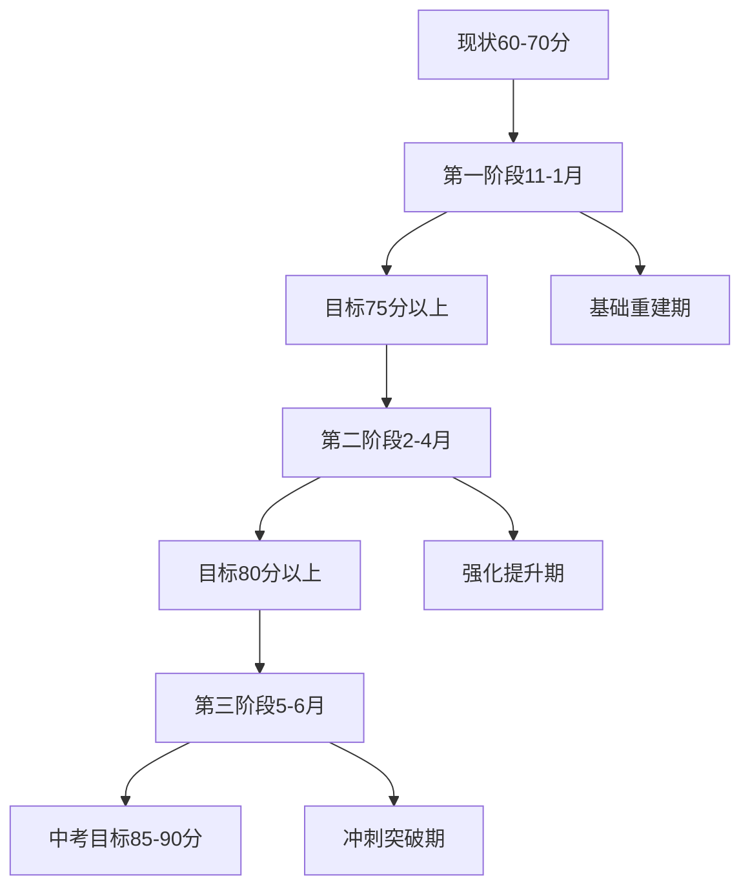

# 初中学习低分重建完整指南

## 🔥 紧急入口：4个月冲刺版

**距离中考只剩4个月？基础不扎实？** 请直接查看：
- [14-4个月紧急冲刺版-中考逆袭完整方案](./14-4个月紧急冲刺版-中考逆袭完整方案.md)

**配套执行文档（新增）：**
- [15-4个月冲刺-16周详细执行计划](./15-4个月冲刺-16周详细执行计划.md) - 每周每天具体任务清单
- [16-各科学习方法SOP手册](./16-各科学习方法SOP手册.md) - 每个步骤都可执行的标准流程
- [17-家庭支持具体操作指南](./17-家庭支持具体操作指南.md) - 家长每日/每周必做清单
- [18-核心学习方法详解-高效记忆与解题技巧](./18-核心学习方法详解-高效记忆与解题技巧.md) - 复述、回忆、错题本、思路分析等方法详解
- [19-深度学习与高效习得-成人方法转初中生核心思想提炼](./19-深度学习与高效习得-成人方法转初中生核心思想提炼.md) - 从深度工作、i+1输入理论等成人方法中提炼的核心学习原理

该方案专为时间紧迫的学生设计，涵盖：
- 现状分析与目标重新校准
- 学习态度与心理建设
- 生活作息与健康管理
- 4个月分阶段计划
- 各科提分策略（聚焦基础分）
- 家庭支持系统
- 学习方法精要
- 考试技巧
- 资源推荐

---

## 📚 文档导航

### 🎯 核心指导文档
- [01-家庭教育指导-父母沟通策略与心理建设](./01-家庭教育指导-父母沟通策略与心理建设.md)
- [02-时间管理与学习计划-8个月冲刺方案](./02-时间管理与学习计划-8个月冲刺方案.md)
- [10-学习障碍深度诊断-7大核心问题解决方案](./10-学习障碍深度诊断-7大核心问题解决方案.md)
- [12-作业处理与师生沟通-实用话术与应急策略](./12-作业处理与师生沟通-实用话术与应急策略.md)
- [08-应急策略指南-考试焦虑与危机处理](./08-应急策略指南-考试焦虑与危机处理.md)

### 📖 各科目学习指南
- [03-数学科目学习指南-从基础到突破](./03-数学科目学习指南-从基础到突破.md)
- [04-物理科目学习指南-概念理解与实验突破](./04-物理科目学习指南-概念理解与实验突破.md)
- [05-英语科目学习指南-词汇语法与技能突破](./05-英语科目学习指南-词汇语法与技能突破.md)
- [07-政治历史科目学习指南-记忆技巧与答题策略](./07-政治历史科目学习指南-记忆技巧与答题策略.md)
- [11-化学科目学习指南-方程式与应用专题](./11-化学科目学习指南-方程式与应用专题.md)
- [13-语文学科学习指南-阅读与写作能力突破](./13-语文学科学习指南-阅读与写作能力突破.md)

### 📋 资源与工具
- [06-学习资源汇总-工具书籍与在线平台](./06-学习资源汇总-工具书籍与在线平台.md)
- [09-辅导班选择与免费替代方案-决策指南](./09-辅导班选择与免费替代方案-决策指南.md)

### 📊 图表与流程
- [8个月学习时间轴](../diagrams/8个月学习时间轴.svg)
- [学习效果评估流程图](../diagrams/学习效果评估流程图.svg)
- [学习效率提升技巧图](../diagrams/学习效率提升技巧图.svg)
- [学科学习策略对比图](../diagrams/学科学习策略对比图.svg)
- [家庭教育沟通策略图](../diagrams/家庭教育沟通策略图.svg)
- [应急处理流程图](../diagrams/应急处理流程图.svg)
- [数学知识体系重建图](../diagrams/数学知识体系重建图.svg)

## 🚨 紧急情况处理

### 当前问题诊断
**学生现状：**
- 语文、化学：80-90分（相对较好）
- 数学、物理、英语、政治、历史：60-70分（急需提升）
- 基础差、不理解、错误多、死记硬背、没思路、正反馈少

**家庭问题：**
- 父母教育理念分歧严重
- 母亲焦虑易发火，父亲过度放任
- 作业做不完形成恶性循环
- 孩子叛逆，缺乏学习动力

### 🎯 8个月目标设定

### ⚡ 立即行动清单

**第一周必做事项：**
1. **Day 1**: 家庭危机会议（父母先统一战线）
2. **Day 2**: 母亲与班主任深度沟通
3. **Day 3-4**: 与各科老师沟通作业调整
4. **Day 5-7**: 制定详细学习计划并开始执行

**核心原则：**
- ✅ **优先沟通**：先与老师沟通作业调整，争取理解和支持
- ✅ **理性取舍**：对于确实无效或低效的作业，在沟通失败后可战略性取舍
- ✅ **替代学习**：节省的时间必须用于更有价值的学习活动
- ✅ **战略性取舍**：优先完成核心理解类作业，保证质量
- ✅ **父母统一战线**：停止在孩子面前争吵
- ✅ **建立正反馈机制**：重建孩子学习信心

## 📈 成功指标

### 月度检查点
- **11月底**: 各科基础知识点梳理完成，期中考试提升5-10分
- **12月底**: 重难点攻克，期末考试达到75分以上
- **2月底**: 真题训练启动，一模备考充分
- **4月底**: 一模达到80分以上
- **6月中考**: 目标85-90分，考上理想高中

### 家庭关系改善指标
- 父母不再在孩子面前争吵
- 孩子主动分享学习困难
- 家庭学习氛围和谐
- 孩子学习自信心逐步恢复

## 🔥 关键成功因素

1. **家庭统一战线** - 父母必须先达成共识
2. **科学时间管理** - 避免无效作业，专注核心提升
   - 📖 [如何识别无效作业和低效作业](./12-作业处理与师生沟通-实用话术与应急策略.md) - 5分钟快速判断流程，包含详细识别标准和案例分析
3. **正确学习方法** - 理解为主，死记硬背为辅
4. **持续正反馈** - 及时鼓励每一个小进步
5. **现实目标设定** - 不求完美，但求进步

## 📞 紧急联系与支持

**遇到问题时的处理顺序：**
1. 查阅对应的专项指南文档
2. 参考应急策略指南
3. 与班主任或科任老师沟通
4. 家庭内部讨论调整策略

---

**重要提醒：** 这是一个8个月的马拉松，不是百米冲刺。保持耐心，相信过程，每天进步一点点，最终一定能看到显著改变。

**最后更新：** 2024年11月
**适用对象：** 初三学生及家长
**预期效果：** 各科提升15-25分，总分提升70-100分