# 时间管理与学习计划：4个月稳步提分方案（16周）

## 契约先行：我的改变宣言与行动清单

**写在前面：**

这份清单不是给父母的“保证书”，也不是给老师的“军令状”，这是**你与自己未来的约定**。

计划再完美，没有发自内心的改变意愿和具体行动，都只是纸上谈兵。这份清单的目的，是帮助你将“我要改变”这个模糊的想法，转化为清晰、具体、可执行的行动步骤。

请认真阅读每一条，勾选你承诺做到的，并签上你的名字。这代表着你正式向过去的自己告别，迎接一个全新的、更有力量的你。

---

### 我的“改变清单” V1.0

#### 一、 课堂行为契约

- [ ] **尽量不睡**：上课如果困，先用“喝水/站起来/捏手/深呼吸”把自己拉回来，哪怕只清醒5分钟，也是在变好。
- [ ] **先跟上形式**：即使听不懂，也尽量看着老师，把板书（尤其是例题）抄下来。先跟上形式，再追求内容。
- [ ] **“烂笔头”原则**：每节课至少记录3个知识点或1道完整例题的解题过程。
- [ ] **“问题不过夜”**：每天至少向老师或同学请教1个今天没搞懂的问题。

#### 二、 作业态度契约

- [ ] **独立完成**：作业是自己的事。绝不抄袭，即使空着，也要自己思考过。
- [ ] **限时训练**：严格按照“作业处理策略”中的时间限制完成作业，超时就停，并标记未完成原因。
- [ ] **“纠错优先”**：做作业前，先花10分钟看昨天作业的错题和老师的批改。
- [ ] **整洁书写**：字可以不漂亮，但必须清晰、整洁，解题步骤要有序。

#### 三、 时间管理契约

- [ ] **手机“隔离”**：晚上学习期间，手机主动上交父母保管，或锁在固定地方。
- [ ] **执行计划**：严格按照“每日时间安排表”执行，完成一项，勾选一项。
- [ ] **番茄钟信徒**：学习时使用番茄钟，25分钟内不做任何与学习无关的事。
- [ ] **睡前复盘**：每天睡前花10分钟，回顾今天计划的完成情况，并规划明天。

#### 四、 情绪与心态契约

- [ ] **接受不完美**：允许自己暂时做不出来难题，不因此否定自己。
- [ ] **“三秒呼吸法”**：遇到难题想放弃时，闭上眼，深呼吸三次，再重新读题。
- [ ] **庆祝小进步**：每完成一个“小目标”（如连续三天完成计划），给自己一个正向激励（如看一集动漫）。
- [ ] **主动沟通**：当感到压力巨大或情绪崩溃时，主动向父母或朋友倾诉，而不是一个人扛着。

---

**我的承诺：**

我，__________，郑重承诺，将以上述清单为我的行动准则，从此刻起，为自己的学习和未来负责。

**承诺人：** ____________

**日期：** ____年__月__日

---

## 🎯 总体时间规划框架

### 四阶段（16周）战略


| 阶段 | 周期 | 主要任务 | 目标（参考） |
|------|------|----------|----------|
| **第1阶段** | 第1-4周 | 基础回补 - 课本+错题+基础题正确率 | 先稳住 |
| **第2阶段** | 第5-8周 | 题型强化 - 中档题型训练+错题闭环 | 稳步上升 |
| **第3阶段** | 第9-12周 | 真题专项 - 真题分类+限时训练 | 稳定得分 |
| **第4阶段** | 第13-16周 | 模拟收官 - 模拟卷+查漏补缺+稳心 | 稳稳上岸 |

## 📅 4个月（16周）执行框架

> 更细的「每周/每日」任务清单：请配套使用 [15-4个月稳步提分-16周详细执行计划](./15-4个月稳步提分-16周详细执行计划.md)（这份文档负责“每天做什么”）。

### 第1阶段：第1-4周（稳住局面 + 基础回补）

**本阶段只做三件事：**
1. 先把作息与执行节奏稳住（用 A/B/C 档不断线）
2. 用课本+例题把“最常考基础点”补齐（不追求做难）
3. 建立错题闭环（错因分类 → 变式 1-2 题 → 二刷）

**第4周检查点（你应该看见的变化）：**
- 作业更少崩盘：能按时睡、能按时开始
- 基础题正确率明显变高（尤其是选择/填空）
- 你能说清楚“我最常错的3类错误是什么”

### 第2阶段：第5-8周（题型强化 + 错题闭环）

**目标：把中档题做稳。**
- 每科选 2-3 个“最影响分数”的题型，反复训练
- 训练方式：真题/模拟题的“同题型连刷” + 限时
- 错题必须二刷：同一类错题，3天内至少回做 1 次

**第8周检查点：**
- 能做对更多中档题（不是靠蒙）
- 做题速度变快，空题变少

### 第3阶段：第9-12周（真题专项 + 限时训练）

**目标：把“会”变成“稳定得分”。**
- 真题按“题型/考点”刷，不按“整张卷”刷
- 每周至少 2 次限时训练（按考试节奏）
- 继续压缩低价值任务，把时间留给高回报动作

**第12周检查点：**
- 你更清楚“哪些题我该稳拿、哪些题该果断跳过”
- 情绪波动更可控：能用 5 分钟稳心流程拉回执行

### 第4阶段：第13-16周（模拟收官 + 查漏补缺 + 稳心）

**目标：稳住发挥，减少失误。**
- 模拟卷训练：练“节奏”，不练“炫技”
- 查漏补缺：只补“最常丢分的洞”，不补“最难的题”
- 考前两周：睡眠与心态优先，保持手感即可

**第16周（考前）你追求的不是超常发挥，而是稳定发挥。**

## ⏰ 每日时间安排表

### 工作日时间表（周一至周五） - **SOP整合版**

```mermaid
gantt
    title 工作日学习时间安排 (SOP整合版)
    dateFormat  HH:mm
    axisFormat %H:%M
    section 早晨
    起床洗漱     :06:30, 07:00
    英语SOP-1练习 :07:00, 07:30
    section 中午
    午休前单词   :12:00, 12:10
    section 晚上
    回顾笔记     :done, 18:30, 18:45
    数学SOP练习  :18:45, 19:45
    休息         :19:45, 19:55
    理化SOP练习  :19:55, 20:35
    休息         :20:35, 20:45
    英语SOP练习  :20:45, 21:25
    文科SOP练习  :21:25, 21:55
    整理错题     :21:55, 22:15
    睡前复习     :22:15, 22:45
```



| 时间段 | 内容 | 时长 | 具体安排 (SOP整合版) |
|---|---|---|---|
| 6:30-7:00 | 起床+洗漱 | 30分钟 | 准备开始新的一天 |
| 7:00-7:30 | **英语SOP-1晨读** | 30分钟 | 执行“艾宾浩斯-卡片-语境”SOP，复习旧卡片，制作新卡片 |
| 7:00-7:30 | 早餐+上学路上 | 30分钟 | 继续使用卡片App进行滚动复习 |
| 12:00-12:10 | **英语SOP-1午间复习** | 10分钟 | 执行“艾宾浩斯”SOP，完成第二轮滚动复习 |
| 18:30-18:45 | 回顾当天笔记 | 15分钟 | 快速回顾课堂知识，找出SOP练习的重点 |
| 18:45-19:45 | **数学SOP刻意练习** | 60分钟 | 选取2-3道典型题，严格按照“四步解题SOP”完整解构 |
| 19:45-19:55 | 休息 | 10分钟 | 眼保健操，活动身体 |
| 19:55-20:35 | **物理/化学SOP刻意练习** | 40分钟 | 隔天轮换。选取1-2道计算题或实验题，用“三步解题SOP”分析 |
| 20:35-20:45 | 休息 | 10分钟 | 喝水，放松 |
| 20:45-21:25 | **英语SOP-2/3练习** | 40分钟 | 轮换进行：用“三步肢解法”分析1个长难句 / 用“四步定位法”精读1篇阅读 |
| 21:25-21:55 | **政史SOP练习** | 30分钟 | 轮换进行：用“故事线SOP”梳理1个事件 / 用“三步成文法”练习1道论述题 |
| 21:55-22:15 | 整理错题+明日计划 | 20分钟 | 用SOP的视角重新分析错题，规划第二天的SOP练习重点 |
| 22:15-22:45 | **英语SOP-1睡前复习** | 30分钟 | 执行“艾宾浩斯”SOP，完成第三轮滚动复习，激活语境 |

**总学习时长：** 约4小时（不含课堂时间）

### 周末时间表（周六/周日） - **SOP深度应用版**

| 时间段 | 内容 | 时长 | 具体安排 (SOP深度应用版) |
|---|---|---|---|
| 8:00-9:00 | **英语SOP-1系统复习** | 60分钟 | 执行“艾宾浩斯”SOP，系统复习本周所有新词卡片，并进行语境造句练习 |
| 9:00-11:00 | **数学SOP专题突破** | 120分钟 | 针对本周难点（如二次函数），用“四步解题SOP”深度分析3-5道压轴题 |
| 11:00-11:30 | 休息+整理SOP笔记 | 30分钟 | 整理上午的SOP解题流程图，总结关键步骤和易错点 |
| 11:30-12:30 | **物理SOP专题突破** | 60分钟 | 针对一个专题（如电学），用“三步解题SOP”解构2-3道复杂计算或实验题 |
| 12:30-14:00 | 午饭+午休 | 90分钟 | 充分休息，为下午的SOP练习储备精力 |
| 14:00-15:30 | **理科SOP综合练习** | 90分钟 | 完成一套数学或物理的章节测试卷，要求每道题都写出SOP分析要点 |
| 15:30-16:00 | 运动/放松 | 30分钟 | 户外活动，缓解压力，让大脑“清零” |
| 16:00-17:30 | **英语SOP综合练习** | 90分钟 | 完成一套含长难句分析和阅读理解的试卷，全程使用“三步肢解法”和“四步定位法” |
| 17:30-18:30 | 晚饭+休息 | 60分钟 | 家庭时间，放松心情 |
| 18:30-20:00 | **文科SOP综合应用** | 90分钟 | 结合本周历史和政治内容，用“故事线SOP”绘制一幅大的逻辑图，并用“三步成文法”写一篇小论文 |
| 20:00-21:30 | **本周错题SOP复盘** | 90分钟 | 将本周所有错题，逐一用对应科目的SOP进行重新分析、归类、总结 |
| 21:30-22:30 | 自由时间/预习 | 60分钟 | 放松或预习下周内容，准备新的SOP练习 |

**总学习时长：** 约8小时

## 📊 科目时间分配策略

### 各科目时间占比


### 不同阶段的时间调整

#### 第一阶段（11月-1月）：基础重建
- **数学：40%** - 基础最薄弱，需要重点突破
- **英语：25%** - 词汇语法基础建设
- **物理：20%** - 概念理解为主
- **化学：10%** - 维持现有水平
- **文科：5%** - 轻度关注

#### 第二阶段（2月-4月）：强化提升
- **数学：35%** - 题型训练为主
- **物理：25%** - 电学重点突破
- **英语：20%** - 阅读写作提升
- **化学：10%** - 计算专题
- **文科：10%** - 开始系统复习

#### 第三阶段（5月-6月）：冲刺突破
- **数学：30%** - 保持手感，攻克压轴题
- **物理：20%** - 高频考点反复练
- **英语：20%** - 作文模板+阅读速度
- **化学：10%** - 实验题专项
- **文科：20%** - 大量背诵，时事关注

## 🎯 每周学习计划模板 (SOP整合版)

### 周一：新知识学习日
- **重点：** 理解新知识，并将其纳入SOP框架。
- **数学：** 学习新章节概念，并思考如何用“四步解题SOP”来解决相关例题。
- **物理：** 理解新实验或新概念，尝试用“三步解题SOP”分析例题。
- **英语：** 学习新语法点或阅读技巧，并立即用“三步肢解法”或“四步定位法”进行实践。
- **文科：** 预习新课内容，尝试用“故事线SOP”或“关键词SOP”梳理基本脉络。

### 周二：SOP基础练习日
- **重点：** 使用SOP巩固周一所学的基础知识。
- **数学：** 用“四步解题SOP”完成20-30道基础题，重点是流程的规范性。
- **物理：** 用“三步解题SOP”完成概念题和简单计算题，确保每一步都清晰。
- **英语：** 进行“艾宾浩斯SOP”的常规复习，并用“三步肢解法”分析5-8个包含新语法点的句子。
- **文科：** 用“关键词SOP”背诵课后核心概念。

### 周三：SOP难点突破日
- **重点：** 应用SOP攻克本周的重点和难点。
- **数学：** 选取3-5道中档题，严格使用“四步解题SOP”进行解构分析。
- **物理：** 选取1-2道综合题，用“三步解题SOP”画出详细的分析流程图。
- **英语：** 用“四步定位法”精读2-3篇阅读理解，写出每道题的定位和排除过程。
- **文科：** 用“故事线SOP”梳理一个复杂的历史事件或政治专题。

### 周四：SOP综合应用日
- **重点：** 在更复杂的场景中综合运用SOP。
- **数学：** 挑战1-2道综合题的压轴问，记录使用SOP时的思考过程。
- **物理：** 分析一道复杂的实验题或计算题，重点是用SOP理清多个知识点的关联。
- **英语：** 完成一篇完形填空，并写一篇小作文，尝试在写作中运用本周学到的句式。
- **文科：** 练习一道材料分析题，用“三步成文法SOP”写出完整的答案。

### 周五：SOP复盘总结日
- **重点：** 复盘本周的SOP应用情况，整理错题。
- **数学：** 将本周错题全部用“四步解题SOP”重新分析一遍，找出思维误区。
- **物理：** 整理本周的SOP分析图，总结公式和概念在SOP中的应用场景。
- **英语：** 进行“艾宾浩斯SOP”周度总复习，并整理本周的长难句分析笔记。
- **文科：** 完善本周的“故事线SOP”逻辑图，并对“三步成文法”的答案进行润色。

### 周六：SOP专题突破日
- **重点：** 针对薄弱环节进行SOP的深度、集中训练。
- **上午：** **数学SOP专题**（2小时），见周末时间表。
- **下午：** **物理SOP专题**（1.5小时），见周末时间表。
- **晚上：** **英语SOP专项**（1.5小时），见周末时间表。

### 周日：SOP效果测试与调整日
- **重点：** 检验本周SOP学习效果，并规划下周。
- **上午：** **SOP模拟测试**（数学+物理），要求写出关键题目的SOP解题思路。
- **下午：** **英语SOP测试**+**文科SOP复习**。
- **晚上：** **家庭会议**，复盘本周SOP练习情况，讨论下周的SOP训练重点。

## 📈 学习效率提升策略

### 番茄工作法应用


**具体应用：**
- 每个学科用番茄工作法
- 25分钟内绝对专注，手机静音
- 5分钟休息做眼保健操或活动
- 4个番茄后休息15-30分钟

### 学习环境优化

**物理环境：**
- 固定的学习桌椅
- 充足的光线（护眼灯）
- 安静的环境（家人配合）
- 整洁的桌面（只放当前需要的）

**学习工具：**
- 错题本（每科一本）
- 计时器（番茄工作法）
- 荧光笔（标记重点）
- 便利贴（标记疑问）

### 注意力管理

**提高专注度：**
1. **学习前准备**：喝水、上厕所、准备文具
2. **手机管理**：放在另一个房间或交给父母
3. **目标明确**：每次学习前明确要完成什么
4. **及时奖励**：完成目标后给自己小奖励

**对抗疲劳：**
1. **适当休息**：感到疲劳立即休息5-10分钟
2. **换科目**：一个科目学累了换另一个
3. **适度运动**：每天至少30分钟运动
4. **充足睡眠**：保证每天7-8小时睡眠

## 💡 SOP方法论融入说明 (核心)

**警告：请在执行本计划前，务必阅读并理解以下内容。**

本学习计划最大的特点，是将所有学科的核心学习过程，都升级为了“标准作业流程”（SOP）。这意味着，你不再是“凭感觉”学习，而是像一名工程师一样，按照严谨、高效的流程去解决每一个问题。

**为什么必须使用SOP？**

- **变“模糊”为“精确”**：SOP将解题、记忆、阅读等过程，拆解为一步步可执行的动作，杜绝“不知道该干嘛”的迷茫状态。
- **变“被动”为“主动”**：SOP让你成为学习的主导者，你不是在被动地刷题，而是在主动地使用一个“工具”去解构题目。
- **变“低效”为“高效”**：SOP是经过验证的最优路径，能帮你绕开思维误区，直达问题核心，大幅提升单位时间内的学习效率。

**如何执行？**

1.  **先学SOP**：在开始一个新科目的学习前，请务必先前往对应的《学科指南》，熟读并理解该科目的所有SOP。
2.  **刻意练习**：计划中所有的“SOP练习”时间，都必须严格、完整地按照流程执行，初期宁可慢，也要保证动作不变形。
3.  **SOP分析错题**：所有错题，都必须用SOP的视角重新分析一遍，找到具体是哪一个步骤出了问题。
4.  **SOP内化为本能**：练习的最终目标，是让SOP成为你的肌肉记忆和思维本能，做到“心中有流程，下笔如有神”。

**一句话总结：在本计划中，所有“学习”、“练习”、“复习”和“作业”，默认都指代“基于SOP的刻意练习”。**

---

## 📋 作业处理策略 (SOP版)

### 作业分类处理


#### 优先级与处理方式 (SOP版)

1.  **最高优先级：核心理解类作业 (必须使用SOP完成)**
    -   **定义**：需要调用核心概念、公式、定理才能解决的题目，如数学计算题、物理实验分析题、英语阅读理解、政史论述题等。
    -   **处理方式**：**严格按照对应学科的SOP进行解题**。在作业本上，不仅要写出答案，还应简要写出SOP的关键步骤（如：数学题的“信息提取”、“模型匹配”等），以便复查和反馈。
    -   **目的**：将每一次作业都转化为一次高质量的“SOP刻意练习”。

2.  **中优先级：重复练习类作业 (用SOP完成一半)**
    -   **定义**：题型类似、仅更换数字或细节的巩固性练习。
    -   **处理方式**：与老师沟通，争取只完成一半的数量。但完成的每一道题，都必须经过SOP的完整流程。追求“质”而非“量”。

3.  **低优先级：机械抄写类作业 (用整理SOP错题代替)**
    -   **定义**：如抄写词汇、课文、公式等。
    -   **处理方式**：与老师沟通，用更有价值的“SOP化”任务代替。例如：
        -   抄写单词 → 执行“艾宾浩斯SOP”，制作并复习单词卡片。
        -   抄写课文 → 用“长难句SOP”分析课文中的一个复杂句子。
        -   抄写公式 → 用“解题SOP”完成一道使用该公式的典型例题。

4.  **可跳过：超纲难题类**
    -   **定义**：超出当前学习阶段和能力范围的竞赛题或压轴题的最后一问。
    -   **处理方式**：战略性放弃。将时间投入到SOP的基础练习中，确保基础分不失，这才是提分的关键。

### 与老师沟通的作业调整

**沟通模板：**
```
"X老师，关于作业我想和您商量一下。

孩子现在基础比较差，作业经常做不完。我分析了一下，
主要是因为速度慢，而速度慢是因为不会。

我想请问：
1. 能否让他优先完成您认为最重要的题目？
2. 抄写类的作业能否用整理错题本代替？
3. 重复的练习题能否做一半？

我保证：
1. 他会认真听您的课
2. 您讲的例题他会专门练习
3. 每周向您汇报学习情况

您看这样可以吗？"
```

## 🔄 计划调整机制

### 每周评估调整

**评估指标：**
- 计划完成度（目标80%以上）
- 学习效果（错题率下降）
- 身心状态（不过度疲劳）
- 家庭关系（和谐稳定）

**调整原则：**
- 如果完成度低于70%，降低难度
- 如果错题率没有下降，调整方法
- 如果过度疲劳，增加休息时间
- 如果家庭关系紧张，减少学习压力

### 月度大调整

**调整时机：**
- 每月最后一个周日
- 重大考试后
- 出现学习危机时

**调整内容：**
- 各科时间分配比例
- 学习方法和策略
- 目标设定的合理性
- 家庭支持的方式

### 应急预案

#### 学习计划严重滞后时
1. **立即停止**：停止当前所有学习活动
2. **分析原因**：找出滞后的根本原因
3. **重新规划**：制定更现实的计划
4. **寻求帮助**：向老师或同学求助

#### 孩子情绪崩溃时
1. **情感支持**：先处理情绪，再谈学习
2. **降低目标**：临时降低学习目标
3. **增加休息**：增加放松和娱乐时间
4. **专业帮助**：必要时寻求心理咨询

## 📊 成效监控指标

### 每日监控
- [ ] 学习时间是否达标
- [ ] 学习任务是否完成
- [ ] 错题是否及时整理
- [ ] 身心状态是否良好

### 每周监控
- [ ] 周计划完成度
- [ ] 各科进步情况
- [ ] 错题本使用情况
- [ ] 家庭关系状态

### 每月监控
- [ ] 月考成绩变化
- [ ] 学习方法效果
- [ ] 时间管理效率
- [ ] 整体目标进度

### 阶段性监控
- [ ] 期末考试成绩（第一阶段）
- [ ] 一模考试成绩（第二阶段）
- [ ] 二模考试成绩（第三阶段）
- [ ] 中考最终成绩

---

**重要提醒：** 计划是为了更好地学习，不是为了完美执行。如果计划与实际情况不符，要及时调整，保持灵活性。最重要的是持续进步，而不是严格按照计划执行。

**紧急联系：** 如果在执行计划过程中遇到重大困难，请及时与班主任沟通，或寻求专业的学习指导帮助。
