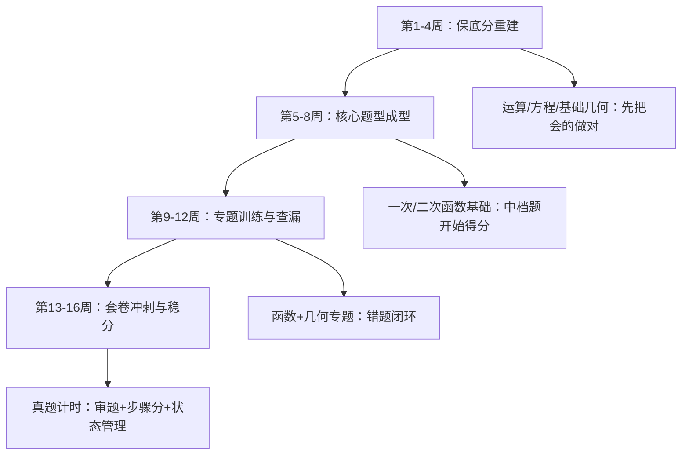
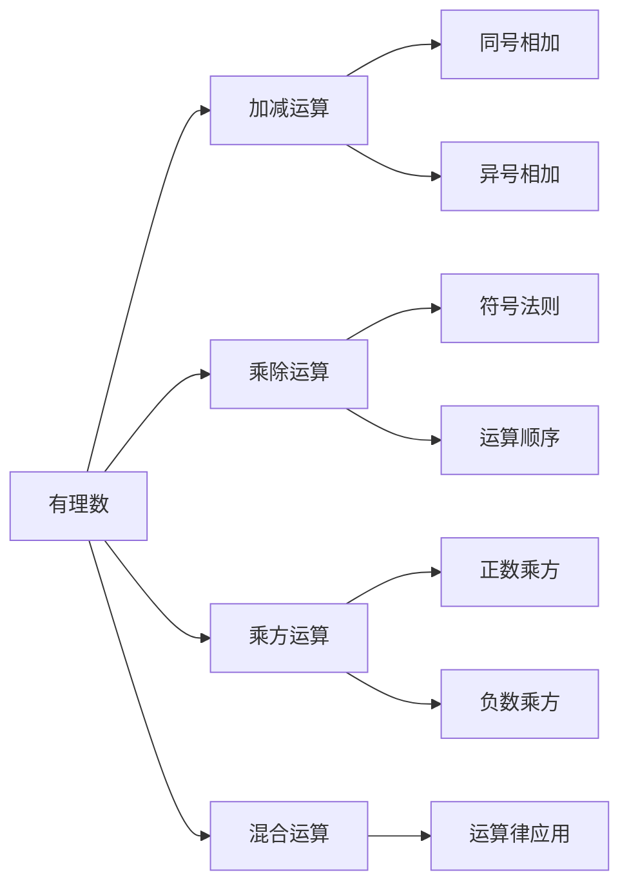
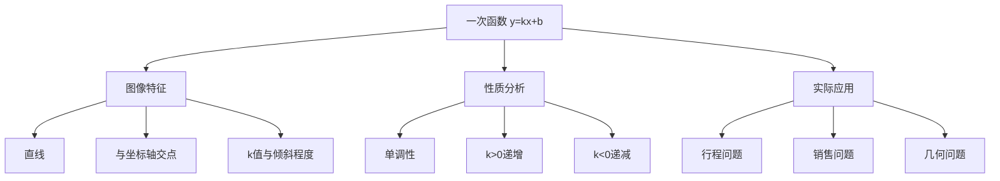
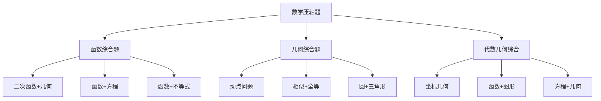
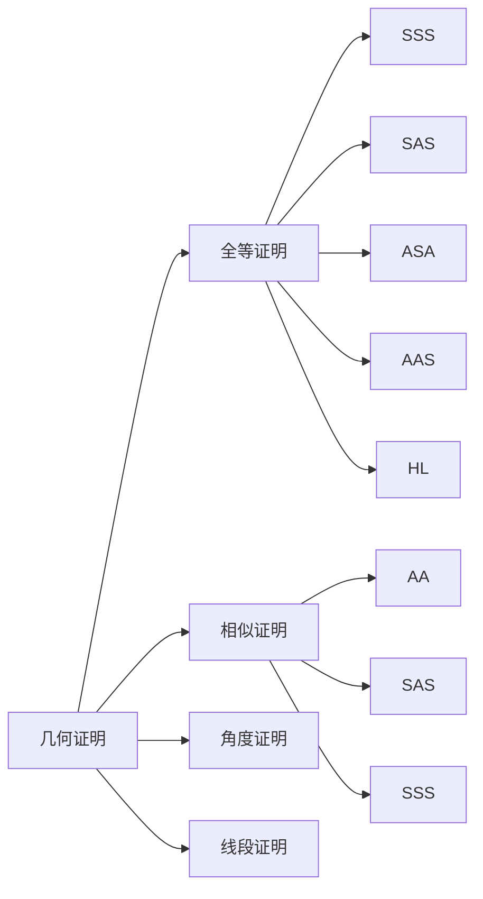
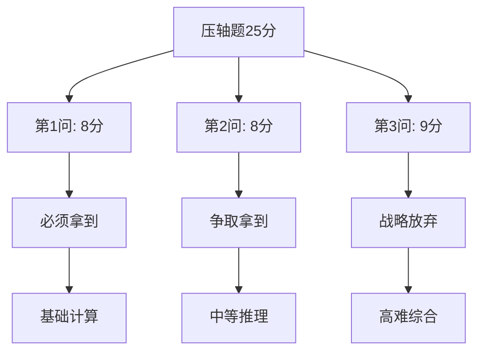

# 数学科目学习指南：从基础到突破

## 🎯 数学学习总体策略

### 当前问题诊断

**基础薄弱点分析：**
- ✅ **有理数运算**：基本掌握
- ❌ **整式运算**：乘法公式不熟练
- ❌ **方程求解**：一元二次方程困难
- ❌ **函数概念**：图像与性质理解不深
- ❌ **几何证明**：逻辑推理能力弱
- ❌ **应用题**：建模能力不足

### 4个月（16周）稳步学习路线图（更适合临近中考）



### 分数提升目标

| 阶段 | 时间 | 目标分数（参考） | 重点内容 | 验证方式 |
|------|------|------------------|----------|----------|
| 保底分重建期 | 第1-4周 | 70+ | 运算准确率、方程/不等式、基础几何与基础题型 | 每周小测 + 错题回做 |
| 题型成型期 | 第5-8周 | 75-80 | 一次函数、二次函数基础、常考几何模型 | 阶段卷/月考 |
| 专题提升期 | 第9-12周 | 80-85 | 函数+几何专题训练、中档题得分率 | 真题训练/一模 |
| 冲刺稳分期 | 第13-16周 | 85+（稳住不回落） | 套卷计时、时间分配、压轴前两问 | 套卷计时 + 二模/中考 |

> 对于60-70分想上普通公办高中：优先目标不是“解出所有压轴”，而是“基础题不丢分 + 中档题拿到该拿的步骤分”。只要持续执行，你会看到分数更稳定、更可控。

## 📚 知识体系重建计划

### 第一阶段：基础重建

#### 模块1：数与式的运算

**Week 1-2: 有理数运算强化**



**学习任务：**
- 每天20道有理数运算题
- 重点：符号判断、运算顺序
- 易错点：负数乘方、分数运算
- 目标：运算准确率95%以上

**每日任务清单（可打印）**

```
【Week 1-2 每日任务】日期：____月____日

□ 课本复习（15分钟）
  - 人教版七上 P12-P25 有理数运算
  - 重点看例题1-5的解题步骤

□ 基础练习（20分钟）
  - 《5年中考3年模拟》P8-P12 基础题
  - 必做：每页前5题
  - 选做：每页后5题（有余力再做）

□ 错题整理（10分钟）
  - 当天错题抄到错题本
  - 标注错误类型（A粗心/B不会/C不熟）

□ 复述检查（5分钟）
  - 合上书，说出今天学的运算法则
  - 说不出来的地方做标记，明天重点复习

【今日完成情况】
完成 ___/4 项  用时 ___分钟
```

**推荐练习：**
1. 《5年中考3年模拟》有理数专题（P8-P20）
2. 洋葱数学有理数运算视频
3. 每日一练：混合运算10题

**Week 3-4: 整式运算突破**

**重点内容：**
- 同类项合并
- 去括号法则
- 乘法公式：$(a+b)^2$、$(a-b)^2$、$(a+b)(a-b)$
- 因式分解基础

**学习方法：**
1. **公式记忆**：每天背诵3个公式
2. **模式识别**：学会识别公式的变形
3. **逆向思维**：从结果推导过程
4. **大量练习**：每天15道整式运算题

#### 模块2：方程与不等式

**Week 1-2: 一元一次方程复习 + 一元二次方程入门**

**一元二次方程解法：**
1. **直接开平方法**：$x^2 = a$ 型
2. **配方法**：$x^2 + px + q = 0$ 型
3. **公式法**：$x = \frac{-b \pm \sqrt{b^2-4ac}}{2a}$
4. **因式分解法**：能分解的优先用

**学习策略：**
- 先掌握直接开平方法和因式分解法
- 配方法重点理解思路，不强求熟练
- 公式法作为万能方法重点练习
- 每种方法每天练习5题

**Week 3-4: 不等式与不等式组**

**重点内容：**
- 不等式的性质（特别是乘除负数变号）
- 一元一次不等式的解法
- 不等式组的解法
- 数轴表示解集

#### 模块3：阶段复盘 + 函数预热

**期末复习重点：**
- 有理数运算（保证不失分）
- 整式运算（重点练习乘法公式）
- 方程求解（一元一次、一元二次）
- 基础几何（角度计算、面积计算）

**函数预习内容：**
- 函数的概念
- 函数的表示方法
- 一次函数的图像

### 第二阶段：函数与几何

#### 模块4：一次函数系统学习

**Week 1-2: 一次函数基础**



**学习重点：**
1. **图像画法**：根据解析式画图像
2. **性质理解**：k、b的几何意义
3. **解析式求法**：根据条件求解析式
4. **交点问题**：两直线交点的求法

**每日任务：**
- 画图练习：5个一次函数图像
- 性质判断：10道选择题
- 解析式求解：5道计算题
- 应用题：2道实际问题

**Week 3-4: 反比例函数**

**重点内容：**
- 反比例函数 $y = \frac{k}{x}$ 的图像（双曲线）
- 性质：k>0时图像分布，k<0时图像分布
- 与一次函数的交点问题
- 实际应用（压强、密度等）

#### 模块5：二次函数入门

**Week 1-2: 二次函数基础**

**学习顺序：**
1. $y = ax^2$ 的图像和性质
2. $y = ax^2 + k$ 的图像变换
3. $y = a(x-h)^2$ 的图像变换
4. $y = a(x-h)^2 + k$ 的一般形式

**重点理解：**
- 开口方向由a的符号决定
- 对称轴和顶点坐标
- 图像的平移变换规律

**Week 3-4: 二次函数应用**

**应用类型：**
1. **最值问题**：利润最大、面积最大等
2. **交点问题**：与x轴、y轴、直线的交点
3. **图像变换**：平移、翻折等
4. **实际建模**：抛物线运动等

#### 模块6：几何基础强化

**Week 1-2: 三角形专题**

**重点内容：**
- 三角形的分类和性质
- 全等三角形的判定和性质
- 相似三角形的判定和性质
- 直角三角形的性质（勾股定理）

**Week 3-4: 四边形与圆**

**四边形重点：**
- 平行四边形的性质和判定
- 矩形、菱形、正方形的性质
- 梯形的性质

**圆的重点：**
- 圆的基本性质
- 圆周角定理
- 切线的性质

### 第三阶段：综合提升

#### 模块7：综合题与压轴前两问

**压轴题类型分析：**



**突破策略：**
1. **只做前两问**：压轴题第三问战略性放弃
2. **模式识别**：总结常见题型的解题套路
3. **分步得分**：即使不会做完，也要写出已知步骤
4. **时间控制**：压轴题最多花15分钟

#### 模块8：中考冲刺

**最后冲刺策略：**
1. **回归基础**：确保基础题不失分
2. **保持手感**：每天做一套数学卷子
3. **错题回顾**：重点看错题本
4. **心态调整**：不追求满分，确保85分以上

## 🎯 专题训练计划

### 专题一：函数图像与性质

**训练目标：** 熟练掌握一次函数、反比例函数、二次函数的图像和性质

**训练内容：**
1. **图像识别**：根据图像判断函数类型和参数
2. **性质应用**：利用函数性质解决问题
3. **图像变换**：平移、翻折、伸缩变换
4. **交点问题**：函数与坐标轴、函数与函数的交点

**训练方法：**
- 每天画5个函数图像
- 每天做10道图像相关选择题
- 每周做2道函数综合应用题
- 建立函数图像库（常见函数的标准图像）

**易错点总结：**
- 二次函数开口方向判断错误
- 函数图像平移方向搞反
- 交点坐标计算错误
- 函数性质与图像不对应

### 专题二：几何证明与计算

**训练目标：** 掌握基本的几何证明方法和计算技巧

**证明方法总结：**



**训练内容：**
1. **基础证明**：全等三角形、相似三角形
2. **角度计算**：利用三角形内角和、外角等
3. **线段计算**：利用勾股定理、相似比等
4. **面积计算**：三角形、四边形、圆的面积

**训练方法：**
- 每天做3道几何证明题
- 重点练习证明的书写格式
- 总结常用的辅助线作法
- 建立几何模型库

### 专题三：应用题建模

**应用题类型：**

| 类型 | 常见题材 | 关键词 | 建模方法 |
|------|----------|--------|----------|
| 行程问题 | 相遇、追及 | 速度、时间、路程 | s=vt |
| 工程问题 | 合作完工 | 工作效率、工作时间 | 工作量=效率×时间 |
| 销售问题 | 利润最大 | 成本、售价、利润 | 利润=售价-成本 |
| 几何应用 | 面积最值 | 长度、宽度、面积 | 面积公式 |
| 浓度问题 | 溶液配制 | 溶质、溶剂、浓度 | 浓度=溶质/溶液 |

**解题步骤：**
1. **理解题意**：找出已知条件和求解目标
2. **设定未知数**：选择合适的未知数
3. **建立方程**：根据等量关系建立方程
4. **求解方程**：解出未知数的值
5. **检验答案**：检查答案是否符合实际意义

### 专题四：压轴题策略

**压轴题得分策略：**



**第一问突破：**
- 通常是基础计算或简单证明
- 目标：100%正确率
- 方法：仔细审题，规范书写

**第二问突破：**
- 通常需要一定的推理能力
- 目标：80%正确率
- 方法：寻找与第一问的联系

**第三问策略：**
- 通常是综合性很强的难题
- 策略：写出已知条件，尝试第一步
- 目标：能得2-3分即可

## 📖 学习资源推荐

### 教材和辅导书

**基础阶段推荐：**
1. **《初中数学基础知识手册》** - 知识点全面，适合查漏补缺
2. **《5年中考3年模拟》** - 题型全面，难度适中
3. **《中考数学压轴题》** - 专门训练压轴题

**提高阶段推荐：**
1. **《中考数学满分突破》** - 专题训练，题型经典
2. **《历年中考真题分类汇编》** - 真题练习，把握趋势
3. **《数学思维训练》** - 提升数学思维能力

### 在线学习资源

**视频学习平台：**
1. **洋葱数学** - 动画讲解，生动有趣
   - 适合：基础概念理解
   - 推荐章节：函数、几何证明
   - 使用方法：每天看1-2个视频

2. **学而思网校** - 系统性强，讲解详细
   - 适合：专题突破
   - 推荐课程：中考数学冲刺班
   - 使用方法：周末集中学习

3. **腾讯课堂** - 免费资源多
   - 适合：查漏补缺
   - 推荐搜索：中考数学专题
   - 使用方法：针对薄弱点学习

**练习平台：**
1. **作业帮** - 拍照搜题，解析详细
2. **小猿搜题** - 题库丰富，分类清晰
3. **猿题库** - 在线练习，自动批改

### 学习工具推荐

**必备工具：**
1. **错题本** - 记录错题，定期复习
2. **公式卡片** - 随时背诵，加深记忆
3. **几何画板** - 画图工具，理解几何
4. **计算器** - 复杂计算，提高效率

**学习APP：**
1. **GeoGebra** - 数学绘图软件
2. **Photomath** - 拍照解题应用
3. **数学公式** - 公式查询工具
4. **番茄工作法** - 时间管理工具

## 📝 学习方法指导

### 课堂学习策略

**课前预习：**
1. **浏览教材**：了解本节课要学的内容
2. **标记疑问**：把不懂的地方标出来
3. **准备问题**：准备课堂上要问的问题
4. **回顾旧知**：复习相关的旧知识

**课堂听讲：**
1. **专注听讲**：跟上老师的思路
2. **积极思考**：思考老师提出的问题
3. **记录重点**：记录重要的公式和方法
4. **及时提问**：不懂的地方及时问

**课后复习：**
1. **整理笔记**：把课堂笔记整理清楚
2. **完成作业**：认真完成课后作业
3. **总结方法**：总结解题方法和技巧
4. **拓展练习**：做一些相关的练习题

### 深度学习方法：将知识内化为直觉

#### “知识点电影”学习法

这是一种将抽象知识转化为生动故事的强大记忆方法，尤其适合理解困难的复杂概念。

**核心理念：** 大脑更容易记住故事和图像，而不是抽象的符号。把一个知识点想象成一部电影，你就是导演。

**操作步骤：**
1.  **挑选剧本：** 选择一个你觉得最难理解或最枯燥的知识点（比如，二次函数的性质、相似三角形的判定）。
2.  **角色设定：** 给知识点中的核心元素（变量、参数、图形）赋予拟人化的角色。例如，在二次函数 `y = a(x-h)² + k` 中，`a` 是“开口导演”，决定了抛物线是“笑脸”还是“哭脸”；`(h, k)` 是“顶点双胞胎”，决定了抛物线的位置。
3.  **编排剧情：** 将知识点的逻辑关系、公式推导或性质变化，编排成一个有开头、发展、高潮和结局的故事情节。
4.  **心理预演：** 在你的大脑里“放映”这部电影。你可以随时暂停、快进、慢放，确保自己理解每一个“镜头”背后的数学意义。
5.  **反复上映：** 每当复习这个知识点时，就在脑海里重新播放这部电影。你会发现，回忆起整个故事，比回忆一个冰冷的公式要容易得多。

**应用举例：导演一部《二次函数平移历险记》**

-   **主角：** 最简单的二次函数 `y = x²`，它是一个开口向上、顶点在原点的标准抛物线。
-   **剧情：**
    -   **第一幕《左右移动》：** `h` 登场。当 `h` 为正数时（比如 `(x-3)²`），主角 `y=x²` 被命令向右平移3个单位；当 `h` 为负数时（比如 `(x+2)²`），主角向左平移2个单位。口诀：“左加右减”。
    -   **第二幕《上下移动》：** `k` 登场。当 `k` 为正数时（比如 `x²+4`），主角向上平移4个单位；当 `k` 为负数时（比如 `x²-1`），主角向下平移1个单位。口诀：“上加下减”。
    -   **第三幕《开口与胖瘦》：** `a` 登场。`a` 是个大导演，`a` > 0 时，抛物线开口向上（笑脸）；`a` < 0 时，开口向下（哭脸）。`|a|` 越大，抛物线越“瘦”（开口越小）；`|a|` 越小，越“胖”（开口越大）。
-   **大结局：** 经过一系列的历险，`y = a(x-h)² + k` 诞生了！它的顶点坐标就是 `(h, k)`，形状由 `a` 决定。

通过这种方式，枯燥的平移规律就变成了一个生动的故事，更容易被理解和记忆。

### 做题技巧

**选择题技巧：**
1. **排除法**：排除明显错误的选项
2. **特值法**：用特殊值验证选项
3. **图像法**：画图帮助理解
4. **逆推法**：从答案反推过程

**填空题技巧：**
1. **直接法**：直接计算得出答案
2. **特值法**：用特殊情况求解
3. **数形结合**：结合图形分析
4. **分类讨论**：考虑不同情况

**解答题技巧：**
1. **审题仔细**：理解题意，找出关键信息
2. **规划思路**：先想好解题步骤
3. **规范书写**：步骤清晰，格式规范
4. **检查验证**：做完后检查答案

### 每日练习SOP：“每日一题”的正确打开方式

“每日一题”的精髓不在于“量”，而在于“质”。它是一个微型的“学习-应用-反思”闭环，旨在通过每天一次高质量的深度练习，将知识“磨”进你的长期记忆里。

**选题标准：**

“每日一题”不是随便找道题做，而应具备以下特点之一：
- **巩固型：** 与当天课堂学习或复习的知识点紧密相关。
- **纠错型：** 来自错题本中的“顽固”错题或其同类型题目。
- **挑战型：** “跳一跳”才能够得着的题目，能引发你的思考，但又不至于完全没思路。

**执行流程：一个15分钟的微型战斗**

1.  **专注时间（5-10分钟）：**
    -   **模拟考场：** 设定一个10分钟的闹钟，在此期间，除了草稿纸和笔，不使用任何参考资料或电子设备。
    -   **独立思考：** 尽最大努力独立完成。即使卡住了，也要坚持思考，尝试不同的路径。

2.  **复盘与订正（5-10分钟）：**
    -   **核对答案：** 时间到了之后，核对正确答案。
    -   **深度复盘：** 这是“每日一题”的灵魂所在。无论做对做错，都必须回答以下三个问题：
        1.  **这道题考的是什么？**（识别核心知识点）
        2.  **我当时是怎么想的？**（回顾自己的思路，如果是错的，错在哪里？）
        3.  **最佳思路是什么？**（对比答案，学习最优的解题路径和思维方式）

3.  **归纳与关联（3-5分钟）：**
    -   **写入错题本：** 如果做错，按照“错题本SOP 2.0”的标准进行整理。
    -   **思维导图关联：** 在脑海中或纸上，将这道题与它所属的知识体系（比如，函数章节的某个分支）连接起来，思考它与其他知识点的关系。

**记录与追踪：**

建议准备一个“每日一题本”，每天记录下题目、解题过程和最重要的“复盘三问”的答案。一周后回顾，你会清晰地看到自己的思考轨迹和进步。

### 错题管理：错题本SOP 2.0 - 将错误转化为财富

错题本不是简单地抄录错题，而是一个系统化的“纠错-学习-内化”流程。它能将每一次的“学费”（错误）都转化为未来的“资产”（分数）。

**核心理念：** 不怕做错题，就怕错过了从错误中学习的机会。每一道错题都是一个指向你知识盲区的精准路标。

**SOP 1：标准化的错题记录流程**

使用“四步记录法”来整理每一道错题，确保记录的有效性。

| 模块 | 内容 | 目的 |
|---|---|---|
| **1. 原题与出处** | 抄下原题，并注明来源（如“XX月考卷第21题”）。 | 方便回顾，了解题目背景。 |
| **2. 错误分析** | **这是最关键的一步！** 必须用自己的话写清楚错误原因。是“概念不清”、“计算失误”、“审题不清”、“思路错误”还是“方法太笨”？ | 诊断病根，避免再犯。 |
| **3. 正确解法** | 写下详细、规范的正确解题步骤。 | 掌握正确的方法。 |
| **4. 归纳与反思** | **这是从优秀到卓越的一步！** 总结这道题的“题眼”是什么？考察了哪些核心知识点？有没有更优的解法？可以和哪些题型关联？ | 提炼方法论，举一反三。 |

**示例：**
> **原题与出处：**（略）... [11月月考卷第18题]
> **错误分析：** 审题不清，题目要求的是“至少有一个”，我理解成了“只有一个”，导致分类讨论时漏掉了两种情况。属于“逻辑漏洞型”错误。
> **正确解法：**（略）...
> **归纳与反思：** 这是一道典型的分类讨论题。关键词“至少”、“至多”、“任意”等都是陷阱。以后看到这些词，必须立刻启动分类讨论的思维，检查所有可能的情况是否都已覆盖。此题的解题“钥匙”是“正难则反”，从反面考虑“一个都没有”的情况，再用总数去减，会更简单。

**SOP 2：“三轮滚动复习法”**

基于艾宾浩斯遗忘曲线，建立一个严格的复习周期。

- **第一轮（1天内）：** 睡觉前，快速回顾当天记录的错题，重点看“错误分析”和“归纳与反思”，确保理解。
- **第二轮（1周后）：** 遮住答案，重新做一遍上周的所有错题。做对的，用绿色笔打个勾；仍然做错的，用红色笔做标记，并重新进行错误分析。
- **第三轮（1个月后/大考前）：** 重点复习所有标有红色标记的“顽固”错题，以及所有同类型的题目。

**SOP 3：“销号”与“激活”机制**

- **销号：** 当一道错题在“三轮滚动复习法”中连续两次（例如，第2轮和第3轮）都能被快速、准确地做对，并且能清晰地讲出解题思路，这道题就可以被“销号”（用荧光笔划掉或标记为“已掌握”）。
- **激活：** 在后续的考试或练习中，如果再次遇到“已销号”的同类型题目但又做错了，必须立刻“激活”这道题，将其重新纳入复习流程，并加倍关注。

**工具推荐：**
- **活页本：** 方便按知识点进行分类和重新整理。
- **不同颜色的笔：** 蓝色写原题，黑色写解法，红色写错误分析和警示，绿色写归纳总结。让你的错题本“五彩斑斓”，重点突出。
- **标签贴：** 用于快速索引不同的知识模块。

## 📊 学习效果评估

### 每周自测

**自测内容：**
1. **基础知识**：公式、定理、概念
2. **基本技能**：计算、画图、证明
3. **应用能力**：解决实际问题
4. **综合能力**：综合运用知识

**自测方法：**
1. **知识默写**：默写重要公式和定理
2. **题型练习**：做各种类型的题目
3. **时间限制**：在规定时间内完成
4. **自我评分**：根据标准答案评分

### 月度检测

**检测方式：**
1. **模拟考试**：做一套完整的模拟卷
2. **专题测试**：针对某个专题进行测试
3. **错题重做**：重做本月的错题
4. **知识梳理**：梳理本月学习的知识

**评估标准：**
- 90分以上：优秀，继续保持
- 80-89分：良好，稍作调整
- 70-79分：及格，需要加强
- 70分以下：不及格，重点补习

### 阶段性评估

**评估时机：**
- 期末考试后
- 一模考试后
- 二模考试后
- 中考前一个月

**评估内容：**
1. **知识掌握程度**：各个知识点的掌握情况
2. **解题能力**：各种题型的解题能力
3. **应试技巧**：考试中的表现和技巧
4. **心理状态**：学习的信心和动力

**调整策略：**
- 根据评估结果调整学习计划
- 加强薄弱环节的训练
- 改进学习方法和技巧
- 调整心理状态和学习态度

## 🚨 常见问题解决

### 计算错误频繁

**问题分析：**
- 基础运算不熟练
- 注意力不集中
- 检查习惯不好

**解决方案：**
1. **加强基础训练**：每天做20道基础计算题
2. **养成检查习惯**：做完题后必须检查
3. **提高专注度**：做题时排除干扰
4. **使用草稿纸**：计算过程写在草稿纸上

### 几何证明困难

**问题分析：**
- 空间想象能力弱
- 逻辑推理能力不足
- 辅助线作法不熟

**解决方案：**
1. **多画图**：把几何图形画得准确清晰
2. **背诵定理**：熟记几何定理和性质
3. **模仿练习**：先模仿标准证明过程
4. **总结套路**：总结常见的证明套路

### 应用题建模难

**问题分析：**
- 理解能力不足
- 数学建模经验少
- 方程建立困难

**解决方案：**
1. **多读题**：仔细阅读题目，理解题意
2. **画示意图**：用图形帮助理解
3. **找等量关系**：找出题目中的等量关系
4. **模板练习**：练习各种类型的应用题模板

### 压轴题恐惧

**问题分析：**
- 心理压力大
- 基础不够扎实
- 解题经验不足

**解决方案：**
1. **降低期望**：不要求全部做对，只做前两问
2. **分步得分**：即使不会做完，也要写出已知步骤
3. **积累经验**：多做压轴题，积累解题经验
4. **调整心态**：把压轴题当作挑战，而不是负担

---

## 🔧 数学专属学习方法详解

> 以下方法专门针对数学学科特点设计，配合[18-核心学习方法详解](./18-核心学习方法详解-高效记忆与解题技巧.md)使用效果更佳

### 方法一：数学公式复述法

**为什么数学需要复述？**
- 很多同学"看懂了"公式，但做题时想不起来
- 复述能把"眼睛懂"变成"脑子懂"

**数学公式复述示例**

```
【学习内容】一元二次方程求根公式

【第1步：看书学习】
求根公式：x = (-b ± √(b²-4ac)) / 2a
适用条件：ax² + bx + c = 0 (a≠0)
判别式：Δ = b²-4ac

【第2步：合上书复述】
"一元二次方程ax²+bx+c=0的求根公式是...
x等于负b，加减根号下b平方减4ac，
整体除以2a...
呃...判别式是什么来着..."

【第3步：打开书检查】
✓ 公式主体记对了
✗ 忘了说"a不等于0"
✗ 判别式Δ的三种情况没说：
  - Δ>0：两个不相等的实根
  - Δ=0：两个相等的实根
  - Δ<0：无实根

【第4步：补充复述遗漏部分】
重点复述判别式的三种情况
```

**数学公式复述清单（每日一个）**

```
□ 完全平方公式：(a±b)² = a² ± 2ab + b²
□ 平方差公式：(a+b)(a-b) = a² - b²
□ 一元二次方程求根公式
□ 一次函数性质：k>0递增，k<0递减
□ 二次函数顶点式：y = a(x-h)² + k，顶点(h,k)
□ 勾股定理：a² + b² = c²
□ 相似三角形性质：对应边成比例，对应角相等
```

### 方法二：数学错题深度分析法

**数学错题的四种类型**

```
【A类：知识盲区型】
特征：完全不会做，没有思路
原因：相关知识点没学会
对策：回去重新学这个知识点

【B类：方法欠缺型】
特征：知道考什么，但不知道怎么做
原因：解题方法没掌握
对策：学习并练习这类题的标准解法

【C类：计算失误型】
特征：思路对，但算错了
原因：计算不熟练或粗心
对策：加强计算训练，养成检查习惯

【D类：审题失误型】
特征：题目理解错误
原因：没有仔细读题
对策：养成圈画关键词的习惯
```

**数学错题分析示例**

```
┌─────────────────────────────────────────────┐
│ 【原题】                                     │
│ 已知二次函数y=x²-2x-3，求：                 │
│ (1) 与x轴的交点坐标                         │
│ (2) 顶点坐标                                │
│ (3) 当x取何值时，y<0                        │
├─────────────────────────────────────────────┤
│ 【我的错误】                                 │
│ 第(3)问答案写成：x<-1或x>3                  │
│ 正确答案：-1<x<3                            │
├─────────────────────────────────────────────┤
│ 【错误类型】B类-方法欠缺型                   │
├─────────────────────────────────────────────┤
│ 【错误原因分析】                             │
│ 1. 不理解"y<0"的几何意义                    │
│ 2. y<0 意味着图像在x轴下方                  │
│ 3. 我搞反了，写成了图像在x轴上方的部分      │
├─────────────────────────────────────────────┤
│ 【正确思路】                                 │
│ 第1步：求与x轴交点，令y=0                   │
│        x²-2x-3=0 → (x+1)(x-3)=0            │
│        x=-1 或 x=3                          │
│ 第2步：画草图，开口向上的抛物线             │
│ 第3步：y<0 → 图像在x轴下方                 │
│        → 在两个交点之间                     │
│        → -1<x<3                            │
├─────────────────────────────────────────────┤
│ 【题型特征总结】                             │
│ 看到"y<0"或"y>0"：                          │
│ → 先求与x轴交点                            │
│ → 画草图判断图像位置                        │
│ → y<0在x轴下方，y>0在x轴上方               │
│ → 开口向上：两根之间y<0，两根之外y>0       │
│ → 开口向下：两根之间y>0，两根之外y<0       │
└─────────────────────────────────────────────┘
```

### 方法三：数学题型归纳法

**从一道题扩展到一类题的完整示例**

```
【原题】
已知一次函数y=2x+4，求与坐标轴围成的三角形面积。

【解答过程】
第1步：求与x轴交点
令y=0，得2x+4=0，x=-2
交点A(-2, 0)

第2步：求与y轴交点
令x=0，得y=4
交点B(0, 4)

第3步：计算面积
底边OA=2，高OB=4
面积S = ½ × 2 × 4 = 4

【题型归纳】
┌────────────────────────────────────────┐
│ 【一次函数与坐标轴围成三角形面积】      │
│                                         │
│ 函数：y = kx + b                        │
│                                         │
│ 与x轴交点：(-b/k, 0)                   │
│ 与y轴交点：(0, b)                      │
│                                         │
│ 三角形面积 = ½ × |b/k| × |b|           │
│            = |b|² / (2|k|)             │
│                                         │
│ 【快速公式】S = b² / (2|k|)            │
└────────────────────────────────────────┘

【验证练习】
题目：y = -3x + 6 与坐标轴围成的三角形面积？

用公式：S = 6² / (2×3) = 36/6 = 6 ✓

用常规方法验证：
与x轴交点(2,0)，与y轴交点(0,6)
S = ½ × 2 × 6 = 6 ✓
```

### 方法四：数学思路分析模板

**遇到数学题的标准思考流程**

```
【第1步：读题识别】（30秒）
问自己：
□ 这道题属于哪个章节？
□ 考查什么知识点？
□ 题目给了哪些条件？
□ 要求什么？

【第2步：调取方法】（30秒）
问自己：
□ 这类题我学过什么方法？
□ 有没有做过类似的题？
□ 课本例题是怎么做的？

【第3步：规划步骤】（1分钟）
在草稿纸上写出：
第1步：...
第2步：...
第3步：...

【第4步：执行计算】
按照规划的步骤一步步做
每一步都写清楚，不跳步

【第5步：检查验证】（1分钟）
□ 答案代回原题验证
□ 单位是否正确
□ 答案是否符合实际意义
```

**思路分析实战示例**

```
【题目】
某商店购进一批商品，每件进价20元。
若每件售价25元，可卖出400件；
若每件售价每提高1元，销量就减少20件。
问：售价定为多少元时，利润最大？最大利润是多少？

【第1步：读题识别】
□ 章节：二次函数应用题
□ 知识点：利润最值问题
□ 条件：进价20元，基准售价25元卖400件，
        每涨1元少卖20件
□ 求：最大利润时的售价

【第2步：调取方法】
□ 利润 = (售价-进价) × 销量
□ 设未知数，建立二次函数
□ 用顶点公式求最值

【第3步：规划步骤】
第1步：设售价为x元
第2步：表示销量（用x表示）
第3步：建立利润函数
第4步：求顶点（最大值）

【第4步：执行计算】
设售价为x元（x≥25）
销量 = 400 - 20(x-25) = 400 - 20x + 500 = 900 - 20x
利润 y = (x-20)(900-20x)
      = -20x² + 900x + 400x - 18000
      = -20x² + 1300x - 18000
      = -20(x² - 65x) - 18000
      = -20(x - 32.5)² + 21125 - 18000
      = -20(x - 32.5)² + 3125

顶点：x = 32.5，y = 3125

【第5步：检查验证】
售价32.5元，销量 = 900 - 20×32.5 = 250件
利润 = (32.5-20) × 250 = 12.5 × 250 = 3125元 ✓

【答案】
售价定为32.5元时利润最大，最大利润为3125元。
```

### 方法五：数学考试时间分配

```
【中考数学120分钟时间分配】

选择题（10题×3分=30分）：20分钟
  → 每题2分钟，简单题1分钟，难题3分钟
  → 不会的先跳过，最后蒙一个

填空题（6题×3分=18分）：15分钟
  → 每题2-3分钟
  → 注意单位和格式

解答题前4题（约40分）：35分钟
  → 基础计算、证明题
  → 必须全对，仔细检查

解答题后2题（约32分）：40分钟
  → 综合应用题
  → 第1问必做，第2问争取，第3问量力

检查时间：10分钟
  → 重点检查选择题和计算题
  → 检查有没有漏做的题

【时间警报】
60分钟时：应该做完选择+填空+前2道解答题
90分钟时：应该做完所有会做的题
100分钟后：开始检查或攻克难题
```

---

**重要提醒：** 数学学习是一个循序渐进的过程，不要急于求成。重点是打好基础，培养数学思维，逐步提高解题能力。遇到困难时，要及时寻求帮助，不要让问题积累。

**紧急求助：** 如果在学习过程中遇到重大困难，可以：
1. 向数学老师请教
2. 寻找数学家教
3. 参加数学辅导班
4. 与同学组成学习小组
