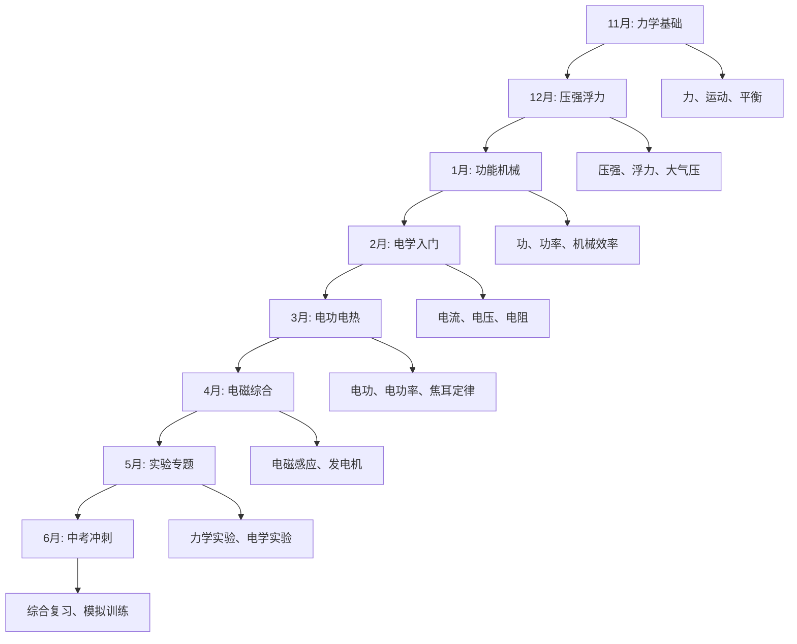
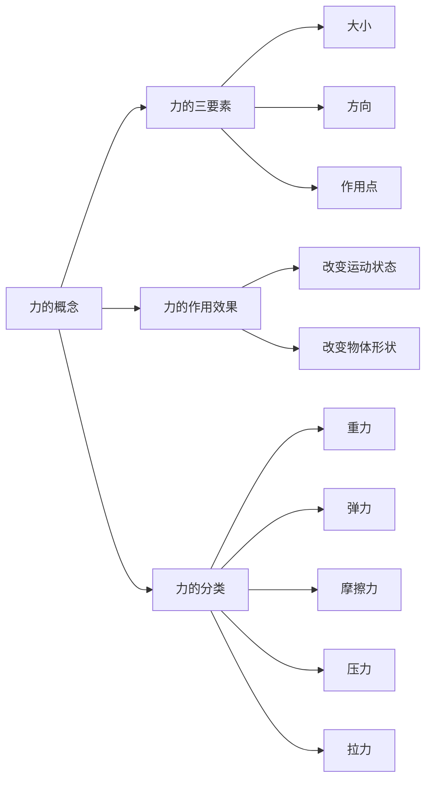
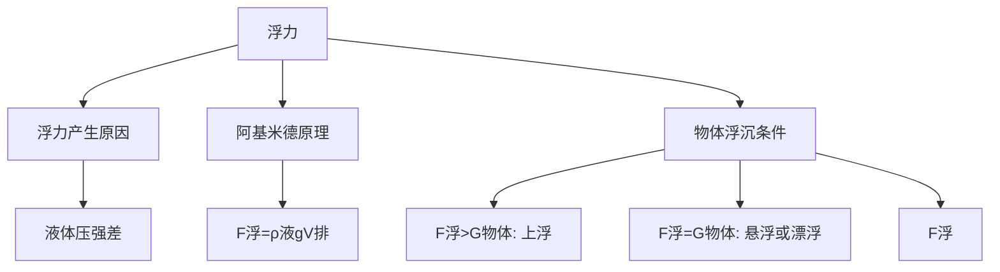
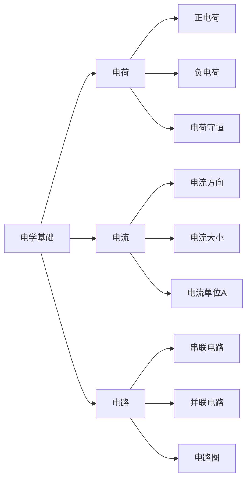
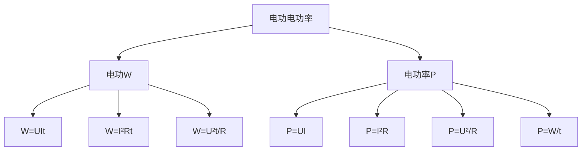
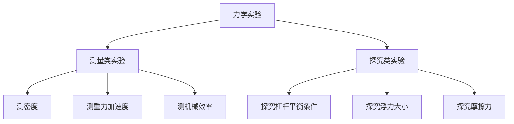
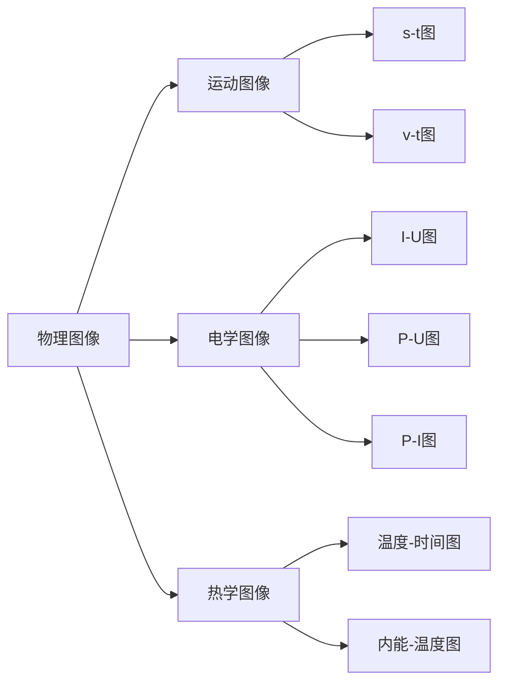

# 物理科目学习指南：概念理解与实验突破

## 🎯 物理学习总体策略

### 当前问题诊断

**基础薄弱点分析：**
- ✅ **声光热基础**：基本概念理解
- ❌ **力学概念**：力的分析不清晰
- ❌ **电学计算**：欧姆定律应用困难
- ❌ **实验分析**：实验原理理解不深
- ❌ **公式应用**：公式记忆混乱，应用错误
- ❌ **图像分析**：v-t图、I-U图等看不懂

### 8个月学习路线图



### 分数提升目标

| 阶段 | 时间 | 目标分数 | 重点内容 | 验证方式 |
|------|------|----------|----------|----------|
| 基础重建期 | 11月-1月 | 70分 | 力学基础+基本计算 | 期末考试 |
| 强化提升期 | 2月-4月 | 75分 | 电学系统+实验理解 | 一模考试 |
| 冲刺突破期 | 5月-6月 | 80-85分 | 综合应用+实验设计 | 二模+中考 |

## 📚 知识体系重建计划

### 第一阶段：力学基础（11月-1月）

#### 11月重点：力与运动

**Week 1-2: 力的概念与分析**



**学习重点：**
1. **力的概念**：力是物体对物体的作用
2. **力的三要素**：大小、方向、作用点
3. **力的示意图**：用箭头表示力
4. **常见的力**：重力、弹力、摩擦力

**每日任务：**
- 概念理解：每天复习3个力学概念
- 画图练习：画5个力的示意图
- 计算练习：重力计算10题
- 实验观察：观察生活中的力现象

**易错点提醒：**
- 重力方向总是竖直向下
- 摩擦力方向与运动方向相反
- 力的作用是相互的（牛顿第三定律）

#### 力学分析标准作业流程 (SOP)

**核心理念**：将“凭感觉”的力学分析，转变为“按流程”的机械化操作。遇到任何力学题目，不想当然，直接套用以下四步法。

**第一步：隔离对象，画出“干净”的受力图**

1.  **选对象**：明确你要分析的是哪个物体（或系统）。把它从周围环境中“抠”出来，单独画一个框或圆表示它。
2.  **画重力**：只要在地球上，就一定有重力。从物体的几何中心画一个竖直向下的箭头，标上 `G`。
3.  **找接触**：看物体和几个东西接触，每个接触点都可能有力。
    *   **有挤压，画弹力**：如果接触面相互挤压，就画一个垂直于接触面、指向物体内部的弹力，标上 `N`。
    *   **有趋势，画摩擦**：如果接触面粗糙，且物体有相对运动或运动趋势，就画一个与运动（或趋势）方向相反的摩擦力，标上 `f`。
4.  **看外力**：题目中是否还有绳子拉力 `T`、人的推力 `F` 等“主动”施加的力？有就画上。
5.  **检查**：确保每个力都有施力物体，没有无中生有的力。

**第二步：建立坐标，分解“不正交”的力**

1.  **建坐标系**：以物体的重心为原点，建立十字交叉的直角坐标系 (`x`轴和`y`轴)。
    *   **原则**：尽量让更多的力落在坐标轴上。通常，如果物体在平面上运动，就以平面方向为`x`轴，垂直平面方向为`y`轴。
2.  **分解力**：找出所有不在坐标轴上的力（“歪”的力）。
3.  **投影**：从这个“歪”力的箭头末端，向`x`轴和`y`轴分别作垂线。
4.  **画分力**：从原点出发，分别画到两个垂足的箭头，这就是`Fx`和`Fy`。
5.  **标记**：在原图上用虚线画出被分解的力，表示它已经被两个分力替代了。

**第三步：按轴列式，建立“平衡”的方程**

1.  **看`x`轴**：`x`轴上所有向右的力 = 所有向左的力。
    *   写出方程：`ΣF_right = ΣF_left`
2.  **看`y`轴**：`y`轴上所有向上的力 = 所有向下的力。
    *   写出方程：`ΣF_up = ΣF_down`
3.  **检查**：确保每个力（或分力）都只在一个方程中出现一次。

**第四步：联立求解，代入“干净”的数据**

1.  **整理方程**：将上面列出的方程组放在一起。
2.  **代入数值**：将题目给出的已知数值代入方程。注意单位统一（全部使用国际单位制：米、千克、秒、牛顿）。
3.  **求解**：解方程组，得出未知量。

---

**Week 3-4: 运动与平衡**

**运动的描述：**
- 参照物的选择
- 匀速直线运动
- 速度的计算：$v = \frac{s}{t}$
- v-t图像的理解

**力的平衡：**
- 平衡状态：静止或匀速直线运动
- 二力平衡条件：大小相等、方向相反、作用在同一直线上、作用在同一物体上
- 平衡力与相互作用力的区别

#### 12月重点：压强与浮力

**Week 1-2: 压强概念与计算**

**固体压强：**
- 压强定义：$p = \frac{F}{S}$
- 增大压强的方法：增大压力、减小受力面积
- 减小压强的方法：减小压力、增大受力面积

**液体压强：**
- 液体压强特点：向各个方向都有压强
- 液体压强公式：$p = \rho gh$
- 连通器原理：连通器中同种液体静止时，各部分液面相平

**气体压强：**
- 大气压强的存在
- 大气压强的测量：托里拆利实验
- 大气压强的应用：吸盘、注射器等

**Week 3-4: 浮力原理与应用**



**浮力计算方法：**
1. **阿基米德原理**：$F_{浮} = \rho_{液}gV_{排}$
2. **称重法**：$F_{浮} = G_{空气中} - G_{液体中}$
3. **平衡法**：$F_{浮} = G_{物}$（悬浮或漂浮时）
4. **压力差法**：$F_{浮} = F_{向上} - F_{向下}$

#### 1月重点：功、功率与机械

**Week 1-2: 功与功率**

**功的概念：**
- 功的定义：力与在力的方向上移动距离的乘积
- 功的公式：$W = Fs$
- 功的单位：焦耳（J）
- 做功的两个必要因素：有力作用、在力的方向上有距离

**功率的概念：**
- 功率的定义：单位时间内做的功
- 功率公式：$P = \frac{W}{t} = Fv$
- 功率单位：瓦特（W）

**Week 3-4: 简单机械**

**杠杆：**
- 杠杆平衡条件：$F_1 \times L_1 = F_2 \times L_2$
- 杠杆分类：省力杠杆、费力杠杆、等臂杠杆
- 杠杆应用：天平、剪刀、钳子等

**滑轮：**
- 定滑轮：改变力的方向，不省力
- 动滑轮：省一半力，费一倍距离
- 滑轮组：$F = \frac{G}{n}$（n为承重绳子段数）

**机械效率：**
- 有用功、额外功、总功
- 机械效率：$\eta = \frac{W_{有用}}{W_{总}} \times 100\%$

### 第二阶段：电学系统（2月-4月）

#### 2月重点：电学基础

**Week 1-2: 电流与电路**



**电流概念：**
- 电流的形成：电荷的定向移动
- 电流方向：正电荷移动的方向
- 电流大小：$I = \frac{Q}{t}$
- 电流单位：安培（A）

**电路基础：**
- 电路组成：电源、用电器、开关、导线
- 电路状态：通路、断路、短路
- 串联电路：电流只有一条路径
- 并联电路：电流有多条路径

**Week 3-4: 电压与电阻**

**电压概念：**
- 电压的作用：使电路中产生电流
- 电压单位：伏特（V）
- 电压测量：电压表并联在被测电路两端

**电阻概念：**
- 电阻的定义：导体对电流的阻碍作用
- 电阻单位：欧姆（Ω）
- 影响电阻的因素：材料、长度、横截面积、温度

#### 3月重点：欧姆定律与电功率

**Week 1-2: 欧姆定律**

**欧姆定律内容：**
- 公式：$I = \frac{U}{R}$
- 变形：$U = IR$，$R = \frac{U}{I}$
- 适用条件：纯电阻电路

**串联电路规律：**
- 电流：$I = I_1 = I_2$
- 电压：$U = U_1 + U_2$
- 电阻：$R = R_1 + R_2$
- 电压分配：$\frac{U_1}{U_2} = \frac{R_1}{R_2}$

**并联电路规律：**
- 电流：$I = I_1 + I_2$
- 电压：$U = U_1 = U_2$
- 电阻：$\frac{1}{R} = \frac{1}{R_1} + \frac{1}{R_2}$
- 电流分配：$\frac{I_1}{I_2} = \frac{R_2}{R_1}$

#### 电路分析标准作业流程 (SOP)

**核心理念**：告别“一眼定生死”的电路分析方式，用“剥洋葱”的流程化方法，任何复杂电路都能被拆解为简单的串并联组合。

**第一步：识别结构，简化电路图**

1.  **电流流向法**：从电源正极出发，用笔尖顺着导线走，看电流有几条通路。
    *   **一条路走到黑**：路径上所有元件都是**串联**。
    *   **遇到分岔路**：在分岔点分开，在汇合点汇合，这几条支路是**并联**。
2.  **节点标记法**：将电路中的每一个分岔点（三条或以上导线的连接点）和汇合点标记出来。两个节点之间的所有元件，都处于并联关系。
3.  **等效简化**：如果电路图很乱，就在草稿纸上重新画一遍。
    *   **原则**：抓住“谁和谁串联，谁和谁并联”的核心关系，把电路图画成清晰的“豆腐块”形状。
    *   **处理电压表/电流表**：分析结构时，把**电压表看作断路**（直接拿掉），把**电流表看作导线**。

**第二步：分析局部，标记三要素**

1.  **分解元件**：将电路中的每一个电阻（或灯泡）视为一个独立的分析单元。
2.  **标记三要素**：在每个电阻旁边，清晰地标记出它的三个核心物理量：电阻值 `R`、流过的电流 `I`、两端的电压 `U`。
    *   `R = ?`
    *   `I = ?`
    *   `U = ?`
3.  **识别已知和未知**：根据题目给出的条件，将已知量填入，未知量打上问号。我们的目标就是求出所有问号。

**第三步：应用规律，逐个击破**

1.  **先算总电阻**：从最简单的局部开始，一步步计算等效电阻，直到算出整个电路的总电阻 `R_total`。
    *   串联：`R = R1 + R2`
    *   并联：`1/R = 1/R1 + 1/R2`
2.  **再算总电流**：利用总电压 `U_total`（通常是电源电压）和总电阻 `R_total`，根据欧姆定律 `I_total = U_total / R_total`，求出干路的总电流。
3.  **由总到分，逐层推导**：现在你有了总电流和总电压，开始从干路向支路反推。
    *   **遇到串联**：电流不变 (`I_part = I_total`)，用 `U_part = I_part * R_part` 求出各部分电压。
    *   **遇到并联**：电压不变 (`U_branch = U_total`)，用 `I_branch = U_branch / R_branch` 求出各支路电流。
4.  **反复应用**：不断重复“串联电流同，并联电压同”和欧姆定律，直到所有元件的 `R`, `I`, `U` 三个量都计算出来。

**第四步：核查验证，确保无误**

1.  **串联电压和**：检查串联电路中，各部分电压之和是否等于总电压。
2.  **并联电流和**：检查并联电路中，各支路电流之和是否等于干路总电流。
3.  **功率验算**：如果题目涉及功率，可以用 `P = UI = I²R = U²/R` 相互验算，看结果是否一致。

---


**Week 3-4: 电功与电功率**



**电功：**
- 定义：电流做的功
- 公式：$W = UIt$
- 单位：焦耳（J），千瓦时（kW·h）

**电功率：**
- 定义：单位时间内电流做的功
- 公式：$P = UI$
- 单位：瓦特（W）

**焦耳定律：**
- 内容：电流通过导体产生的热量
- 公式：$Q = I^2Rt$
- 纯电阻电路：$Q = W = UIt$

#### 4月重点：电磁现象

**Week 1-2: 磁现象**

**磁场：**
- 磁场的存在：磁体周围存在磁场
- 磁感线：描述磁场的假想曲线
- 地磁场：地球是一个大磁体

**电流的磁效应：**
- 奥斯特实验：通电导体周围存在磁场
- 通电螺线管：相当于条形磁体
- 右手螺旋定则：判断磁场方向

**Week 3-4: 电磁感应**

**电磁感应现象：**
- 法拉第实验：闭合电路中磁通量变化产生感应电流
- 感应电流方向：楞次定律
- 应用：发电机、变压器

**电动机原理：**
- 通电导体在磁场中受力
- 左手定则：判断受力方向
- 应用：电动机、电风扇等

### 第三阶段：综合提升（5月-6月）

#### 5月重点：实验专题

**力学实验：**



**电学实验：**
1. **测电阻**：伏安法测电阻
2. **测电功率**：伏安法测小灯泡功率
3. **探究欧姆定律**：电流与电压、电阻的关系
4. **探究串并联电路规律**

#### 6月重点：中考冲刺

**综合题型训练：**
1. **力学综合**：浮力+压强+杠杆
2. **电学综合**：欧姆定律+电功率+安全用电
3. **实验设计**：根据要求设计实验方案
4. **图像分析**：v-t图、I-U图、P-U图等
5. **压轴题策略（战略性放弃）**：对于力学和电学的综合压轴题，目标是做对前两问，确保拿到基础分数。不要在最后一问上花费过多时间，影响整体得分。

**冲刺期核心思想**：物理冲刺阶段，目标不是“满分”，而是“得分最大化”。要学会取舍，将时间投入到最有把握得分的题目上。

## 🎯 专题训练计划

### 专题一：力学计算

**训练目标：** 熟练掌握力学公式的应用

**重点公式：**
- 速度：$v = \frac{s}{t}$
- 密度：$\rho = \frac{m}{V}$
- 压强：$p = \frac{F}{S}$，$p = \rho gh$
- 浮力：$F_{浮} = \rho_{液}gV_{排}$
- 功：$W = Fs$
- 功率：$P = \frac{W}{t}$
- 机械效率：$\eta = \frac{W_{有用}}{W_{总}}$

**训练方法：**
1. **公式记忆**：每天背诵2-3个公式
2. **单位换算**：熟练掌握各种单位换算
3. **计算练习**：每天做10道计算题
4. **综合应用**：每周做2道综合题

### 专题二：电学计算

**训练目标：** 掌握电学公式的综合应用

**核心公式：**
- 欧姆定律：$I = \frac{U}{R}$
- 电功：$W = UIt$
- 电功率：$P = UI$
- 焦耳定律：$Q = I^2Rt$

**串并联电路规律：**

| 电路类型 | 电流关系 | 电压关系 | 电阻关系 |
|----------|----------|----------|----------|
| 串联 | $I = I_1 = I_2$ | $U = U_1 + U_2$ | $R = R_1 + R_2$ |
| 并联 | $I = I_1 + I_2$ | $U = U_1 = U_2$ | $\frac{1}{R} = \frac{1}{R_1} + \frac{1}{R_2}$ |

**训练方法：**
1. **电路分析**：判断串联还是并联
2. **公式选择**：根据已知条件选择合适公式
3. **计算步骤**：规范计算步骤和单位
4. **检验答案**：检查答案的合理性

### 专题三：实验分析

#### 实验题标准作答流程 (SOP)

**核心理念**：任何物理实验题，无论看起来多复杂，都可以被拆解为“目的-原理-器材-步骤-数据-结论-评估”这七个标准模块。用这个框架去套题目，保证思路清晰，得分点不遗漏。

**第一步：审题 - 明确实验目的**

*   **问自己**：这个实验到底想干什么？是“探究A和B的关系”，还是“测量物理量C”？
*   **关键词**：找到“探究”、“测量”、“验证”等核心动词，一句话概括实验目的。

**第二步：回忆 - 写出核心原理**

*   **问自己**：这个实验是基于哪个物理定律或公式？
*   **探究性实验**：写出需要控制的变量（控制变量法）。例如：探究电流与电压关系，需要控制电阻不变。
*   **测量性实验**：写出测量的核心公式。例如：测密度用 `ρ = m/V`，测电阻用 `R = U/I`。

**第三步：选择 - 列出关键器材**

*   **问自己**：要完成这个实验，必须用到哪些工具？
*   **按功能分类**：
    *   **测量工具**：刻度尺、天平、量筒、弹簧测力计、电压表、电流表、温度计。
    *   **主体器材**：小车、滑轮、杠杆、斜面、小灯泡、定值电阻、滑动变阻器。
    *   **辅助器材**：电源、开关、导线、烧杯、水等。

**第四步：设计 - 描述关键步骤**

*   **问自己**：如果让我来做，第一步干什么，第二步干什么？
*   **标准句式**：
    1.  “**组装**：按照电路图/实验装置图，连接/组装好器材。”
    2.  “**调节**：将……调节到初始位置/水平位置/最大阻值。”
    3.  “**测量/操作**：闭合开关，记录……的示数（U1, I1）。改变……（如滑动变阻器滑片），重复测量三次，记录数据（U2, I2; U3, I3）。”
    4.  “**计算**：利用公式……，分别计算出R1, R2, R3，然后求平均值。”
*   **核心**：体现“多次测量减小误差”的思想。

**第五步：处理 - 分析数据/现象**

*   **问自己**：从记录的数据或观察到的现象中，能发现什么规律？
*   **数据处理**：
    *   **计算平均值**：适用于测量性实验，以减小偶然误差。
    *   **画图像**：根据数据点在坐标系中描点、连线，得出U-I图像或s-t图像。
*   **现象描述**：
    *   “当……增加时，……也随之增加/减小。”
    *   “可以观察到……，说明……”

**第六步：总结 - 得出明确结论**

*   **问自己**：这个实验最终证明了什么？
*   **标准句式**：
    *   **探究性实验**：“在（某个量）不变的情况下，（物理量A）与（物理量B）成正比/反比。” **（必须提控制变量）**
    *   **测量性实验**：“通过测量计算，该物体的密度/电阻为……。”

**第七步：反思 - 提出误差/改进分析**

*   **问自己**：这个实验可能在哪些地方出错？怎样能做得更好？
*   **误差来源**：
    *   **读数误差**：测量工具的估读不准。
    *   **系统误差**：器材本身不准（如弹簧测力计未校零）。
    *   **环境误差**：温度、空气阻力等影响。
*   **改进措施**：
    *   “进行多次测量求平均值，以减小偶然误差。”
    *   “选择更精密的测量工具。”
    *   “保持环境稳定，排除……的干扰。”

---

**实验能力要求：**
1. **实验原理**：理解实验的物理原理
2. **实验器材**：熟悉常用实验器材
3. **实验步骤**：掌握实验的操作步骤
4. **数据处理**：会处理实验数据
5. **误差分析**：分析实验误差的来源

**重点实验：**

| 实验名称 | 实验原理 | 主要器材 | 注意事项 |
|----------|----------|----------|----------|
| 测密度 | $\rho = \frac{m}{V}$ | 天平、量筒 | 先测质量后测体积 |
| 测电阻 | $R = \frac{U}{I}$ | 电压表、电流表 | 多次测量求平均值 |
| 测电功率 | $P = UI$ | 电压表、电流表 | 注意额定电压 |
| 探究杠杆平衡 | $F_1L_1 = F_2L_2$ | 杠杆、钩码 | 杠杆要水平平衡 |

### 专题四：图像分析

**常见图像类型：**



**图像分析方法：**
1. **看坐标轴**：明确横纵坐标表示的物理量
2. **看图像形状**：直线、曲线、折线等
3. **看特殊点**：起点、终点、拐点等
4. **看斜率**：斜率的物理意义
5. **看面积**：图像与坐标轴围成面积的意义

## 📖 学习资源推荐

### 教材和辅导书

**基础阶段：**
1. **《初中物理基础知识手册》** - 概念清晰，公式齐全
2. **《物理实验手册》** - 实验原理详细，操作规范
3. **《5年中考3年模拟·物理》** - 题型全面，难度适中

**提高阶段：**
1. **《中考物理专题突破》** - 专题训练，重点突出
2. **《物理思维训练》** - 培养物理思维，提高分析能力
3. **《历年中考物理真题》** - 真题练习，把握趋势

### 在线学习资源

**视频学习：**
1. **洋葱物理** - 动画生动，概念清晰
   - 推荐章节：力学基础、电学入门
   - 使用方法：每天看1-2个视频

2. **学而思网校** - 系统全面，讲解详细
   - 推荐课程：中考物理冲刺班
   - 使用方法：周末集中学习

3. **网易公开课** - 大学物理入门
   - 适合：有余力的同学拓展视野
   - 使用方法：选择性观看

**实验视频：**
1. **中科院物理所** - 趣味物理实验
2. **物理大师** - 经典物理实验重现
3. **科普中国** - 生活中的物理现象

### 学习工具

**实验工具：**
1. **家庭小实验**：用生活用品做简单实验
2. **仿真实验室**：在线物理实验平台
3. **实验视频**：观看标准实验操作

**学习APP：**
1. **物理实验室** - 虚拟实验平台
2. **物理公式** - 公式查询工具
3. **物理计算器** - 物理量计算工具

## 📝 学习方法指导

### 概念理解方法

**物理概念学习步骤：**
1. **定义理解**：准确理解概念的定义
2. **物理意义**：理解概念的物理意义
3. **数学表达**：掌握概念的数学表达式
4. **单位换算**：熟练掌握单位换算
5. **实际应用**：联系生活实际理解概念

**概念记忆技巧：**
1. **对比记忆**：对比相似概念的异同
2. **联想记忆**：联系生活现象记忆概念
3. **图像记忆**：用图像帮助记忆概念
4. **公式记忆**：通过公式理解概念

### 公式应用方法

**公式学习步骤：**
1. **理解推导**：理解公式的推导过程
2. **记忆公式**：准确记忆公式的形式
3. **明确适用条件**：了解公式的适用范围
4. **单位统一**：注意公式中各量的单位
5. **变形应用**：掌握公式的各种变形

**计算题解题步骤：**
1. **审题**：仔细阅读题目，理解题意
2. **画图**：必要时画出示意图
3. **列已知**：列出已知条件和求解目标
4. **选公式**：选择合适的公式
5. **代入计算**：代入数值进行计算
6. **检验**：检验答案的合理性

### 实验学习方法

**实验学习要点：**
1. **实验目的**：明确实验要解决什么问题
2. **实验原理**：理解实验的物理原理
3. **实验器材**：熟悉实验器材的使用方法
4. **实验步骤**：掌握实验的操作步骤
5. **数据处理**：学会处理实验数据
6. **误差分析**：分析实验误差的来源

**实验报告写作：**
1. **实验目的**：简明扼要地说明实验目的
2. **实验原理**：简述实验的物理原理
3. **实验器材**：列出实验所用器材
4. **实验步骤**：详细描述实验步骤
5. **实验数据**：记录实验数据
6. **数据处理**：处理实验数据，得出结论
7. **误差分析**：分析实验误差的来源

## 📊 学习效果评估

### 知识点掌握检测

**自测方法：**
1. **概念默写**：默写重要概念的定义
2. **公式默写**：默写重要公式及其适用条件
3. **单位换算**：练习各种单位换算
4. **实验原理**：复述重要实验的原理

**检测标准：**
- 概念定义：准确率90%以上
- 公式记忆：准确率95%以上
- 单位换算：准确率90%以上
- 实验原理：能够清晰表述

### 计算能力检测

**检测内容：**
1. **基础计算**：单一公式的应用
2. **综合计算**：多个公式的综合应用
3. **实验计算**：实验数据的处理
4. **图像计算**：根据图像进行计算

**检测方法：**
- 每周做一套计算题专项练习
- 限时完成，模拟考试环境
- 统计正确率和用时
- 分析错误原因，针对性改进

### 实验能力检测

**检测项目：**
1. **器材识别**：识别常用实验器材
2. **原理理解**：理解实验原理
3. **步骤设计**：设计实验步骤
4. **数据处理**：处理实验数据
5. **误差分析**：分析实验误差

**检测方式：**
- 实验操作考试
- 实验设计题练习
- 实验报告写作
- 实验视频观看后回答问题

## 🚨 常见问题解决

### 概念理解困难

**问题表现：**
- 概念定义记不住
- 概念之间容易混淆
- 不理解概念的物理意义

**解决方案：**
1. **多种感官学习**：看、听、说、写结合
2. **生活联系**：联系生活现象理解概念
3. **对比学习**：对比相似概念的异同
4. **反复复习**：定期复习已学概念

### 公式应用错误

**问题表现：**
- 公式记忆混乱
- 不知道什么时候用什么公式
- 计算过程出错

**解决方案：**
1. **理解推导**：理解公式的推导过程
2. **分类整理**：按主题整理相关公式
3. **条件判断**：明确公式的适用条件
4. **大量练习**：通过练习熟练掌握公式应用

### 实验分析困难

**问题表现：**
- 不理解实验原理
- 不会设计实验步骤
- 不会处理实验数据

**解决方案：**
1. **观看实验视频**：观看标准实验操作
2. **动手实践**：尽可能动手做实验
3. **理论联系实际**：将理论知识与实验联系
4. **总结规律**：总结实验设计的一般规律

### 图像分析困难

**问题表现：**
- 看不懂物理图像
- 不会从图像中提取信息
- 不会根据图像进行计算

**解决方案：**
1. **基础训练**：从简单图像开始练习
2. **方法总结**：总结图像分析的一般方法
3. **大量练习**：多做图像分析题
4. **联系实际**：将图像与实际物理过程联系

---

## 🔧 物理专属学习方法详解

> 以下方法专门针对物理学科特点设计，配合[18-核心学习方法详解](./18-核心学习方法详解-高效记忆与解题技巧.md)使用效果更佳

### 方法一：物理概念思路分析法

**为什么物理需要思路分析？**
- 物理概念不是孤立的，它们之间有严密的逻辑关系
- 很多同学"背住了"概念，但做题时不知道怎么用
- 思路分析能把"死概念"变成"活工具"

**物理概念思路分析模板**

```
【概念名称】压强

【第1步：概念定义】
压强是什么？
→ 物体单位面积上受到的压力
→ 公式：p = F/S
→ 单位：帕斯卡(Pa)，1Pa = 1N/m²

【第2步：物理意义】
压强表示什么？
→ 表示压力的"作用效果"
→ 同样的力，面积越小，压强越大（效果越明显）
→ 生活例子：图钉尖端面积小，容易扎进墙里

【第3步：影响因素】
什么会改变压强？
→ 压力F：力越大，压强越大
→ 受力面积S：面积越小，压强越大
→ 注意：是"受力面积"，不是物体的总面积！

【第4步：应用场景】
什么时候用这个概念？
→ 看到"压力作用效果"→ 想到压强
→ 看到"增大/减小压强"→ 想到改变F或S
→ 看到"液体深度"→ 想到液体压强p=ρgh

【第5步：易错点】
容易在哪里出错？
→ 受力面积≠接触面积≠物体底面积
→ 液体压强只与深度有关，与容器形状无关
→ 压力≠重力（只有水平面上静止时才相等）
```

**物理概念思路分析实战示例**

```
┌─────────────────────────────────────────────┐
│ 【题目】                                     │
│ 一块砖平放和侧放在地面上，哪种方式对地面    │
│ 的压强大？                                   │
├─────────────────────────────────────────────┤
│ 【思路分析过程】                             │
│                                              │
│ 第1步：识别概念                              │
│ → 问的是"压强大小"                          │
│ → 调用压强公式：p = F/S                     │
│                                              │
│ 第2步：分析压力F                             │
│ → 砖静止在水平地面上                        │
│ → 压力 = 重力 = mg                          │
│ → 平放和侧放，重力不变                      │
│ → 所以压力F相同                             │
│                                              │
│ 第3步：分析受力面积S                         │
│ → 平放：受力面积 = 砖的最大面（长×宽）      │
│ → 侧放：受力面积 = 砖的侧面（长×高）        │
│ → 侧放的受力面积更小                        │
│                                              │
│ 第4步：得出结论                              │
│ → F相同，S侧放 < S平放                      │
│ → 根据p = F/S，S越小，p越大                 │
│ → 所以侧放时压强更大                        │
├─────────────────────────────────────────────┤
│ 【答案】侧放时对地面的压强大                 │
└─────────────────────────────────────────────┘
```

### 方法二：物理公式复述法

**物理公式复述示例**

```
【学习内容】欧姆定律

【第1步：看书学习】
欧姆定律：I = U/R
I：电流（安培A）
U：电压（伏特V）
R：电阻（欧姆Ω）
适用条件：纯电阻电路

【第2步：合上书复述】
"欧姆定律说的是...电流等于电压除以电阻...
公式是I等于U除以R...
呃...单位是什么来着...
电流是安培，电压是...伏特，电阻是欧姆..."

【第3步：打开书检查】
✓ 公式记对了
✓ 单位记对了
✗ 忘了说变形公式：U=IR，R=U/I
✗ 忘了说适用条件：纯电阻电路

【第4步：补充复述遗漏部分】
重点复述：
- 变形公式及其应用场景
- 适用条件（纯电阻电路）
```

**物理公式复述清单（每日一个）**

```
□ 速度公式：v = s/t
□ 密度公式：ρ = m/V
□ 重力公式：G = mg
□ 压强公式：p = F/S，p = ρgh
□ 浮力公式：F浮 = ρ液gV排
□ 功的公式：W = Fs
□ 功率公式：P = W/t = Fv
□ 欧姆定律：I = U/R
□ 电功公式：W = UIt
□ 电功率公式：P = UI = I²R = U²/R
□ 焦耳定律：Q = I²Rt
```

**公式变形速查表（中考必备）**

```
┌─────────────────────────────────────────────────────────────┐
│                    【力学公式变形】                           │
├─────────────────────────────────────────────────────────────┤
│ 速度公式 v = s/t                                             │
│ ├─ 变形1：s = vt （已知速度时间求路程）                      │
│ ├─ 变形2：t = s/v （已知路程速度求时间）                     │
│ └─ 应用：追及问题、相遇问题                                  │
│                                                              │
│ 密度公式 ρ = m/V                                             │
│ ├─ 变形1：m = ρV （已知密度体积求质量）                      │
│ ├─ 变形2：V = m/ρ （已知质量密度求体积）                     │
│ └─ 应用：鉴别物质、计算质量                                  │
│                                                              │
│ 压强公式 p = F/S                                             │
│ ├─ 变形1：F = pS （已知压强面积求压力）                      │
│ ├─ 变形2：S = F/p （已知压力压强求面积）                     │
│ └─ 注意：液体压强p=ρgh中，h是深度不是高度！                  │
│                                                              │
│ 浮力公式 F浮 = ρ液gV排                                       │
│ ├─ 变形1：V排 = F浮/(ρ液g) （求排开液体体积）               │
│ ├─ 漂浮条件：F浮 = G物 → ρ液V排 = ρ物V物                    │
│ └─ 应用：判断浮沉、计算浮力                                  │
├─────────────────────────────────────────────────────────────┤
│                    【电学公式变形】                           │
├─────────────────────────────────────────────────────────────┤
│ 欧姆定律 I = U/R                                             │
│ ├─ 变形1：U = IR （已知电流电阻求电压）                      │
│ ├─ 变形2：R = U/I （伏安法测电阻）                           │
│ └─ 注意：R不随U、I变化！电阻是导体本身的性质                 │
│                                                              │
│ 电功率公式 P = UI                                            │
│ ├─ 变形1：P = I²R （纯电阻，已知电流电阻）                   │
│ ├─ 变形2：P = U²/R （纯电阻，已知电压电阻）                  │
│ ├─ 变形3：U = P/I，I = P/U                                   │
│ └─ 应用：计算用电器功率、选择保险丝                          │
│                                                              │
│ 电功公式 W = UIt = Pt                                        │
│ ├─ 变形1：W = I²Rt （纯电阻电路）                            │
│ ├─ 变形2：W = U²t/R （纯电阻电路）                           │
│ └─ 注意：1度电 = 1kW·h = 3.6×10⁶J                           │
└─────────────────────────────────────────────────────────────┘
```

### 方法三：物理错题深度分析法

**物理错题的四种类型**

```
【A类：概念不清型】
特征：不理解物理概念的含义
原因：概念学习不扎实
对策：回去重新理解概念，做概念辨析题

【B类：公式混淆型】
特征：知道用什么公式，但用错了
原因：公式记忆混乱或适用条件不清
对策：整理公式表，明确每个公式的适用条件

【C类：分析错误型】
特征：物理过程分析错误
原因：没有按照标准流程分析
对策：严格按照SOP进行受力分析或电路分析

【D类：计算失误型】
特征：分析对了，但算错了
原因：计算不熟练或单位换算错误
对策：加强计算训练，注意单位统一
```

**物理错题分析示例**

```
┌─────────────────────────────────────────────┐
│ 【原题】                                     │
│ 一个物体重20N，放在水平桌面上，与桌面的     │
│ 接触面积为0.01m²，求物体对桌面的压强。      │
│                                              │
│ 【我的错误答案】                             │
│ p = G/S = 20/0.01 = 200Pa                   │
│                                              │
│ 【正确答案】                                 │
│ p = F/S = 20/0.01 = 2000Pa                  │
├─────────────────────────────────────────────┤
│ 【错误类型】D类-计算失误型                   │
├─────────────────────────────────────────────┤
│ 【错误原因分析】                             │
│ 1. 公式选择正确：p = F/S                    │
│ 2. 物理分析正确：水平面上F = G = 20N        │
│ 3. 计算错误：20÷0.01 = 2000，不是200       │
│ 4. 原因：除以0.01相当于乘以100，我算成了÷10│
├─────────────────────────────────────────────┤
│ 【正确计算过程】                             │
│ p = F/S                                      │
│   = 20N / 0.01m²                            │
│   = 20 / (1/100) N/m²                       │
│   = 20 × 100 Pa                             │
│   = 2000 Pa                                  │
├─────────────────────────────────────────────┤
│ 【防错提醒】                                 │
│ 遇到除以小数时：                             │
│ → 先把小数转换成分数                        │
│ → 除以分数 = 乘以分数的倒数                 │
│ → 0.01 = 1/100，除以0.01 = 乘以100         │
└─────────────────────────────────────────────┘
```

### 方法四：物理实验记忆口诀法

**常用物理实验口诀**

```
【测密度实验】
"先质后体防吸水"
→ 先测质量，后测体积
→ 防止物体吸水后质量改变

【伏安法测电阻】
"内接外接看大小，大内小外要记牢"
→ 电阻大用内接法
→ 电阻小用外接法

【探究杠杆平衡】
"水平平衡读力臂，多次测量找规律"
→ 杠杆要调到水平位置
→ 这样力臂可以直接从杠杆上读出

【探究浮力大小】
"空气液体两次称，差值就是浮力值"
→ 先在空气中称重G1
→ 再在液体中称重G2
→ 浮力 = G1 - G2

【探究电流与电压关系】
"控制电阻不变化，改变电压看电流"
→ 控制变量法
→ 保持电阻不变，改变电压
→ 观察电流如何变化
```

### 方法五：物理图像分析三步法

**物理图像分析模板**

```
【第1步：看坐标轴】
问自己：
□ 横轴表示什么物理量？单位是什么？
□ 纵轴表示什么物理量？单位是什么？
□ 原点代表什么含义？

【第2步：看图像特征】
问自己：
□ 图像是直线还是曲线？
□ 直线：过原点吗？斜率是正是负？
□ 曲线：是什么形状？有没有最值点？

【第3步：提取物理信息】
问自己：
□ 斜率代表什么物理量？
□ 图像与坐标轴围成的面积代表什么？
□ 图像上的特殊点（交点、拐点）有什么意义？
```

**v-t图像分析示例**

```
【题目】下图是某物体的v-t图像，分析物体的运动情况。

     v(m/s)
       ↑
    4  |----●
       |   /
    2  |  /
       | /
    0  +----→ t(s)
       0  2  4

【第1步：看坐标轴】
→ 横轴：时间t，单位秒(s)
→ 纵轴：速度v，单位米/秒(m/s)
→ 原点：t=0时，v=0，物体从静止开始

【第2步：看图像特征】
→ 图像是一条过原点的直线
→ 斜率为正（向右上方倾斜）
→ 斜率 = Δv/Δt = 4/4 = 1 m/s²

【第3步：提取物理信息】
→ 斜率代表加速度：a = 1 m/s²
→ 物体做匀加速直线运动
→ 图像与t轴围成的面积 = 位移
→ 4秒内位移 = ½ × 4 × 4 = 8m

【结论】
物体从静止开始做匀加速直线运动，
加速度为1m/s²，4秒内位移为8m。
```

---

**重要提醒：** 物理学习重在理解，不要死记硬背。要多联系生活实际，多做实验，多思考物理现象背后的原理。遇到困难时，要及时寻求帮助，不要让问题积累。

**学习建议：**
1. 每天至少花40分钟学习物理
2. 重视实验，多观察生活中的物理现象
3. 建立错题本，定期复习错题
4. 多与同学讨论，互相学习
5. 及时向老师请教不懂的问题