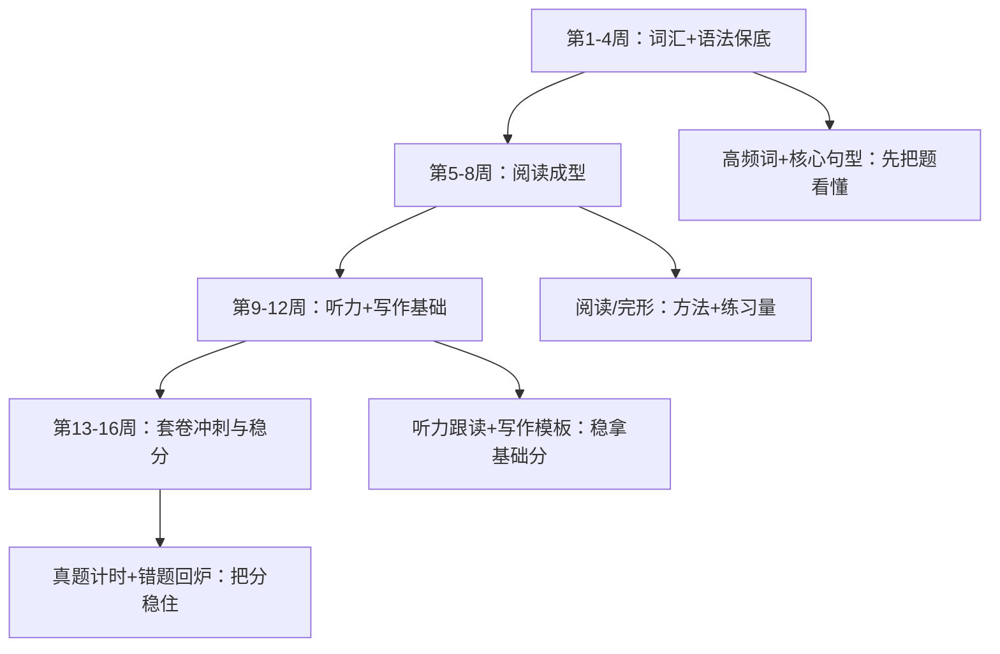
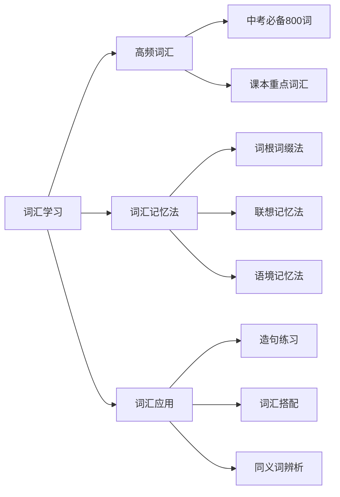
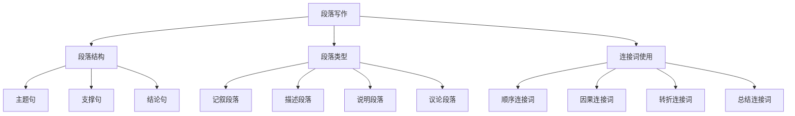
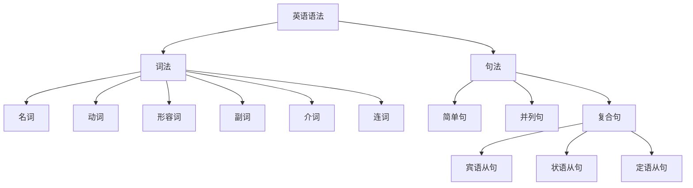

# 英语科目学习指南：词汇语法与技能突破

## 🎯 英语学习总体策略

### 当前问题诊断

**基础薄弱点分析：**
- ❌ **词汇量不足**：约800词汇，目标1600词汇
- ❌ **语法混乱**：时态、语态、从句不清楚
- ❌ **阅读理解困难**：速度慢，理解不准确
- ❌ **写作表达困难**：句式单一，语法错误多
- ❌ **听力基础薄弱**：语音识别困难
- ✅ **学习态度积极**：愿意努力，有改变决心

### 4个月（16周）稳步学习路线图（更适合临近中考）



### 分数提升目标

| 阶段 | 时间 | 目标分数（参考） | 重点内容 | 验证方式 |
|------|------|------------------|----------|----------|
| 基础重建期 | 第1-4周 | 65-70+ | 高频词、基础语法、简单阅读 | 每周小测 + 错题回做 |
| 阅读成型期 | 第5-8周 | 70-75 | 阅读理解/完形填空方法 + 练习量 | 阶段卷/月考 |
| 技能补齐期 | 第9-12周 | 75-80 | 听力跟读、写作句型与模板 | 真题训练/一模 |
| 冲刺稳分期 | 第13-16周 | 80+（稳住不回落） | 套卷计时、审题、作文提纲 | 套卷计时 + 二模/中考 |

> 英语提分最“朴素”：每天固定两段时间（各20-30分钟）把词汇和阅读跑起来，坚持4个月，你会明显感觉“题变得看得懂了”。

## 📚 知识体系重建计划

### 第一阶段：基础重建

#### 模块1：词汇突破与语音基础

**Week 1-2: 核心词汇启动计划**



**每日词汇计划：**
- **目标**：每天新学30个单词，复习50个单词
- **时间安排**：早晨30分钟，晚上30分钟
- **记忆方法**：看-读-写-用四步法
- **复习周期**：1天后、3天后、7天后、15天后

**词汇学习工具：**
1. **百词斩**：图像记忆，生动有趣
2. **扇贝单词**：科学复习，记忆曲线
3. **有道词典**：查词翻译，例句丰富
4. **纸质单词卡**：随时随地复习

**Week 3-4: 语音基础强化**

**音标学习：**
- 48个国际音标的准确发音
- 重点：元音音标的区分
- 方法：跟读模仿+录音对比
- 目标：能够根据音标读出单词

**语音规则：**
- 重读规则：双音节、多音节词的重读
- 连读规则：辅音+元音的连读
- 语调规则：陈述句、疑问句的语调
- 弱读规则：功能词的弱读

#### 模块2：语法系统构建

**Week 1-2: 时态系统**

**八大时态掌握：**

| 时态 | 构成 | 用法 | 标志词 |
|------|------|------|--------|
| 一般现在时 | do/does | 习惯、真理 | always, usually, often |
| 一般过去时 | did | 过去的事 | yesterday, last week |
| 一般将来时 | will do | 将来的事 | tomorrow, next week |
| 现在进行时 | am/is/are doing | 正在进行 | now, at the moment |
| 过去进行时 | was/were doing | 过去正在进行 | at that time |
| 现在完成时 | have/has done | 过去对现在的影响 | already, yet, just |
| 过去完成时 | had done | 过去的过去 | by the time |
| 过去将来时 | would do | 过去看将来 | said that |

**学习方法：**
1. **时间轴理解**：在时间轴上标出各时态
2. **标志词记忆**：通过标志词判断时态
3. **语境练习**：在具体语境中练习时态
4. **对比练习**：对比相似时态的用法

**Week 3-4: 句型结构**

**五大基本句型：**
1. **主+谓**：I run.
2. **主+谓+宾**：I love you.
3. **主+谓+宾+宾**：I give you a book.
4. **主+谓+宾+补**：I make you happy.
5. **主+系+表**：I am happy.

**复合句类型：**
- **宾语从句**：I think (that) he is right.
- **状语从句**：I will go if it doesn't rain.
- **定语从句**：The book (that) I bought is good.

### 长难句分析标准作业流程 (SOP) - “三步肢解法”

**核心理念**：任何复杂的长难句，本质上都是由一个“主干”和若干个“枝叶”（修饰成分）组成的。我们的任务就是通过标准流程，先砍掉所有枝叶，找到主干，再逐一分析枝叶的功能。

**第一步：找连词，断长句为短句**

连词是句子的“关节”。找到它们，就能把一个大长句切分成几个小短句，降低理解难度。

1.  **寻找标志**：快速扫描句子，圈出所有的“连词”。
    *   **并列连词**：`and`, `but`, `or`, `so`
    *   **从属连词**：
        *   **名词性从句**：`that`, `if`, `whether`, `what`, `who`, `when`, `where`, `why`, `how`
        *   **状语从句**：`when`, `while`, `since`, `until`, `if`, `unless`, `because`, `so that`, `though`
        *   **定语从句**：`that`, `which`, `who`, `whom`, `whose`, `when`, `where`
2.  **切分句子**：在每个连词前面，用斜杠`/`进行逻辑切分。

**第二步：去枝叶，寻主干**

句子的主干是“主语-谓语-宾语/表语”，它表达了句子的核心意思。我们的目标是暂时忽略所有修饰成分，找到这个核心。

1.  **识别“枝叶”（修饰成分）**：
    *   **介词短语**：由`in`, `on`, `at`, `with`, `for`, `about`等介词开头的短语，通常作定语或状语。
    *   **非谓语动词短语**：由`doing` (现在分词), `done` (过去分词), `to do` (不定式)开头的短语。
    *   **副词**：以`-ly`结尾的词，或`however`, `therefore`等。
    *   **从句**：上一步切分出来的、由连词引导的部分。
2.  **“括号处理”**：将所有识别出的“枝叶”成分，用括号括起来。
3.  **提取主干**：括号外剩下的部分，就是句子的主干。

**第三步：理关系，解全句**

现在，我们已经有了句子的主干，再把“枝叶”一个个加回来，分析它们各自的功能，就能理解整句话的精确意思。

1.  **分析主干**：理解“谁做了什么”或“谁是什么”的核心意思。
2.  **分析枝叶**：逐一分析括号里的内容，明确它是用来修饰哪个词的。
    *   **定语**？（回答“什么样的？”）：修饰名词。
    *   **状语**？（回答“怎么样地？”、“在哪里？”、“什么时候？”、“为什么？”）：修饰动词、形容词或整个句子。
    *   **宾语/主语/表语**？（回答“...是什么？”）：名词性从句的功能。
3.  **整合句意**：按照中文的表达习惯，将所有信息整合，形成通顺、准确的译文。

--- 

### 案例演示

**句子**：The book `that` my father bought for me `when` we traveled in Beijing is so interesting `that` I want to read it again.

**SOP应用**：

**第一步：找连词，断长句**

*   找到连词: `that`, `when`, `that`
*   切分: The book / `that` my father bought for me / `when` we traveled in Beijing / is so interesting / `that` I want to read it again.

**第二步：去枝叶，寻主干**

1.  **识别枝叶**：
    *   `(that my father bought for me)`：定语从句
    *   `(when we traveled in Beijing)`：状语从句
    *   `(for me)`：介词短语
    *   `(in Beijing)`：介词短语
    *   `(so...that I want to read it again)`：结果状语从句结构
2.  **括号处理**：The book (that my father bought for me (when we traveled in Beijing)) is so interesting (that I want to read it again).
3.  **提取主干**：**The book is so interesting.** (这本书非常有趣。)

**第三步：理关系，解全句**

1.  **分析主干**：核心意思是“书很有趣”。
2.  **分析枝叶**：
    *   `(that my father bought for me)`：修饰 `The book`，说明是“我爸爸买给我的”那本书。
    *   `(when we traveled in Beijing)`：修饰 `bought`，说明是“我们在北京旅游时”买的。
    *   `(that I want to read it again)`：修- `so interesting`，说明有趣到了“我想再读一遍”的程度。
3.  **整合句意**：
    *   **逐层翻译**：这本书（我爸爸买给我的（当我们在北京旅游时））是如此有趣（以至于我想再读一遍）。
    *   **润色成中文**：我爸爸在北京旅游时给我买的那本书非常有趣，我想再读一遍。

#### 模块3：阅读理解入门

### 阅读理解标准作业流程 (SOP) - “四步定位法”

**核心理念**：阅读理解的本质不是“理解”，而是“寻找与匹配”。答案一定在原文中，只是换了一种说法。我们的任务就是像侦探一样，根据题干提供的线索，在原文中找到证据，然后进行精确匹配。

**适用题型**：细节理解题、推理判断题、词义猜测题。（主旨大意题除外）

--- 

**解题流程:**

**第一步：审题干，圈定“定位词”**

拿到一道题，**绝对不要先读文章！** 先读题目，并在题干中划出最关键的、最不容易被替换的词，作为你在原文中寻找答案的“GPS导航信号”。

*   **最佳定位词**：
    *   **专有名词**：人名 (Alice)、地名 (Beijing)、组织机构名 (WHO)
    *   **数字和时间**：`1998`, `two weeks`, `9 o'clock`
    *   **特殊印刷体**：大写字母、斜体、引号内的词
*   **次佳定位词**：
    *   **具体名词**：`computer`, `examination`, `pollution`
    *   **动词/形容词**：`improve`, `difficult` (这些较容易被同义替换，作为辅助定位)
*   **绝对不能用的定位词**：`he`, `she`, `it`, `they`, `this`, `that` (这些词在文中大量出现，没有定位价值)

**第二步：回原文，快速定位**

带着你的“定位词”，像使用`Ctrl+F`搜索功能一样，快速扫描文章，寻找包含定位词或其同义词的句子。

*   **技巧**：眼睛要像雷达一样扫过，而不是逐字阅读。你的目标只是找到那个词，不是理解句子。
*   **找到后**：一旦找到包含定位词的句子，就在该句句末做个标记（如`Q1`代表第一题），然后仔细阅读这个句子以及它的**前后紧邻的句子**。这三句话通常就是“答案区”。

**第三步：细比对，找出“同义替换”**

这是最关键的一步。正确选项几乎总是对原文“答案区”中某个词或短语的**同义替换**。

1.  **逐一比对选项**：将A、B、C、D四个选项，与你在原文中划出的“答案区”进行逐词比对。
2.  **寻找替换关系**：
    *   **词汇替换**：`goal` ↔ `aim` (目标), `important` ↔ `vital` (重要的), `result` ↔ `consequence` (结果)
    *   **句式替换**：主动语态 ↔ 被动语态 (`He helps me.` ↔ `I am helped by him.`)
    *   **正话反说**：`He is not happy.` ↔ `He is sad.`
3.  **选出匹配项**：哪个选项能与原文形成最完美的同义替换，哪个就是正确答案。

**第四步：除干扰，验证答案**

用“排除法”检查你的选择，确保万无一失。干扰项通常有以下特征：

*   **无中生有**：选项中的信息在原文完全没有提及。
*   **张冠李戴**：将A的特征安在B的头上，信息配对错误。
*   **偷换概念**：选项看起来和原文很像，但偷偷换了关键词，导致意思完全不同 (如 `some people` 换成 `all people`)。
*   **过于绝对**：包含 `only`, `all`, `never`, `must` 等绝对化词语的选项，通常是错误的。

--- 

### 案例演示

**原文片段**：...
In fact, a study found that people who keep a daily journal are happier than those who don't. The reason is simple. Writing down your thoughts and feelings helps you understand them better. It’s like having a conversation with yourself. This simple habit can significantly improve your mood.
...

**题目**：According to the study, why are people who keep a daily journal happier?

A. They talk with friends more often.
B. They understand their own feelings better.
C. They have more interesting habits.
D. They write down others' thoughts.

**SOP应用**：

1.  **审题干，圈定位词**：`study`, `why`, `happier`。
2.  **回原文，快速定位**：扫描文章，找到 `study` 和 `happier`。定位到句子：“...a study found that people who keep a daily journal are happier than those who don't. The reason is simple. Writing down your thoughts and feelings helps you understand them better.” 这三句就是“答案区”。
3.  **细比对，找同义替换**：
    *   原文说：`Writing down your thoughts and feelings helps you understand them better.` (写下你的想法和感受，帮助你更好地理解它们。)
    *   比对选项B：`They understand their own feelings better.` (他们更好地理解自己的感受。)
    *   **匹配成功**：`understand them better` 与 `understand their own feelings better` 是完美的同义替换。
4.  **除干扰，验证答案**：
    *   A. `talk with friends`：原文是`conversation with yourself` (与自己对话)，无中生有。
    *   C. `more interesting habits`：原文只说这是一个`simple habit` (简单的习惯)，无中生有。
    *   D. `others' thoughts`：原文是`your thoughts` (你自己的想法)，张冠李戴。

**结论**：正确答案是B。

**Week 3-4: 完形填空技巧**

**完形填空解题步骤：**
1. **通读全文**：了解文章大意
2. **逐句分析**：分析每个空的语法和语义
3. **前后呼应**：注意上下文的逻辑关系
4. **复读检查**：检查答案是否合理

**常考知识点：**
- 词汇辨析：近义词、形似词
- 语法结构：时态、语态、非谓语
- 逻辑关系：因果、转折、递进
- 固定搭配：动词短语、介词搭配

### 第二阶段：技能提升

#### 模块4：听力训练启动

**Week 1-2: 听力基础训练**

**听力材料分级：**
1. **入门级**：单词、短语听写
2. **基础级**：简单对话、短文
3. **提高级**：长对话、独白
4. **冲刺级**：中考真题听力

**听力训练方法：**
- **精听**：逐句听写，反复播放
- **泛听**：大量输入，培养语感
- **跟读**：模仿语音语调
- **预测**：根据题目预测内容

**每日听力计划：**
- 早晨：20分钟英语新闻或歌曲
- 中午：10分钟听力练习
- 晚上：30分钟专项听力训练

**Week 3-4: 听力技巧强化**

**听力题型分析：**

| 题型 | 特点 | 解题技巧 |
|------|------|----------|
| 听选图片 | 考查细节理解 | 关注关键词，排除干扰 |
| 听选答案 | 考查具体信息 | 预读选项，定位信息 |
| 听填信息 | 考查准确理解 | 注意拼写，语法正确 |
| 听选主题 | 考查整体理解 | 抓住主题句，忽略细节 |

#### 模块5：写作基础建设

**Week 1-2: 句子写作训练**

**基础句型练习：**
1. **简单句扩展**：主语+谓语 → 主语+谓语+宾语+状语
2. **句型转换**：陈述句↔疑问句↔否定句
3. **句子合并**：用连词合并简单句
4. **句式变化**：避免句式单一

**常用句型模板：**
- **表达观点**：I think/believe/suppose that...
- **举例说明**：For example/instance, ...
- **因果关系**：Because/Since/As a result, ...
- **对比转折**：However/But/On the other hand, ...

**Week 3-4: 段落写作训练**



**段落写作要素：**
1. **统一性**：围绕一个主题
2. **连贯性**：句子之间逻辑清晰
3. **完整性**：有开头、发展、结尾
4. **准确性**：语法正确，用词恰当

#### 模块6：综合技能训练

**Week 1-2: 四项技能综合**

**综合训练计划：**
- **听力**：每天30分钟，各种题型轮换
- **阅读**：每天3篇文章，限时完成
- **写作**：每周3篇作文，不同体裁
- **口语**：每天朗读20分钟

**Week 3-4: 一模备考冲刺**

**模拟考试训练：**
- 每周2套完整试卷
- 严格按照考试时间
- 考后详细分析错题
- 针对薄弱点专项训练

### 第三阶段：冲刺突破

#### 模块7：应试技巧强化

**各题型应试技巧：**

**听力部分：**
- 预读题目，预测内容
- 抓住关键词，忽略生词
- 注意数字、时间、地点
- 第一遍听大意，第二遍听细节

**阅读理解：**
- 先读题目，再读文章
- 在文中找到答题依据
- 排除明显错误选项
- 注意题目中的关键词

**完形填空：**
- 通读全文，把握主旨
- 注意上下文逻辑关系
- 优先考虑语法正确性
- 最后通读检查合理性

**书面表达：**
- 仔细审题，明确要求
- 列出要点，组织结构
- 使用简单句，避免错误
- 检查语法、拼写、标点

#### 模块8：中考最后冲刺

**最后两周安排：**
- **Week 1**：每天一套模拟卷+错题复习
- **Week 2**：回归基础+保持状态

**考前准备：**
- 复习核心词汇和语法
- 背诵作文模板和好句子
- 调整作息，保证睡眠
- 准备考试用品

## 🎯 专题训练计划

### 专题一：词汇突破

**词汇分类学习：**

| 词汇类别 | 数量 | 学习重点 | 记忆方法 |
|----------|------|----------|----------|
| 高频词汇 | 500词 | 拼写+用法 | 语境记忆 |
| 课本词汇 | 600词 | 理解+应用 | 课文背诵 |
| 话题词汇 | 300词 | 分类记忆 | 主题归纳 |
| 短语搭配 | 200个 | 固定搭配 | 例句记忆 |

**词汇记忆技巧：**
1. **词根词缀法**：
   - 前缀：un-, re-, pre-, dis-
   - 后缀：-tion, -ly, -ful, -less
   - 词根：spect(看), port(运), dict(说)

2. **联想记忆法**：
   - 形象联想：eye(眼睛) → 像两个眼睛
   - 谐音联想：ambulance(救护车) → 俺不能死
   - 词汇联想：family → father and mother I love you

3. **语境记忆法**：
   - 在句子中记忆单词
   - 在文章中理解词汇
   - 在对话中应用词汇

### 专题二：语法突破

**语法学习体系：**



**重点语法专项：**

1. **动词时态语态**：
   - 时态：8种基本时态的用法
   - 语态：主动语态与被动语态
   - 非谓语：动名词、分词、不定式

2. **从句类型**：
   - 宾语从句：引导词+陈述语序
   - 状语从句：时间、条件、原因等
   - 定语从句：关系代词和关系副词

3. **特殊句型**：
   - 倒装句：Never have I seen...
   - 强调句：It is...that...
   - 虚拟语气：If I were you...

### 专题三：阅读理解

**阅读能力培养：**

**阅读速度训练：**
- 目标：每分钟150-200词
- 方法：限时阅读+逐步提速
- 技巧：避免回读，减少默读

**阅读理解技巧：**
1. **主旨大意题**：
   - 看首段和尾段
   - 注意主题句
   - 概括全文内容

2. **细节理解题**：
   - 在文中找原句
   - 注意同义转换
   - 排除干扰信息

3. **推理判断题**：
   - 基于文章内容推理
   - 不能过度推理
   - 注意作者态度

4. **词义猜测题**：
   - 根据上下文猜测
   - 注意词汇搭配
   - 考虑词性变化

### 专题四：写作提升

**写作能力分级：**

| 水平 | 特征 | 训练重点 |
|------|------|----------|
| 基础级 | 句子基本正确 | 句型练习 |
| 提高级 | 段落结构清晰 | 段落写作 |
| 熟练级 | 文章逻辑连贯 | 篇章结构 |
| 优秀级 | 语言丰富准确 | 语言润色 |

**写作训练步骤：**
1. **仿写训练**：模仿优秀范文
2. **改写训练**：改写简单句为复合句
3. **扩写训练**：扩展句子和段落
4. **创作训练**：独立完成作文

**常考作文类型：**
1. **记叙文**：个人经历、故事叙述
2. **说明文**：介绍事物、说明方法
3. **议论文**：表达观点、论证道理
4. **应用文**：书信、通知、日记

## 📖 学习资源推荐

### 教材和辅导书

**基础阶段：**
1. **《中考英语词汇手册》** - 词汇全面，例句丰富
2. **《英语语法大全》** - 语法系统，讲解详细
3. **《5年中考3年模拟·英语》** - 题型全面，难度适中

**提高阶段：**
1. **《中考英语阅读理解》** - 阅读专项，技巧实用
2. **《英语写作指导》** - 写作系统，范文优秀
3. **《历年中考英语真题》** - 真题练习，把握趋势

### 在线学习资源

**词汇学习APP：**
1. **百词斩** - 图像记忆，趣味性强
2. **扇贝单词** - 科学复习，效果显著
3. **墨墨背单词** - 记忆曲线，个性化复习
4. **有道词典** - 查词翻译，例句丰富

**听力训练资源：**
1. **可可英语** - 听力材料丰富，分级明确
2. **英语流利说** - 口语练习，语音识别
3. **VOA慢速英语** - 语速适中，内容有趣
4. **BBC Learning English** - 英式发音，内容权威

**阅读材料推荐：**
1. **21世纪学生英文报** - 适合中学生，内容时新
2. **英语街** - 趣味性强，难度适中
3. **China Daily** - 了解时事，提高阅读
4. **简易读物** - 分级阅读，循序渐进

### 学习工具

**学习软件：**
1. **Anki** - 记忆卡片，科学复习
2. **Quizlet** - 在线学习，互动性强
3. **Grammarly** - 语法检查，写作助手
4. **Google翻译** - 翻译工具，语音输入

**学习网站：**
1. **沪江英语** - 学习资源丰富
2. **爱词霸** - 词汇学习，例句查询
3. **英语语法网** - 语法专项，讲解详细
4. **中国日报网** - 双语新闻，提高阅读

## 📝 学习方法指导

### 词汇学习标准作业流程 (SOP) - “艾宾浩斯-卡片-语境”循环记忆法

**核心理念**：拒绝孤立地、机械地背单词。将“认识一个词”深化为“掌握一个词”，需要将科学的记忆曲线、主动的思考加工和实际的应用场景结合起来。

**工具准备**：
1.  **实体卡片/电子Anki**：用于制作单词卡。
2.  **一本笔记本**：作为“语境例句库”。
3.  **一部手机词典**：用于查询权威释义和例句。

---

**每日操作流程 (以30个新词为例):**

**阶段一：输入与制作 (上午/晚上，30分钟)**

1.  **获取新词**：从你的词汇书或APP中，获取今天的30个新单词。
2.  **初次接触**：
    *   **听发音**：用词典APP点按喇叭，听2-3遍标准发音（英音/美音均可，但要统一）。
    *   **跟读模仿**：轻声跟读，模仿语音语调，感受单词的节奏。
    *   **看释义**：只看最核心的1-2个中文释义，不要贪多。
3.  **制作单词卡 (正面/反面)**：
    *   **正面**：只写英文单词。
    *   **反面**：
        *   **音标**：抄下国际音标。
        *   **核心释义**：写下1-2个核心中文意思。
        *   **“造一个属于你的句子”**：这是最关键的一步！放弃抄写词典里的复杂例句。用这个新词，结合你自己的生活、情感、已知的人或事，造一个最简单、最个人化的句子。
            *   **坏例子** (`abandon`): *The government was accused of abandoning its policy of full employment.* (离你太远，无法感同身受)
            *   **好例子** (`abandon`): *I will never abandon my dream of becoming a scientist.* (与你的梦想关联，有情感投入)
            *   **好例子** (`abandon`): *He abandoned his dog.* (简单、具体、有画面感)
4.  **存入卡片盒/Anki**：将今天制作的30张卡片放入“新卡片”区域。

**阶段二：滚动复习 (利用碎片时间，如课间、饭后、睡前)**

这是严格执行**艾宾浩斯遗忘曲线**的部分。你需要3个卡片盒/Anki分组：
- **盒子1：短期记忆 (每天复习)**
- **盒子2：中期记忆 (每周复习)**
- **盒子3：长期记忆 (每月复习)**

1.  **复习“盒子1”**：
    *   拿出盒子1的所有卡片。
    *   看正面（英文），尝试回忆反面的所有信息（发音、意思、你的句子）。
    *   **回忆成功**：将卡片放入“盒子2”。
    *   **回忆失败**：重新看一遍反面，大声朗读你的句子，然后将卡片**放回“盒子1”的末尾**，今天晚些时候必须再次复习。
2.  **处理新卡片**：
    *   拿出今天制作的30张新卡片。
    *   进行第一次回忆（看正面，想反面）。
    *   **回忆成功**：放入“盒子1”。
    *   **回忆失败**：放回新卡片堆的末尾，稍后再次尝试。

**阶段三：语境激活 (每周一次，周末30分钟)**

1.  **翻阅“语境例句库”**：拿出你的笔记本，快速阅读本周你为所有新单词造的句子。
2.  **寻找联系**：看看这些句子之间有没有主题或情节上的联系？能不能把几个句子串联成一个小故事？
    *   *例：本周学了 `excited`, `journey`, `arrive`。可以串联成：I was so **excited** about my **journey** to Beijing. I finally **arrived** there this morning.*
3.  **口头或书面创作**：用本周的5-10个核心单词，讲一个小故事或写一个小段落。这个过程是把被动的单词记忆，转化为主动的语言输出。

---

**SOP总结**：
- **每日**：制作新卡片（含个人化造句），滚动复习“盒子1”。
- **每周**：复习“盒子2”，进行一次“语境激活”。
- **每月**：复习“盒子3”。

这个流程将“记单词”从一个孤立的点，变成了一个“输入-加工-复习-输出”的闭环系统，从而真正将词汇内化为自己的能力。

### 语法学习方法

**语法学习步骤：**
1. **理解概念**：明确语法规则的含义
2. **记忆规则**：背诵语法规则和例外
3. **模仿练习**：模仿例句造句
4. **应用练习**：在语境中应用语法
5. **总结归纳**：总结语法规律

**语法错误纠正：**
1. **建立错题本**：记录语法错误
2. **分析错误原因**：找出错误根源
3. **针对性练习**：专项训练薄弱点
4. **定期复习**：防止重复犯错

### 阅读学习方法

**阅读训练策略：**
1. **分级阅读**：从简单到复杂
2. **限时阅读**：提高阅读速度
3. **精读与泛读结合**：既要深度也要广度
4. **主动阅读**：带着问题阅读

**阅读理解技巧：**
1. **预测内容**：根据标题预测内容
2. **抓住主旨**：找出文章中心思想
3. **理解细节**：注意具体信息
4. **推理判断**：基于文章内容推理

### 写作学习方法

**写作能力提升：**
1. **模仿写作**：模仿优秀范文
2. **积累素材**：收集好词好句
3. **练习写作**：定期写作练习
4. **修改完善**：反复修改作文

**写作技巧训练：**
1. **审题技巧**：仔细分析题目要求
2. **构思技巧**：列出写作提纲
3. **表达技巧**：使用丰富的句式
4. **检查技巧**：检查语法和拼写

## 📊 学习效果评估

### 词汇掌握检测

**检测方法：**
1. **词汇默写**：英译汉、汉译英
2. **词汇选择**：选择正确词汇填空
3. **词汇应用**：用词汇造句
4. **词汇搭配**：选择正确搭配

**检测标准：**
- 核心词汇：掌握率90%以上
- 拓展词汇：掌握率80%以上
- 词汇应用：能够正确使用
- 词汇搭配：熟悉常用搭配

### 语法掌握检测

**检测内容：**
1. **语法选择题**：选择正确语法形式
2. **语法填空题**：填入正确语法形式
3. **语法改错题**：找出并改正语法错误
4. **语法翻译题**：翻译包含特定语法的句子

**检测频率：**
- 每周一次语法专项测试
- 每月一次综合语法测试
- 每学期一次语法总测试

### 技能水平检测

**听力水平检测：**
- 听力理解准确率
- 听力速度适应性
- 听力材料难度等级
- 听力策略运用效果

**阅读水平检测：**
- 阅读理解准确率
- 阅读速度（词/分钟）
- 阅读材料难度等级
- 阅读策略运用效果

**写作水平检测：**
- 语法准确性
- 词汇丰富性
- 句式多样性
- 逻辑连贯性
- 内容完整性

## 🚨 常见问题解决

### 词汇记忆困难

**问题表现：**
- 单词记不住
- 记住了又忘记
- 不会在语境中使用

**解决方案：**
1. **改进记忆方法**：使用多种记忆技巧
2. **增加复习频率**：按遗忘曲线复习
3. **加强应用练习**：在语境中使用词汇
4. **建立词汇网络**：建立词汇之间的联系

### 语法理解困难

**问题表现：**
- 语法规则记不住
- 不知道什么时候用什么语法
- 语法应用错误频繁

**解决方案：**
1. **系统学习语法**：按体系学习语法
2. **大量练习应用**：在练习中掌握语法
3. **建立语法框架**：构建语法知识体系
4. **寻求帮助指导**：向老师或同学请教

### 阅读理解困难

**问题表现：**
- 阅读速度慢
- 理解不准确
- 不会做阅读题

**解决方案：**
1. **提高词汇量**：扩大词汇量是基础
2. **训练阅读技巧**：学习各种阅读策略
3. **增加阅读量**：多读各种类型的文章
4. **分析错题原因**：找出理解错误的原因

### 写作表达困难

**问题表现：**
- 不知道写什么
- 句子表达不准确
- 文章结构混乱

**解决方案：**
1. **积累写作素材**：收集好词好句好段
2. **练习基本句型**：从简单句开始练习
3. **学习文章结构**：掌握各种文体结构
4. **多写多练**：通过大量练习提高写作能力

---

## 🔧 英语专属学习方法详解

> 以下方法专门针对英语学科特点设计，配合[18-核心学习方法详解](./18-核心学习方法详解-高效记忆与解题技巧.md)使用效果更佳

### 方法一：单词间歇性回忆时间表

**为什么需要间歇性回忆？**
- 大脑遗忘有规律：艾宾浩斯遗忘曲线
- 刚学完的单词，20分钟后就忘40%
- 科学的复习间隔能让记忆更持久

**单词间歇性回忆时间表（30个新词/天）**

```
┌─────────────────────────────────────────────────────────┐
│                    【每日复习时间表】                     │
├─────────────────────────────────────────────────────────┤
│                                                          │
│  ⏰ 早晨 7:00-7:30 【新词学习】                          │
│     → 学习30个新单词                                     │
│     → 每个单词：看-读-写-造句                            │
│     → 制作单词卡片                                       │
│                                                          │
│  ⏰ 上午 10:00 【第1次回忆】（学后3小时）                │
│     → 遮住中文，看英文回忆意思                           │
│     → 想不起来的做标记★                                 │
│     → 用时：5分钟                                        │
│                                                          │
│  ⏰ 中午 12:30 【第2次回忆】（学后5.5小时）              │
│     → 重点复习★标记的单词                               │
│     → 尝试用单词造句                                     │
│     → 用时：10分钟                                       │
│                                                          │
│  ⏰ 下午 17:00 【第3次回忆】（学后10小时）               │
│     → 全部30个单词快速过一遍                             │
│     → 仍然想不起来的做双标记★★                         │
│     → 用时：5分钟                                        │
│                                                          │
│  ⏰ 晚上 21:00 【第4次回忆】（学后14小时）               │
│     → 睡前最后一次复习                                   │
│     → 重点攻克★★标记的"顽固"单词                      │
│     → 用时：10分钟                                       │
│                                                          │
└─────────────────────────────────────────────────────────┘

┌─────────────────────────────────────────────────────────┐
│                    【周复习时间表】                       │
├─────────────────────────────────────────────────────────┤
│                                                          │
│  📅 第2天早晨：复习昨天的30个词（10分钟）               │
│  📅 第3天早晨：复习前天的30个词（5分钟）                │
│  📅 第7天（周末）：复习本周全部210个词（30分钟）        │
│                                                          │
│  【周末复习方法】                                        │
│  1. 快速浏览：每个单词3秒，能想起来就过                 │
│  2. 筛选困难词：想不起来的单独抄到"困难词本"           │
│  3. 重点攻克：困难词每个造2个句子                       │
│  4. 听写测试：让家长或同学报中文，你写英文              │
│                                                          │
└─────────────────────────────────────────────────────────┘

┌─────────────────────────────────────────────────────────┐
│                    【月复习时间表】                       │
├─────────────────────────────────────────────────────────┤
│                                                          │
│  📅 第15天：复习第1-7天的单词（20分钟）                 │
│  📅 第30天：复习全月所有单词（40分钟）                  │
│                                                          │
│  【月末大复习方法】                                      │
│  1. 分类整理：按主题把单词分组                          │
│  2. 词汇网络：画出单词之间的关系图                      │
│  3. 实战应用：用本月单词写一篇小短文                    │
│  4. 查漏补缺：找出仍然不熟的词，下月重点复习            │
│                                                          │
└─────────────────────────────────────────────────────────┘
```

**间歇性回忆实操示例**

```
【示例：学习单词 "abandon"】

⏰ 7:00 新词学习
→ 看：abandon [əˈbændən]
→ 读：跟读3遍，注意重音在第二个音节
→ 写：抄写3遍
→ 造句：I will never abandon my dream.

⏰ 10:00 第1次回忆
→ 看到 "abandon"
→ 回忆：放弃...遗弃...对了！
→ 状态：✓ 记住了

⏰ 12:30 第2次回忆
→ 看到 "abandon"
→ 回忆：呃...是"放弃"的意思
→ 尝试造句：He abandoned his dog. ✓

⏰ 17:00 第3次回忆
→ 看到 "abandon"
→ 回忆：放弃，遗弃 ✓
→ 状态：记忆稳定

⏰ 21:00 第4次回忆
→ 看到 "abandon"
→ 回忆：放弃，遗弃，还有"放纵"的意思
→ 状态：记忆巩固 ✓✓
```

**中考必考词汇分级清单（按优先级背诵）**

```
┌─────────────────────────────────────────────────────────────┐
│              【A级：核心高频词100个】                         │
│              （必须100%掌握，每个词都可能考）                  │
├─────────────────────────────────────────────────────────────┤
│                                                              │
│ 【动词20个】（最易考，优先背）                                │
│ achieve 实现    allow 允许     appear 出现                   │
│ believe 相信    borrow 借入    choose 选择                   │
│ consider 考虑   decide 决定    develop 发展                  │
│ discover 发现   expect 期望    explain 解释                  │
│ improve 改善    include 包括   introduce 介绍                │
│ manage 管理     provide 提供   realize 意识到                │
│ receive 收到    suggest 建议                                 │
│                                                              │
│ 【形容词15个】                                                │
│ available 可用的   comfortable 舒适的   convenient 方便的    │
│ different 不同的   difficult 困难的     excellent 优秀的     │
│ famous 著名的      important 重要的     necessary 必要的     │
│ possible 可能的    popular 流行的       successful 成功的    │
│ valuable 有价值的  wonderful 精彩的     worried 担心的       │
│                                                              │
│ 【名词15个】                                                  │
│ advantage 优势     attention 注意       communication 交流   │
│ competition 竞争   environment 环境     experience 经验      │
│ government 政府    information 信息     knowledge 知识       │
│ opportunity 机会   population 人口      relationship 关系    │
│ responsibility 责任 technology 技术     tradition 传统       │
│                                                              │
├─────────────────────────────────────────────────────────────┤
│              【B级：常考词200个】                             │
│              （90%掌握，大部分题目会涉及）                     │
├─────────────────────────────────────────────────────────────┤
│ 详见《中考词汇手册》P20-P50                                   │
│ 建议：A级词汇背完后，每天背10个B级词汇                        │
│                                                              │
├─────────────────────────────────────────────────────────────┤
│              【C级：拓展词300个】                             │
│              （有余力再背，阅读理解可能出现）                  │
├─────────────────────────────────────────────────────────────┤
│ 详见《中考词汇手册》P51-P100                                  │
│ 建议：考前1个月集中突破                                       │
└─────────────────────────────────────────────────────────────┘
```

**易混淆词对比表（必背）**

```
┌────────────────────────────────────────────────────────────┐
│                  【时态标志词对比】                          │
├────────────────────────────────────────────────────────────┤
│ since vs for                                                │
│ ├─ since + 时间点：since 2020, since last year             │
│ ├─ for + 时间段：for 3 years, for a long time              │
│ └─ 两者都用于现在完成时！                                   │
│                                                             │
│ already vs yet                                              │
│ ├─ already：用于肯定句，"已经"                              │
│ │   例：I have already finished my homework.               │
│ ├─ yet：用于否定句和疑问句，"还，已经"                      │
│ │   例：I haven't finished yet. / Have you finished yet?   │
│ └─ 位置：already常在have后，yet常在句末                     │
│                                                             │
│ have been to vs have gone to                                │
│ ├─ have been to：去过（已回来）                             │
│ │   例：I have been to Beijing twice.                      │
│ ├─ have gone to：去了（还没回来）                           │
│ │   例：He has gone to Beijing. (他不在这里)               │
│ └─ 注意：have gone to不能用于第一人称！                     │
└────────────────────────────────────────────────────────────┘
```

### 方法二：英语语法复述法

**语法复述示例**

```
【学习内容】现在完成时

【第1步：看书学习】
现在完成时：have/has + 过去分词
用法：
1. 过去发生的动作对现在有影响
2. 从过去持续到现在的动作
标志词：already, yet, just, ever, never, since, for

【第2步：合上书复述】
"现在完成时的构成是have或has加过去分词...
用法是...呃...过去的事对现在有影响...
标志词有already, yet, just...还有什么来着..."

【第3步：打开书检查】
✓ 构成记对了
✓ 第一个用法记对了
✗ 第二个用法没说完整
✗ 标志词漏了since和for

【第4步：补充复述遗漏部分】
重点复述：
- 第二个用法：从过去持续到现在
- since + 时间点，for + 时间段
- 例句：I have lived here since 2020.
        I have lived here for 4 years.
```

### 方法三：英语错题分类整理法

**英语错题的四种类型**

```
【A类：词汇不认识型】
特征：因为不认识单词而做错
原因：词汇量不足
对策：把生词加入单词本，按间歇性回忆法复习

【B类：语法不清楚型】
特征：语法规则不熟悉
原因：语法学习不系统
对策：整理语法笔记，做专项练习

【C类：理解偏差型】
特征：单词都认识，但理解错了
原因：长难句分析能力弱
对策：用"三步肢解法"分析句子结构

【D类：粗心大意型】
特征：会做但做错了
原因：审题不仔细或答题不规范
对策：养成检查习惯，注意答题规范
```

**英语错题分析示例**

```
┌─────────────────────────────────────────────┐
│ 【原题】                                     │
│ I _____ (live) in Beijing since 2020.       │
│                                              │
│ 【我的错误答案】lived                        │
│ 【正确答案】have lived                       │
├─────────────────────────────────────────────┤
│ 【错误类型】B类-语法不清楚型                 │
├─────────────────────────────────────────────┤
│ 【错误原因分析】                             │
│ 1. 看到since，应该想到现在完成时            │
│ 2. since 2020表示"从2020年到现在"          │
│ 3. 动作从过去持续到现在，用现在完成时       │
│ 4. 我错误地用了一般过去时                   │
├─────────────────────────────────────────────┤
│ 【语法规则总结】                             │
│ since + 时间点 → 现在完成时                 │
│ for + 时间段 → 现在完成时                   │
│                                              │
│ 【类似例句】                                 │
│ I have known him since childhood.           │
│ She has worked here for 5 years.            │
├─────────────────────────────────────────────┤
│ 【防错提醒】                                 │
│ 看到since/for → 立刻想到现在完成时          │
│ 构成：have/has + 过去分词                   │
└─────────────────────────────────────────────┘
```

### 方法四：英语作文模板积累法

**作文开头模板**

```
【表达观点类】
1. In my opinion, ... (在我看来，...)
2. I think/believe that ... (我认为...)
3. As far as I'm concerned, ... (就我而言，...)

【引出话题类】
1. Nowadays, ... is becoming more and more popular.
   (如今，...变得越来越流行。)
2. With the development of ..., ...
   (随着...的发展，...)
3. It is well known that ...
   (众所周知，...)

【描述现象类】
1. There is a heated discussion about ...
   (关于...有一场热烈的讨论)
2. Recently, ... has become a hot topic.
   (最近，...成为了一个热门话题)
```

**作文结尾模板**

```
【总结类】
1. In a word, ... (总之，...)
2. All in all, ... (总而言之，...)
3. In conclusion, ... (总之，...)

【呼吁类】
1. Let's work together to ... (让我们一起...)
2. I hope everyone can ... (我希望每个人都能...)
3. It's time for us to ... (是时候让我们...)

【展望类】
1. I believe ... will be better in the future.
   (我相信...在未来会更好)
2. I'm looking forward to ...
   (我期待着...)
```

### 方法五：英语听力精听四步法

**精听操作流程**

```
【第1步：盲听】（不看文本）
→ 播放一遍，尝试听懂大意
→ 记录：听懂了多少？哪里没听懂？
→ 目标：了解自己的听力水平

【第2步：听写】（逐句暂停）
→ 每句话播放2-3遍
→ 把听到的内容写下来
→ 听不出来的地方空着

【第3步：对照】（看文本检查）
→ 对照原文，找出听写错误
→ 分析错误原因：
  □ 单词不认识？
  □ 连读没听出来？
  □ 语速太快？
  □ 发音不熟悉？

【第4步：跟读】（模仿语音语调）
→ 跟着录音逐句朗读
→ 注意模仿语音、语调、连读
→ 反复练习直到流利
```

**精听实操示例**

```
【听力材料】
"I've been living in Beijing for three years."

【第1步：盲听】
听到的：I... living... Beijing... three years
没听懂：开头部分，for前面的内容

【第2步：听写】
I've been living in Beijing for three years.
（第3遍才完整听出来）

【第3步：对照分析】
✗ "I've been" 连读成 [aɪv bɪn]，一开始没听出来
✓ "living in" 听出来了
✓ "Beijing for three years" 听出来了

【第4步：跟读练习】
重点练习：I've been [aɪv bɪn] 的连读
跟读10遍，直到能流利说出整句话
```

---

**重要提醒：** 英语学习是一个长期积累的过程，需要持之以恒。要注重基础，循序渐进，不要急于求成。同时要多听多说多读多写，在实践中提高英语能力。

**学习建议：**
1. 每天至少学习英语1小时
2. 坚持每天背单词和复习
3. 多接触英语材料，培养语感
4. 不怕犯错，勇于开口说英语
5. 及时寻求帮助，解决学习困难
