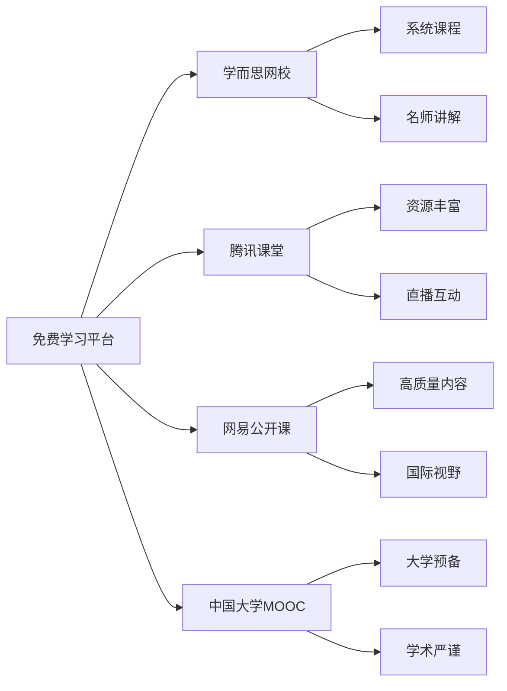
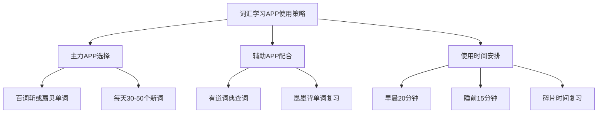
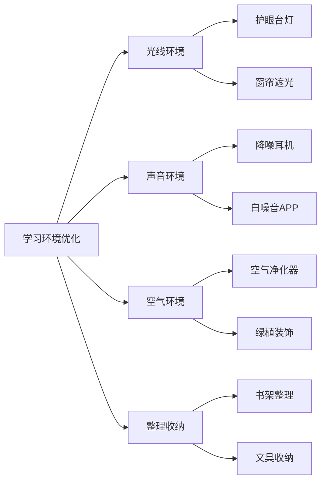
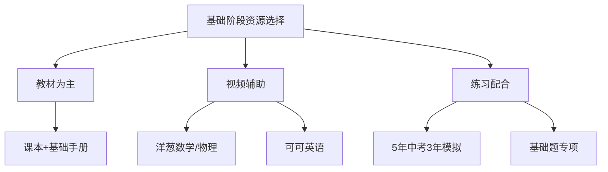

# 学习资源汇总：工具书籍与在线平台

## 📚 教材与辅导书籍

### 数学学习资源

#### 基础阶段教材
| 书名 | 出版社 | 适用阶段 | 推荐指数 | 特点 |
|------|--------|----------|----------|------|
| 《初中数学基础知识手册》 | 华东师大出版社 | 基础重建期 | ⭐⭐⭐⭐⭐ | 知识点全面，查漏补缺必备 |
| 《5年中考3年模拟·数学》 | 首都师范大学出版社 | 全阶段 | ⭐⭐⭐⭐⭐ | 题型全面，难度适中 |
| 《中考数学基础题1000道》 | 北京教育出版社 | 基础重建期 | ⭐⭐⭐⭐ | 基础题型丰富，适合打基础 |

#### 提高阶段教材
| 书名 | 出版社 | 适用阶段 | 推荐指数 | 特点 |
|------|--------|----------|----------|------|
| 《中考数学压轴题突破》 | 华东师大出版社 | 冲刺突破期 | ⭐⭐⭐⭐ | 专攻压轴题，方法系统 |
| 《数学思维训练》 | 人民教育出版社 | 强化提升期 | ⭐⭐⭐⭐ | 培养数学思维，提高分析能力 |
| 《历年中考数学真题分类汇编》 | 教育科学出版社 | 强化提升期 | ⭐⭐⭐⭐⭐ | 真题练习，把握考试趋势 |

#### 专项训练书籍
| 专题 | 推荐书籍 | 特点 | 使用建议 |
|------|----------|------|----------|
| 函数专题 | 《中考数学函数专项突破》 | 函数题型全面 | 12月-3月重点使用 |
| 几何专题 | 《中考几何证明与计算》 | 几何方法系统 | 1月-4月配合使用 |
| 应用题专题 | 《中考数学应用题解题技巧》 | 建模方法清晰 | 全程配合使用 |

### 物理学习资源

#### 基础阶段教材
| 书名 | 出版社 | 适用阶段 | 推荐指数 | 特点 |
|------|--------|----------|----------|------|
| 《初中物理基础知识手册》 | 人民教育出版社 | 基础重建期 | ⭐⭐⭐⭐⭐ | 概念清晰，公式齐全 |
| 《物理实验手册》 | 科学出版社 | 全阶段 | ⭐⭐⭐⭐ | 实验原理详细，操作规范 |
| 《5年中考3年模拟·物理》 | 首都师范大学出版社 | 全阶段 | ⭐⭐⭐⭐⭐ | 题型全面，难度适中 |

#### 专项训练书籍
| 专题 | 推荐书籍 | 特点 | 使用建议 |
|------|----------|------|----------|
| 力学专题 | 《中考物理力学专项》 | 力学概念清晰 | 11月-1月重点使用 |
| 电学专题 | 《中考物理电学突破》 | 电学计算系统 | 2月-4月重点使用 |
| 实验专题 | 《中考物理实验大全》 | 实验分析全面 | 5月重点使用 |

### 英语学习资源

#### 词汇语法书籍
| 书名 | 出版社 | 适用阶段 | 推荐指数 | 特点 |
|------|--------|----------|----------|------|
| 《中考英语词汇手册》 | 外语教学与研究出版社 | 全阶段 | ⭐⭐⭐⭐⭐ | 词汇全面，例句丰富 |
| 《英语语法大全》 | 商务印书馆 | 基础重建期 | ⭐⭐⭐⭐ | 语法系统，讲解详细 |
| 《中考英语语法专项训练》 | 华东师大出版社 | 强化提升期 | ⭐⭐⭐⭐ | 语法练习丰富 |

#### 技能训练书籍
| 技能 | 推荐书籍 | 特点 | 使用建议 |
|------|----------|------|----------|
| 阅读理解 | 《中考英语阅读理解》 | 阅读技巧实用 | 1月-4月重点使用 |
| 完形填空 | 《中考英语完形填空》 | 解题方法系统 | 2月-4月重点使用 |
| 书面表达 | 《英语写作指导》 | 写作系统，范文优秀 | 3月-6月重点使用 |

### 文科学习资源

#### 政治历史书籍
| 书名 | 出版社 | 适用阶段 | 推荐指数 | 特点 |
|------|--------|----------|----------|------|
| 《中考政治知识点大全》 | 人民教育出版社 | 全阶段 | ⭐⭐⭐⭐ | 知识点全面，时事更新 |
| 《中考历史时间轴》 | 中华书局 | 全阶段 | ⭐⭐⭐⭐ | 历史脉络清晰 |
| 《政治历史热点专题》 | 教育科学出版社 | 冲刺突破期 | ⭐⭐⭐⭐ | 热点分析深入 |

## 💻 在线学习平台

### 综合学习平台

#### 免费平台

| 平台名称 | 特色功能 | 适用科目 | 费用 | 推荐指数 |
|----------|----------|----------|------|----------|
| 学而思网校 | 系统性强，讲解详细 | 数学、物理、英语 | 部分免费 | ⭐⭐⭐⭐⭐ |
| 腾讯课堂 | 资源丰富，直播互动 | 全科目 | 大部分免费 | ⭐⭐⭐⭐ |
| 网易公开课 | 高质量内容，国际视野 | 英语、科学 | 免费 | ⭐⭐⭐⭐ |
| 中国大学MOOC | 大学预备，学术严谨 | 数学、物理 | 免费 | ⭐⭐⭐ |

#### 付费平台
| 平台名称 | 特色功能 | 适用科目 | 月费用 | 推荐指数 |
|----------|----------|----------|--------|----------|
| 猿辅导 | AI个性化，题库丰富 | 全科目 | 200-500元 | ⭐⭐⭐⭐⭐ |
| 作业帮直播课 | 互动性强，答疑及时 | 全科目 | 150-400元 | ⭐⭐⭐⭐ |
| 新东方在线 | 英语专业，方法独特 | 英语为主 | 300-600元 | ⭐⭐⭐⭐ |

### 专科学习平台

#### 数学专项平台
| 平台名称 | 主要功能 | 特点 | 使用建议 |
|----------|----------|------|----------|
| 洋葱数学 | 动画讲解，概念清晰 | 生动有趣，易理解 | 基础概念学习 |
| 数学加 | 题库丰富，智能推荐 | 个性化练习 | 专项训练 |
| GeoGebra | 数学绘图，动态演示 | 几何直观 | 几何学习辅助 |

#### 物理专项平台
| 平台名称 | 主要功能 | 特点 | 使用建议 |
|----------|----------|------|----------|
| 洋葱物理 | 动画实验，原理清晰 | 实验生动 | 概念理解 |
| 物理大师 | 实验视频，操作标准 | 实验规范 | 实验学习 |
| PhET仿真实验 | 虚拟实验，安全便捷 | 交互性强 | 实验补充 |

#### 英语专项平台
| 平台名称 | 主要功能 | 特点 | 使用建议 |
|----------|----------|------|----------|
| 可可英语 | 听力训练，材料丰富 | 分级明确 | 听力专项训练 |
| 英语流利说 | 口语练习，语音识别 | AI纠音 | 口语提升 |
| 沪江英语 | 综合学习，社区互动 | 资源全面 | 综合提升 |

## 📱 学习应用推荐

### 词汇学习APP

#### 主流词汇APP对比
| APP名称 | 记忆方法 | 特色功能 | 适用人群 | 推荐指数 |
|---------|----------|----------|----------|----------|
| 百词斩 | 图像记忆 | 图片联想，趣味性强 | 视觉学习者 | ⭐⭐⭐⭐⭐ |
| 扇贝单词 | 科学复习 | 记忆曲线，效果显著 | 系统学习者 | ⭐⭐⭐⭐⭐ |
| 墨墨背单词 | 个性化复习 | 遗忘曲线，精准复习 | 高效学习者 | ⭐⭐⭐⭐ |
| 有道词典 | 查词翻译 | 例句丰富，权威准确 | 全体学习者 | ⭐⭐⭐⭐⭐ |

#### 使用建议

### 学科专项APP

#### 数学学习APP
| APP名称 | 主要功能 | 特点 | 使用场景 |
|---------|----------|------|----------|
| 小猿搜题 | 拍照搜题 | 解析详细，步骤清晰 | 作业辅导 |
| 作业帮 | 拍照搜题+直播课 | 功能全面，互动性强 | 综合学习 |
| 数学加 | 专项练习 | 题库丰富，智能推荐 | 专项训练 |
| GeoGebra | 几何绘图 | 动态演示，直观理解 | 几何学习 |

#### 物理学习APP
| APP名称 | 主要功能 | 特点 | 使用场景 |
|---------|----------|------|----------|
| 物理实验室 | 虚拟实验 | 安全便捷，可重复 | 实验学习 |
| 物理公式 | 公式查询 | 分类清晰，查找方便 | 公式复习 |
| 物理计算器 | 物理计算 | 单位换算，计算准确 | 计算辅助 |

#### 英语学习APP
| APP名称 | 主要功能 | 特点 | 使用场景 |
|---------|----------|------|----------|
| 可可英语 | 听力训练 | 材料丰富，分级明确 | 听力提升 |
| 英语流利说 | 口语练习 | AI纠音，个性化 | 口语训练 |
| Grammarly | 语法检查 | 智能纠错，写作助手 | 写作辅助 |

### 学习管理APP

#### 时间管理APP
| APP名称 | 主要功能 | 特点 | 适用场景 |
|---------|----------|------|----------|
| 番茄工作法 | 时间管理 | 专注学习，定时休息 | 学习专注 |
| Forest | 专注管理 | 游戏化设计，趣味性强 | 防止分心 |
| 滴答清单 | 任务管理 | 任务提醒，进度跟踪 | 计划执行 |

#### 笔记管理APP
| APP名称 | 主要功能 | 特点 | 适用场景 |
|---------|----------|------|----------|
| 印象笔记 | 笔记整理 | 云端同步，搜索强大 | 知识管理 |
| 有道云笔记 | 笔记记录 | 多端同步，操作简单 | 日常记录 |
| Notion | 全能笔记 | 功能强大，自定义高 | 系统整理 |

## 🌐 学习网站推荐

### 综合学习网站

#### 国内学习网站
| 网站名称 | 网址 | 主要内容 | 特点 | 推荐指数 |
|----------|------|----------|------|----------|
| 学而思网校 | xueersi.com | 全科课程 | 系统性强，名师授课 | ⭐⭐⭐⭐⭐ |
| 腾讯课堂 | ke.qq.com | 在线课程 | 资源丰富，免费课程多 | ⭐⭐⭐⭐ |
| 网易公开课 | open.163.com | 公开课程 | 高质量内容，国际视野 | ⭐⭐⭐⭐ |
| 中国大学MOOC | icourse163.org | 大学课程 | 学术严谨，预备学习 | ⭐⭐⭐ |

#### 国外学习网站
| 网站名称 | 网址 | 主要内容 | 特点 | 推荐指数 |
|----------|------|----------|------|----------|
| Khan Academy | khanacademy.org | 免费教育 | 内容全面，质量高 | ⭐⭐⭐⭐⭐ |
| Coursera | coursera.org | 在线课程 | 大学课程，证书认证 | ⭐⭐⭐⭐ |
| edX | edx.org | 在线教育 | 名校课程，免费学习 | ⭐⭐⭐⭐ |

### 专科学习网站

#### 数学学习网站
| 网站名称 | 网址 | 主要内容 | 特点 |
|----------|------|----------|------|
| 洋葱数学 | yangcong345.com | 数学动画课程 | 生动有趣，概念清晰 |
| 数学乐 | shuxuele.com | 数学知识百科 | 内容全面，查询方便 |
| GeoGebra | geogebra.org | 数学软件 | 动态几何，可视化强 |

#### 物理学习网站
| 网站名称 | 网址 | 主要内容 | 特点 |
|----------|------|----------|------|
| 洋葱物理 | yangcong345.com | 物理动画课程 | 实验生动，原理清晰 |
| PhET仿真实验 | phet.colorado.edu | 虚拟物理实验 | 交互性强，安全便捷 |
| 物理网 | wuli.com | 物理知识资源 | 资源丰富，更新及时 |

#### 英语学习网站
| 网站名称 | 网址 | 主要内容 | 特点 |
|----------|------|----------|------|
| 可可英语 | kekenet.com | 英语听力材料 | 分级明确，材料丰富 |
| 沪江英语 | hjenglish.com | 英语学习资源 | 社区活跃，资源全面 |
| BBC Learning English | bbc.co.uk/learningenglish | 英语学习 | 权威内容，英式发音 |

### 题库练习网站

#### 综合题库网站
| 网站名称 | 网址 | 主要内容 | 特点 |
|----------|------|----------|------|
| 菁优网 | jyeoo.com | 各科题库 | 题量丰富，分类详细 |
| 组卷网 | zujuan.com | 在线组卷 | 自由组卷，难度可控 |
| 学科网 | zxxk.com | 教学资源 | 资源权威，更新及时 |

#### 专项练习网站
| 网站名称 | 主要内容 | 特点 | 适用科目 |
|----------|----------|------|----------|
| 猿题库 | 在线练习，智能推荐 | 个性化练习 | 全科目 |
| 作业盒子 | 作业练习，数据分析 | 学习分析 | 数学、英语 |
| 一起作业 | 在线作业，师生互动 | 互动性强 | 英语为主 |

## 🛠️ 学习工具推荐

### 硬件工具

#### 基础学习工具
| 工具名称 | 用途 | 推荐品牌 | 价格范围 | 必要性 |
|----------|------|----------|----------|----------|
| 护眼台灯 | 学习照明 | 飞利浦、小米 | 100-300元 | 必需 |
| 学习桌椅 | 学习环境 | 宜家、网易严选 | 500-1500元 | 必需 |
| 计算器 | 数学计算 | 卡西欧、德州仪器 | 50-200元 | 必需 |
| 文具用品 | 日常学习 | 晨光、得力 | 50-100元 | 必需 |

#### 电子学习工具
| 工具名称 | 用途 | 推荐型号 | 价格范围 | 必要性 |
|----------|------|----------|----------|----------|
| 学习平板 | 在线学习 | iPad、华为MatePad | 2000-4000元 | 可选 |
| 电子词典 | 英语学习 | 卡西欧、好易通 | 500-1500元 | 可选 |
| 录音笔 | 课堂录音 | 索尼、飞利浦 | 200-800元 | 可选 |
| 蓝牙耳机 | 听力练习 | 苹果、小米 | 200-1000元 | 可选 |

### 软件工具

#### 学习管理软件
| 软件名称 | 主要功能 | 平台 | 费用 | 推荐指数 |
|----------|----------|------|------|----------|
| Anki | 记忆卡片 | 全平台 | 免费 | ⭐⭐⭐⭐⭐ |
| Notion | 笔记管理 | 全平台 | 免费/付费 | ⭐⭐⭐⭐ |
| Forest | 专注管理 | 手机 | 付费 | ⭐⭐⭐⭐ |
| 滴答清单 | 任务管理 | 全平台 | 免费/付费 | ⭐⭐⭐⭐ |

#### 学科专用软件
| 软件名称 | 适用科目 | 主要功能 | 特点 |
|----------|----------|----------|------|
| GeoGebra | 数学 | 几何绘图 | 动态演示，免费 |
| Photomath | 数学 | 拍照解题 | 步骤详细，免费 |
| Grammarly | 英语 | 语法检查 | 智能纠错，部分免费 |
| Quizlet | 全科 | 学习卡片 | 社区分享，免费 |

### 学习环境工具

#### 环境优化工具

| 工具类型 | 具体工具 | 作用 | 推荐品牌 |
|----------|----------|------|----------|
| 照明工具 | 护眼台灯 | 保护视力，提供充足光线 | 飞利浦、小米 |
| 降噪工具 | 降噪耳机 | 隔绝干扰，专注学习 | 索尼、Bose |
| 空气工具 | 空气净化器 | 改善空气质量 | 小米、飞利浦 |
| 收纳工具 | 书架文具盒 | 整理学习用品 | 宜家、无印良品 |

## 📊 资源使用建议

### 资源选择原则

#### 基础阶段资源选择

**选择标准：**
1. **权威性**：选择知名出版社和平台
2. **系统性**：内容体系完整，循序渐进
3. **适用性**：符合当前学习水平
4. **经济性**：在预算范围内选择最优

#### 提高阶段资源选择
**选择重点：**
1. **专项突破**：针对薄弱环节选择专项资源
2. **真题练习**：大量使用历年真题
3. **技巧训练**：学习应试技巧和方法
4. **模拟测试**：定期进行模拟考试

### 资源使用时间安排

#### 每日资源使用计划
| 时间段 | 主要资源 | 使用方式 | 时长 |
|--------|----------|----------|------|
| 早晨 | 英语APP、听力材料 | 词汇背诵、听力训练 | 30分钟 |
| 上午 | 数学视频、练习册 | 概念学习、题目练习 | 60分钟 |
| 下午 | 物理视频、实验网站 | 原理理解、实验观看 | 40分钟 |
| 晚上 | 综合练习、错题本 | 复习巩固、查漏补缺 | 90分钟 |

#### 周末资源使用计划
| 时间段 | 主要资源 | 使用方式 | 时长 |
|--------|----------|----------|------|
| 周六上午 | 在线课程、专题视频 | 系统学习、深度理解 | 120分钟 |
| 周六下午 | 练习册、题库网站 | 大量练习、专项训练 | 120分钟 |
| 周日上午 | 模拟试卷、真题 | 模拟考试、查漏补缺 | 120分钟 |
| 周日下午 | 错题整理、知识梳理 | 总结反思、计划调整 | 90分钟 |

### 资源效果评估

#### 评估指标
1. **学习效率**：单位时间内的学习效果
2. **知识掌握**：知识点的理解和应用程度
3. **成绩提升**：考试成绩的变化情况
4. **学习兴趣**：对学习的积极性和主动性

#### 评估方法
1. **定期测试**：每周进行小测试
2. **学习记录**：记录每日学习情况
3. **效果对比**：对比使用前后的效果
4. **及时调整**：根据效果调整资源使用

### 资源获取途径

#### 免费资源获取
1. **图书馆借阅**：借阅教辅书籍和参考资料
2. **网络下载**：下载免费的学习APP和软件
3. **在线观看**：观看免费的教学视频
4. **同学分享**：与同学分享学习资源

#### 付费资源选择
1. **性价比分析**：比较不同资源的性价比
2. **试用体验**：先试用再决定是否购买
3. **分期付款**：选择分期付款减轻经济压力
4. **团购优惠**：与同学团购获得优惠

## 🚨 资源使用注意事项

### 避免资源过载

**常见问题：**
- 资源太多，不知道选择哪个
- 同时使用多个平台，效果不佳
- 频繁更换资源，缺乏持续性

**解决方案：**
1. **精选原则**：每个科目选择1-2个主要资源
2. **循序渐进**：先用好一个资源再考虑其他
3. **定期评估**：定期评估资源使用效果
4. **坚持使用**：给每个资源足够的使用时间

### 合理安排时间

**时间分配建议：**
- 70%时间用于主要资源
- 20%时间用于辅助资源
- 10%时间用于尝试新资源

**避免时间浪费：**
1. **明确目标**：使用资源前明确学习目标
2. **限制时间**：为每个资源设定使用时间
3. **专注学习**：使用时保持专注，避免分心
4. **及时总结**：使用后及时总结学习效果

### 保护视力健康

**电子设备使用建议：**
1. **20-20-20法则**：每20分钟看20英尺外20秒
2. **调节亮度**：屏幕亮度与环境光线匹配
3. **保持距离**：眼睛与屏幕保持50-70厘米
4. **定期休息**：每小时休息10-15分钟

**护眼措施：**
- 使用护眼台灯提供充足光线
- 调节电子设备的护眼模式
- 多进行户外活动，放松眼部肌肉
- 定期检查视力，及时矫正

---

**重要提醒：** 学习资源只是工具，关键在于如何有效使用。要根据自己的学习情况和需求选择合适的资源，并坚持使用，才能取得良好的学习效果。

**使用建议：**
1. 优先选择权威、系统的资源
2. 每个科目选择1-2个主要资源深度使用
3. 定期评估资源使用效果，及时调整
4. 注意劳逸结合，保护身体健康
5. 与老师和同学交流，分享使用经验