# 政治历史科目学习指南：记忆技巧与答题策略

## 📊 当前问题诊断

### 政治历史学科现状分析

#### 典型问题表现
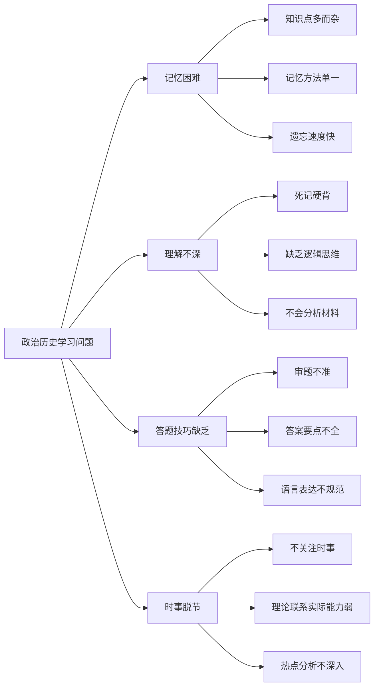

#### 分数分布分析
| 题型 | 满分 | 当前得分 | 失分原因 | 提升空间 |
|------|------|----------|----------|----------|
| 选择题 | 50分 | 30分 | 基础知识不牢固 | 15分 |
| 材料分析题 | 30分 | 15分 | 审题不准，答题不规范 | 12分 |
| 论述题 | 20分 | 8分 | 逻辑不清，要点不全 | 10分 |
| **总计** | **100分** | **53分** | **综合能力不足** | **37分** |

### 8个月提升目标

#### 阶段性目标设定
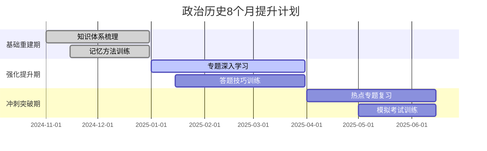

| 阶段 | 时间 | 目标分数 | 重点任务 | 评估标准 |
|------|------|----------|----------|----------|
| 基础重建期 | 11-12月 | 65分 | 知识体系重建，基础记忆 | 选择题正确率70% |
| 强化提升期 | 1-3月 | 75分 | 专题学习，技巧训练 | 材料题得分率60% |
| 冲刺突破期 | 4-6月 | 85分 | 热点复习，模拟训练 | 综合能力全面提升 |

## 🧠 结构化记忆标准作业流程 (SOP)

**核心理念**：文科学习的本质不是死记硬背，而是将孤立的知识点，通过逻辑和想象，编织成一张有序的“知识网络”。这张网络不仅记得牢，而且在需要时能迅速提取和应用。

--- 

### SOP-1: “故事线”串联记忆法 (适用于历史事件、政治发展脉络)

此方法旨在将枯燥的、线性的时间-事件-影响，转化为一个生动、有因果关系的故事。

**操作三步骤：**

**第一步：抓主角，定场景 (提取关键词)**

拿到一个历史事件或知识模块，首先问自己三个问题，找出故事的“核心要素”：
1.  **主角是谁？** (国家、阶级、政党、关键人物)
2.  **发生了什么？** (事件、会议、战争、改革)
3.  **为什么发生？** (背景、原因)
4.  **结果怎么样？** (影响、意义)

*   **案例：** 记忆“新文化运动”
    *   **主角**：陈独秀、胡适、鲁迅等激进的知识分子。
    *   **场景**：北洋军阀统治下的黑暗中国，辛亥革命失败，人们思想迷茫。
    *   **核心事件**：他们创办《新青年》杂志，提出“民主”与“科学”两大口号，反对旧思想、旧道德、旧文学。
    *   **结果**：动摇了封建思想的统治地位，极大地解放了人们的思想，为马克思主义在中国的传播开辟了道路。

**第二步：编故事，加细节 (逻辑联想)**

将上一步提取的关键词，用“因为...所以...”、“接着...”、“但是...”等逻辑连接词串联起来，像讲故事一样讲给自己听。可以加入一些夸张的、有趣的想象来增强记忆。

*   **故事化叙述：**
    > “**因为**辛亥革命虽然赶跑了皇帝，但人们脑子里的‘辫子’还在，整个社会死气沉沉（**场景**）。
    > **所以**，一群叫陈独秀、胡适的‘海归’看不下去了（**主角**）。他们办了一本叫《新青年》的‘网红杂志’，大声疾呼：‘我们不要皇帝，更不要脑子里的皇帝！我们需要的是德先生（民主）和赛先生（科学）！’（**核心事件**）。
    > 他们就像往一潭死水里扔了一颗炸弹，把孔家店砸得稀巴烂，虽然没能立刻救中国，但**结果**是把大家的脑子都给炸清醒了，为后来更厉害的思想（马克思主义）进场扫清了障碍。（**影响**）”

**第三步：画简图，理脉络 (构建逻辑树)**

用最简单的图示，把故事的逻辑关系画出来。这会形成一个视觉“锚点”，巩固记忆。

*   **新文化运动逻辑简图：**
    ```mermaid
    graph TD
        A[背景：辛亥革命失败<br>思想混乱] --> B{核心：<br>《新青年》}
        B --> C[口号：民主(德先生)]
        B --> D[口号：科学(赛先生)]
        C --> E[内容：反专制]
        D --> F[内容：反迷信]
        E & F --> G[性质：思想解放运动]
        G --> H[影响：动摇封建思想<br>为马克思主义传播开路]
    ```

--- 

### SOP-2: “关键词”发散记忆法 (适用于政治概念、历史名词解释)

此方法用于快速、准确地记忆核心概念的定义和内涵。

**操作三步骤：**

1.  **定核心 (1个词)**：用一个词定义该概念的本质。
2.  **找要素 (3-5个词)**：围绕核心词，找出构成该概念的几个关键要素。
3.  **连成句 (一段话)**：用通顺的语言，将核心词和要素组合成一段完整的解释。

*   **案例：** 记忆政治概念“人民代表大会制度”
    1.  **定核心**：`权力` (本质是权力机关)
    2.  **找要素**：`人民选举`、`代表`、`组成国家权力机关`、`统一行使国家权力`、`民主集中制`
    3.  **连成句**：“人民代表大会制度是我国的根本政治制度（**定性**）。它指的是，国家的一切权力属于人民（**核心**），人民通过**选举**产生自己的**代表**，由这些代表**组成国家权力机关**（人大），**统一行使国家权力**。它的组织和活动原则是**民主集中制**。”

通过这两个SOP，你可以将任何复杂的文科知识点，转化为有逻辑、有图像、易于回忆的知识结构。

## 📝 答题技巧与策略

### 论述题标准作业流程 (SOP) - “三步成文法”

**核心理念**：任何一道文科论述题，其本质都是要求你就一个问题“发表看法并证明它”。一个高分答案，必须包含清晰的“观点”、充分的“论据”和简明的“总结”。本SOP旨在将这个逻辑过程标准化。

**适用题型**：政治、历史学科的所有材料分析题、简答题、论述题。

--- 

**操作三步骤：**

**第一步：亮观点 (一句话)**

在答案的开头，用一句话直接、明确地回答题目问的核心问题。这句话就是你整个答案的“总论点”，起到开宗明义的作用。

*   **句式模板**：
    *   “这一事件/政策的意义在于...”
    *   “我认为，造成这一现象的原因是...”
    *   “材料反映了...的道理/观点。”
    *   “我们应该...” (针对启示类题目)
*   **关键**：不要抄材料，不要说废话，直接给出结论。这一步是给阅卷老师的第一印象，必须清晰有力。

**第二步：摆论据 (分点罗列)**

这是答案的主体部分。你需要从不同角度，分点阐述来支撑你的观点。每一条论据都应该是一个“论点+论证”的完整结构。

*   **操作要领**：
    1.  **分点**：用“第一、第二、第三...”或“首先、其次、再次...”等序号词，让答案层次分明。
    2.  **史论结合/政理结合**：每个要点都应该包含“理论知识”和“材料信息”两部分。
        *   **历史科**：`史实（材料/课本） + 结论（该史实说明了什么）`
        *   **政治科**：`原理（课本知识） + 材料（材料中的具体表现）`
    3.  **由表及里**：可以按照“政治、经济、文化”、“对内、对外”、“直接原因、根本原因”等多角度、多层次来组织论据。

**第三步：做总结 (一句话)**

在答案的结尾，用一句话对前面的论述进行概括，或者升华主题，再次点明题意。

*   **句式模板**：
    *   “综上所述，...”
    *   “因此，我们青少年应该...”
    *   “这对于我们今天的...建设，依然具有重要的借鉴意义。”
*   **作用**：让答案结构完整，首尾呼应，给阅卷老师一个“任务完成”的清晰信号。

--- 

### 案例演示 (历史题)

**材料**：19世纪60年代到90年代，洋务派以“自强”、“求富”为口号，创办了一系列军事和民用工业，如安庆内军械所、江南制造总局等。但最终在甲午中日战争中惨败，宣告了洋务运动的失败。

**题目**：根据材料并结合所学知识，评价洋务运动。

**SOP应用**：

1.  **【亮观点】** 洋务运动是一次失败的封建统治者的自救运动，但它客观上开启了中国近代化的进程。

2.  **【摆论据】**
    *   **第一，从目的上看，它是为了维护清朝的封建统治，是地主阶级的自救运动，这是其失败的根源。** (分论点1：定性)
    *   **第二，从实践上看，它引进了西方先进的科学技术，创办了中国第一批近代军事和民用企业（如江南制造总局等），培养了第一批科技人才。** (分论点2：积极作用-经济)
    *   **第三，从影响上看，它客观上刺激了中国民族资本主义的产生和发展，对外国的经济侵略起到了一定的抵制作用，是中国近代化的开端。** (分论点3：积极作用-深远影响)
    *   **第四，从结果上看，甲午中日战争的惨败证明了只学习技术而不改变腐朽的封建制度，是无法让中国真正富强起来的。** (分论点4：局限性)

3.  **【做总结】** 综上所述，洋务运动虽然没能实现国家富强，但它打开了古老中国紧闭的大门，是中国从传统社会向近代社会过渡的重要一环。

### 政治答题技巧

#### 选择题答题策略
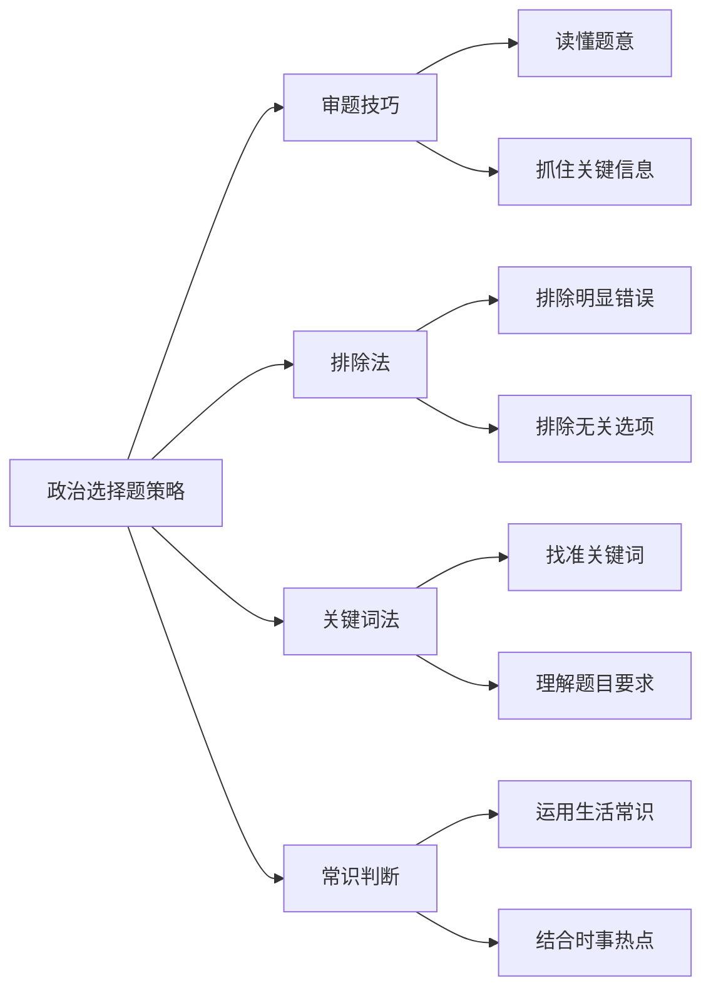

**具体技巧：**
1. **审题要仔细**：
   - 看清题目要求（体现、说明、表明等）
   - 注意限定词（主要、根本、直接等）
   - 理解材料信息（时间、地点、人物等）

2. **选项分析法**：
   - 先排除明显错误的选项
   - 再排除与题意无关的选项
   - 最后在剩余选项中选择最佳答案

3. **常见错误类型**：
   - 绝对化表述（一定、必然、只有等）
   - 颠倒因果关系
   - 混淆概念内涵
   - 夸大或缩小作用

#### 材料分析题答题策略

**答题步骤：**
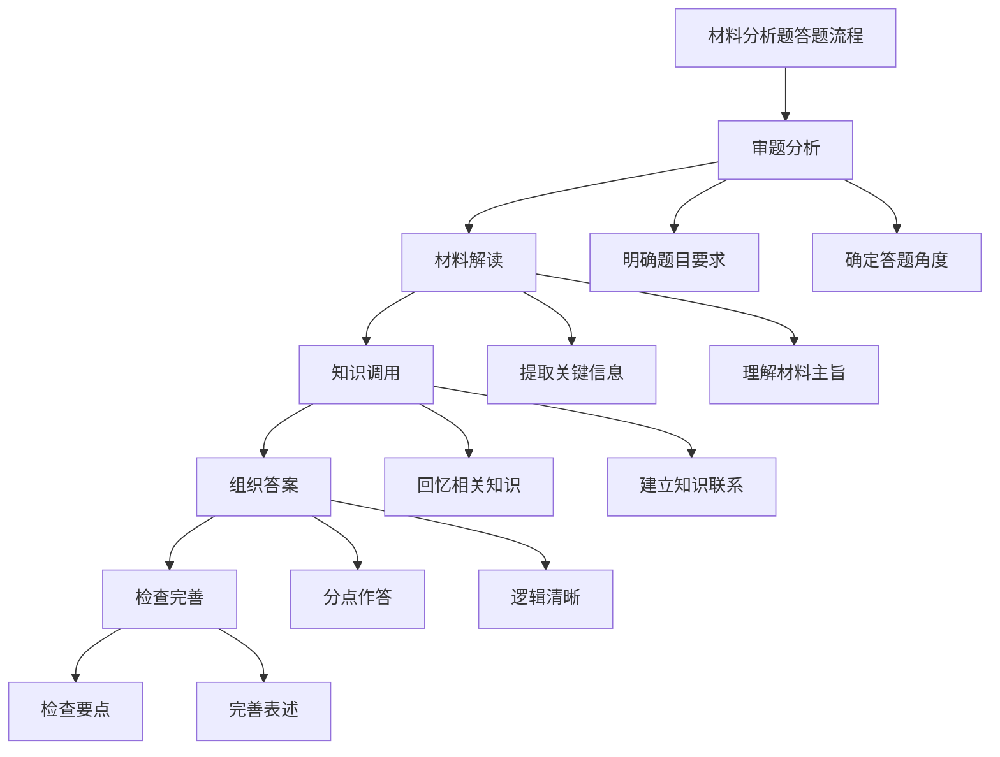

**答题模板：**
1. **"体现类"题目**：
   - 材料中...体现了...（理论观点）
   - 具体表现为...（材料信息）
   - 说明了...（深层含义）

2. **"意义类"题目**：
   - 有利于...（积极作用）
   - 能够...（具体效果）
   - 对...具有重要意义（总体评价）

3. **"措施类"题目**：
   - 国家要...（政府角度）
   - 社会要...（社会角度）
   - 个人要...（个人角度）

#### 论述题答题策略

**答题结构：**
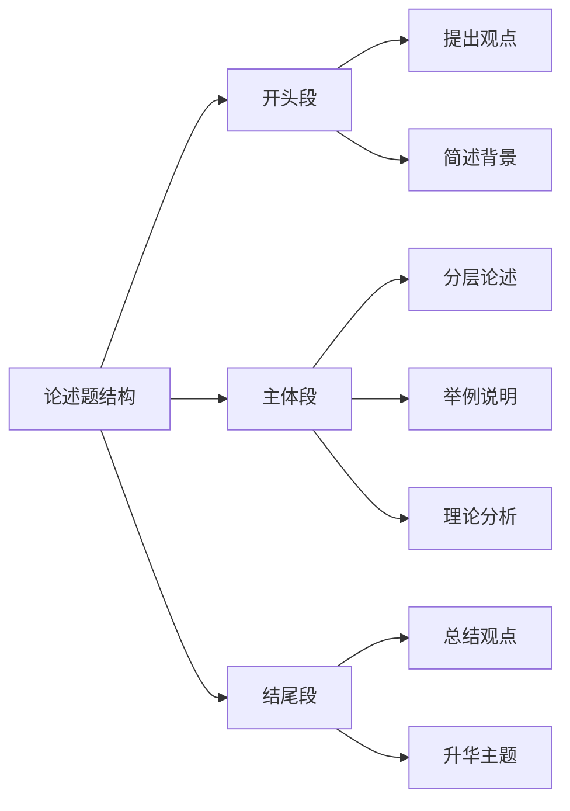

**写作要点：**
1. **观点明确**：开头明确提出中心论点
2. **层次清晰**：按逻辑顺序分层论述
3. **论据充分**：理论论据+事实论据
4. **语言规范**：使用政治术语，表述准确

### 历史答题技巧

#### 选择题答题策略

**时间判断法：**
- 根据材料中的时间信息判断历史阶段
- 结合时代背景分析历史现象
- 注意时间的前后逻辑关系

**关键词识别法：**
- 抓住材料中的关键词汇
- 联系相关历史知识
- 排除时代不符的选项

**史实对比法：**
- 对比不同历史事件的异同
- 分析历史现象的发展变化
- 注意历史概念的准确含义

#### 材料解析题答题策略

**材料分析步骤：**
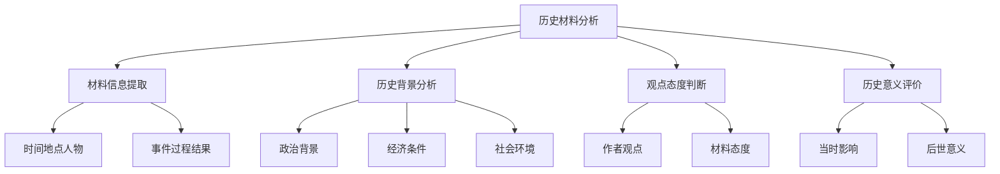

**答题要点：**
1. **信息提取要全面**：
   - 直接信息：材料明确表述的内容
   - 间接信息：需要推理得出的内容
   - 隐含信息：材料背后的深层含义

2. **历史背景要准确**：
   - 时代特征：政治、经济、文化背景
   - 具体环境：事件发生的具体条件
   - 因果关系：前因后果的逻辑关系

3. **观点分析要客观**：
   - 材料观点：作者的立场和态度
   - 史学观点：史学界的主流认识
   - 个人观点：基于史实的合理判断

#### 论述题答题策略

**论述题类型：**
| 题型 | 特点 | 答题要求 | 评分标准 |
|------|------|----------|----------|
| 叙述类 | 要求叙述历史过程 | 时间顺序，要素完整 | 史实准确，逻辑清晰 |
| 分析类 | 要求分析历史现象 | 多角度分析，深入透彻 | 观点明确，论证充分 |
| 评价类 | 要求评价历史人物事件 | 客观公正，一分为二 | 史论结合，评价合理 |
| 比较类 | 要求比较历史现象 | 找出异同，分析原因 | 对比准确，分析深入 |

**写作模板：**
1. **分析类论述题**：
   - 背景：...的历史背景是...
   - 原因：...的原因主要有...
   - 过程：...的发展过程是...
   - 影响：...产生了...的影响

2. **评价类论述题**：
   - 积极作用：...在...方面发挥了积极作用
   - 消极影响：...也存在...的局限性
   - 历史地位：...在历史上具有重要地位
   - 现实启示：...给我们的启示是...

## 📚 知识体系重建

### 政治知识体系

#### 马克思主义基本原理
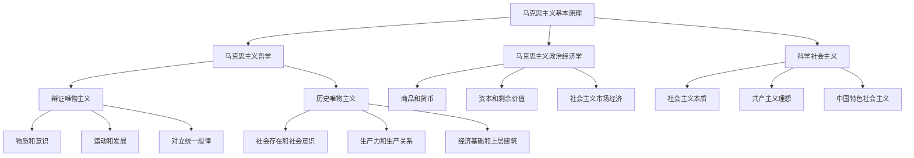

**重点知识梳理：**

1. **哲学基本问题**
   - 物质和意识的关系
   - 思维和存在的关系
   - 理论和实践的关系

2. **认识论要点**
   - 实践是认识的基础
   - 认识的发展过程
   - 真理的客观性和相对性

3. **社会发展规律**
   - 生产力决定生产关系
   - 经济基础决定上层建筑
   - 人民群众是历史的创造者

#### 中国特色社会主义理论
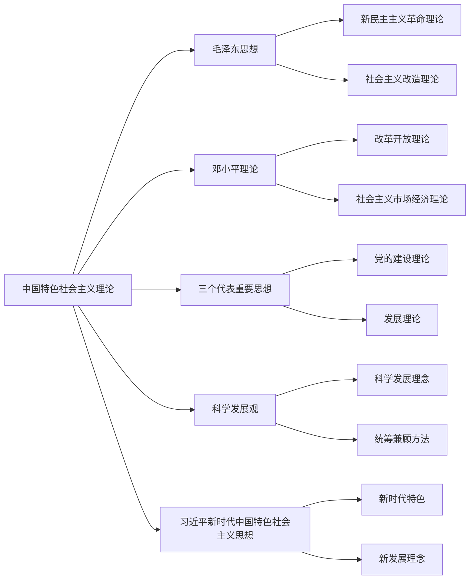

**核心内容：**
1. **基本路线**：一个中心，两个基本点
2. **基本制度**：人民代表大会制度、中国共产党领导的多党合作和政治协商制度、民族区域自治制度、基层群众自治制度
3. **基本方略**：十四个坚持

#### 经济生活知识体系
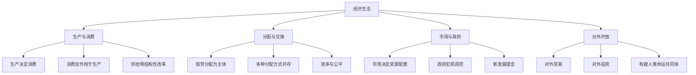

### 历史知识体系

#### 中国古代史体系
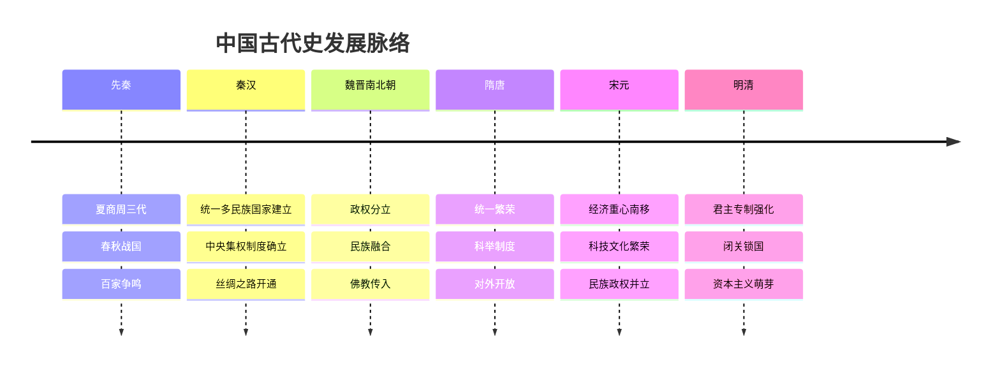

**重点专题：**
1. **政治制度演变**
   - 分封制→郡县制→三省六部制→内阁制
   - 中央集权制度的发展完善
   - 君主专制的强化过程

2. **经济发展变化**
   - 农业：精耕细作技术发展
   - 手工业：官营手工业→民营手工业
   - 商业：重农抑商→商品经济发展

3. **思想文化成就**
   - 春秋战国：百家争鸣
   - 汉代：独尊儒术
   - 宋明：理学兴起
   - 明清：启蒙思想萌芽

#### 中国近现代史体系
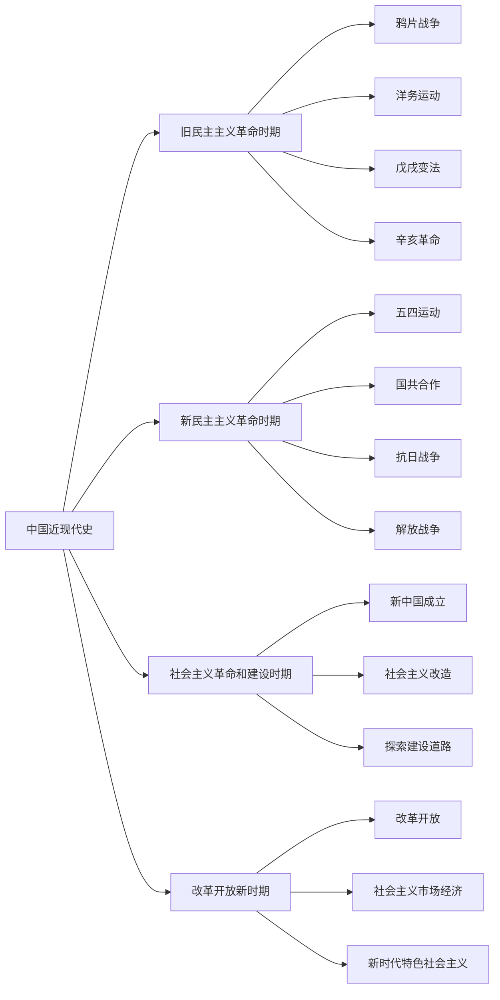

**阶段特征：**
1. **1840-1919年**：旧民主主义革命时期
   - 特征：反帝反封建，资产阶级领导
   - 成果：推翻封建帝制，建立共和政体

2. **1919-1949年**：新民主主义革命时期
   - 特征：无产阶级领导，农民为主力
   - 成果：建立人民民主专政的新中国

3. **1949-1978年**：社会主义革命和建设时期
   - 特征：确立社会主义制度，探索建设道路
   - 成果：建立完整的工业体系和国民经济体系

4. **1978年至今**：改革开放新时期
   - 特征：改革开放，建设中国特色社会主义
   - 成果：成为世界第二大经济体

#### 世界史知识体系
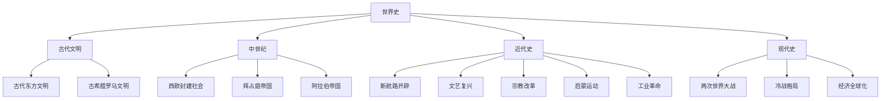

## 🎯 专题学习计划

### 政治专题学习

#### 第一阶段：基础理论专题（11-12月）

**专题一：马克思主义哲学基本原理**
- 学习内容：物质与意识、实践与认识、矛盾分析法
- 学习方法：理论学习+案例分析+练习巩固
- 时间安排：每周3小时，共8周
- 评估标准：能够运用哲学原理分析现实问题

**专题二：中国特色社会主义理论体系**
- 学习内容：毛泽东思想、邓小平理论、新时代思想
- 学习方法：历史脉络梳理+重点内容精讲
- 时间安排：每周2小时，共8周
- 评估标准：掌握理论体系的发展脉络和核心内容

#### 第二阶段：应用能力专题（1-3月）

**专题三：经济生活分析**
- 学习内容：市场经济、宏观调控、对外开放
- 学习方法：经济现象分析+政策解读
- 时间安排：每周3小时，共12周
- 评估标准：能够分析经济现象，理解经济政策

**专题四：政治生活参与**
- 学习内容：人民当家作主、依法治国、党的领导
- 学习方法：制度学习+实践参与
- 时间安排：每周2小时，共12周
- 评估标准：理解政治制度，具备政治参与意识

#### 第三阶段：热点专题复习（4-6月）

**专题五：时事政治分析**
- 学习内容：国内外重大时事、热点问题分析
- 学习方法：时事跟踪+理论分析+模拟练习
- 时间安排：每周4小时，共10周
- 评估标准：能够运用理论分析时事热点

### 历史专题学习

#### 第一阶段：通史复习（11-12月）

**专题一：中国古代史**
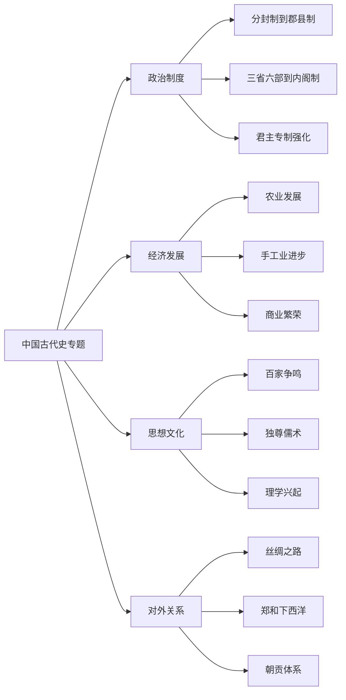

- 学习重点：政治制度演变、经济发展脉络、思想文化成就
- 学习方法：时间轴梳理+专题归纳+比较分析
- 时间安排：每周4小时，共8周

**专题二：中国近现代史**
- 学习重点：革命历程、建设成就、改革开放
- 学习方法：阶段特征分析+重大事件梳理
- 时间安排：每周4小时，共8周

#### 第二阶段：专题深化（1-3月）

**专题三：世界史重点**
- 学习重点：工业革命、两次世界大战、冷战格局
- 学习方法：中外对比+影响分析
- 时间安排：每周3小时，共12周

**专题四：史学方法训练**
- 学习重点：史料分析、史学观点、史学方法
- 学习方法：材料练习+观点辨析
- 时间安排：每周2小时，共12周

#### 第三阶段：综合提升（4-6月）

**专题五：热点专题**
- 学习重点：历史热点、周年纪念、现实意义
- 学习方法：专题复习+模拟训练
- 时间安排：每周4小时，共10周

## 📊 学习效果评估

### 评估体系设计

#### 知识掌握评估
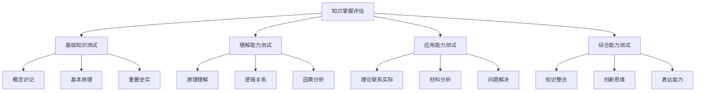

#### 评估标准
| 能力层次 | 评估内容 | 评估方式 | 合格标准 |
|----------|----------|----------|----------|
| 识记 | 基本概念、重要史实 | 选择题、填空题 | 正确率80% |
| 理解 | 原理含义、逻辑关系 | 简答题、解释题 | 要点完整，表述准确 |
| 应用 | 理论分析、材料解读 | 材料题、分析题 | 观点正确，论证充分 |
| 综合 | 知识整合、创新表达 | 论述题、小论文 | 逻辑清晰，有创新见解 |

### 阶段性检测

#### 月度检测计划
| 月份 | 检测重点 | 检测形式 | 目标分数 |
|------|----------|----------|----------|
| 11月 | 基础知识掌握 | 选择题+简答题 | 65分 |
| 12月 | 理解能力提升 | 材料题+分析题 | 70分 |
| 1月 | 应用能力训练 | 综合练习 | 75分 |
| 2月 | 专题知识整合 | 专题测试 | 78分 |
| 3月 | 答题技巧运用 | 模拟考试 | 80分 |
| 4月 | 热点问题分析 | 时事分析 | 82分 |
| 5月 | 综合能力提升 | 全真模拟 | 85分 |
| 6月 | 考前冲刺训练 | 押题练习 | 88分 |

#### 错误分析与改进
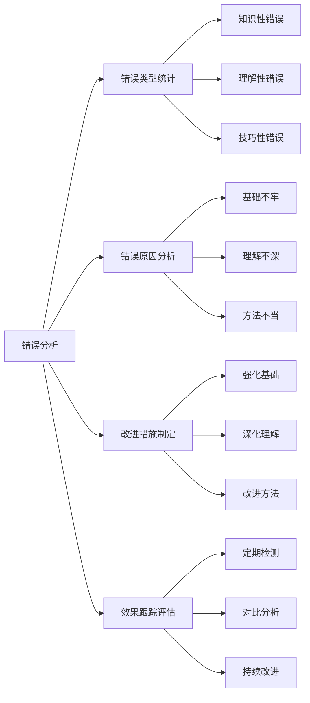

## 🚨 常见问题解决

### 记忆问题解决

#### 记忆困难的原因分析
1. **方法单一**：只用死记硬背，缺乏科学方法
2. **缺乏理解**：不理解知识内在逻辑，机械记忆
3. **复习不及时**：学过就忘，没有及时复习巩固
4. **兴趣不足**：对学科缺乏兴趣，记忆动力不足

#### 解决策略
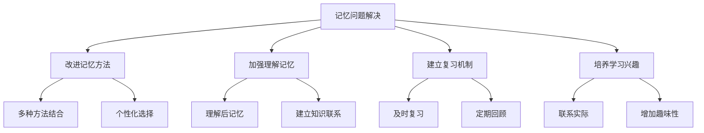

### 理解问题解决

#### 理解困难的表现
1. **概念模糊**：对基本概念理解不清
2. **逻辑混乱**：不能理清知识间的逻辑关系
3. **应用困难**：不会运用理论分析实际问题
4. **思维僵化**：思维方式单一，缺乏灵活性

#### 解决方法
1. **概念辨析法**：
   - 准确理解概念内涵和外延
   - 区分相似概念的差异
   - 建立概念之间的联系

2. **逻辑梳理法**：
   - 理清知识的逻辑结构
   - 建立知识框架图
   - 掌握分析问题的逻辑方法

3. **实例分析法**：
   - 用具体实例说明抽象理论
   - 理论联系实际
   - 提高应用能力

### 答题问题解决

#### 答题常见问题
1. **审题不准**：不能准确理解题目要求
2. **要点不全**：答案要点不完整
3. **表述不规范**：语言表达不准确
4. **逻辑不清**：答案缺乏逻辑性

#### 改进措施
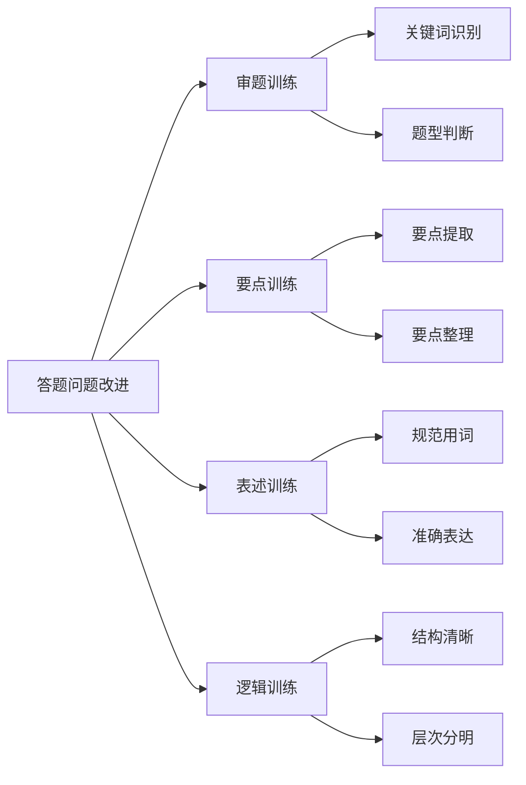

## 📈 提升建议

### 短期提升策略（1-3个月）

#### 基础知识强化
1. **制定详细的复习计划**
2. **每天坚持背诵重点知识**
3. **及时复习，防止遗忘**
4. **多做基础练习题**

#### 理解能力提升
1. **注重理解，避免死记硬背**
2. **建立知识框架，理清逻辑关系**
3. **多思考，多提问**
4. **理论联系实际**

#### 答题技巧训练
1. **熟悉各种题型的答题方法**
2. **多做模拟练习**
3. **总结答题规律**
4. **规范答题格式**

### 长期发展规划（3-8个月）

#### 综合能力培养
1. **培养政治敏感性和历史思维**
2. **关注时事热点，增强现实感**
3. **提高分析问题和解决问题的能力**
4. **培养创新思维和批判精神**

#### 学习方法优化
1. **不断改进学习方法**
2. **提高学习效率**
3. **培养自主学习能力**
4. **建立终身学习理念**

---

## 🔧 政治历史专属学习方法详解

> 以下方法专门针对政治历史学科特点设计，配合[18-核心学习方法详解](./18-核心学习方法详解-高效记忆与解题技巧.md)使用效果更佳

### 方法一：历史事件复述法

**为什么历史需要复述？**
- 历史不是"背"出来的，是"讲"出来的
- 能讲清楚一个历史事件，说明你真正理解了
- 复述能帮你发现记忆的漏洞

**历史事件复述示例**

```
【学习内容】鸦片战争

【第1步：看书学习】
时间：1840-1842年
原因：英国为打开中国市场，倾销鸦片
经过：英军攻占广州、厦门、宁波、上海
结果：签订《南京条约》
影响：中国开始沦为半殖民地半封建社会

【第2步：合上书复述】
"鸦片战争发生在1840年...
英国为了...呃...为了卖鸦片...
不对，是为了打开中国市场...
结果签订了《南京条约》...
条约内容是什么来着..."

【第3步：打开书检查】
✓ 时间记对了
✓ 原因大致记对了
✗ 经过没说完整（漏了具体战役）
✗ 《南京条约》内容没说
✗ 影响只说了一半

【第4步：补充复述遗漏部分】
重点复述：
- 《南京条约》内容：割香港岛、赔款2100万银元、
  开放五口通商、协定关税
- 影响：中国开始沦为半殖民地半封建社会，
  是中国近代史的开端
```

**历史事件复述清单（每日1-2个）**

```
【中国近代史】
□ 鸦片战争（1840-1842）
□ 太平天国运动（1851-1864）
□ 洋务运动（1861-1895）
□ 甲午中日战争（1894-1895）
□ 戊戌变法（1898）
□ 辛亥革命（1911）
□ 五四运动（1919）
□ 中国共产党成立（1921）
□ 抗日战争（1937-1945）
□ 解放战争（1946-1949）

【世界近代史】
□ 新航路开辟（15-16世纪）
□ 文艺复兴（14-17世纪）
□ 英国资产阶级革命（1640-1688）
□ 美国独立战争（1775-1783）
□ 法国大革命（1789-1794）
□ 工业革命（18世纪60年代-19世纪中期）
```

### 方法二：政治概念"三问法"

**政治概念记忆模板**

```
【概念名称】人民代表大会制度

【第1问：是什么？】（定义）
→ 我国的根本政治制度
→ 人民通过选举产生代表，组成国家权力机关

【第2问：为什么？】（意义/作用）
→ 保证人民当家作主
→ 体现社会主义民主的本质
→ 保证国家机关协调高效运转

【第3问：怎么做？】（要求/措施）
→ 坚持党的领导
→ 坚持人民主体地位
→ 坚持依法治国
→ 坚持民主集中制
```

**政治概念"三问法"实战示例**

```
┌─────────────────────────────────────────────┐
│ 【题目】                                     │
│ 简述我国的基本经济制度及其意义。            │
├─────────────────────────────────────────────┤
│ 【用"三问法"组织答案】                      │
│                                              │
│ 【是什么】                                   │
│ 我国的基本经济制度是：                       │
│ 公有制为主体、多种所有制经济共同发展        │
│                                              │
│ 【为什么】（意义）                           │
│ ① 适合我国社会主义初级阶段的国情           │
│ ② 有利于促进生产力发展                     │
│ ③ 有利于增强综合国力                       │
│ ④ 有利于提高人民生活水平                   │
│                                              │
│ 【怎么做】（要求）                           │
│ ① 毫不动摇巩固和发展公有制经济             │
│ ② 毫不动摇鼓励、支持、引导非公有制经济发展 │
│ ③ 保证各种所有制经济依法平等使用生产要素   │
└─────────────────────────────────────────────┘
```

### 方法三：历史错题分类整理法

**历史错题的四种类型**

```
【A类：时间混淆型】
特征：把不同时期的事件搞混
原因：时间线不清晰
对策：画时间轴，按时间顺序整理事件

【B类：概念混淆型】
特征：把相似的历史概念搞混
原因：概念理解不深入
对策：做概念对比表，找出异同点

【C类：因果颠倒型】
特征：把原因和结果搞反
原因：历史逻辑不清楚
对策：用"因为...所以..."梳理因果关系

【D类：审题失误型】
特征：题目理解错误
原因：没看清"根本原因""直接原因"等限定词
对策：养成圈画关键词的习惯
```

**历史错题分析示例**

```
┌─────────────────────────────────────────────┐
│ 【原题】                                     │
│ 洋务运动失败的根本原因是什么？              │
│ A. 西方列强的阻挠                           │
│ B. 顽固派的反对                             │
│ C. 没有触动封建制度                         │
│ D. 甲午战争的失败                           │
│                                              │
│ 【我的错误答案】D                            │
│ 【正确答案】C                                │
├─────────────────────────────────────────────┤
│ 【错误类型】D类-审题失误型                   │
├─────────────────────────────────────────────┤
│ 【错误原因分析】                             │
│ 1. 题目问的是"根本原因"                     │
│ 2. 甲午战争失败是"直接原因"（导火索）       │
│ 3. "根本原因"要从制度层面找                 │
│ 4. 洋务运动只学技术不改制度，这才是根本     │
├─────────────────────────────────────────────┤
│ 【知识点总结】                               │
│ "根本原因"vs"直接原因"：                    │
│ - 根本原因：深层的、制度性的、长期的原因    │
│ - 直接原因：表面的、事件性的、短期的原因    │
│                                              │
│ 【类似题型提醒】                             │
│ 看到"根本原因"→ 往制度、经济基础上找       │
│ 看到"直接原因"→ 往具体事件、导火索上找     │
└─────────────────────────────────────────────┘
```

### 方法四：政治答题"万能模板"

**答题分值-要点对应表（必背）**

```
┌─────────────────────────────────────────────────────────────┐
│                【分值-要点对应规则】                          │
│                （看分值定要点数，不多不少）                    │
├─────────────────────────────────────────────────────────────┤
│                                                              │
│  分值    要点数    每点字数    答题时间    答题格式           │
│  ────    ──────    ────────    ────────    ────────           │
│  2分     1点       30-40字     1分钟       直接作答           │
│  4分     2点       各30-40字   2分钟       ①...②...          │
│  6分     3点       各40-50字   3-4分钟     ①...②...③...      │
│  8分     4点       各40-50字   5分钟       ①...②...③...④... │
│  10分    5点       各40-50字   6-7分钟     分层作答           │
│                                                              │
├─────────────────────────────────────────────────────────────┤
│                【答题字数估算技巧】                           │
├─────────────────────────────────────────────────────────────┤
│                                                              │
│  总字数 ≈ 分值 × 20-25字                                     │
│                                                              │
│  例如：                                                       │
│  - 4分题 → 80-100字（2个要点，每点40-50字）                  │
│  - 6分题 → 120-150字（3个要点，每点40-50字）                 │
│  - 8分题 → 160-200字（4个要点，每点40-50字）                 │
│                                                              │
├─────────────────────────────────────────────────────────────┤
│                【答题时间分配】                               │
├─────────────────────────────────────────────────────────────┤
│                                                              │
│  审题时间：分值 × 10秒                                        │
│  答题时间：分值 × 30秒                                        │
│  检查时间：分值 × 5秒                                         │
│                                                              │
│  例如6分题：                                                  │
│  - 审题：60秒（读题+圈关键词+定位知识点）                    │
│  - 答题：180秒（写3个要点）                                  │
│  - 检查：30秒（看是否漏点、错字）                            │
│  - 总计：约4分钟                                             │
│                                                              │
└─────────────────────────────────────────────────────────────┘
```

**材料分析题答题模板**

```
【"体现类"题目】
材料中...（材料信息）
体现了...（理论观点）
具体表现为...（材料细节）

【"意义类"题目】
有利于...（积极作用1）
能够...（积极作用2）
对...具有重要意义（总体评价）

【"措施类"题目】
国家要...（政府角度）
社会要...（社会角度）
个人要...（个人角度）

【"原因类"题目】
从...角度看，...（角度1）
从...角度看，...（角度2）
根本原因是...（深层原因）
```

**政治答题实战示例**

```
【题目】
材料：某市政府通过网络平台征集市民对城市建设的意见，
并将采纳的建议纳入城市规划。

问：上述材料体现了哪些政治生活道理？

【答题模板应用】

【亮观点】
材料体现了我国公民参与政治生活的相关道理。

【摆论据】（分点作答）
① 体现了公民享有监督权和建议权。
   材料中市民通过网络平台提出意见建议，
   这是公民行使民主监督权利的表现。

② 体现了政府坚持对人民负责的原则。
   政府征集并采纳市民意见，
   说明政府坚持为人民服务的宗旨。

③ 体现了公民有序参与政治生活。
   市民通过合法渠道表达诉求，
   这是公民有序政治参与的体现。

【做总结】
综上所述，材料体现了我国社会主义民主的广泛性和真实性。
```

### 方法五：历史时间轴记忆法

**时间轴绘制模板**

```
【中国近代史时间轴】

1840 ─┬─ 鸦片战争开始
      │   ↓ 中国近代史开端
1842 ─┼─ 《南京条约》签订
      │
1851 ─┼─ 太平天国运动开始
      │
1861 ─┼─ 洋务运动开始
      │   ↓ "自强""求富"
1894 ─┼─ 甲午中日战争
      │   ↓ 洋务运动失败
1895 ─┼─ 《马关条约》签订
      │
1898 ─┼─ 戊戌变法
      │   ↓ 103天失败
1900 ─┼─ 八国联军侵华
      │
1901 ─┼─ 《辛丑条约》签订
      │   ↓ 完全沦为半殖民地半封建社会
1911 ─┼─ 辛亥革命
      │   ↓ 推翻封建帝制
1912 ─┼─ 中华民国成立
      │
1919 ─┼─ 五四运动
      │   ↓ 新民主主义革命开端
1921 ─┴─ 中国共产党成立
```

**时间轴记忆口诀**

```
【中国近代史口诀】
四零鸦片战争起，四二南京条约签。
五一太平天国立，六一洋务运动兴。
九四甲午战争败，九五马关条约签。
九八戊戌变法短，零一辛丑条约签。
一一辛亥革命成，一二民国建立年。
一九五四运动起，二一建党开新篇。
```

---

**重要提醒：** 政治历史学科的学习需要长期积累，不能急于求成。要注重理解记忆，理论联系实际，培养正确的世界观、人生观、价值观。同时要关注时事热点，增强现实感和时代感。

**学习建议：**
1. 坚持每天学习，保持连续性
2. 注重方法，提高效率
3. 理论联系实际，增强应用能力
4. 关注热点，培养政治敏感性
5. 多思考，多讨论，提高思维能力