# 应急策略指南：考试焦虑与危机处理

## 🚨 应急情况识别

### 学习危机信号

#### 学业危机预警信号
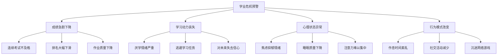

#### 危机等级评估
| 危机等级 | 主要表现 | 影响程度 | 应对紧急程度 |
|----------|----------|----------|--------------|
| **轻度危机** | 单科成绩下降，学习效率降低 | 局部影响 | 1-2周内处理 |
| **中度危机** | 多科成绩下降，学习动力不足 | 整体影响 | 3-5天内处理 |
| **重度危机** | 全面成绩下滑，心理状态异常 | 严重影响 | 24小时内处理 |
| **极度危机** | 拒绝学习，出现心理问题 | 危及未来 | 立即处理 |

### 考试焦虑识别

#### 考试焦虑症状表现
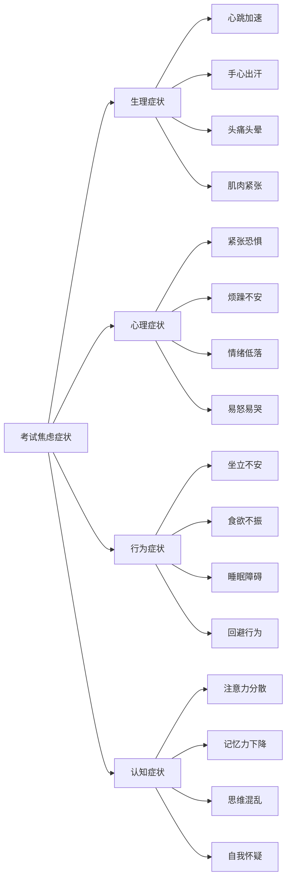

#### 焦虑程度评估量表
| 症状 | 从不 | 偶尔 | 经常 | 总是 | 得分 |
|------|------|------|------|------|------|
| 考试前失眠 | 0分 | 1分 | 2分 | 3分 | ___ |
| 考试时手心出汗 | 0分 | 1分 | 2分 | 3分 | ___ |
| 考试时心跳加速 | 0分 | 1分 | 2分 | 3分 | ___ |
| 考试时大脑空白 | 0分 | 1分 | 2分 | 3分 | ___ |
| 考试后过度担心 | 0分 | 1分 | 2分 | 3分 | ___ |
| 害怕考试失败 | 0分 | 1分 | 2分 | 3分 | ___ |
| 考试前食欲不振 | 0分 | 1分 | 2分 | 3分 | ___ |
| 考试时注意力不集中 | 0分 | 1分 | 2分 | 3分 | ___ |

**评估标准：**
- 0-8分：轻度焦虑，正常范围
- 9-16分：中度焦虑，需要关注
- 17-24分：重度焦虑，需要干预

## 🆘 紧急应对方案

### 考试焦虑应急处理

#### 考前焦虑处理（24小时内）
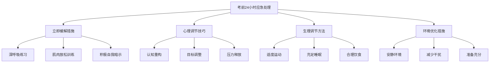

**具体操作步骤：**

1. **深呼吸练习（5分钟见效）**
   ```
   步骤：
   1. 找一个安静的地方坐下
   2. 闭上眼睛，放松身体
   3. 慢慢吸气4秒，屏气4秒，呼气4秒
   4. 重复10-15次
   5. 感受身体的放松状态
   ```

2. **肌肉放松训练（10分钟见效）**
   ```
   步骤：
   1. 从脚趾开始，逐步向上
   2. 每个部位先紧张5秒，再放松10秒
   3. 脚趾→小腿→大腿→腹部→手臂→肩膀→面部
   4. 全身放松后静坐2分钟
   ```

3. **积极自我暗示**
   ```
   暗示语句：
   - "我已经充分准备，一定能够发挥正常水平"
   - "考试只是检验学习成果，不是人生的全部"
   - "我有能力应对这次考试"
   - "紧张是正常的，我可以控制它"
   ```

#### 考中焦虑处理（即时应对）

**考试中遇到焦虑的应急处理：**

1. **暂停-呼吸-重新开始**
   ```
   操作流程：
   1. 停止答题，放下笔
   2. 闭眼深呼吸3次
   3. 告诉自己"我可以的"
   4. 重新审题，继续答题
   ```

2. **跳题策略**
   ```
   遇到难题时：
   1. 不要纠结，立即跳过
   2. 先完成会做的题目
   3. 建立信心后再回头处理
   4. 合理分配时间
   ```

3. **时间管理技巧**
   ```mermaid
   graph LR
       A[考试时间管理] --> B[快速浏览]
       A --> C[合理分配]
       A --> D[灵活调整]
       
       B --> B1[整体把握题量]
       B --> B2[识别难易程度]
       
       C --> C1[易题快速完成]
       C --> C2[难题预留时间]
       
       D --> D1[根据进度调整]
       D --> D2[确保基础分数]
   ```

### 学习危机应急处理

#### 孩子情绪崩溃或极端抵触学习的SOP

当孩子出现摔东西、哭喊、拒绝沟通、彻底“摆烂”等极端行为时，这通常是长期压力和挫败感累积到临界点的爆发。此时，任何形式的讲道理、指责或强迫都只会火上浇油。正确的处理方式是“先处理情绪，再处理问题”。

**第一阶段：无条件接纳，做情绪的“灭火器” (约30分钟)**

| 步骤 | 行动指南 | 核心目标 | 禁忌语言 |
|---|---|---|---|
| **1. 保持冷静** | 家长自己先做深呼吸，稳住情绪。你的冷静是孩子情绪的“定海神针”。 | 避免被卷入情绪漩涡 | “你又发什么疯！” |
| **2. 物理隔离** | 如果孩子在摔东西，默默地把贵重或危险物品移开，确保安全。 | 保护人身和财产安全 | “你再摔一个试试！” |
| **3. 情感共鸣** | 坐在孩子身边（但保持一定距离），用平静、温和的语气说：“妈妈/爸爸看到你现在很难受/很生气。” | 让孩子感到被理解 | “这有什么好哭的？” |
| **4. 命名情绪** | 尝试帮助孩子识别并说出他的情绪：“你是不是觉得特别委屈/绝望？” | 帮助孩子从混乱情绪中抽离 | “别哭了，烦死了！” |
| **5. 无声陪伴** | 如果孩子不想说话，就静静地陪着他，递上一杯水或一张纸巾。 | 传递“我在这里陪你”的信号 | “你到底想怎么样？” |

**第二阶段：引导表达，做情绪的“疏导管” (情绪缓和后)**

| 步骤 | 行动指南 | 核心目标 | 关键句式 |
|---|---|---|---|
| **6. 邀请沟通** | 当孩子哭声渐小或停止破坏行为后，轻声问：“愿意和我说说发生了什么吗？” | 打开沟通的缺口 | “说吧，我听着。” |
| **7. 倾听与复述** | 孩子讲述时，不打断、不评判。使用“倾听-复述”技巧：“所以，你是因为觉得怎么努力都没用，才感到特别绝望，是吗？” | 确保你准确理解了孩子的感受 | “你应该这样想...” |
| **8. 确认核心诉求** | 在倾听中，找到情绪背后的核心需求：“听起来，你最希望的是能看到自己的努力有回报，对吗？” | 找到问题的根源 | “你的想法是错的。” |

**第三阶段：面向未来，做问题的“合伙人” (第二天或稍后)**

| 步骤 | 行动指南 | 核心目标 | 关键对话 |
|---|---|---|---|
| **9. 预约讨论** | “你今天累了，我们都先好好休息。明天我们找个时间，专门聊聊怎么解决‘努力没回报’这个问题，你觉得怎么样？” | 将情绪和问题分离，给彼此冷静思考的空间 | “我们现在就得解决！” |
| **10. 共同制定方案** | 在约定的时间，和孩子一起，像“战友”一样分析问题，并共同制定一个小而可行的改进计划。 | 赋能孩子，让他成为解决问题的主人 | “你必须按我说的做！” |

**核心原则总结：**
- **先接纳，后解决：** 情绪是洪水，只能疏导，不能堵塞。
- **你在船上，不在岸上：** 让孩子感觉到你和他是一边的，共同面对问题，而不是你站在对岸指责他。
- **关注需求，而非行为：** 孩子的极端行为只是冰山一角，水面下是他未被满足的心理需求（如被认可、有掌控感、看到希望）。

#### 成绩急剧下降应对

**24小时内应急措施：**
1. **冷静分析原因**
   - 是否学习方法有问题？
   - 是否学习时间不够？
   - 是否心理状态影响？
   - 是否外界因素干扰？

2. **制定紧急补救计划**
   ```mermaid
   graph TD
       A[紧急补救计划] --> B[问题诊断]
       A --> C[重点突破]
       A --> D[时间调整]
       A --> E[心理调节]
       
       B --> B1[找出薄弱环节]
       B --> B2[分析失分原因]
       
       C --> C1[集中攻克重点]
       C --> C2[强化基础知识]
       
       D --> D1[增加学习时间]
       D --> D2[提高学习效率]
       
       E --> E1[调整心态]
       E --> E2[寻求支持]
   ```

3. **寻求紧急支援**
   - 立即联系老师，寻求指导
   - 与家长沟通，获得理解支持
   - 找同学讨论，共同解决问题
   - 必要时寻求专业心理帮助

#### 学习动力丧失应对

**重燃学习动力的紧急方案：**

1. **目标重新设定**
   ```
   SMART目标设定：
   - Specific（具体的）：明确要达到的分数
   - Measurable（可测量的）：设定量化指标
   - Achievable（可实现的）：符合实际能力
   - Relevant（相关的）：与中考目标相关
   - Time-bound（有时限的）：设定明确期限
   ```

2. **成就感重建**
   ```mermaid
   graph LR
       A[成就感重建] --> B[小目标设定]
       A --> C[及时奖励]
       A --> D[进步记录]
       A --> E[正面反馈]
       
       B --> B1[每日小任务]
       B --> B2[容易达成]
       
       C --> C1[完成即奖励]
       C --> C2[奖励多样化]
       
       D --> D1[学习日记]
       D --> D2[进步可视化]
       
       E --> E1[自我肯定]
       E --> E2[他人认可]
   ```

3. **环境改变策略**
   - 改变学习环境，增加新鲜感
   - 调整学习方式，增加趣味性
   - 寻找学习伙伴，增加互动性
   - 设定学习仪式，增加仪式感

## 🧘 心理调节技巧

### 压力管理技巧

#### 认知调节技巧
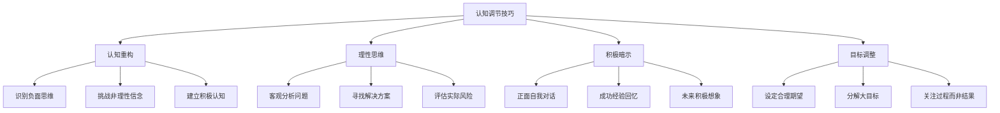

**常见负面思维及调节方法：**

| 负面思维 | 认知偏差 | 调节方法 | 积极替代思维 |
|----------|----------|----------|--------------|
| "我一定会考砸" | 灾难化思维 | 客观分析概率 | "我会尽力发挥，结果不一定很糟" |
| "我比别人笨" | 标签化思维 | 关注个人进步 | "每个人都有自己的节奏和优势" |
| "这次考不好就完了" | 全或无思维 | 长远视角看待 | "一次考试不能决定我的未来" |
| "我永远学不会" | 绝对化思维 | 回顾学习历程 | "我在不断进步，只是需要时间" |

#### 情绪调节技巧

**情绪ABC理论应用：**
```
A（事件）→ B（信念/想法）→ C（情绪/行为）

例子：
A：考试成绩不理想
B：我太笨了，永远学不好
C：沮丧、焦虑、想放弃

调节后：
A：考试成绩不理想
B：这次没发挥好，找出原因继续努力
C：虽然失望但有动力改进
```

**情绪调节具体方法：**

1. **情绪识别与表达**
   ```
   步骤：
   1. 识别当前情绪（愤怒、焦虑、沮丧等）
   2. 接受情绪的存在，不要压抑
   3. 找到合适的表达方式（写日记、运动、倾诉）
   4. 分析情绪产生的原因
   5. 寻找积极的应对方式
   ```

2. **放松训练技巧**
   ```mermaid
   graph LR
       A[放松训练] --> B[渐进性肌肉放松]
       A --> C[冥想练习]
       A --> D[音乐疗法]
       A --> E[运动放松]
       
       B --> B1[系统性放松]
       B --> B2[快速放松]
       
       C --> C1[正念冥想]
       C --> C2[引导想象]
       
       D --> D1[古典音乐]
       D --> D2[自然声音]
       
       E --> E1[有氧运动]
       E --> E2[瑜伽太极]
   ```

### 考试心理调节

#### 考前心理准备

**考前一周心理调节计划：**
| 时间 | 心理调节重点 | 具体措施 | 预期效果 |
|------|--------------|----------|----------|
| 考前7天 | 建立信心 | 回顾学习成果，肯定进步 | 增强自信心 |
| 考前5天 | 减少焦虑 | 适度复习，避免过度紧张 | 保持平和心态 |
| 考前3天 | 调整状态 | 规律作息，适度运动 | 最佳身心状态 |
| 考前1天 | 放松心情 | 轻松活动，早睡早起 | 精神饱满 |

**考前心理暗示训练：**
```
积极暗示语句：
1. "我已经做了充分的准备"
2. "我有能力应对这次考试"
3. "我会保持冷静，发挥正常水平"
4. "无论结果如何，我都已经尽力了"
5. "这只是人生中的一次经历"

使用方法：
- 每天早晚各重复5遍
- 在感到紧张时立即使用
- 配合深呼吸练习
- 想象成功的场景
```

#### 考中心理调节

**考试过程中的心理调节策略：**

1. **开考前5分钟调节**
   ```
   调节流程：
   1. 深呼吸3次，放松身体
   2. 积极自我暗示
   3. 快速浏览试卷，心中有数
   4. 制定答题策略
   5. 保持平和心态开始答题
   ```

2. **答题过程中的心理调节**
   ```mermaid
   graph TD
       A[答题心理调节] --> B[遇到难题]
       A --> C[时间紧张]
       A --> D[出现错误]
       A --> E[大脑空白]
       
       B --> B1[跳过继续]
       B --> B2[不要纠结]
       
       C --> C1[合理分配]
       C --> C2[确保基础分]
       
       D --> D1[冷静修改]
       D --> D2[不要慌张]
       
       E --> E1[暂停呼吸]
       E --> E2[重新开始]
   ```

3. **考后心理调节**
   ```
   考后注意事项：
   1. 不要立即对答案
   2. 不要过度分析得失
   3. 专注准备下一科
   4. 保持正常作息
   5. 适度放松娱乐
   ```

## 📞 紧急联系与支援

### 支援网络建立

#### 家庭支援系统
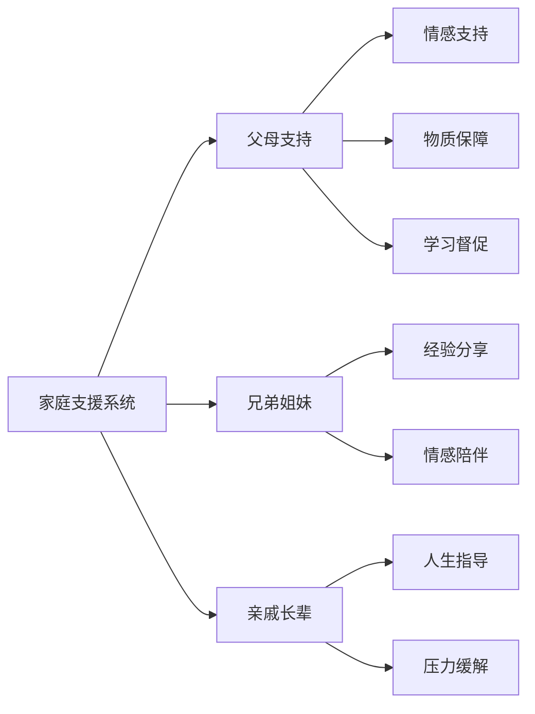

**家庭支援激活方案：**
1. **与父母建立有效沟通**
   - 定期汇报学习情况
   - 主动寻求帮助和建议
   - 表达自己的需求和困难
   - 感谢父母的支持和理解

2. **家庭会议机制**
   ```
   家庭会议流程：
   1. 每周固定时间召开
   2. 汇报学习进展和困难
   3. 讨论解决方案
   4. 制定下周计划
   5. 家庭成员相互鼓励
   ```

#### 学校支援系统
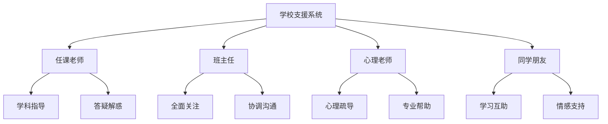

**学校支援利用策略：**
1. **主动寻求老师帮助**
   - 课后及时请教问题
   - 定期与老师沟通学习情况
   - 寻求学习方法指导
   - 请求额外的学习资源

2. **建立学习互助小组**
   ```
   互助小组运作：
   1. 3-5人组成学习小组
   2. 定期讨论学习问题
   3. 相互监督学习进度
   4. 分享学习资源和方法
   5. 共同面对学习挑战
   ```

#### 专业支援系统

**心理健康支援：**
| 支援类型 | 联系方式 | 服务内容 | 适用情况 |
|----------|----------|----------|----------|
| 学校心理老师 | 学校心理咨询室 | 学习心理指导 | 学习焦虑、压力过大 |
| 社区心理服务 | 社区服务中心 | 青少年心理咨询 | 情绪问题、行为问题 |
| 专业心理机构 | 心理咨询中心 | 专业心理治疗 | 严重心理问题 |
| 心理热线 | 400-161-9995 | 24小时电话咨询 | 紧急心理危机 |

### 紧急联系清单

#### 重要联系人信息表
| 联系人 | 关系 | 电话号码 | 可提供帮助 | 联系时机 |
|--------|------|----------|------------|----------|
| 班主任 | 老师 | ___________ | 学习指导、心理支持 | 学习问题、心理困扰 |
| 数学老师 | 任课老师 | ___________ | 数学学科指导 | 数学学习困难 |
| 物理老师 | 任课老师 | ___________ | 物理学科指导 | 物理学习困难 |
| 英语老师 | 任课老师 | ___________ | 英语学科指导 | 英语学习困难 |
| 心理老师 | 专业老师 | ___________ | 心理疏导 | 心理压力过大 |
| 最好朋友 | 同学 | ___________ | 情感支持 | 需要倾诉时 |
| 学习伙伴 | 同学 | ___________ | 学习互助 | 学习问题讨论 |

#### 紧急情况处理流程
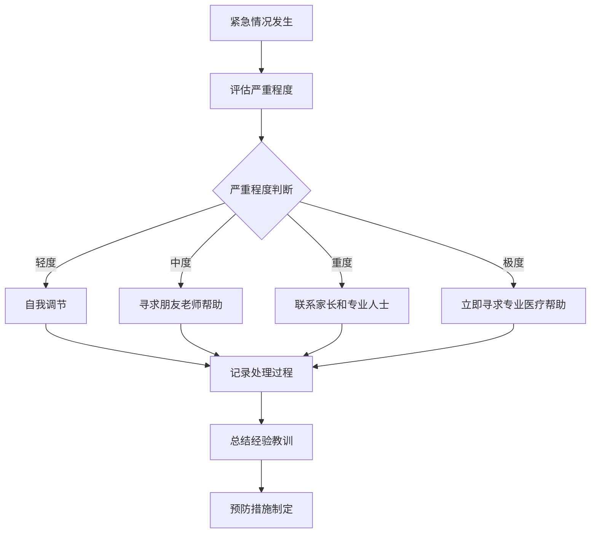

## 🛡️ 预防措施

### 压力预防策略

#### 日常压力管理
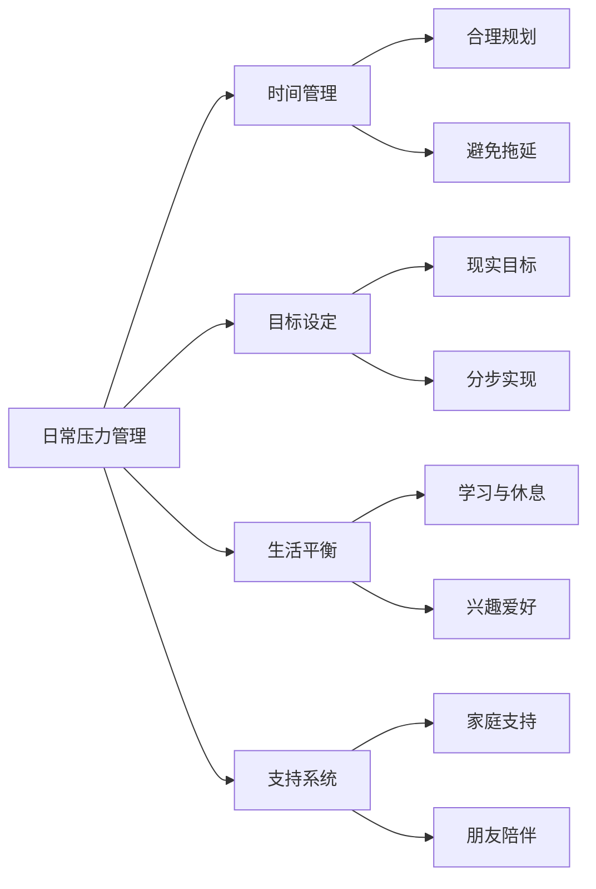

**具体预防措施：**

1. **建立规律作息**
   ```
   理想作息时间表：
   6:30  起床洗漱
   7:00  早餐
   7:30  上学路上复习
   8:00-12:00  上午课程
   12:00-13:30  午餐午休
   13:30-17:30  下午课程
   18:00-19:00  晚餐
   19:00-21:30  晚自习
   21:30-22:00  洗漱放松
   22:00  睡觉
   ```

2. **培养兴趣爱好**
   - 每周安排2-3次兴趣活动
   - 选择能够放松身心的活动
   - 与朋友一起参与，增加社交
   - 避免过度沉迷影响学习

3. **定期压力评估**
   ```
   压力评估问题：
   1. 最近感到压力大吗？（1-10分）
   2. 睡眠质量如何？
   3. 食欲是否正常？
   4. 与朋友家人关系如何？
   5. 对未来是否有信心？
   
   评估频率：每周一次
   记录方式：压力日记
   ```

#### 考试焦虑预防

**考试焦虑预防体系：**
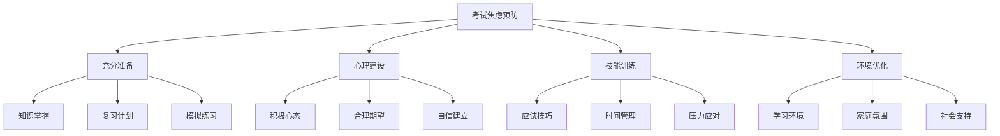

**预防措施实施：**

1. **平时考试脱敏训练**
   ```
   脱敏训练步骤：
   1. 从小测验开始适应
   2. 逐步增加考试难度
   3. 练习考试技巧
   4. 总结考试经验
   5. 建立考试信心
   ```

2. **考试技能训练**
   - 审题技巧训练
   - 时间分配练习
   - 答题策略学习
   - 检查方法掌握

3. **心理韧性培养**
   ```
   韧性培养方法：
   1. 面对挫折的积极应对
   2. 从失败中学习经验
   3. 保持乐观的心态
   4. 培养解决问题的能力
   5. 建立强大的内心力量
   ```

### 学习危机预防

#### 学习监控系统
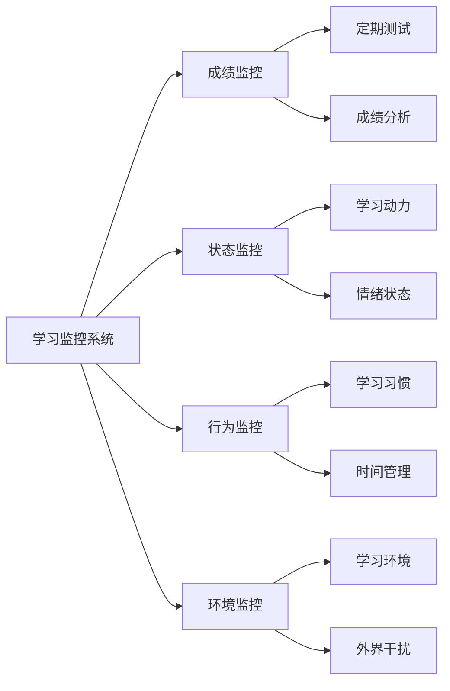

**监控指标体系：**

| 监控维度 | 具体指标 | 监控频率 | 预警标准 |
|----------|----------|----------|----------|
| 学习成绩 | 各科分数、排名变化 | 每次考试后 | 连续2次下降 |
| 学习时间 | 每日学习时长、效率 | 每日记录 | 低于计划20% |
| 学习状态 | 专注度、疲劳度 | 每日评估 | 连续3天状态差 |
| 情绪状态 | 焦虑、抑郁、压力 | 每周评估 | 负面情绪持续 |
| 行为表现 | 作业完成、课堂表现 | 每日观察 | 明显异常变化 |

#### 早期干预机制

**三级预防体系：**
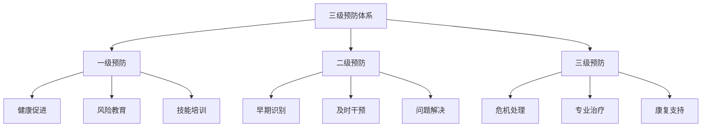

**干预措施：**

1. **一级预防（健康促进）**
   - 学习方法指导
   - 心理健康教育
   - 压力管理训练
   - 生活技能培养

2. **二级预防（早期干预）**
   - 定期心理筛查
   - 学习困难识别
   - 及时心理疏导
   - 学习支持提供

3. **三级预防（危机处理）**
   - 紧急心理干预
   - 专业治疗转介
   - 康复计划制定
   - 长期跟踪支持

## 📋 应急预案模板

### 考试焦虑应急预案

#### 预案启动条件
- 考试前出现严重焦虑症状
- 考试中出现恐慌反应
- 考试后出现严重情绪问题

#### 应急处理流程
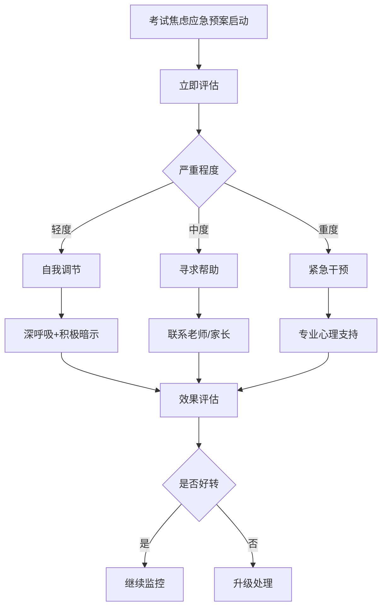

#### 具体操作步骤

**步骤一：立即评估（2分钟内）**
```
评估清单：
□ 生理症状：心跳、出汗、颤抖
□ 心理症状：恐惧、紧张、绝望
□ 认知症状：思维混乱、注意力不集中
□ 行为症状：坐立不安、回避行为

严重程度判断：
- 轻度：1-2项症状，可以控制
- 中度：3-4项症状，影响正常功能
- 重度：5项以上症状，无法正常功能
```

**步骤二：分级处理**

1. **轻度焦虑处理**
   ```
   自我调节技巧：
   1. 4-7-8呼吸法（吸气4秒，屏气7秒，呼气8秒）
   2. 积极自我暗示（"我可以应对这种情况"）
   3. 肌肉放松（紧张-放松循环）
   4. 注意力转移（专注于当前任务）
   
   时间：10-15分钟
   预期效果：症状明显缓解
   ```

2. **中度焦虑处理**
   ```
   寻求支持：
   1. 立即联系班主任或心理老师
   2. 通知家长当前情况
   3. 寻找信任的朋友陪伴
   4. 申请考试特殊安排（如延时、单独考场）
   
   时间：30分钟内
   预期效果：获得外界支持，情况稳定
   ```

3. **重度焦虑处理**
   ```
   紧急干预：
   1. 立即停止考试，离开考场
   2. 联系学校医务室或拨打120
   3. 通知家长立即到场
   4. 寻求专业心理危机干预
   5. 考虑医疗评估和治疗
   
   时间：立即执行
   预期效果：确保安全，专业处理
   ```

### 学习危机应急预案

#### 预案启动条件
- 连续多次考试成绩大幅下降
- 出现严重厌学情绪
- 学习行为发生异常改变
- 出现自我伤害倾向

#### 应急处理流程
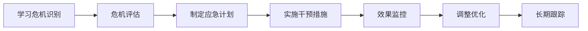

#### 具体应急措施

**第一阶段：危机稳定（24小时内）**
```
紧急措施：
1. 确保学生安全，防止自我伤害
2. 提供情感支持和心理安慰
3. 联系家长，说明情况
4. 暂停高强度学习任务
5. 安排专人陪伴和监护

责任人：班主任、家长
时间要求：立即执行
```

**第二阶段：问题诊断（3天内）**
```
诊断内容：
1. 学习问题分析（知识、方法、习惯）
2. 心理状态评估（情绪、动机、压力）
3. 环境因素调查（家庭、学校、同伴）
4. 身体健康检查（睡眠、饮食、运动）

诊断方法：
- 与学生深度访谈
- 家长老师反馈
- 心理测评工具
- 学习行为观察

责任人：心理老师、班主任
```

**第三阶段：干预实施（1-2周）**
```
干预措施：
1. 心理疏导和情感支持
2. 学习方法指导和调整
3. 学习目标重新设定
4. 家庭环境优化
5. 同伴支持网络建立

实施计划：
- 每日心理支持30分钟
- 每日学习指导1小时
- 每周家庭会议1次
- 每周同伴活动2次

责任人：多方协作
```

**第四阶段：效果评估（每周）**
```
评估指标：
1. 情绪状态改善程度
2. 学习动力恢复情况
3. 学习行为改变程度
4. 学习成绩变化趋势

评估方法：
- 情绪量表测评
- 学习行为观察
- 成绩数据分析
- 主观感受访谈

调整策略：
- 根据评估结果调整干预措施
- 增加或减少干预强度
- 改变干预方法和重点
```

## 📈 效果评估与改进

### 应急处理效果评估

#### 评估指标体系
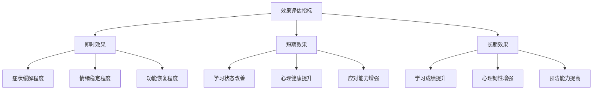

#### 评估方法和工具

**量化评估工具：**
| 评估工具 | 评估内容 | 使用时机 | 评估频率 |
|----------|----------|----------|----------|
| 焦虑自评量表 | 焦虑程度 | 干预前后 | 每周一次 |
| 学习动机量表 | 学习动机 | 危机前后 | 每月一次 |
| 压力应对量表 | 应对能力 | 训练前后 | 每月一次 |
| 生活质量量表 | 整体状况 | 长期跟踪 | 每季度一次 |

**质性评估方法：**
```
评估方式：
1. 深度访谈：了解主观感受和体验
2. 行为观察：记录行为变化和改善
3. 日记分析：分析情绪和认知变化
4. 反馈收集：收集各方面的反馈意见

评估内容：
1. 应急措施的有效性
2. 干预过程的适宜性
3. 支持系统的充分性
4. 个人成长和收获
```

### 预案优化改进

#### 持续改进机制
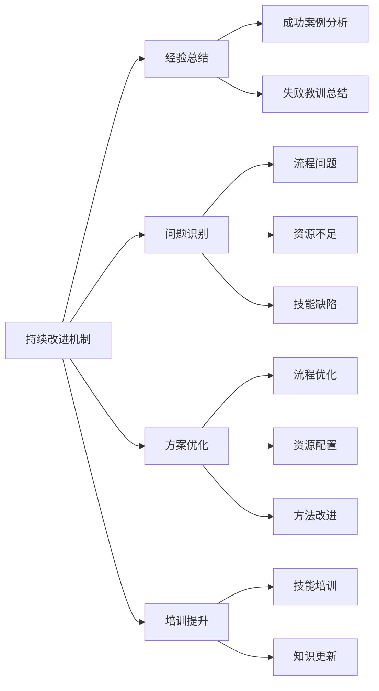

**改进流程：**
1. **定期回顾（每月）**
   - 回顾本月应急处理情况
   - 分析处理效果和问题
   - 收集各方反馈意见
   - 识别改进机会

2. **方案更新（每季度）**
   - 根据实践经验更新预案
   - 补充新的应对策略
   - 完善操作流程
   - 更新联系信息

3. **培训提升（每学期）**
   - 组织应急处理培训
   - 学习新的干预技术
   - 提高识别和应对能力
   - 加强团队协作

#### 预案完善建议

**基于实践的改进建议：**
```
改进方向：
1. 增强预案的可操作性
   - 细化操作步骤
   - 明确责任分工
   - 提供具体工具

2. 提高预案的针对性
   - 针对不同类型问题制定专门预案
   - 考虑个体差异因素
   - 结合实际情况调整

3. 完善支持保障体系
   - 建立更完善的支持网络
   - 配备必要的资源和工具
   - 加强专业人员培训

4. 强化预防和早期干预
   - 重视预防工作
   - 建立早期预警机制
   - 提高识别敏感性
```

---

**重要提醒：** 应急策略指南是为了帮助应对学习和考试中的突发情况，但最重要的是平时的预防和准备。建议定期练习应急技巧，建立良好的支持网络，培养积极的心态和强大的心理韧性。

**使用建议：**
1. 熟悉各种应急处理方法，平时多练习
2. 建立完善的支持网络，及时寻求帮助
3. 重视预防工作，避免危机发生
4. 保持积极心态，相信困难是暂时的
5. 从每次经历中学习，不断提高应对能力