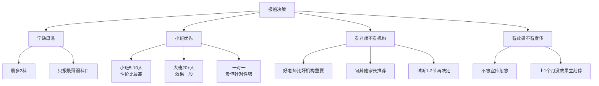
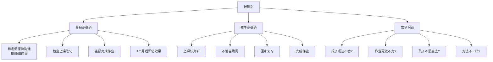
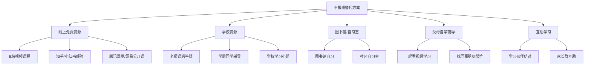
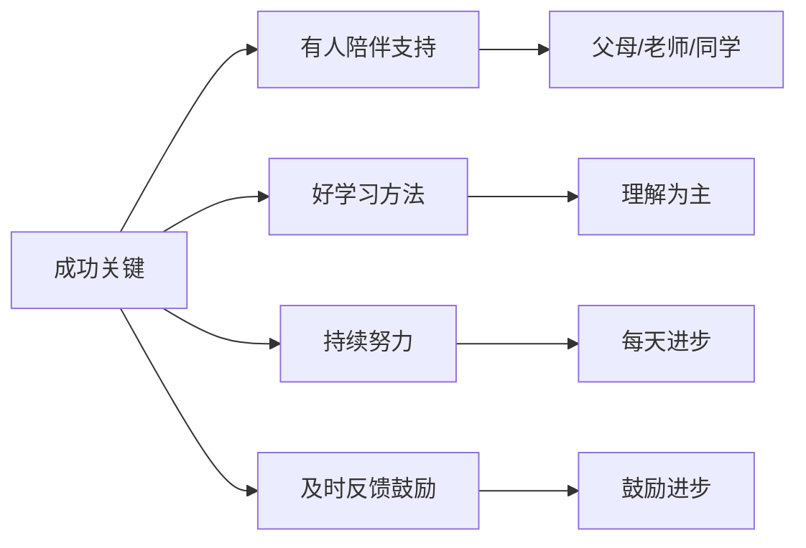
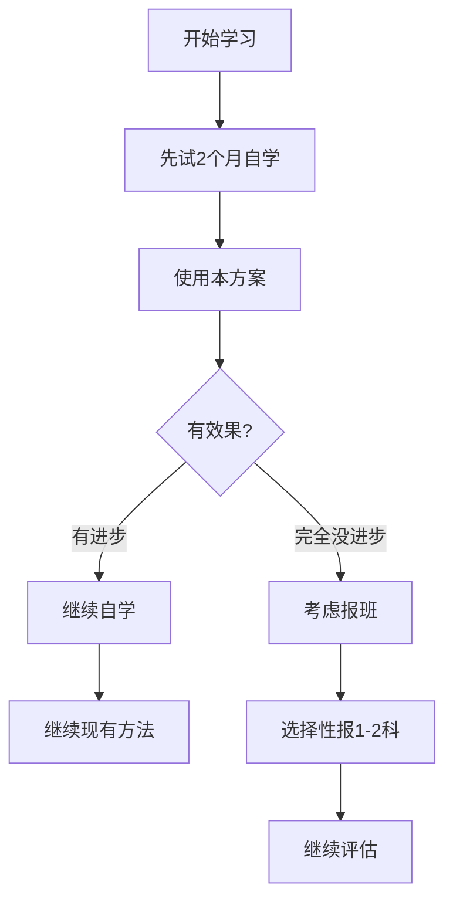

# 辅导班选择与免费替代方案决策指南

## 📋 文档说明

本文档针对经济条件一般的家庭，提供是否报辅导班的决策框架，以及不报班的免费替代方案。

---

## ❓ 核心问题：要不要报辅导班？

### 决策前的重要思考

**很多家长纠结的问题,给一个决策框架:**

---

## 什么情况下必须报班？

```
1. 父母完全不会教,孩子自学也学不会
   而且孩子愿意去

2. 某一科特别差(40分以下),自己补不上来

3. 尝试了2个月自学,完全没进步

4. 孩子主动要求报班

5. 经济条件允许(不会给家庭造成负担)
```

---

## 什么情况下可以不报班？

```
✅ 父母有时间陪伴+辅导(哪怕父母也不会,但愿意一起学)
✅ 孩子自学能力可以,看视频能学懂
✅ 学校老师愿意课后答疑
✅ 经济条件确实紧张,报班会影响生活质量
✅ 孩子抵触上辅导班(强制去也是浪费钱)
✅ 已经在按照计划学习,有进步
```

---

## 如果决定报班,怎么选？

### 报班原则



**原则详解**：

1. **宁缺毋滥**:
   - 不要报太多科(最多2科)
   - 只报最薄弱的科目

2. **小班>大班>一对一**:
   - 小班(5-10人):性价比最高,有互动
   - 大班(20+人):便宜,但效果一般
   - 一对一:贵,但针对性强(如果经济允许)

3. **看老师,不看机构**:
   - 好老师比好机构重要
   - 问其他家长推荐
   - 试听1-2节课再决定

4. **看效果,不看宣传**:
   - 不要被"保证提XX分"忽悠
   - 上1个月没效果,立刻停

---

## 如何选择老师/机构？

### 考察老师

**去试听课时,观察**:

| 观察点 | 好老师特征 | 差老师特征 |
|--------|----------|----------|
| **教学方法** | 教方法,让孩子学会举一反三 | 直接给答案,只讲题不教思路 |
| **关注对象** | 会关注基础差的学生 | 只讲难题,不管基础差的 |
| **孩子反馈** | "听懂了,有信心了" ✓ | "还是不懂,更迷糊了" ✗ |

### 和老师沟通

**试听后,和老师单独谈**：

```
"X老师,我孩子现在XX分,基础很差。
请问:
1. 您觉得他适合上您的课吗?
2. 您会怎么帮他提高?
3. 大概多久能看到效果?
4. 如果上了1个月没效果,怎么办?"
```

**好老师会**：
- 诚实说孩子的问题
- 给出具体方案
- 说"需要时间,不能保证立刻见效"

**差老师会**：
- 夸大效果:"保证提XX分"
- 说得很玄乎,没有具体方案
- 催你赶紧报名

---

## 报班后的注意事项

### 父母要做的

**很多家长以为"报了班就万事大吉",这是最大的误区!**



**详细清单**：

1. **和老师保持沟通(每周或每两周)**:
   ```
   "X老师,孩子这周上课情况怎么样?
   您觉得他有进步吗?
   我们在家应该怎么配合?"
   ```

2. **检查孩子上课笔记**:
   ```
   "今天老师讲了什么?
   你听懂了吗?
   有没有不会的?"
   ```

3. **监督完成辅导班作业**:
   - 辅导班作业必须认真做
   - 不会的题,下次课问老师

4. **评估效果(1个月后)**:
   - 孩子成绩有提高吗?
   - 孩子学习方法有改变吗?
   - 孩子对这科的信心增加了吗?
   - **如果都没有 → 换老师或停止报班**

### 孩子要做的

1. 上课认真听(不是去睡觉的!)
2. 不懂的当场问
3. 回家复习当天内容
4. 完成辅导班作业

---

## 常见问题解答

### 问题1：报了班,孩子还是不会？

**处理流程**：
```
1. 检查:孩子上课认真听了吗?回家复习了吗?
2. 如果都做了还是不会 → 这个老师不适合,换!
3. 换老师或暂停该科目辅导班
```

### 问题2：报了班,学校作业更做不完？

**解决方案**：

| 方案 | 具体做法 |
|------|----------|
| **和学校老师沟通** | "孩子在上辅导班,时间紧张,能否作业上给一些调整?" |
| **调整辅导班时间** | 周末上,不占用平时时间 |

### 问题3：孩子不愿意去辅导班？

**原因分析和处理**：

| 原因 | 表现 | 处理方式 |
|------|------|----------|
| **老师讲得不好** | 听不懂,更迷糊 | 换老师 |
| **听不懂** | 基础太差,跟不上 | 换老师或补习更低级内容 |
| **不想学** | 抵触心理 | 先停班,调整心态 |

**处理步骤**：
```
1. 先问原因:
   - 是老师讲得不好?
   - 是听不懂?
   - 还是单纯不想学?

2. 如果是前两个原因 → 换老师
3. 如果是不想学 → 先停班,调整心态
```

### 问题4：辅导班老师和学校老师方法不一样？

**处理策略**：
```
1. 问孩子:"你觉得哪个老师的方法更容易懂?"
2. 选择孩子觉得好的方法
3. 和另一个老师沟通:"我们用XX方法"
```

---

## 如果真的不报班,如何替代？

### 免费/低成本的替代方案



---

### 方案1：线上免费资源

#### B站(完全免费)

**搜"中考+科目+知识点"**

**推荐up主**：

| 科目 | 推荐UP主 | 特点 |
|------|---------|------|
| **数学** | 高途课堂、猿辅导、洋葱数学 | 讲解清晰 |
| **物理** | 李永乐老师、跟谁学物理 | 原理透彻 |
| **英语** | 英语兔、猿辅导英语 | 生动有趣 |

**使用方法**：
- 每天看30分钟视频 = 一节辅导课
- 可以反复看,随时暂停

#### 知乎/小红书

**搜索关键词**：
- "中考上岸"
- "中考经验"
- "中考学习方法"

**作用**：
- 看别人怎么学的
- 学习方法分享

#### 腾讯课堂/网易公开课

**资源**：
- 有一些免费的中考复习课
- 系统性课程

**优缺点**：
- ✅ 优点:免费,随时看,可以反复看
- ❌ 缺点:没有老师答疑,需要自律

---

### 方案2：找学校资源

#### 找老师课后答疑(免费)

**方法**：
```
1. 每天下午放学后,带着问题去办公室问老师
2. 准备好具体问题:"老师,这道题我不懂..."
3. 大多数老师愿意花10分钟解答
```

**沟通技巧**：
- 提前准备好具体问题
- 感谢老师的帮助
- 不要频繁打扰

#### 找学霸同学(免费或少量费用)

**方法**：
```
1. 找班上成绩好的同学
2. 周末请到家里,一起学习2小时
3. 可以适当给一些报酬(零食、小礼物,或付费50-100元/次)
```

**好处**：
- 同龄人讲解,孩子更容易懂
- 价格低,性价比高

#### 找学校学习小组

**方法**：
```
1. 和几个成绩相近的同学组成学习小组
2. 每周末一起学习,互相讨论
3. 家长轮流监督
```

---

### 方案3：图书馆/自习室

#### 去图书馆自习

**安排**：
- 周末去图书馆学习3小时
- 氛围好,不容易分心
- 而且图书馆有很多参考书可以免费看

**适用场景**：
- 孩子需要安静环境
- 周末学习时间

#### 社区自习室

**资源**：
- 有些社区有免费自习室
- 可以和其他学生一起学习

---

### 方案4：父母自学+辅导

#### 父母重新学一遍

**方法**：
```
1. 和孩子一起看视频学习
2. 父母先看懂,再教给孩子
3. 虽然父母不是专业老师,但陪伴+态度很重要
```

#### 父母找同事/朋友帮忙

**方法**：
```
1. 有没有同事/朋友的孩子成绩好?
2. 能否请他们分享经验?
3. 能否请他们的孩子辅导一下?
```

---

### 方案5：互助学习

#### 找一个学习伙伴

**方法**：
```
1. 两个孩子结对,互相监督
2. 每天视频通话,一起学习1小时
3. 互相出题,互相检查
```

#### 家长群互助

**方法**：
```
1. 在家长群里找志同道合的家长
2. 组成互助小组
3. 孩子们一起学习,家长轮流监督
```

---

## 总结：报不报班,不是关键

### 关键成功因素



**核心观点**：

```
关键是:
1. 有没有人陪伴和支持(父母/老师/同学)
2. 有没有好的学习方法
3. 有没有持续的努力
4. 有没有及时的反馈和鼓励

如果这些都有,不报班也能提高
如果这些都没有,报再贵的班也没用
```

---

## 建议决策流程

### 推荐方案



**具体建议**：

```
1. 先试2个月自学(用本方案)
   - 用线上免费资源
   - 父母陪伴学习
   - 学校老师答疑

2. 评估效果:
   - 如果有进步 → 继续自学
   - 如果没进步 → 再考虑报班

3. 如果报班:
   - 只报最薄弱的1-2科
   - 选择小班,性价比最高
   - 试听后决定
```

---

## 💰 经济成本对比

### 各类方案成本分析

| 方案 | 每月成本 | 年度成本 | 适用对象 |
|------|---------|---------|---------|
| **线上免费资源** | 0-100元 | 0-1200元 | 自律性强的学生 |
| **老师课后答疑** | 0元 | 0元 | 好沟通的老师 |
| **学霸同学辅导** | 200-400元 | 2400-4800元 | 需要同伴激励 |
| **小班辅导** | 800-2000元 | 9600-24000元 | 基础太差,自学无果 |
| **一对一辅导** | 3000-6000元 | 36000-72000元 | 特殊需求 |

**建议**：
- 优先尝试低成本方案
- 根据效果决定是否升级
- 量力而行,不增加家庭负担

---

## 🎯 成功案例参考

### 案例1：线上自学成功

**背景**：
- 家庭收入中等
- 数学40分,物理50分
- 父母会督促但不会教

**方案**：
- B站看视频学习
- 每天1小时
- 父母陪伴监督

**结果**：
- 3个月后数学70分
- 6个月后物理75分
- 成本:几乎0元

---

### 案例2：学霸辅导成功

**背景**：
- 家庭收入较低
- 英语词汇量不足
- 需要同伴激励

**方案**：
- 找班上英语好的同学辅导
- 每周2次,每次100元
- 一起背单词,一起练习

**结果**：
- 2个月词汇量翻倍
- 英语从50分到70分
- 成本:1600元/月

---

### 案例3：小班补习成功

**背景**：
- 家庭收入中等
- 数学20分,完全听不懂
- 自学3个月无效果

**方案**：
- 报数学小班辅导
- 每周2次课
- 父母课后监督

**结果**：
- 2个月后理解基础
- 4个月后及格
- 成本:1200元/月

---

## ⚠️ 注意事项

### 避免的误区

| 误区 | 错误想法 | 正确做法 |
|------|---------|---------|
| **报班就万事大吉** | 交了钱就放心了 | 报班只是开始,需要持续跟进 |
| **报越多越好** | 把所有科目都报满 | 只报最薄弱的1-2科 |
| **选机构不看老师** | 大机构肯定好 | 好老师比好机构重要 |
| **效果不好还继续** | 已经交了钱要坚持 | 1个月没效果立刻换 |
| **不报班就没办法** | 没条件补习就没希望 | 线上资源同样有效 |

---

## 📊 决策检查表

### 使用前请回答这些问题

**关于家庭情况**：
- [ ] 经济条件允许报班吗？（不会影响生活质量）
- [ ] 父母有时间陪伴学习吗？
- [ ] 孩子自律性如何？

**关于学习情况**：
- [ ] 最薄弱的科目有哪些？
- [ ] 是否尝试过自学？
- [ ] 自学效果如何？

**关于孩子意愿**：
- [ ] 孩子愿意上辅导班吗？
- [ ] 孩子能坚持自学吗？
- [ ] 孩子最需要什么支持？

**关于资源情况**：
- [ ] 学校老师愿意帮忙吗？
- [ ] 能找到学霸同学辅导吗？
- [ ] 家里有网络看视频吗？

**决策建议**：
- 大部分选"是" → 优先考虑自学
- 大部分选"否" → 考虑报班
- 混合答案 → 部分科目报班

---

## 🌟 最后的话

**给父母的话**：

```
报不报班,不是衡量父母是否尽责的标准。

关键是:
你有没有陪伴孩子?
你有没有支持孩子?
你有没有和孩子一起面对困难?

如果这些你都做到了,报不报班,都是好父母。
```

**给孩子的话**：

```
学习最重要的是自己的态度和方法,
不是花了多少钱。

有人花钱多考不好,
有人花钱少考得好,
区别在于你是否真的在学。

无论报不报班,都要靠自己努力!
```

---

**文档版本**：v1.0  
**最后更新**：2024年11月  
**使用说明**：本文档帮助家长做出是否报班的明智决策，并提供免费替代方案
