# 学习障碍深度诊断与解决方案

## 📊 文档说明

本文档针对60-70分学生的7大核心学习障碍，提供深度诊断和系统解决方案。每个问题都包含：表现、原因、解决方法、实战案例。

---

## 🎯 问题1：基础差 - "听不懂课，看不懂题"

### 具体表现

- 老师讲课像听天书
- 课本看了也不明白
- 做题时不知道从哪里下手
- 感觉自己和别人差一大截

### 根本原因

```
知识漏洞 → 新课听不懂 → 更多漏洞 → 恶性循环
```

**典型表现**：
- 数学：初一的有理数不会，初二的方程听不懂，初三函数完全蒙圈
- 英语：只认识300个词，阅读全是生词
- 物理：速度公式不清，后续力学全废

### 解决方案：回退式学习法

#### 第一步：找到知识断层点（1-2天）

**自我诊断题**：

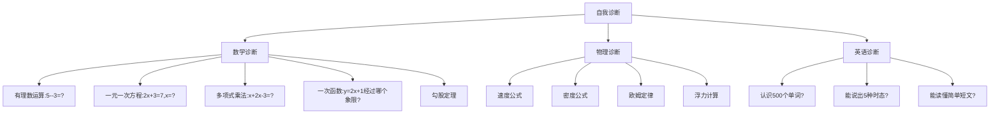

**判断标准**：
- 数学做对0-1题 → 从初一补
- 数学做对2-3题 → 从初二补
- 数学做对4题 → 进入初三
- 英语认识<300词 → 先背单词
- 英语认识300-600词 → 补语法+词汇
- 英语认识>600词 → 直接刷题

#### 第二步：搭建知识地基（11-12月，2个月）

**核心原则**：
- 宁可慢，不能跳
- 真懂再前进
- 用最简单的材料

**具体操作**：

**数学基础重建（每天60分钟）**：

| 周次 | 内容 | 标准 | 资源 |
|------|------|------|------|
| 第1周 | 有理数（加减乘除混合） | 5分钟内算对 `(-5)+3×(-2)-8÷4` | 洋葱学院+《尖子生学案》 |
| 第2周 | 整式运算（合并同类项、去括号） | 能化简 `3(2x-1)-2(x+3)` | 同上 |
| 第3周 | 一元一次方程 | 能解出 `3x-5=2x+7` | 同上 |
| 第4周 | 几何基础（角、线段、三角形） | 能证明三角形内角和180° | 同上 |

**每学一个知识点的验证标准 (SOP版)**：
1. 能用自己的话解释概念（是什么）。
2. 能解释公式/定理的推导过程（为什么）。
3. **能使用SOP工具（如数学“四步法”）做对10道基础题（正确率≥90%）（怎么用）。**
4. 能给别人讲明白一道错题的SOP分析过程。

**英语基础重建（每天40分钟）**：

**词汇关（2个月800词）**：


**记忆方法**：
- 看图 → 读音 → 例句 → 默写1遍 → 隔日复习
- 联想记忆：`ambulance`（俺不能死）
- 优先背《中考词汇闪过》高频词

**语法关（只学核心的5个）**：

| 语法点 | 时间 | 方法 |
|--------|------|------|
| 时态 | 1周 | 英语兔视频+20题 |
| 句型 | 3天 | 陈述/疑问/否定 |
| 词性 | 3天 | 名/动/形容词 |
| 简单句 | 3天 | 主谓宾 |
| 连接词 | 2天 | and/but/because |

**物理基础重建（每天30分钟）**：

**核心公式（1周熟背）**：

| 公式 | 物理量 | 背诵技巧 |
|------|--------|----------|
| `v = s/t` | 速度 | 路程除以时间 |
| `ρ = m/V` | 密度 | 质量除以体积 |
| `p = F/S` | 压强 | 力除以面积 |
| `F浮 = ρ液gV排` | 浮力 | 液体密度×重力×排开体积 |
| `I = U/R` | 欧姆定律 | 电流=电压/电阻 |
| `P = UI` | 电功率 | 功率=电压×电流 |

**背诵方法**：
- 每日睡前5分钟
- 晨起默写
- 配合20道计算题

#### 第三步：验证是否真懂

**每周自测（周日晚上）**：
1. 拿出一张白纸
2. 不看书，默写本周知识点
3. 每个知识点做2题
4. 做对通过；做错下周继续

**家长验收法**：
- 让孩子讲解当天所学
- 讲清楚即真懂

#### 第四步：跟进度与补基础并行

**时间分配**：
- 60%时间：补漏洞
- 40%时间：跟新课

**应对学校考试**：
- 策略：只做会做的
- 目标：基础题全对（60分）+ 中档题过半（10分）= 70分

### 基础差的解决公式

```
找断层点 → 回退学习 → 小步快跑 → 验证真懂 → 继续前进

时间投入 = 2个月 × 每天2小时 = 120小时
效果 = 完整知识体系，后续事半功倍
```

---

## 🎯 问题2：不理解 - "会背不会用，做题就懵"

### 具体表现

- 公式背得滚瓜烂熟，一做题就不知道用哪个
- 知识点能复述，题目换个样子就不认识
- 老师讲例题听懂了，自己做类似题还是错
- 感觉学的和考的是两回事

### 根本原因

```
机械记忆 ≠ 真正理解
背概念 ≠ 会应用
```

**深层原因**：
1. 知识孤立
2. 不会识别条件
3. 缺少“为什么”的思考

### 解决方案：理解式学习法 (SOP版)

如果说“基础差”是看不懂原材料，“不理解”就是不知道如何加工原材料。解决方案的核心，就是将隐性的思考过程，用标准化的流程显性化。

#### 方法1：费曼学习法 (概念理解)

当学习一个新概念（比如“压强”）时，遵循以下4步，是检验是否真懂的试金石：

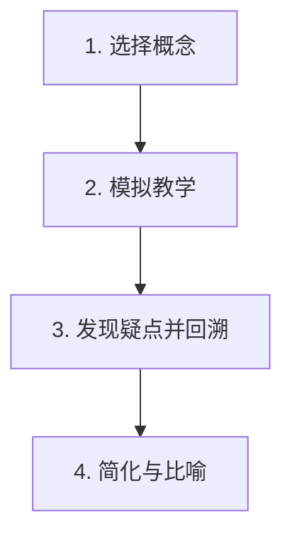

- **第1步：选择概念** - 锁定你要学习的单个概念，如“欧姆定律”。
- **第2步：模拟教学** - 想象你要把它教给一个完全不懂的小白。你需要用最简单、最清晰的语言，在白纸上写下或说出你对它的理解。这个过程会瞬间暴露你的知识漏洞。
- **第3步：发现疑点并回溯** - 在“教学”过程中，你会发现哪些地方讲不清楚、解释不通。这就是你的理解薄弱环节。立刻回到课本或资料，重新学习和理解这个点。
- **第4步：简化与比喻** - 用自己的话（甚至是一个比喻）来总结这个概念。例如：“电压就像是水压，电流就像是水流，电阻就像是水管的粗细。水压越大，水流越快；水管越细，水流越慢。” 如果你能做到这一步，说明你才真正理解了它。

#### 方法2：解题SOP应用 (实践理解)

如果说费曼学习法是理解“是什么”和“为什么”的利器，那么**解题SOP就是理解“怎么用”的标准化流程**。它强制你在解题时，把“理解”的思考过程外化出来。

**核心思想**：从“找答案”转变为“找过程”，将解题变成一个“输入-处理-输出”的清晰流程。

**以数学“四步解题SOP”为例，看如何解决“会背不会用”：**

**题目**：一个长方形花坛，长比宽多5米，周长是30米，求它的面积。

**普通学生的做法**：设x，列方程... 脑子里一团乱麻，可能列错方程。

**SOP使用者的做法**：

1.  **【第1步：读题 & 翻译】** (识别信息)
    -   在草稿纸上写下：
        -   **已知1**: 长 = 宽 + 5 (数学语言)
        -   **已知2**: 2 * (长 + 宽) = 30 (数学语言)
        -   **目标**: 求 面积 = 长 * 宽

2.  **【第2步：关联 & 建模】** (寻找工具)
    -   脑中或纸上思考：
        -   这是一个二元一次方程组问题。
        -   核心工具是“代入消元法”。

3.  **【第3步：计算 & 求解】** (执行操作)
    -   清晰地写出计算步骤：
        -   由已知2得：长 + 宽 = 15
        -   将已知1代入：(宽 + 5) + 宽 = 15
        -   2 * 宽 = 10  => 宽 = 5米
        -   长 = 5 + 5 = 10米
        -   面积 = 10 * 5 = 50平方米

4.  **【第4步：反思 & 总结】** (检查与提炼)
    -   检查：(10+5)*2 = 30，周长正确。长10米比宽5米多5米，正确。
    -   总结：这类“和差”问题的关键，就是通过代入法，将两个未知数变成一个未知数来求解。

**SOP的价值**：
-   **强制理解**：SOP的每一步都在强迫你思考“为什么这么做”，而不是凭感觉。
-   **过程可视化**：将大脑中的模糊思路，变成纸上清晰的步骤，极大降低了认知负荷。
-   **可复制性**：无论题目怎么变，SOP的框架不变。学生学到的不再是零散的解法，而是一套通用的解题“元能力”。

### 不理解的解决公式 (SOP版)

```
机械记忆 → 理解式学习 → 能讲给别人 → 能举一反三

方法组合:
费曼学习法（讲清楚概念是什么、为什么）+
各科解题SOP（讲清楚题目怎么用、如何用好）

= 真正理解，告别“会背不会用”
```

---

## 🎯 问题3：错的多 - "做10道错8道，越做越没信心"

### 具体表现

- 试卷红叉比对勾多
- 错题本越记越厚
- 同类型题反复错
- 怀疑自己智商

### 根本原因

```
基础不牢 + 方法不对 + 练习无效 = 错误率高

具体分析:
40% - 基础知识不牢（概念公式没记住）
30% - 解题方法不会（不知道从哪里入手）
20% - 粗心大意（会做但做错）
10% - 题目太难（超出当前能力）
```

### 解决方案：分层刷题+精准纠错

#### 策略1：降低难度

**题目难度分级**：

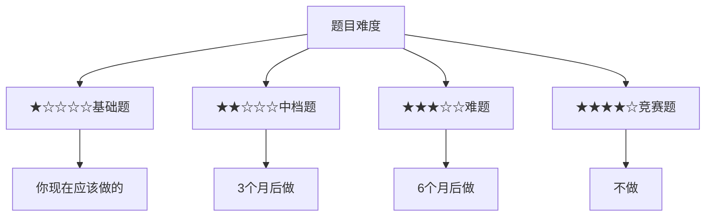

**60-70分策略**：
- 80%时间做基础题（★）
- 20%时间做中档题（★★）
- 0%时间做难题

**推荐资源**：

| 科目 | 推荐 | 不推荐 |
|------|------|--------|
| 数学 | 《尖子生学案》基础版<br>《必刷题》A组<br>《五三》只做A组<br>课本例题 | 中考真题<br>压轴题专项<br>《培优》系列 |
| 物理 | 课本课后题<br>《尖子生学案》基础<br>《五三》选择填空基础 | 综合计算<br>电学压轴 |
| 英语 | 七、八年级阅读<br>基础语法选择<br>简单完形 | 中考难度阅读<br>任务型阅读 |

#### 策略2：控制数量

**目标**：每天错题≤5道（而非追求做对多少）

**错误做法**：
```
每天做50道题，错30道
→ 没时间整理
→ 错误越积越多
→ 信心崩溃
```

**正确做法**：
```
每天做15道题，错3-5道
→ 每道错题深度分析
→ 找2道类似题再做
→ 确保下次不错
→ 逐步提高正确率
```

**数学刷题节奏**：

| 天 | 任务 | 目标 |
|-----|------|------|
| Day1 | 15道基础题 | 错5道 |
| Day1晚 | 花30分钟搞懂这5道<br>每道找1道类似题做 | - |
| Day2 | 把昨天错的5道重做 | 确保全对 |
| Week1 | 做对10/15 | 67% |
| Week2 | 做对12/15 | 80% |
| Week3 | 做对13/15 | 87% |
| Week4 | 做对14/15 | 93% |

**原则**：学会优先，做完第二

#### 策略3：精准分类

**错题4分类**：

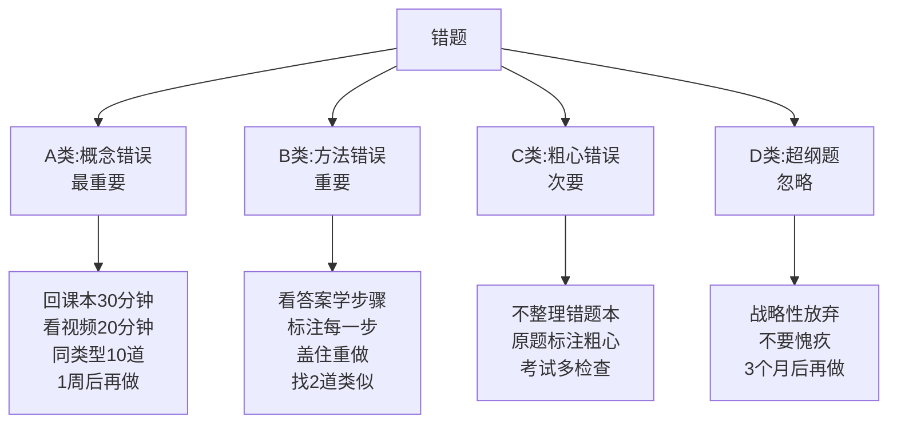

**分类标准**：
- 红色 = A类（必须搞懂）
- 黄色 = B类（需练习）
- 蓝色 = C类（粗心）
- 灰色 = D类（战略放弃）

#### 策略4：同类集中攻克

**步骤**：


**实战示例：二次函数集中攻克**

| Day | 内容 | 题目量 |
|-----|------|--------|
| Day1 | 基本概念（a,b,c作用） | 10道判断题 |
| Day2 | 图像（画图+识图） | 10道图像题 |
| Day3 | 顶点坐标和对称轴 | 15道计算 |
| Day4 | 与x轴交点（判别式） | 15道综合 |
| Day5 | 实际应用（简单） | 10道应用 |
| Day6-7 | 混合题 | 30道 |
| 周末 | 专项测试20道 | - |

**检验标准**：
- 错≤2道 → 通过
- 错3-5道 → 继续3天
- 错>5道 → 再学一周

**效果**：
- 传统：二次函数错8道 → 做2道去做别的 → 一直不会
- 集中：二次函数错8道 → 一周专攻 → 彻底掌握

#### 策略5：建立“会做”题库

**准备2个本子**：
- 红本：错题本
- 绿本：会做题本

**绿本内容**：
- 一次做对的难题
- 之前不会现在会的
- 老师表扬的
- 特别有成就感的

**格式**：
```
日期: 2024.11.15
题目: [贴题目]
我的解法: [写出思路]
得意之处: [为什么做对了]
```

**使用**：
- 累了 → 翻绿本
- 考前 → 看绿本
- 暗示：“我已经会做这么多题”

**效果对比**：

| 方式 | 心理感受 | 结果 |
|------|----------|------|
| 只有错题本 | 一无是处 | 越来越没信心 |
| 错题+会做题本 | 看到进步 | 越来越有信心 |

#### 策略6：复习节奏

**艾宾浩斯复习法**：


**每周日错题复习**：
- 19:00-20:00 数学
- 20:00-20:30 物理
- 20:30-21:00 英语
- 21:00-21:30 其他科

### 错得多的解决公式

```
降低难度 + 控制数量 + 精准分类 + 集中攻克 + 科学复习 = 错误率下降

实施后效果:
Week1: 正确率60% → 压力大但坚持
Week4: 正确率75% → 看到希望
Week8: 正确率85% → 信心提升
Week12: 正确率90%+ → 良性循环
```

---

## 🎯 问题4：死记硬背 - "背了就忘，考试全还给老师"

### 具体表现

- 政治历史背了10遍，考试还是想不起来
- 英语单词今天背明天忘
- 数学公式考试时混淆
- 物理概念张冠李戴

### 根本原因

```
机械重复 ≠ 有效记忆

问题所在:
1. 只用眼看（视觉单通道）
2. 没有理解（死记硬背）
3. 不及时复习（遗忘曲线）
4. 没有应用（知识孤立）
```

### 解决方案：多感官记忆+理解记忆

#### 原理：记忆金字塔

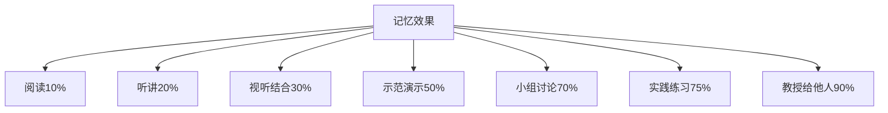

**结论**：不能只“看”，要多种方式结合

#### 方法1：多感官记忆法

**英语单词记忆**：

❌ 错误方法（效率10%）：
```
ambulance
ambulance
ambulance
（抄写10遍）
```

✅ 正确方法（效率90%）：


**记忆流程**：
1. 看：ambulance + 救护车图 + ambul（走）+ ance
2. 听：/ˈæmbjələns/ + 大声读3遍 + 例句
3. 写：默写1遍 + 造句
4. 联想：俺不能死 → 叫救护车 + 想象急救现场
5. 应用：完形1道 + 写1句
6. 教：讲给家长/同学

**时间对比**：
- 抄写10遍：5分钟（保持10%）
- 多感官法：5分钟（保持90%）
- 同样时间，效果差9倍

**数学公式记忆**：

❌ 错误方法：
```
F浮=ρ液gV排
F浮=ρ液gV排
F浮=ρ液gV排
（抄写10遍）
```

✅ 正确方法：

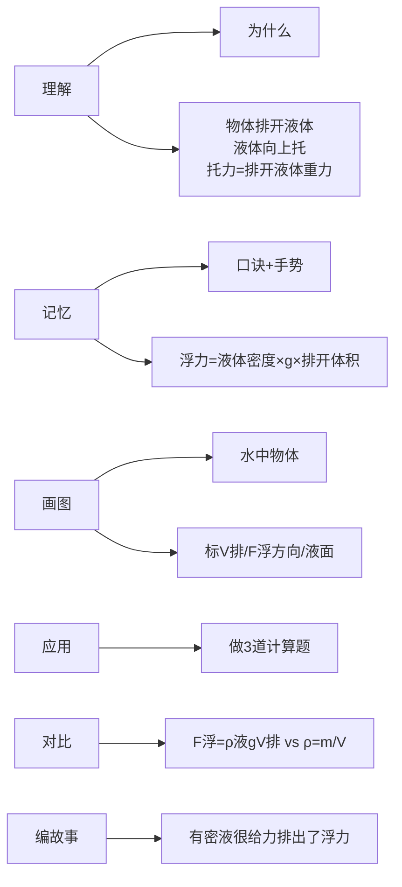

**政治知识点记忆**：

❌ 错误方法：
```
我国的基本国策是对外开放、计划生育...
读10遍
```

✅ 正确方法：

**步骤**：
1. 理解原因：对外开放（闭关落后）、计划生育（人多资源少）
2. 归类框架：国家层面（开放、计生、环保）
3. 生活实例：进口车/iPhone、二孩、垃圾分类
4. 口诀：开放生育和环境
5. 默写
6. 应用：3道相关选择题

**历史时间记忆**：

❌ 错误方法：
```
1840鸦片战争
1840鸦片战争
1840鸦片战争
背10遍
```

✅ 正确方法：

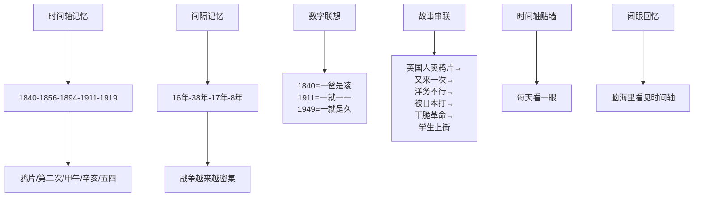

#### 方法2：理解记忆法

**政治记忆示例**：

**死记硬背版**（忘得快）：
```
坚持党的基本路线不动摇：
以经济建设为中心，坚持四项基本原则，坚持改革开放
```

**理解记忆版**（记得牢）：

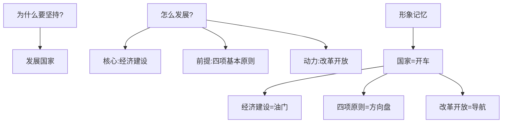

**考试回忆**：开车要油门、方向盘、导航

#### 方法3：记忆宫殿法

**操作步骤**：

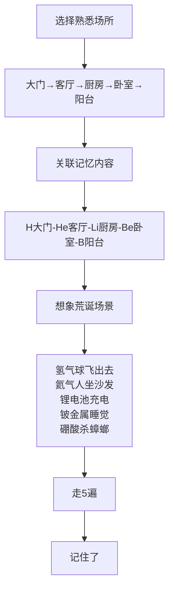

**效果**：
- 死记硬背：痛苦，易忘
- 记忆宫殿：有趣，记得牢

#### 方法4：间隔重复法

**记忆卡片法**：

**正面**：
```
F浮 = ?
ambulance
```

**背面**：
```
ρ液gV排
救护车（俺不能死）
```

**使用App**：
- Anki：自动计算复习时间
- Quizlet：界面友好
- 百词斩：背单词

**碎片时间复习**：
- 等车5张
- 排队3张
- 课间10张
- 睡前20张
- 合计15分钟≈复习100+知识点

#### 方法5：睡前记忆法

**科学原理**：睡前记忆在睡眠中巩固

**操作方法**：
- 22:00-22:10 20个单词
- 22:10-22:20 3个政治/历史点
- 22:20-22:30 过数学/物理公式
- 6:30-7:00 晨起复习

**时间安排**：

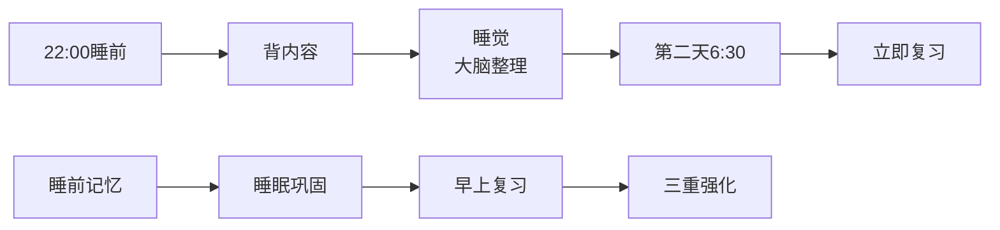

**科学依据**：睡前背诵的保持率提高40%

### 死记硬背的解决公式

```
单通道记忆（看）→多感官记忆（看+听+说+写+画）
机械重复→理解记忆
集中记忆→分散记忆
死记硬背→记忆术+理解+应用

= 记得快+记得牢+不容易忘
```

**各科记忆效率对比**：

| 方法 | 单词记忆 | 公式记忆 | 知识点记忆 | 时间成本 |
|------|----------|----------|------------|----------|
| 死记硬背 | 10%保持 | 20%保持 | 15%保持 | 100% |
| 理解记忆 | 70%保持 | 90%保持 | 80%保持 | 120% |
| 多感官+理解 | 90%保持 | 95%保持 | 95%保持 | 150% |

**结论**：多花50%时间，效果提升9倍

---

## 🎯 问题5：没思路 - "看到题目大脑一片空白"

### 具体表现

- 看完题目不知道从哪里下手
- 会背公式，但不知道什么时候用
- 例题能看懂，自己做就不会
- 总是要看答案才恍然大悟

### 根本原因

```
知识 ≠ 能力
会背 ≠ 会用

缺少的是"解题思维"：
1. 审题能力（看不出题目考什么）
2. 条件识别（不会提取有用信息）
3. 思路建立（不知道分析步骤）
4. 方法选择（不知道用什么方法）
```

### 解决方案：解题思维训练法

#### 方法1：解题4步法（万能框架）

**任何题目都按这4步走**：

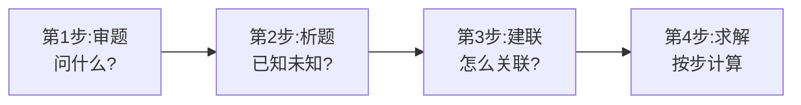

**实战演练**：

**题目**：长方形长是宽的2倍，周长为36cm，求面积。

❌ 没思路学生：
```
36...2倍...面积...不会
```

✅ 有思路学生：

**第1步：审题**
- 问什么：求面积
- 考什么：长方形周长与面积

**第2步：析题**
- 已知：长=2×宽，周长=36cm
- 未知：面积=？
- 需要：长与宽

**第3步：建联**
- 设宽=x，则长=2x
- 周长=2(长+宽)=2(2x+x)=6x=36 → x=6
- 长=12，面积=12×6=72cm²

**第4步：求解**
- 6x=36 → x=6 → 长=12 → 面积=72cm²

**把这4步贴在桌上**：
```
┌─────────────────┐
│ 遇到题目不慌张  │
│ 按照4步走思路   │
│ 1.审题-问什么？ │
│ 2.析题-已知未知？│
│ 3.建联-怎么关联？│
│ 4.求解-按步计算  │
└─────────────────┘
```

#### 方法2：题型识别训练

**建立题型档案库**：

**题型本格式**：

```
题型名称: 一次函数与面积问题

特征识别:
□ 给出一次函数解析式
□ 问三角形/四边形面积
□ 涉及坐标轴围成的图形

典型例题: [贴一道题]

万能思路:
Step1: 画出函数图像
Step2: 找出图形顶点坐标
Step3: 用面积公式（S=½×底×高）
Step4: 带入坐标计算

易错点:
- 是否在坐标轴上方/下方
- 底和高要看清楚

类似题编号: P23第5题，P45第8题，2021中考第19题
```

**目标**：
- 数学50种题型
- 物理30种
- 英语20种阅读
- 每类10道可掌握

**做题前查档案**：
1. 识别题型
2. 翻档案
3. 套用套路
4. 开始解题

#### 方法3："葵花宝典"法

**数学宝典示例**：

| 套路 | 看到什么 → 想到什么 |
|------|-------------------|
| 套路1 | 两个变量的和/差是定值 → 设未知数列方程 |
| 套路2 | 增长率问题 → a(1+x)²=b |
| 套路3 | 动点问题 → 设时间为t → 表示线段 → 列方程 |
| 套路4 | 几何证明 → 标注已知 → 倒推 |
| 套路5 | 函数与几何综合 → 解析式 → 几何 → 数形结合 |
| 套路6 | 求线段长度 → 勾股→相似→三角函数→坐标法 |
| 套路7 | 至少/最多 → 找临界状态 |
| 套路8 | 做不出来 → 特殊情况（x=0,x=1） |

**物理宝典示例**：

| 套路 | 内容 |
|------|------|
| 套路1 | 漂浮/悬浮 → F浮=G物 |
| 套路2 | 电路故障：<br>断路=电流表无示数，电压表有示数<br>短路=电流表有示数，电压表无示数 |
| 套路3 | 滑动变阻器：<br>判串并联→看滑片方向→判电阻变化→电流电压变化 |
| 套路4 | 额定/实际功率：U实际=U额定→P实际=P额定 |
| 套路5 | 天平/弹簧秤测密度：测质量→测体积→ρ=m/V |
| 套路6 | 等效替代：一个复杂过程=一个简单过程的效果 |
| 套路7 | 控制变量：研究A对B的影响→控制其他变量不变 |
| 套路8 | 计算题：已知求→公式→代数→带单位结果 |

**英语阅读宝典示例**：

| 题型 | 方法/位置 |
|------|-----------|
| 主旨题 | 首段首/末句、尾段总结、段首共同点 |
| 细节题 | 关键词定位、找原词/同义、防陷阱 |
| 词义猜测题 | 上下文、同/反义、例子、前后缀 |
| 推断题 | 不过度推断，答案在文中 |
| 作者态度题 | 褒/贬/中性词注意 |
| 是非判断题 | 排除法、回原文验证、忌绝对化 |

#### 方法4："答案倒推"法

**步骤**：

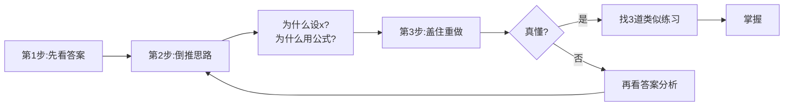

**效果**：
- Week1:10道看答案
- Week2:7道
- Week3:4道
- Week4:2道
- 思路逐步建立

#### 方法5："分解大题"法

**大题**：汽车前半程60km/h，后半程40km/h，共5小时，求AB距离。

❌ 没思路：
```
速度...时间...距离...怎么办?
```

✅ 有思路（分解）：

**小问题列表**：
1. 设总距离为多少 → 设2s
2. 前半程用多长时间 → t1=s/60
3. 后半程用多长时间 → t2=s/40
4. 总时间是多少 → t1+t2=5
5. 能列方程吗 → s/60+s/40=5
6. 会解这个方程吗 → 通分→s

**训练方法**：
1. 拿草稿纸
2. 写：问什么
3. 写：要求这个，需要知道什么
4. 写：这些东西怎么求
5. 继续分解
6. 每步都会做，问题就解决

#### 方法6："口诀化"记忆法

**数学口诀**：

| 类型 | 口诀 | 说明 |
|------|------|------|
| 方程应用题 | 设列解答验 | 设未知数→列方程→解→答→验 |
| 几何证明题 | 一标二看三倒推 | 标已知→看要证→倒推 |
| 函数题 | 一画二算三结论 | 画图像→算坐标→写结论 |
| 最值问题 | 配顶端三处看 | 配方找顶点→看端点→三个地方比大小 |

**物理口诀**：

| 类型 | 口诀 |
|------|------|
| 浮力问题 | 漂浮重浮等，悬浮也相等，下沉浮小重 |
| 欧姆定律 | 伏安欧，三角形，遮谁求谁很轻松 |
| 杠杆平衡 | 动力乘臂等阻力乘臂 |
| 电路分析 | 串联电流处处等，并联电压都相同 |

**英语口诀**：

| 类型 | 口诀 |
|------|------|
| 时态判断 | 看标志词定时态<br>yesterday→过去<br>tomorrow→将来<br>now→进行<br>already→完成 |
| 完形填空 | 先通读再做题最后查 |
| 阅读理解 | 先看题带问题找答案回头看 |

**使用**：每日睡前背一遍，做题前默念，一周后自然浮现

### 没思路的解决公式

```
混乱思维 → 结构化思维
无从下手 → 按步骤操作
见题就慌 → 识别题型套路

方法组合:
解题四步法（框架）+ 
题型档案（识别）+
解题宝典（套路）+
答案倒推（学习）+
分解大题（降难度）+
口诀记忆（快速调用）

= 看到题目，自动有思路
```

**进步曲线**：
- Week1:10道有思路2道（20%）
- Week2:10道有思路4道（40%）
- Week4:10道有思路6道（60%）
- Week8:10道有思路8道（80%）
- 思路是训练出来的

---

## 🎯 问题6：没记住 - "学了就忘，复习没效果"

### 具体表现

- 昨天刚学的，今天就忘了
- 复习了很多遍，考试还是想不起来
- 感觉学习像"竹篮打水"
- 怀疑自己记忆力有问题

### 根本原因

```
不是记忆力差，是复习方法错了

问题所在：
1. 一次学太多（超负荷）
2. 复习不及时（错过最佳时机）
3. 复习方法机械（无效重复）
4. 没有检验（自以为会了）
```

### 解决方案：科学记忆系统

#### 原理：遗忘曲线

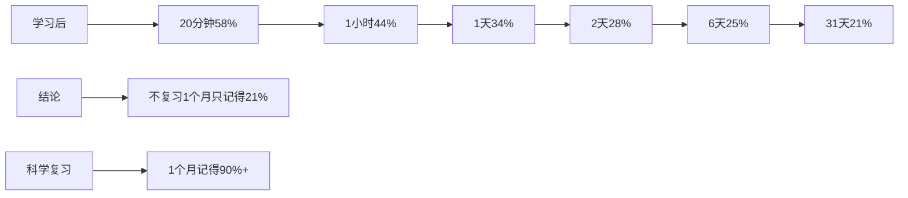

#### 方法1："5+1复习法"

**核心**：关键时间点复习

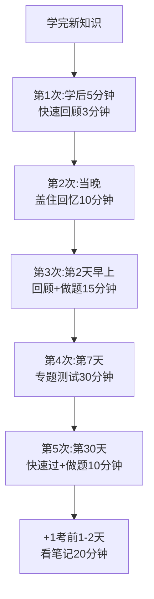

**时间表示例**（11月1日学的知识）：

| 日期 | 时间 | 复习内容 | 效果 |
|------|------|----------|------|
| 11月1日 20:00 | 学习新知识 | 二次函数 | - |
| 11月1日 20:50 | 第1次复习 | 5分钟后回顾 | 加深印象 |
| 11月1日 22:00 | 第2次复习 | 当晚回忆 | 巩固 |
| 11月2日 7:00 | 第3次复习 | 晨起回顾+做题 | 对抗遗忘 |
| 11月8日 19:00 | 第4次复习 | 1周后测试 | 长期记忆 |
| 12月1日 19:00 | 第5次复习 | 1个月后过 | 永久记忆 |
| 考前2天 | 考前复习 | 看笔记 | 激活 |

**记忆保持率**：90%+

**实施技巧**：
- 笔记本标注复习日期
- 手机日历提醒

#### 方法2："主动回忆法"

**原理**：主动回忆比被动重读效果好10倍

❌ 被动重读（效率10%）：
```
拿出课本/笔记
从头到尾看一遍
嗯，都看过了，应该记住了（自欺欺人）
```

✅ 主动回忆（效率90%）：

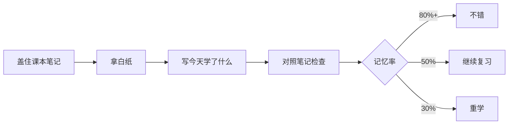

**Step1：回忆今天学的内容（不看书）**
```
今天学了:
1. 数学: 二次函数的顶点坐标公式
   ├ 顶点坐标 = ( ___ , ___ )
   ├ a的作用: ___
   └ 做了哪几道典型题: ___
```

**Step2：对照笔记**
- 对→打勾
- 错→画叉+红笔补

**Step3：重点复习错的**
- 大声读3遍
- 抄1遍
- 做2道相关题

**效果对比**：

| 方法 | 时间 | 记忆保持率 | 自我认知 |
|------|------|------------|----------|
| 被动重读 | 30分钟 | 20% | 以为记住了 |
| 主动回忆 | 30分钟 | 80% | 清楚未掌握 |

#### 方法3："费曼复述法"

**操作**：

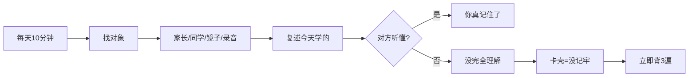

**实战示例**：
```
"妈妈，我给你讲讲今天学的浮力"

浮力就是物体在水里受到的向上的力。
比如你洗碗的时候，碗在水里是不是感觉变轻了？
那就是浮力。

浮力的计算公式是 F浮 = ρ液gV排
ρ液是液体密度，水就是1.0×10³
g是10
V排是排开液体的体积

比如说，一个物体体积是0.001立方米，
全部浸在水中，那么
F浮 = 1000 × 10 × 0.001 = 10牛
```

**卡壳处=未掌握处**：
- 如果卡在公式 → 立即背3遍
- 如果卡在概念 → 去看视频或问老师

#### 方法4："间隔测试法"

**原理**：测试本身是最好的学习

**每周日晚上测试**（19:00-21:00）：

| 时间 | 内容 | 时长 |
|------|------|------|
| 19:00-19:30 | 数学本周30道 | 30分钟 |
| 19:30-20:00 | 物理本周20道 | 30分钟 |
| 20:00-20:30 | 英语阅读+完形+单词 | 30分钟 |
| 20:30-21:00 | 政治/历史默写 | 30分钟 |

**测试后分析**：
- 正确率>80% → 掌握良好
- 60-80% → 需巩固
- <60% → 继续学

#### 方法5："知识卡片法"

**制作**：

```
正面:
欧姆定律公式是什么？

背面:
I = U/R
电流 = 电压 / 电阻
单位: A, V, Ω
```

**碎片时间使用**：

| 场景 | 题目量 |
|------|--------|
| 等公交 | 5张 |
| 排队买饭 | 3张 |
| 课间 | 10张 |
| 上厕所 | 3张 |
| 睡前 | 20张 |
| 每天合计 | 30分钟≈100+知识点 |

**App推荐**：
- Anki：强大，自动复习
- Quizlet：简单友好
- 百词斩：背单词

#### 方法6："睡眠巩固法"

**科学依据**：睡眠时大脑整理白天所学

```mermaid
graph LR
    A[21:30-22:00<br>重点复习] --> B[22:00-22:10<br>闭眼回忆]
    B --> C[22:10-22:30<br>洗漱]
    C --> D[22:30<br>上床睡觉]
    D --> E[6:30起床]
    E --> F[回忆昨晚内容]
    F --> G[早上巩固]
    
    H[睡前复习] --> I[睡眠整理]
    I --> J[早上巩固]
    J --> K[三重强化]
```

**睡前"过电影"**：
- 回忆今天所学
- 想重点
- 自然入睡
- 次日记忆更牢

### 没记住的解决公式

```
一次学习+不复习 → 1个月后只记得20%
一次学习+科学复习 → 1个月后记得90%

科学复习系统:
5+1复习法（时间节奏）+
主动回忆法（复习方式）+
费曼复述法（检验真懂）+
间隔测试法（发现漏洞）+
知识卡片法（碎片时间）+
睡眠巩固法（利用睡眠）

= 学一遍，记一辈子
```

**记忆效果对比**：

| 方法 | 1天后 | 1周后 | 1月后 | 考试时 |
|------|-------|-------|-------|--------|
| 不复习 | 34% | 25% | 21% | 基本忘光 |
| 传统复习 | 50% | 40% | 30% | 记得一半 |
| 科学复习 | 90% | 85% | 80% | 轻松回忆 |

---

## 🎯 问题7：正反馈少动力不足 - "越学越没信心，想放弃"

### 具体表现

- 付出多，分数没提升
- 看到学霸轻松考高分，很挫败
- 家长老师批评多，表扬少
- 觉得努力没用，想放弃
- 学习是被逼的，没有内驱力

### 根本原因

```
努力 → 没看到进步 → 挫败感 → 放弃

问题分析：
1. 目标太高（想一次从60到90）
2. 反馈延迟（努力1个月没提高）
3. 只看分数（忽略小进步）
4. 缺少成就感（总关注不会的）
5. 对比错误（总和学霸比）
```

### 解决方案：正反馈系统建立法

#### 策略1：建立"进步可视化系统"

**方法1：进步曲线图**

**在墙上贴一张大图表**：

```mermaid
graph LR
    A[横轴:时间<br>11月-6月] --> B[纵轴:分数<br>50-100]
    B --> C[每次考试后]
    C --> D[标点连线]
    D --> E[形成曲线]
    
    F[数学:红线] --> G[看到上升趋势]
    H[物理:蓝线] --> I[看到努力有效果]
    J[英语:绿线] --> K[下降时分析原因]
```

**示例**：
```
100|                    ×(目标)
 90|               ×
 80|          ×
 75|     ×
 70|×
 60|
   |_______________________________
   10月 11月 12月 1月 2月 3月
```

**看到向上的曲线，更有成就感**

**方法2：进步日记**

**每天晚上写3行**：

```
日期：2024.11.15

今天的进步：
1. 数学：学会二次函数顶点公式，8/10对
2. 英语：背了30个新单词，全部记住
3. 物理：理解浮力的4种计算方法

今天最有成就感的事：
做对了一道之前完全不会的几何证明题！

明天的小目标：
数学做20道二次函数题，争取做对15道以上
```

**每周日翻看进步日记**：
- 本周：学了5个知识点、背了150个词、做了200道题、相似三角会了
- 自我激励，成就感满满

**方法3：知识点打卡表**

**制作表格**：

| 章节 | 知识点 | 状态 | 掌握日期 |
|------|--------|------|----------|
| 有理数 | 有理数加减 | ✓ | 11/1 |
| 有理数 | 有理数乘除 | ✓ | 11/2 |
| 有理数 | 有理数混合运算 | ✓ | 11/3 |
| 整式 | 整式加减 | ✓ | 11/5 |
| 整式 | 整式乘法 | ⊙ | 11/8(复习中) |
| 方程 | 一元一次方程 | ✓ | 11/10 |
| 方程 | 二元一次方程组 | ○ | (未学) |

**符号**：
- ✓ 掌握（做对90%）
- ⊙ 学习中（60-89%）
- ○ 未学

**使用**：
- 每学一个→打✓
- 每周统计：5个✓
- 月末统计：15/20/25…
- 看到✓增多→动力满满

**贴在显眼处**：
- "已掌握35个知识点，还有45个，加油"
- 而非"还有45个不会，太多了"

#### 策略2："小目标激励法"

**问题**：目标太大→遥不可及→没动力

**解决**：小目标→容易达成→获得成就感→继续

❌ 错误设定：
```
我要在中考考到90分以上！
（看起来很长的4个月，可以拆成每周的小目标）
```

✅ 正确设定（阶梯式）：

```mermaid
graph TD
    A[最终目标<br>中考90分] --> B[月目标]
    B --> C[11月:65→70<br>提高5分]
    C --> D[12月:70→75<br>提高5分]
    D --> E[1月:75→80<br>提高5分]
    
    A --> F[周目标]
    F --> G[本周:掌握二次函数基础<br>3个知识点]
    G --> H[做对二次函数基础题<br>20道]
    H --> I[错题不超过3道]
    
    A --> J[日目标]
    J --> K[今天:看完二次函数视频<br>30分钟]
    K --> L[做10道二次函数题]
    L --> M[做对8道以上]
```

**执行与奖励**：

| 频率 | 目标 | 奖励 |
|------|------|------|
| 每日 | 10道对9道 | 给自己一个赞+画笑脸+玩15分钟手机 |
| 每周 | 正确率82% | 看电影+买文具+打半小时球 |
| 每月 | 提高9分（超额完成） | 买鞋+大餐+外出半天 |

**关键原则**：
1. 具体可衡量
2. 跳一跳够得着
3. 完成就奖励（哪怕小进步）

#### 策略3："对比正确化"

**问题**：总和学霸比→越比越挫败

**解决**：和自己比→看到进步→有动力

❌ 错误对比：
```
"小明数学95分，我才70分，我真笨，永远赶不上"
```

✅ 正确对比：
```
"上个月我62分，这个月70分，我进步了8分！

如果保持这个速度：
12月：78分
1月：86分
2月：94分

我正在追上他！"
```

**建立"自我进步参照系"**：

| 日期 | 本次分数 | 上次分数 | 进步幅度 |
|------|----------|----------|----------|
| 11月15日 | 70分 | 62分 | +8分 ↑ |

- 不看别人，只看自己
- 我比上次好→是
- 我在进步→是
- 我能继续进步→能

**心理暗示法**：
- 不要想："我比XX差"、"我是倒数"
- 要想："我比上个月的自己强"、"我在进步"
- 每天对自己说3遍："我在进步，我会越来越好"

#### 策略4："优势聚焦法"

**问题**：只看不会的→觉得自己很差

**解决**：多看会的→建立信心

**每周统计"我会的"**：

```
这周我学会的:
───────────────────
数学:
✓ 二次函数开口方向判断（10题全对）
✓ 二次函数对称轴公式（会背会用）
✓ 二次函数顶点坐标（做对8/10）

物理:
✓ 浮力公式（会背会用）
✓ 漂浮条件（理解了）
✓ 浮力计算题（能做简单的）

英语:
✓ 背了150个单词（记住了130个）
✓ 一般过去时（完全掌握）
✓ 做对了2篇阅读理解

总计: 这周我掌握了9个新知识点！
───────────────────
```

**每天晚上问自己**：
- "今天我做对了哪些题？"
- "今天我进步了什么？"

**改变关注点**：
- ❌ "我有45个知识点不会"（焦虑）
- ✅ "我已经掌握了35个知识点"（自信）
- ✅ "每周掌握5个，9周后全部掌握"（计划）

#### 策略5："即时正反馈法"

**问题**：只有考试才知道结果→反馈延迟

**解决**：每天小胜利→即时反馈→保持动力

**每日小测试**：

```
今天学了: 二次函数顶点公式

立即测试（5道题，5分钟）:
1. y=2x²-4x+3的顶点坐标是？ ✓
2. y=-x²+2x的顶点坐标是？ ✓
3. 顶点在(1,3)，开口向下，写解析式 ✓
4. y=x²-6x+k的顶点纵坐标是-1，求k ✓
5. 综合题 ✗

结果: 4/5 = 80%

立即反馈:
"我今天学的内容，已经掌握80%了！
还有20%明天继续巩固"

成就感 ✓ 知道自己学会了 ✓ 有动力继续 ✓
```

**每日打卡奖励**：

| 连续天数 | 奖励 |
|----------|------|
| 连续7天 | 周日可多看一部电影/多玩1小时手机 |
| 连续30天 | 买心仪的文具/衣服/手办 |

**即时反馈话术**：
- 做对一道题："我会了"
- 学会一个知识点："又掌握一个，目标更进一步"
- 完成一套题："完成，今天又进步了"

#### 策略6："游戏化学习法"

**原理**：即时反馈+成就感+升级系统

**把学习变成"打怪升级"**：

**设定等级系统**：

```mermaid
graph TD
    A[Lv1 小学生0-60] --> B[你现在:Lv2 初学者60-65]
    B --> C[Lv3 入门者65-70<br>11月目标]
    C --> D[Lv4 学徒70-75<br>12月目标]
    D --> E[Lv5 熟练者75-80]
    E --> F[Lv6 精通者80-85]
    F --> G[Lv7 专家85-90]
    G --> H[Lv8 大师90-95]
    H --> I[Lv9 宗师95-100]
    I --> J[Lv10 满分王100+]
    
    K[每提升5分] --> L[升一级]
    L --> M[升级就有奖励]
```

**技能树系统**：

```
数学技能树:
                    [中考满分]
                        |
        ________________|________________
        |               |               |
    [代数大师]      [几何专家]      [函数高手]
        |               |               |
    已掌握            学习中          未解锁

每个分支下有小技能:
代数大师:
  ├ 有理数运算 ✓ (已掌握)
  ├ 整式运算 ✓ (已掌握)
  ├ 方程求解 ⊙ (学习中)
  └ 不等式 ○ (未解锁)

点亮一个技能 → 成就感+1
```

**成就系统**：

| 徽章 | 条件 | 状态 |
|------|------|------|
| 初出茅庐 | 完成第一天学习 | ✓ |
| 坚持7天 | 连续学习7天 | ✓ |
| 知识新星 | 掌握10个知识点 | ✓ |
| 错题杀手 | 改正100道错题 | ⊙(75/100) |
| 月度MVP | 本月进步10分以上 | ○ |
| 逆袭之王 | 从60提升到90分 | ○ |

**组队PK**：

```
找同水平的同学:

约定:
- 每天互相监督学习
- 每周比赛做题速度和正确率
- 每月比谁进步更大

本周PK:
你：做对45/50（90%）
他：做对40/50（80%）
你赢了！+1分

月度积分榜:
你：15分
他：12分

良性竞争 → 共同进步
```

#### 策略7："家长正向激励法"

**给家长的建议**：

**不要说的话**：
```
❌ "你怎么这么笨？"
❌ "你看人家XX考了95分"
❌ "你再不努力就完了"
❌ "考这么差，我们脸都丢光了"
```

**要说的话**：
```
✓ "你这周进步了5分，很不错！"
✓ "妈妈看到你每天都在努力，加油！"
✓ "这道题你之前不会，现在会了，说明你在进步"
✓ "没关系，慢慢来，妈妈相信你"
```

**家长可以做的激励**：

**1. 进步奖励制度**：
- 提高5分 → 奖励50元零花钱
- 提高10分 → 奖励外出游玩
- 掌握一个难点 → 奖励一本喜欢的书
- 连续一周认真学习 → 周末看场电影
- 重点：奖励进步，而非只奖励高分

**2. 学习环境支持**：
- 准备营养餐食
- 学习时不打扰
- 买需要的学习资料
- 提供安静的学习空间

**3. 情感支持**：
- 压力大时，给一个拥抱
- 考砸了，说"没关系，下次再来"
- 进步了，真诚表扬
- 定期聊天，了解学习状态

**4. 榜样力量**：
- 孩子学习时，家长看书（而非玩手机）
- 和孩子一起"学习"（学做菜、学英语等）
- 分享自己年轻时努力的故事
- 一起进步

### 动力不足的解决公式

```
付出看不到回报 → 建立正反馈系统 → 及时看到进步 → 获得成就感 → 持续动力

方法组合:
进步可视化（看得见进步）+
小目标激励（容易达成）+
对比正确化（和自己比）+
优势聚焦（多看会的）+
即时反馈（每天小胜利）+
游戏化学习（增加趣味）+
家长支持（外部激励）

= 从"被逼学习"到"主动学习"
```

**动力提升曲线**：
- Week1:靠毅力（很痛苦）
- Week2:开始小进步（有点动力）
- Week4:进步明显（动力增强）
- Week8:形成习惯（意志力减少）
- Week12:进入正循环（主动学习）
- 坚持12周，形成良性循环

---

## 📊 综合解决方案

### 60-70分学生的完整学习系统

**每日学习流程（标准版）**：

```mermaid
graph TD
    A[早晨6:30-7:00] --> A1[回忆昨晚内容5分钟<br>背20个单词15分钟<br>快速过昨天错题10分钟]
    
    B[课间/碎片时间] --> B1[Anki卡片复习<br>刷单词App]
    
    C[放学后15分钟] --> C1[回顾当天课堂笔记<br>标注不懂]
    
    D[晚上19:00-22:30] --> D1[19:00-20:00数学]
    D1 --> D2[看视频20分钟<br>刷基础题15道30分钟<br>订正+整理10分钟]
    D --> D3[20:00-20:10休息]
    D3 --> D4[20:10-20:50物理/化学]
    D --> D5[20:50-21:00休息]
    D5 --> D6[21:00-21:40英语]
    D6 --> D7[2篇阅读/1篇完形+听力/作文]
    D --> D8[21:40-22:10政治/历史背诵]
    D --> D9[22:10-22:30总结]
    D9 --> D10[整理错题<br>写进步日记<br>主动回忆<br>打卡✓]
    
    E[22:30睡前] --> E1[闭眼回忆重点<br>睡觉8小时]
```

**每周学习节奏**：

| 星期 | 内容 |
|------|------|
| 周一至周五 | 新知识+基础题 |
| 周六 | 数学深度学习2小时<br>理科刷题2小时<br>英语综合训练 |
| 周日 | 复习本周（主动回忆）<br>本周测试<br>分析错题<br>更新曲线与总结<br>制定下周计划 |

**每月里程碑**：

```mermaid
graph LR
    A[月初] --> A1[设定小目标<br>打印打卡表]
    B[月中] --> B1[模拟测试<br>检查进度<br>必要时调整]
    C[月末] --> C1[月度测试]
    C1 --> C2[更新曲线]
    C2 --> C3[统计成就]
    C3 --> C4[奖励自己]
    C4 --> C5[制定下月计划]
```

### 关键成功要素（必须做到）

**1. 错题本必须坚持**

| 频率 | 任务 |
|------|------|
| 每天 | 至少整理5道错题 |
| 每周 | 复习本周错题 |
| 每月 | 复习本月错题 |
| 考前 | 复习全部错题 |

**2. 基础题必须做透**

```
不要贪多
不要做难题
80%时间做基础题
基础题做到90%正确率
再考虑中档题
```

**3. 复习必须科学**

| 时间 | 复习内容 |
|------|----------|
| 当天 | 当天的知识 |
| 第2天早上 | 再过一遍 |
| 第7天 | 专题测试 |
| 第30天 | 快速过 |

**4. 进步必须记录**

```
每天记录小进步
每周统计大进步
每月庆祝里程碑

看得见进步 → 有动力坚持
```

**5. 方法必须正确**

```
理解比死记硬背重要
思路比题海重要
错题质量比数量重要
主动回忆比被动重读重要

用对方法，事半功倍
```

### 给60-70分学生的终极建议

**心态篇**：

| 建议 | 说明 |
|------|------|
| 接受现状 | 60-70不是终点，是起点 |
| 相信自己 | 60到90，很多人做到过 |
| 拒绝焦虑 | 专注当下 |
| 享受过程 | 学会一个知识点很爽 |
| 永不放弃 | 偶尔退步正常 |

**行动篇**：

```mermaid
graph LR
    A[今天就开始] --> B[不要等准备好了]
    B --> C[现在就是最好的时机]
    
    D[小步快跑] --> E[每天进步一点点]
    E --> F[4个月后回头看变化]
    
    G[死磕基础] --> H[前2个月专攻基础]
    H --> I[基础牢后面顺]
    
    J[坚持系统] --> K[严格执行]
    K --> L[坚持3个月成习惯]
    
    M[寻求帮助] --> N[不懂就问]
    N --> O[不积累问题]
```

---

## 🏆 写在最后

**激励语**：

> "基础差不可怕，可怕的是不开始。用2个月补基础，换来6个月的顺畅学习，太值了！"

> "理解一个知识点可能要花2小时，但死记硬背可能只要20分钟。理解后能用一辈子；死记硬背考完就忘。哪个更划算？"

> "与其背10遍忘9遍，不如用对方法背1遍记一辈子。聪明地努力，比盲目地努力重要100倍！"

> "解题思路不是天赋，是可以训练的技能。每天训练一点，3个月后，你会惊讶于自己的进步！"

> "记忆力不是天生的，科学复习让你的大脑变成'保险箱'，存进去的知识再也不会丢！"

> "动力不是等来的，是创造出来的。每一个小进步，都是继续前进的燃料！"

**核心价值**：
- 从"被逼学习"到"主动学习"
- 从"不断受挫"到"持续进步"
- 从"怀疑自己"到"充满信心"
- 从"60-70分"到"85-90分"

**记住**：
- 方法对了，事半功倍
- 坚持比聪明更重要
- 正反馈是持续动力
- 心理健康优先于成绩
- 4个月能带来明显改变

---

**文档版本**：v1.0  
**最后更新**：2024年11月  
**适用对象**：初三60-70分学生及家长  
**预期效果**：按方案执行，各科提升15-25分
