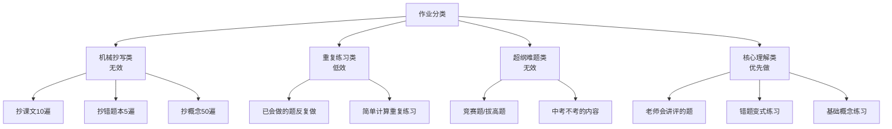
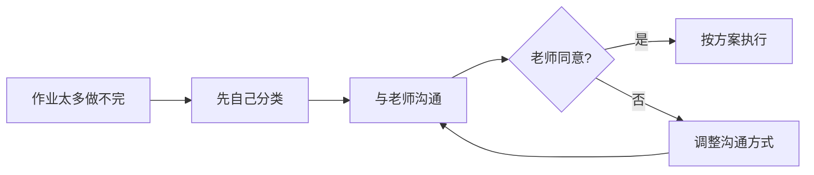
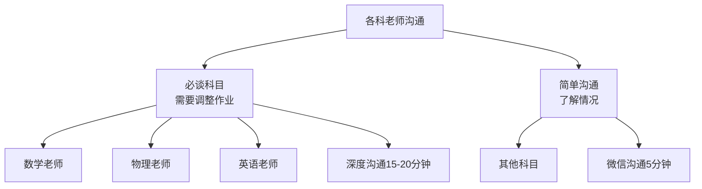
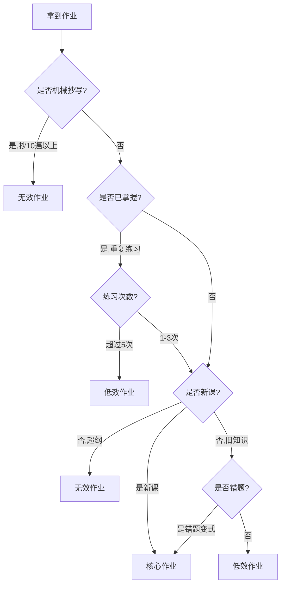
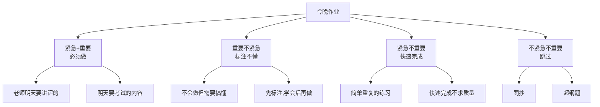
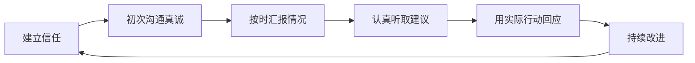

# 作业处理与师生沟通实用手册（稳住局面版）

## 🌤 关于作业处理的务实原则（不硬刚、不内耗）

### 核心原则：优先沟通，理性取舍

**重要认识**：
- 教师水平确实存在差异，部分作业可能确实无效或低效
- 与老师沟通减少作业量存在沟通成本，且老师不一定同意
- 在时间有限的情况下，需要进行战略性取舍

### ⚠️ 需要谨慎的方法及其风险

| 方法 | 适用场景 | 风险提示 | 使用原则 |
|------|----------|----------|----------|
| 家长代写作业 | 无效的机械抄写作业（如抄课文10遍） | 可能被老师发现；可能养成依赖 | 仅在沟通失败且作业确实无效时考虑 |
| 使用抄写机器人 | 重复性抄写作业（如抄单词100遍） | 容易被发现；丧失手写练习 | 仅用于完全无效的机械抄写 |
| AI辅助理解 | 孩子确实不会做，需要理解思路 | 可能直接抄袭答案 | 必须用于理解过程，不能直接抄答案 |
| 战略性跳过 | 超纲题、低效重复题 | 可能被批评 | 需在作业本上说明原因 |

**使用这些方法的前提条件**：
1. ✅ **已尝试与老师沟通**：至少尝试过1-2次沟通，但老师不同意调整
2. ✅ **作业确实无效**：经过判断，属于"机械抄写类"或"超纲难题类"（见下文分类标准）
3. ✅ **有替代学习方案**：用这些方法节省的时间，优先用于更有价值的学习活动
4. ✅ **孩子知情并理解**：让孩子明白这是权宜之计，不能成为习惯

**这些方法的后果（如果滥用）**：
1. 孩子失去练习机会（做题能力越差）
2. 可能被学校发现，面临处罚
3. 破坏师生信任关系
4. 让孩子学会用欺骗解决问题
5. 给孩子树立错误的价值观

**原则**：优先沟通，沟通失败后再考虑战略性取舍，但必须确保节省的时间用于更有价值的学习。

## ✅ 正确的作业处理策略

### 作业分类判断标准

**识别无效作业的方法**：



### 战略取舍原则 (SOP版)

**第一步：作业分类**

拿到所有作业后，第一时间不是动笔，而是花5分钟进行分类，用笔在作业本上做好标记：

-   **A类 (核心理解类)**：初见的新知识、新题型，需要思考才能解答的题目，各科的综合题、论述题、实验题等。
    -   **处理原则**：优先按对应科目的SOP去做（宁可慢一点，也尽量把关键动作做对）。例如，数学用“四步解题法”，英语阅读用“三步肢解法”，物理计算用“三段式解题SOP”。这是投入时间的核心区域，目标是“吃透”而非“做完”。
-   **B类 (重复练习类)**：已经掌握的知识点，但需要通过练习来巩固和提高熟练度的题目。
    -   **处理原则**：与老师沟通后，可减少数量（如只做单数题），完成的每一题尽量经过SOP的关键步骤，保证质量。
-   **C类 (机械抄写类)**：抄写词汇、公式、课文等。
    -   **处理原则**：与老师沟通后，用更高价值的SOP练习代替（例如，用“艾宾浩斯SOP”背单词，用“关键词SOP”梳理概念）。
-   **D类 (战略放弃类)**：明显超纲或过于繁琐的难题，对当前阶段意义不大。
    -   **处理原则**：可跳过，并在题目旁注明“暂缓/战略取舍”，把时间留给A类和B类作业。

### 与老师沟通的话术

**核心策略**：先沟通，再取舍



## 📞 与班主任沟通完整方案

### Day 2: 母亲与班主任深度沟通

#### 准备工作（前一晚必须完成）

**1. 整理孩子详细情况表**：

```
【孩子学习情况分析】
学生姓名:XX
班级:XX

一、各科成绩现状:
- 语文:80-90分（相对较好）
- 化学:80-90分（相对较好）
- 数学:60-70分（基础薄弱）
- 物理:60-70分（基础薄弱）
- 英语:60-70分（词汇量不足）
- 政治:60-70分（背诵不足）
- 历史:60-70分（背诵不足）

二、主要问题:
1. 基础欠账太多,跟不上进度
2. 作业经常做不完,形成恶性循环
3. 学习方法不对,死记硬背,不理解
4. 正反馈少,自信心不足
5. 家长教育方法之前不当,现已调整

三、家长的反思:
1. 之前对孩子要求过严/过松
2. 夫妻教育理念不统一,给孩子造成困扰
3. 现在已经统一战线,愿意全力配合学校

四、诚恳请求:
1. 希望老师指出孩子最需要补的知识点（每科3个）
2. 希望能在作业方面给予灵活调整（详见下文）
3. 希望定期沟通孩子情况（每周或每两周）
4. 我们保证:孩子的学习态度会改善,请老师再给一次机会
```

**2. 预约合适的时间**：
```
"X老师您好,我是XX的家长。关于孩子的学习情况,
我想当面和您详细聊聊,请教您的建议。您这周什么时候
方便?我可以到学校找您,大概占用您30分钟时间。"
```

- 最佳时间：周一到周四下午放学后或午休
- 避免时间：周五、早上

#### 面谈流程（30-45分钟）

**开场（2分钟）- 态度很重要**：
```
"X老师,非常感谢您抽时间见我。我知道您很忙,班上孩子那么多,
我家孩子成绩不好,肯定给您添麻烦了。

今天来,主要是想:
1. 向您了解孩子在学校的真实情况
2. 跟您汇报我们家长的反思和改变
3. 请您给我们一些具体的建议

我把孩子的情况整理了一份,您先看看。"
```
**递上准备好的材料**

**关键话术 - 听老师说（10分钟）**：
```
"老师,您能跟我说说,孩子在学校是什么情况吗?
- 上课听讲怎么样?
- 和同学关系怎么样?
- 作业完成情况您怎么看?
- 您觉得他最大的问题是什么?"
```

**认真记笔记,不要辩解,不要打断**

| 老师的反馈 | ❌ 错误回应 | ✅ 正确回应 |
|------------|------------|------------|
| "孩子上课经常走神" | "不可能啊,他在家说都听懂了" | "确实,他注意力不太集中。请问您有什么建议吗?" |
| "作业质量很差,字也潦草" | "他时间不够,做不完..." | "是的,我们也发现了。这反映出他基础太差,我们会改进" |
| "他有些自暴自弃的倾向" | "那是因为老师您作业留太多了!" | "我们也担心这点。能请您在班上多鼓励鼓励他吗?" |

**核心诉求 - 作业调整 (SOP方案版)**：
```
"老师，关于作业，我想和您坦诚地聊聊，并提出一个我们思考了很久的解决方案。

孩子现在的情况是：作业经常做不完。我们深入分析后发现，根源在于基础差，导致做题慢，越慢越焦虑，形成恶性循环。他不是不想做，是真的‘卡’住了。

为了打破这个循环，我们不能再用老办法，而是引入了一套更科学的学习方法——**标准作业流程（SOP）**。我们希望把时间和精力聚焦在真正能提升理解的核心作业上，用SOP确保每一道题的质量。

这是我们的具体方案，想和您探讨一下：

**1. 聚焦核心，保证质量：**
   - 我们会优先完成您认为最重要的‘核心理解类’作业。
   - **我们的承诺是：** 对于这些题目，我们**保证使用对应科目的SOP（比如数学的‘四步解题法’）来完成**。孩子在作业本上，除了答案，还会写下SOP的关键分析步骤。我们追求的不再是完成作业，而是‘吃透’每一道核心题。

**2. 优化重复，提升效率：**
   - 对于‘重复练习类’的作业，能否允许我们只做一半？我们保证，完成的每一题都会严格走完SOP流程，确保举一反三。

**3. 替换抄写，升级价值：**
   - 对于‘机械抄写类’的作业，比如抄词汇、抄课文，能否允许我们用更有价值的SOP练习代替？
     - **抄单词 → 我们会用‘艾宾浩斯-卡片-语境’SOP来高效记忆和复习。**
     - **抄课文 → 我们会用‘长难句分析’SOP来解构其中的一个复杂句子。**
     - 这样做，价值远高于机械重复。

**4. 战略放弃，保住基础：**
   - 对于‘超纲难题’，我们会战略性放弃，把时间用来反复练习SOP，巩固基础。

如果他这样做，您能接受吗？他会在作业本上注明：‘此题因时间不够未完成，已按SOP方案向X老师报备’。

**最后，我代表孩子向您保证：**
1. **我们绝不是为了偷懒，而是为了更高效地学习。** 他每天的总学习时间不会少。
2. **课上您讲的例题，他会用SOP的视角去听、去记，课后会用SOP专门练习。**
3. **每周，我会把他的SOP练习记录（比如解题分析图）拍给您看，向您汇报他的真实进展。**

我们希望通过这种方式，让孩子从‘应付作业’转变为‘主动学习’，真正把方法学会。您看这个方案，我们能不能试一试？"
```

**老师可能的反应和应对**：

| 老师反应 | 你的回应 |
|----------|----------|
| **反应1（通情达理型）**："可以,我理解。但你要保证他课上认真听讲。" | "谢谢老师!我一定监督。能不能请您在课上也多提醒他一下?" |
| **反应2（为难型）**："这个...其他同学都能完成,如果只给他特殊对待..." | "我理解您的难处。这样吧,能不能让他先试两周?如果两周后他的作业质量提高了,说明有效;如果还是不行,我们再想其他办法。您看行吗?" |
| **反应3（强硬型）**："作业必须全部完成,这是学校规定,我也没办法。" | "我完全理解。那您能不能帮我个忙:每天看看他的作业,您觉得哪些是他必须做的,圈出来?我保证让他把这些做完做好。" |

**请教具体方法（10分钟）**：
```
"老师,还有一件事想请教您。

您教了这么多年,肯定见过不少像我孩子这样的情况。
您能不能给我指点一下:

1. 他现在这个成绩,哪几科还有提升空间?
   您建议我们重点攻哪几科?

2. 每一科,您觉得他最需要补的是哪3个知识点?
   (如果能给一份清单,我感激不尽)

3. 您觉得他需要报辅导班吗?如果报,报哪几科?
   (我们经济一般,想听听您的专业建议)

4. 接下来这4个月,您觉得我们家长应该怎么配合?
   您对我们有什么要求?"
```

**大多数老师会认真回答，如果老师给了具体建议，一定要：**
- 认真记录
- 表示感谢
- 后续执行后反馈给老师

**结束语（3分钟）**：
```
"X老师,太感谢您了!您说的这些我都记下了,回去马上执行。

最后有个请求:能不能每周或每两周,我来找您5分钟,
跟您汇报一下孩子的情况,听听您的反馈?

我保证不会占用您太多时间,就几分钟。
如果您觉得当面不方便,微信也可以。

我们真的想帮孩子把这4个月安排好,请您多多指教!"
```

**送上小礼物（可选，效果好）**：
- 不要太贵重（老师会拒绝）
- 建议：一盒好茶、一束鲜花、或一张感谢卡
- 话术："一点小心意,感谢老师对孩子的付出"

## 🗣️ Day 3-5: 与各科老师沟通

### 沟通优先级



### 各科沟通要点和话术

#### 数学老师沟通话术

**预约**：
```
"X老师您好,我是XX的家长。孩子数学现在60-70分,
我想请教您一些问题。您什么时候方便?大概15分钟就可以。"
```

**沟通内容**：
```
"X老师您好,我是XX的家长。孩子数学现在60-70分,
我想请教您:

1. 他现在最薄弱的是哪块?是计算、几何、还是函数?
2. 您建议他从哪里开始补?
3. 作业方面,能不能让他重点做基础题,难题暂时跳过?
4. 您能推荐一本适合他的练习册吗?

我保证:
- 课本上的例题,我会让他搞懂
- 您课上讲的题,我会让他课后再做一遍
- 每周我让他整理错题,您能帮忙看一眼吗?
- 能给我推荐一本练习册或资料吗?我们自己买"
```

**老师可能推荐**：
- 《XX中考复习》
- 《XX一轮复习》
- 老师自己整理的资料

**一定要问**："老师,这本书我们应该怎么用?全做还是挑着做?"

#### 物理老师沟通话术

```
"X老师,孩子物理也是60-70分。我发现他主要问题是:
- 公式背了但不会用
- 实验题经常搞不懂
- 计算题容易算错

您能给我建议一下:
1. 哪些公式是必须滚瓜烂熟的?我让他重点背
2. 实验题有什么好方法吗?
3. 作业上,能否让他少做一些偏题?
4. 您能给我一份'物理中考必考知识点清单'吗?

我想让他有针对性地补。"
```

#### 英语老师沟通话术

```
"X老师,孩子英语60-70分,我觉得主要是词汇量不够。

我的计划是:
- 让他每天背20个中考高频词
- 每天听10分钟英语（您觉得听什么好?）
- 每周背5个作文万能句

您觉得这个方向对吗?

作业方面:
- 单词听写、默写,我们保证完成
- 阅读理解,能否让他只做基础篇,暂时不做难的?
- 作文,能否每周写1篇精写,您帮忙批改?
5. 能给我推荐一本词汇书吗?"
```

**英语老师通常会推荐**：
- 《XX中考词汇》
- 《XX英语专项训练》

**一定要问**："老师,这本词汇书有1500个词,他应该怎么背?有什么技巧吗?"

#### 其他科目简单沟通

**方式**：微信即可

```
"X老师,我是XX家长。孩子XX科目现在XX分,
想请教您:他这科最需要提高的是什么?
有什么建议吗?谢谢老师!"
```

## 📅 日常沟通策略

### 每周反馈（每周五晚上）

**方式**：微信为主

**模板**：
```
X老师好,又到周末了,和您汇报一下孩子这周情况:

【进步的地方】
1. 这周XX科做对了XX道题
2. 上课举手发言了X次
3. 主动问了您X个问题

【还需要努力的地方】
1. XX知识点还是不太懂
2. 作业速度还是慢

【下周计划】
1. 重点攻克XX知识点
2. 每天练习X道题

请老师多关注他,谢谢老师!
周末愉快!
```

**老师通常会回复**："好的,我会注意。他这周XX方面有进步,继续加油"

**你再回复**："谢谢老师鼓励!我会转告他"

### 当孩子被批评/罚抄时

**第一时间联系老师（当天晚上）**：
```
"X老师,听孩子说今天他XX（作业没交/上课走神...）,
您批评他了。

这是我们家长的责任,没有督促好。
我已经和他谈过了,他也认识到错了。

请问您:
1. 孩子具体哪里做得不好?
2. 我们在家应该怎么配合?
3. 他需要补什么?（作业/惩罚）

我们一定督促他改正,也请老师继续严格要求他。
谢谢老师!"
```

**关键点**：
- 先认错（不为孩子辩解）
- 问具体问题（不是质疑老师）
- 表示会配合（不是护短）
- 感谢老师（态度好）

**大多数老师会软化**：
"其实他也不是故意的,就是基础差...
你们家长能这样配合,我也放心了"

## 🗓️ 月度沟通（每月一次）

### 预约

**提前3天预约**：
```
"X老师,这个月快结束了,
能占用您10分钟时间吗?
我想当面听听您对孩子的反馈。
您什么时候方便?"
```

### 面谈内容

**第一步：带上孩子这个月的"成就本"和"成绩单"**

```
"老师您看,这是孩子这个月的努力:
- 每天背XX个单词
- 整理了XX页错题本
- 成绩从XX提高到XX（或:XX知识点搞懂了）

这些进步,离不开您的帮助,谢谢老师!"
```

**第二步：请教老师反馈**

```
"老师,您觉得他这个月:
1. 上课表现怎么样?
2. 哪方面有进步?
3. 哪方面还需要加强?"
```

**第三步：讨论下个月计划**

```
"根据您的建议,我们下个月打算:
1. ...
2. ...
3. ...

您觉得这个方向对吗?"
```

**第四步：感谢+小礼物**

```
"老师真的辛苦了,这个月麻烦您了。
这是一点小心意（茶叶/咖啡/鲜花）,
请收下,不是什么贵重东西。"
```

**老师通常会**：
- 肯定孩子的进步
- 指出需要改进的地方
- 给出下个月建议
- 表示会继续关注

## 🔍 识别无效作业和低效作业的实用指南

### 📋 5分钟快速判断流程

拿到作业后，立即用这个流程判断（建议与孩子一起完成）：



### ✅ 快速判断检查清单

**判断前先问自己5个问题**：

1. **这个作业的目的是什么？**
   - ✅ 学习新知识 → 核心作业
   - ✅ 巩固已学知识 → 需要判断是否需要
   - ❌ 纯惩罚性质 → 无效作业
   - ❌ 无明确目的 → 低效作业

2. **孩子做这个作业能学到什么？**
   - ✅ 能理解新概念 → 核心作业
   - ✅ 能提高熟练度 → 可能有效
   - ❌ 只是重复已经会的内容 → 低效作业
   - ❌ 没有任何知识增量 → 无效作业

3. **这个作业需要思考吗？**
   - ✅ 需要分析、理解、运用 → 核心作业
   - ⚠️ 纯机械操作 → 可能是低效/无效

4. **这个作业与中考相关吗？**
   - ✅ 中考必考内容 → 优先完成
   - ⚠️ 中考可能考 → 有时间再做
   - ❌ 中考不考 → 无效作业

5. **做这个作业的时间成本？**
   - ✅ 1小时能提升5分 → 值得做
   - ⚠️ 1小时只提升1分 → 低效
   - ❌ 1小时没有任何提升 → 无效

### 🎯 三类作业的详细识别标准

#### 第一类：无效作业（完全不做）

**识别特征**：
- ✗ 纯惩罚性质（如罚抄试卷10遍）
- ✗ 中考不考的内容（如某些竞赛题）
- ✗ 难度远超能力（如给60分学生做90分题）
- ✗ 重复抄写超过10遍
- ✗ 没有任何学习价值

**具体判断方法**：
```
问自己：做这个作业，孩子能学到什么？
答案：什么都学不到 → 无效作业
```

**典型例子**：
| 科目 | 无效作业示例 | 为什么无效 |
|------|------------|-----------|
| 语文 | 抄课文10遍（已会背） | 无知识增量，纯浪费时间 |
| 数学 | 做小学奥数题 | 中考不考，能力不匹配 |
| 英语 | 抄单词100遍（已会） | 可用更高效方法记忆 |
| 物理 | 罚抄试卷10遍 | 纯惩罚，无学习价值 |
| 历史 | 抄历史年表50遍 | 可用时间轴记忆法代替 |

**判断标准（符合任一条件即为无效）**：
- [ ] 抄写遍数 > 10遍
- [ ] 中考大纲中没有的内容
- [ ] 孩子完全不会，且不属于当前学习阶段
- [ ] 明确是惩罚性质的作业
- [ ] 花费时间 > 30分钟，但无任何知识增量

#### 第二类：低效作业（减少或替代）

**识别特征**：
- ⚠️ 已经掌握的知识重复练习
- ⚠️ 同类型题做过多次（超过3次）
- ⚠️ 简单计算重复做（如100道口算题）
- ⚠️ 效率低下的记忆方式（如反复抄写）
- ⚠️ 可以用更高效方法替代

**具体判断方法**：
```
问自己：做这个作业，孩子能学到什么？
答案：只能提升熟练度，但已经够熟练了 → 低效作业

问自己：有没有更高效的方法达到同样效果？
答案：有 → 低效作业，建议替代
```

**典型例子**：
| 科目 | 低效作业示例 | 为什么低效 | 替代方案 |
|------|------------|-----------|---------|
| 数学 | 有理数计算题50道（已会） | 重复练习，效率低 | 只做10道，保证正确率 |
| 英语 | 抄单词表5遍 | 可以用卡片法记忆 | 用艾宾浩斯记忆法替代 |
| 物理 | 同样的公式题做20道 | 已掌握，重复浪费 | 只做5道，保证速度 |
| 语文 | 古诗抄写3遍（已会背） | 可以用默写代替 | 默写一遍，检查准确性 |
| 化学 | 化学方程式抄写10遍 | 可以用记忆技巧 | 用口诀记忆法替代 |

**判断标准（符合任一条件即为低效）**：
- [ ] 已会做的题型，重复练习超过3次
- [ ] 可以快速完成，但数量太多（如100道口算）
- [ ] 可以用更高效方法达到同样效果
- [ ] 花费时间 > 1小时，但提升 < 2分
- [ ] 机械操作，无需思考

**优化建议**：
- 减少数量（如只做一半）
- 提高质量（如每道题都要思考）
- 替代方法（如用记忆法代替抄写）

#### 第三类：核心作业（必须完成）

**识别特征**：
- ✅ 新学习的知识点练习题
- ✅ 老师会讲评的题目
- ✅ 错题的变式练习
- ✅ 中考必考内容
- ✅ 需要理解、分析、应用的题目

**具体判断方法**：
```
问自己：做这个作业，孩子能学到什么？
答案：能理解新概念/能提高解题能力 → 核心作业

问自己：不做这个作业会怎样？
答案：会影响后续学习/会错过重要知识点 → 核心作业
```

**典型例子**：
| 科目 | 核心作业示例 | 为什么是核心 |
|------|------------|-------------|
| 数学 | 今天新学的二次函数题 | 新课内容，必须掌握 |
| 物理 | 老师课上讲的例题 | 会讲评，必须提前思考 |
| 英语 | 阅读理解题（新课） | 考查新学语法点 |
| 语文 | 错题的变式练习 | 巩固薄弱环节 |
| 化学 | 化学方程式应用题 | 中考必考，需要理解 |

**判断标准（符合任一条件即为核心）**：
- [ ] 今天新学的知识点
- [ ] 老师明确说会讲评
- [ ] 错题本上的同类题
- [ ] 中考必考内容
- [ ] 需要理解和应用的题目

### 📊 不同科目的识别要点

#### 数学
- **无效**：超纲题、竞赛题、中考不考的题型
- **低效**：已掌握的题型重复做（如100道口算）、完全会的题反复练
- **核心**：新课练习题、错题变式、综合题、应用题

#### 物理
- **无效**：高中内容提前学、偏题怪题、实验题纯抄写
- **低效**：同样公式反复套用（已掌握）、简单计算重复
- **核心**：概念理解题、实验分析题、综合计算题

#### 英语
- **无效**：抄单词100遍（已会）、抄课文10遍（已会背）
- **低效**：已会单词反复抄写、简单语法题重复
- **核心**：新课词汇练习、阅读理解、写作练习、错题变式

#### 语文
- **无效**：罚抄试卷、抄课文10遍（已会背）、古文逐字抄写
- **低效**：已会古诗反复抄写、简单阅读理解重复
- **核心**：新课阅读理解、作文练习、古诗词理解、错题分析

#### 化学
- **无效**：超纲实验、高中内容、偏题怪题
- **低效**：化学方程式反复抄写（可用记忆法）、已会公式重复
- **核心**：新学方程式应用、实验题分析、综合题

### 💡 实际案例分析

**案例1：数学作业**
```
作业内容：有理数计算题100道
判断过程：
1. 这是新知识吗？ → 否，初一内容，初三已掌握
2. 孩子会做吗？ → 是，已经做过很多次
3. 需要思考吗？ → 否，纯计算
4. 中考会考吗？ → 会，但不需要做100道
5. 时间成本？ → 需要2小时，但提升<1分

判断结果：低效作业
处理方案：与老师沟通，只做20道，保证速度和正确率
```

**案例2：英语作业**
```
作业内容：抄单词表10遍（中考高频词）
判断过程：
1. 这是新知识吗？ → 否，单词已学过
2. 孩子会写吗？ → 部分会，部分不会
3. 需要思考吗？ → 否，纯抄写
4. 中考会考吗？ → 会，必须掌握
5. 有更高效方法吗？ → 有，用艾宾浩斯记忆法

判断结果：低效作业
处理方案：用记忆法代替抄写，只抄不会的单词
```

**案例3：物理作业**
```
作业内容：罚抄试卷10遍（因为没交作业）
判断过程：
1. 这是新知识吗？ → 否，已考过的试卷
2. 能学到什么？ → 什么都学不到
3. 目的是什么？ → 纯惩罚
4. 时间成本？ → 3小时，无任何提升

判断结果：无效作业
处理方案：与老师沟通，用错题分析代替罚抄
```

### 🎯 判断后的行动建议

**判断为无效作业**：
1. 优先与老师沟通，说明原因
2. 沟通失败后，战略性跳过
3. 在作业本上诚实说明原因
4. 确保节省的时间用于核心学习

**判断为低效作业**：
1. 与老师沟通，申请减少数量
2. 用更高效方法替代
3. 保证完成的作业质量高
4. 证明替代方法同样有效

**判断为核心作业**：
1. 优先完成，保证质量
2. 不会的标注出来
3. 使用SOP方法完成
4. 及时复习巩固

### 📝 作业分类记录表

建议每天用这个表格记录作业分类：

```
日期：____年__月__日

【数学作业】
- 核心作业：第1-10题（新课练习题）
- 低效作业：第11-30题（已会题型，申请只做一半）
- 无效作业：无

【英语作业】
- 核心作业：阅读理解2篇（新课）
- 低效作业：抄单词10遍（申请用记忆法代替）
- 无效作业：无

【物理作业】
- 核心作业：综合题3道（需理解）
- 低效作业：计算题20道（已会，申请只做5道）
- 无效作业：无

【总计】
- 核心作业用时：___小时
- 低效作业优化节省：___小时
- 节省时间用于：_______
```

---

## 🔍 识别无效作业的详细标准（补充说明）

### 机械抄写类（完全无效）

**判断标准**：
- 只是重复抄写，不涉及理解
- 数量多（抄10遍以上）
- 目的是"惩戒"而非学习

**典型例子**：
1. 抄课文10遍
2. 抄错题本5遍
3. 抄概念50遍
4. 罚抄试卷10遍
5. 抄单词100遍

**处理方法**：直接和老师沟通，申请用其他方式替代

### 重复练习类（低效）

**判断标准**：
- 已经会做的题反复做
- 同类型题做过很多遍
- 没有新的知识增量

**典型例子**：
1. 有理数计算做了100道，还是这个类型
2. 背单词表背了10遍，还是记不住
3. 同样的应用题做了一遍又一遍

**处理方法**：和老师沟通，是否可以只做一半，或者选择性地做

### 超纲难题类（无效）

**判断标准**：
- 中考不考的内容
- 难度远超当前能力
- 竞赛题、拔高题

**典型例子**：
1. 小学奥数题出现在作业中
2. 高中内容提前练习
3. 偏题怪题

**处理方法**：直接跳过，不在上面浪费时间

### 核心理解类（必须做）

**判断标准**：
- 老师会讲评的题目
- 考查当前所学知识点
- 有助于理解概念
- 错题的变式练习

**典型例子**：
1. 今天新学知识点的练习题
2. 老师课上留的作业
3. 错题本上的同类题
4. 考试卷上的错题

**处理方法**：保质保量完成，不会的标记出来问老师

## 💬 具体沟通场景演练

### 场景1：老师留的作业太多

**孩子情况**：每天作业要做到晚上11点，第二天上课没精神

**沟通话术**：
```
"X老师,我想跟您反映一个情况。

孩子最近每天作业都要做到晚上11点多,早上6点多就要起床,
上课总是没精神,学习效率很低。

我分析了一下,不是他故意拖拉,而是：
1. 他基础差,做题慢
2. 有些题确实不会做,卡在那里很久
3. 作业量确实比较大

我想跟您商量:
1. 能不能让他在作业本上标注出'不会做的题'?
   这样您讲评时可以重点关注这些题
2. 机械抄写类的作业,能否让他选择性完成?
   比如已经会背的课文,抄1遍可以吗?
3. 我们保证:他每天都会花足够时间学习,
   只是希望能提高学习效率

不知道您觉得这样可行吗?或者您有什么更好的建议?"
```

**沟通要点**：
- 先说明客观情况（不是为了偷懒）
- 提出具体建议（不是空谈）
- 表达配合意愿（不给老师添麻烦）
- 虚心请教（给老师面子）

### 场景2：孩子作业经常被罚抄

**孩子情况**：作业没做完被罚抄试卷10遍，完全没有意义

**沟通话术**：
```
"X老师,关于罚抄的事,我想跟您聊聊。

我理解您的用心,是想让孩子记住教训。

但我发现一个问题:罚抄10遍试卷后,
孩子:
1. 更讨厌做作业了
2. 只是机械地抄,根本不思考
3. 占用了大量时间,反而没时间学新知识
4. 形成了恶性循环

我想跟您商量:
1. 能否取消罚抄这种方式?
2. 如果一定要惩罚,能否改成更有意义的?
   比如:让他把做错的题搞懂,然后教给家长
   或者:让他多做几道同类型的题
   或者:让他写一份'错误分析报告'

这样既能让他记住教训,又能促进学习,
您觉得怎么样?

或者,我们能不能用其他方式补偿?
比如:今天作业没做完,明天加倍完成?"
```

**沟通要点**：
- 先肯定老师的意图（理解老师用心良苦）
- 指出罚抄的问题（实际效果不好）
- 提出替代方案（更有意义的方式）
- 给出多种选择（让老师有选择余地）

### 场景3：孩子上课听不懂

**孩子情况**：上课走神是因为完全听不懂，不是故意的

**沟通话术**：
```
"X老师,我观察了一下,发现孩子上课走神有个很重要的原因:
他基础太差,完全跟不上进度。

比如:现在讲二次函数,但他一次函数都没搞懂;
现在讲电路,但他连基本电流电压关系都不知道。

听不懂 → 走神 → 更听不懂 → 恶性循环

我想跟您商量几个方案:
1. 能否让他在课堂上先'听个大概',
   课后我再给他补基础?
2. 能否允许他上课时看之前的基础知识?
   我现在在给他补初二的内容
3. 或者我们商量一个课后的补课计划?

我也不想让他在课堂上浪费时间,
但强行让他听听不懂的东西,效果确实不好。

您看有什么更好的建议吗?"
```

**沟通要点**：
- 先分析问题本质（不是态度问题，是能力问题）
- 提出务实建议（不是让老师为难）
- 表达承担责任（家长会配合）
- 共同找解决方案（双方都有建设性）

### 场景4：孩子被同学取笑

**孩子情况**：因为成绩差被同学嘲笑，不敢问老师问题

**沟通话术**：
```
"X老师,我想跟您说一个情况,可能需要您的帮助。

孩子最近不太敢在班上发言,也不敢问问题,
因为我发现班上有些同学会嘲笑成绩差的同学。

比如他问问题的时候,会有人说'这么简单都不会',
或者说'你真笨啊'之类的话。

我知道这不全是老师的问题,但我想:
1. 能否请您在班上强调一下'同学之间要互相尊重'?
2. 能否鼓励孩子大胆提问,不要怕出丑?
3. 能否组织一些学习互助小组,让成绩好的同学帮助差的?

我知道老师您已经做得很好,
只是想为孩子创造一个更安全的学习环境。

您看这样行吗?"
```

**沟通要点**：
- 先说明孩子面临的困难（需要老师理解）
- 肯定老师的付出（不给老师压力）
- 提出建设性建议（不是投诉告状）
- 表达共同目标（都是为了孩子好）

## 📝 作业选择性完成的执行方法

### 如何判断作业优先级



### 作业本上的标注方法

**标准标注格式**：

| 标注符号 | 含义 | 示例 |
|----------|------|------|
| ⭐ | 必须完成，且要认真做 | 老师讲的例题 |
| ✓ | 已完成 | 已做完的题 |
| ❓ | 不会做，需要帮助 | 不懂的题 |
| ⏰ | 时间不够，来不及做 | 做不完的题 |
| ↪️ | 已替代完成 | 用其他方式完成 |

**在作业本上写说明**：
```
"X老师您好,

今天的作业我分类如下:
【已完成】第1-10题 （已认真完成）
【不会做】第11,15题 （这两题不懂,想请教您）
【时间不够】第20-25题 （会做但时间不够了）
【替代完成】抄写作业部分 （用错题本整理代替了,见第3页）

我保证:
1. 明天课上认真听您讲评不会做的题
2. 今天晚上继续学习,明天早上补做时间不够的题
3. 我的学习时间没有减少,只是提高了效率

如果有不当之处,请您指正。谢谢老师!"
```

## 🔄 跟进沟通技巧

### 建立长期信任关系



**关键行为**：
1. 说到做到（承诺的事情必须完成）
2. 及时反馈（定期汇报孩子的进步）
3. 体谅老师（理解老师的难处）
4. 感谢老师（表达真诚的感激）

**长期策略**：
- 不要把老师当成"对立面"
- 把老师当成"合作伙伴"
- 用结果证明诚意（孩子进步了，老师会认可）

## 📊 沟通效果评估

### 评估标准

**有效沟通的标志**：
1. ✅ 老师理解孩子的困难
2. ✅ 老师同意作业调整方案
3. ✅ 老师愿意提供额外帮助
4. ✅ 建立了良好的沟通渠道
5. ✅ 老师对孩子态度改善

**沟通失败的信号**：
1. ❌ 老师态度冷淡
2. ❌ 老师完全不同意任何调整
3. ❌ 老师对孩子失去信心
4. ❌ 沟通后关系更僵

### 如果沟通失败怎么办

**现实情况**：
- 部分老师可能确实难以沟通或不同意调整
- 沟通成本可能很高（时间、精力、心理压力）
- 教师水平存在差异，有些作业确实无效

**分层应对策略**：

**第一层：降低要求，争取理解**
- 不要求特殊对待，只要老师能理解孩子的困难即可
- 接受"作业必须完成"的要求，但争取"质量优先于数量"的理解
- 如果老师同意"不会做的题可以标注"，也算成功

**第二层：转向其他支持**
- 找其他愿意帮助的老师（如其他科目老师、年级主任）
- 寻求学校心理老师或辅导老师的支持
- 请班主任协调与其他科任老师沟通

**第三层：寻求更高层支持**
- 联系年级主任或教导主任（如果沟通确实失败）
- 说明情况：已尝试沟通，但作业量确实影响学习效率
- 要求：不是要求特殊对待，而是希望建立更合理的作业评价机制

**第四层：自主解决（务实策略）**

如果上述方法都无效，可以采取以下务实策略：

1. **作业本上诚实说明**：
   ```
   "X老师您好，关于今天的作业：
   
   已完成：第1-10题（已认真完成）
   未完成：第11-20题（机械抄写类，已用错题本整理代替）
   说明：这部分时间用于巩固薄弱知识点，见附件错题本
   
   如果这种做法不合适，请您指正，我会调整。"
   ```

2. **确保替代学习有价值**：
   - 用节省的时间完成更有价值的学习（如错题分析、薄弱知识点专项练习）
   - 保留学习记录，证明时间没有浪费
   - 必要时可以主动向老师展示替代学习的成果

3. **承担可能的后果**：
   - 如果老师批评，让孩子和家长一起承担
   - 但要坚持：时间用于更有价值的学习，而非偷懒
   - 用结果证明：成绩提升后，老师可能改变态度

**重要提醒**：
- 这些策略是"权宜之计"，不能成为常态
- 要持续尝试与老师沟通，建立信任关系
- 最重要的是：确保节省的时间真正用于提升学习效果

## 📋 沟通记录表

### 记录模板

**每次沟通后都要记录**：

```
【沟通记录】
日期: ____年__月__日
老师: XXX老师（数学/物理/英语...）
方式: 面谈/微信/电话

【沟通内容】
1. 向老师反馈了什么问题:
   _________________________________

2. 老师给予了什么建议:
   _________________________________

3. 达成了什么共识:
   _________________________________

4. 需要后续做什么:
   _________________________________

【孩子表现反馈】
老师对孩子这周的评价:
_________________________________

【后续计划】
下周我要:
1. _________________________________
2. _________________________________
3. _________________________________

【沟通效果】
很好/一般/不好
备注: _________________________________
```

## 🎯 沟通成功的标志

### 阶段性成果

**第一周**：
- 和所有主要科目老师沟通完成
- 至少一半的老师同意作业调整
- 建立了定期沟通机制

**第一个月**：
- 老师看到孩子的进步，态度更积极
- 沟通更加顺畅，可以随时交流
- 老师主动提供学习建议

**三个月**：
- 和老师建立良好的合作关系
- 老师对孩子有了新的认识
- 沟通成为学习的重要支持

---

## 💡 关键提醒

1. **沟通的前提**：家长必须先调整教育方式，统一战线
2. **沟通的态度**：谦卑、真诚、理解、配合
3. **沟通的目标**：解决问题，不是制造矛盾
4. **沟通的原则**：孩子利益第一，学校规则要遵守
5. **沟通的技巧**：先听再说，先理解再表达

**记住**：与老师沟通的顺畅，是这4个月稳步提分的关键基础！

---

**文档版本**：v1.0  
**最后更新**：2024年11月  
**使用说明**：本文档提供了与学校老师沟通的完整话术和策略，请根据实际情况灵活运用
