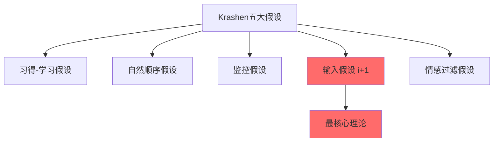
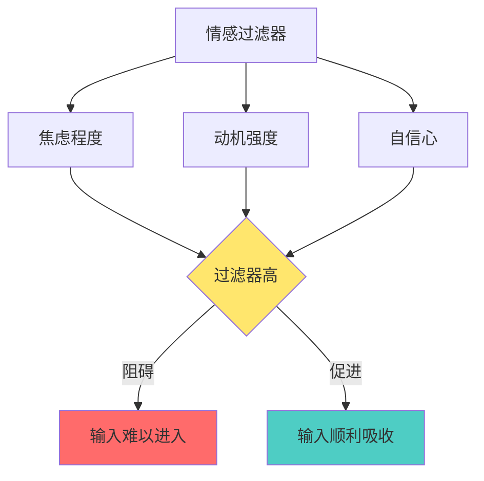
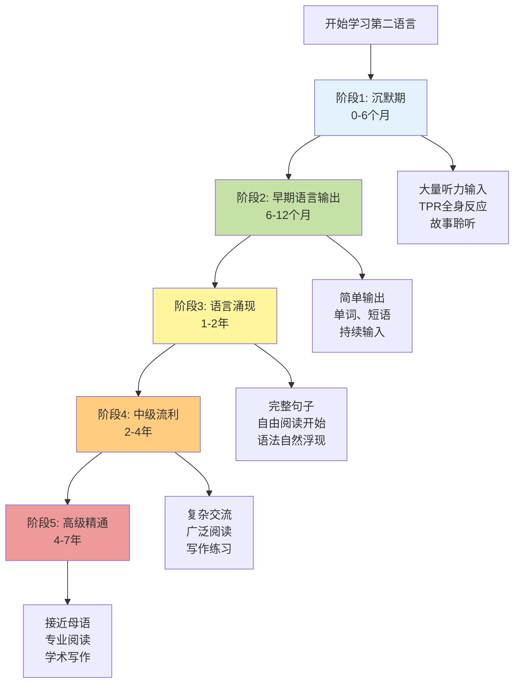

# Stephen D. Krashen 第二语言习得理论：完整实践指南

## 📚 理论概述

Stephen D. Krashen（1941-）是美国南加州大学语言学荣誉教授，第二语言习得领域的权威专家。他的理论自1970年代提出以来，已成为北美语言教育的标准。

### 核心理念

语言习得主要依靠可理解的输入（Comprehensible Input），理解口头和书面语言输入是提升语言能力的唯一机制，而语言输出对学习者能力没有直接影响。

---

## 🎯 五大核心假设



### 1. 习得-学习假设（Acquisition-Learning Hypothesis）

**核心观点：** 习得是潜意识的自然过程，类似儿童学习母语；学习是有意识的过程，比如在学校学习语法规则。

**关键区别：**

| 习得（Acquisition） | 学习（Learning） |
|------------------|----------------|
| 潜意识过程 | 有意识过程 |
| 自然、直觉性的 | 结构化、规则性的 |
| 通过真实交流 | 通过正式教学 |
| 形成"语感" | 记忆规则 |
| 长期有效 | 容易遗忘 |

**实践意义：**
- 习得系统比学习系统更重要
- 语法学习可以帮助"监控"输出，但不能真正提升语言能力
- 应该创造沉浸式环境而非依赖课堂教学

---

### 2. 自然顺序假设（Natural Order Hypothesis）

**核心观点：** 语言习得遵循可预测的顺序，这个顺序对所有学习者基本相同，不依赖于教学难易程度。

**典型习得顺序示例（英语）：**


**实践启示：**
- 不要强迫学生学习他们还未准备好的语法结构
- 尊重自然习得顺序，不要过分关注教学顺序
- 例如：必须先掌握一般过去时，才能学习过去完成时

---

### 3. 监控假设（Monitor Hypothesis）

**核心观点：** 学习到的语法知识只能用于"监控"或"编辑"语言输出，不能用于自然流畅的交流。

**监控器的使用条件：**
1. 有足够的时间思考
2. 关注语言形式而非内容
3. 知道相关的语法规则

**应用场景：**
- ✅ 写作时可以使用监控器
- ✅ 正式考试时可以检查语法
- ❌ 日常对话中难以使用（没有时间）
- ❌ 流利表达时不应该使用（会打断思路）

---

### 4. 输入假设 i+1（Input Hypothesis）⭐

**这是Krashen理论中最重要的概念！**

**核心公式：** 
```
i = 当前语言水平
i+1 = 略高于当前水平的输入
```

**关键原则：**

我们通过理解略高于当前水平的语言输入来进步，Krashen称之为"i+1"，其中"i"代表个人当前语言水平，"+1"代表略高于当前水平的语言。

**可理解输入的特征：**
- 70-90%能够理解（虽然这个百分比不是Krashen原始理论中的，而是实践者总结的）
- 通过上下文、视觉辅助、手势等帮助理解
- 关注意义而非形式
- 有趣、引人入胜的内容

**错误示例：**
- ❌ 完全能理解的内容（i+0）→ 没有进步
- ❌ 远超当前水平的内容（i+3或更高）→ 无法理解，产生挫败感

**正确示例：**
- ✅ 能理解主要意思，有少量生词和新结构
- ✅ 能通过推理和上下文猜测新词含义

---

### 5. 情感过滤假设（Affective Filter Hypothesis）

**核心观点：** 负面情绪如尴尬或恐惧会降低学习者习得语言的能力。

**情感过滤器的影响因素：**



**降低情感过滤器的策略：**
1. 允许沉默期（Silent Period）- 不强迫学生在准备好之前开口
2. 创造低压力环境
3. 提供有趣、相关的内容
4. 鼓励而非批评
5. 允许犯错

---

## 🎓 完整学习路径图



---

## 📖 自由自愿阅读（Free Voluntary Reading, FVR）

### 为什么FVR如此重要？

自由自愿阅读对第一语言和第二语言习得都有效，是语言教育中最强大的工具。

### FVR的惊人效果

**研究证据：**
- 持续默读（SSR）的学生在阅读理解测试中的表现优于传统教学的学生，长期研究显示效果更显著
- 提高词汇量、语法、拼写、写作能力
- 降低写作焦虑
- 促进认知发展
- 学习者认为这是最愉快的学习方式

### FVR实施方案

#### 第一步：建立阅读资源库

**年龄段对应书单：**

**3-6岁（学前）：**
- 绘本系列：Dr. Seuss系列、Eric Carle作品
- 分级读物：牛津阅读树（Oxford Reading Tree）1-3级
- 简单漫画：Big Muzzy视频配套书

**7-10岁（小学低年级）：**
- Magic Tree House系列
- I Can Read系列
- 漫画：Dog Man, Big Nate
- 分级读物：牛津阅读树4-6级

**11-14岁（小学高年级-初中）：**
- Diary of a Wimpy Kid系列
- Percy Jackson系列
- Harry Potter（从简易版开始）
- 青少年杂志

**15-18岁（高中）：**
- Young Adult小说
- The Hunger Games系列
- 流行小说改编（简化版）
- 感兴趣的领域书籍

**成人：**
- 分级读物：Penguin Readers, Cambridge Readers
- 兴趣阅读：根据个人爱好选择
- 窄读（Narrow Reading）：同一作者或主题的多本书

#### 第二步：实施SSR（持续默读）计划

**每日安排：**
```
┌─────────────────────────────────────┐
│  每天固定时间（建议15-30分钟）        │
│                                     │
│  1. 学生自选书籍                      │
│  2. 安静阅读                         │
│  3. 不要求回答问题                    │
│  4. 不要求写读后感                    │
│  5. 老师也一起阅读（榜样作用）         │
└─────────────────────────────────────┘
```

#### 第三步：窄读策略（Narrow Reading）

**什么是窄读？**
- 阅读同一作者的多本书
- 阅读同一主题的多个文本
- 好处：熟悉的语境提高理解度，加快语言习得

**实施示例：**
1. 选择一个系列（如Sweet Valley Kids）
2. 按顺序阅读整个系列
3. 词汇和句型会重复出现，理解度逐渐提升
4. 完成后选择相似难度的另一系列

---

## 🎮 可理解输入实践方法

### 方法1：TPR（全身反应教学法）

**适用人群：** 完全初学者

**实施步骤：**
1. 教师发出简单指令（用目标语言）
2. 教师自己示范动作
3. 学生跟着做动作
4. 不要求学生说话

**示例指令（英语）：**
```
Stand up / Sit down
Touch your nose / Touch your ear
Walk to the door / Come back
Pick up the book / Put it down
```

**进阶：TPR Storytelling**
- 将动作编成故事
- 重复讲述同一故事多次
- 每次增加新细节
- 学生通过动作展示理解

### 方法2：故事聆听（Story Listening）

**Dr. Beniko Mason的方法：**

**第一阶段：纯故事聆听（6-12个月）**
- 教师讲故事，配合图片
- 大量重复核心词汇和句型
- 学生只需要听和理解
- 不要求任何输出

**第二阶段：引导式自选阅读**
- 提供与听过的故事相关的简单书籍
- 学生开始自主阅读
- 逐渐过渡到完全自由阅读

### 方法3：自然教学法（Natural Approach）

自然教学法的课堂时间用于提供可理解输入，焦点在于意义而非形式，学生在自己决定"准备好"之前不需要用第二语言产出。

**课堂活动设计：**

**初级阶段：**
- 图片描述：教师展示图片并用目标语言描述
- TPR活动：身体动作响应指令
- 听故事：配合视觉辅助的故事讲述

**中级阶段：**
- 信息差活动：学生通过交流获取信息
- 问题解决：用目标语言讨论简单问题
- 角色扮演：模拟真实生活场景

**高级阶段：**
- 内容教学：用目标语言教授其他学科
- 讨论和辩论：关于感兴趣的话题
- 项目学习：完成需要语言使用的任务

### 方法4：庇护式教学（Sheltered Instruction）

**适用人群：** 中高级学习者

**核心理念：** 用目标语言教授学科内容，但进行适当调整使其可理解。

**教学技巧：**
1. 放慢语速，清晰发音
2. 使用简单句型
3. 重复关键概念
4. 配合视觉辅助（图表、图片、实物）
5. 检查理解程度
6. 提供背景知识

**实施示例：**
```
主题：光合作用（Photosynthesis）

调整前：
"Photosynthesis is the process by which plants 
utilize sunlight to synthesize nutrients from 
carbon dioxide and water, generating oxygen 
as a byproduct."

调整后（i+1）：
"Plants make food. How? They use sunlight. 
They take in CO2 - that's carbon dioxide from air. 
They take in water from soil. Then, plants make 
sugar - their food. They also make oxygen - 
the air we breathe. This process is called 
photosynthesis."

[配合图示展示整个过程]
```

---

## 💻 现代技术应用

### AI辅助学习方案

**1. 使用ChatGPT/Claude进行个性化输入**

**提示词模板：**
```
我的英语水平是[具体描述]。
请用比我当前水平略高一点的英语（i+1）
给我讲一个关于[主题]的故事。
要求：
- 使用简单的句子结构
- 包含一些我可能不知道但能通过上下文猜测的词汇
- 讲完后不要测试我
```

**2. 利用YouTube学习**

**选择视频标准：**
- 有字幕（最好是目标语言字幕）
- 主题感兴趣
- 能理解大约70-80%的内容
- 语速适中

**推荐频道类型：**
- 儿童节目（初级）
- 简单教程视频（中级）
- TED-Ed（中高级）
- 纪录片（高级）

**3. 阅读App推荐**

| App | 特点 | 适用水平 |
|-----|------|---------|
| Epic! | 儿童电子图书馆 | 初级-中级 |
| LingQ | 自动标注生词 | 中级-高级 |
| Readlang | 在线阅读+翻译 | 中级-高级 |
| Kindle | 内置词典 | 所有水平 |

---

## 📊 学习进度评估

### 如何判断自己的"i"水平？

**非正式评估方法：**

1. **理解度测试**
   - 读一页书或看一段视频
   - 能理解主要意思 = 在你的水平
   - 有几个生词但能猜测 = i+1 ✅
   - 完全理解每个词 = 太简单（i-1）
   - 太多生词，抓不住主旨 = 太难（i+2或更高）

2. **阅读流畅度**
   - 能顺畅阅读，偶尔停顿 = 合适
   - 每句话都要查词典 = 太难
   - 完全不需要思考 = 太简单

3. **情感反应**
   - 感到轻微挑战但不焦虑 = 理想状态 ✅
   - 感到沮丧或压力 = 降低难度
   - 感到无聊 = 提高难度

### 正式评估工具

**蓝思值（Lexile）系统：**
- 评估阅读材料难度和读者水平
- 范围：0L-2000L
- 建议选择比自己水平高100L左右的材料

**CEFR水平对应：**
- A1（入门）：简单日常用语
- A2（初级）：熟悉话题的简单交流
- B1（中级）：工作、学习的基本交流
- B2（中高级）：复杂话题的流利交流
- C1（高级）：灵活有效地运用语言
- C2（精通）：接近母语者水平

---

## 🏃 90天快速启动计划

### 阶段一：第1-30天（建立习惯）

**每日安排：**

**早晨（20分钟）：**
- 10分钟：听简单的目标语言播客或儿童节目
- 10分钟：跟读（可选，低压力）

**下午（30分钟）：**
- 30分钟：自由阅读（选择i+1水平的书籍）
- 规则：享受阅读，不查每个生词

**晚上（15分钟）：**
- 15分钟：看目标语言视频（娱乐内容）

**周末额外活动：**
- 1小时：看一部目标语言电影（带字幕）
- 30分钟：阅读连环画或漫画

**本阶段目标：**
- ✅ 建立每日接触目标语言的习惯
- ✅ 找到3-5本喜欢的书或系列
- ✅ 降低情感过滤器

### 阶段二：第31-60天（增加输入量）

**每日安排：**

**早晨（30分钟）：**
- 20分钟：听更长的音频内容
- 10分钟：简单跟读或重复听到的句子

**下午（45分钟）：**
- 45分钟：自由阅读
- 开始"窄读"：选择同一系列或作者的多本书

**晚上（20分钟）：**
- 20分钟：看视频内容
- 尝试不看字幕（如果太难，用目标语言字幕）

**每周加入：**
- 2-3次TPR活动（如果有学习伙伴）
- 1次写作练习（简单日记，100字以内，不强求语法正确）

**本阶段目标：**
- ✅ 每天接触2-3小时目标语言
- ✅ 完成至少5本书的阅读
- ✅ 能理解简单对话的主要内容

### 阶段三：第61-90天（扩展和巩固）

**每日安排：**

**早晨（30分钟）：**
- 30分钟：听更复杂的内容（新闻、访谈）

**日间（随时）：**
- 利用碎片时间听音频
- 在通勤、运动时听目标语言播客

**下午（60分钟）：**
- 60分钟：阅读（可以开始挑战难度稍高的材料）
- 尝试不同类型：小说、非小说、文章

**晚上（30分钟）：**
- 20分钟：看视频（不带字幕或目标语言字幕）
- 10分钟：写作（提升到200-300字）

**每周加入：**
- 找语言交换伙伴（在线或线下）
- 参加目标语言的兴趣小组

**本阶段目标：**
- ✅ 每天接触3-4小时目标语言
- ✅ 完成至少10本书
- ✅ 能进行简单的日常对话
- ✅ 感受到明显的进步

---

## ⚠️ 常见误区与纠正

### 误区1：必须学完语法才能开始阅读

**纠正：** 
学习语法不是掌握语法的途径，阅读才是关键。语法能力是通过大量输入自然习得的，不是通过学习规则获得的。

**正确做法：** 
- 从第一天开始阅读（选择合适难度）
- 语法会在阅读中自然浮现
- 如果感兴趣，可以简单学习语法作为参考，但不要作为主要学习方式

### 误区2：必须大量练习口语才能提高

**纠正：** 
说话（输出）不是练习，说话能力不是语言学习的原因，而是语言习得的结果。

**正确做法：**
- 先积累大量输入（6-12个月）
- 允许自己有沉默期
- 当感到"准备好"时自然开始说话
- 不要强迫自己在尚未准备好时就大量说话

### 误区3：必须背单词和做练习题

**纠正：** 
自由阅读的效率是直接教授学术词汇的2-6倍。

**正确做法：**
- 通过阅读在上下文中自然学习词汇
- 不要单独背单词表
- 让词汇在有意义的语境中多次出现

### 误区4：必须纠正每个错误

**纠正：** 
过度纠错会提高情感过滤器，阻碍习得。

**正确做法：**
- 在交流中关注意义而非形式
- 只纠正影响理解的严重错误
- 通过提供更多正确输入来间接纠正
- 写作时可以适度自我监控

### 误区5：看不懂就查字典

**纠正：** 
频繁查字典会打断阅读流程，降低理解度。

**正确做法：**
- 尽量通过上下文猜测词义
- 只查影响整体理解的关键词
- 先读完再回头查词
- 选择词汇量合适的材料（90%以上能理解）

---

## 🎯 不同年龄段的具体方案

### 3-6岁儿童方案

**核心策略：** 完全自然习得法

**每日活动（总计30-45分钟）：**

**上午：**
- 15分钟：看英文动画片
  - 推荐：Peppa Pig, Big Muzzy, Super Simple Songs
  - 父母一起看，用简单英语讨论内容

**下午：**
- 20分钟：亲子英文绘本阅读
  - 父母大声朗读，指着图片讲解
  - 不要求孩子背诵或复述
  - 同一本书重复读多次

**晚上：**
- 10分钟：英文儿歌或游戏
  - TPR活动（蹦跳、拍手配合指令）
  - 保持轻松愉快

**关键原则：**
- ❌ 不教字母、不背单词、不学语法
- ✅ 大量输入、低压力、高兴趣
- ✅ 允许1-2年的沉默期
- ✅ 将英语融入日常生活

### 7-12岁儿童方案

**核心策略：** 自然拼读+大量阅读

**每日活动（总计60-90分钟）：**

**早晨（15分钟）：**
- 自然拼读练习（如果已掌握中文拼音）
  - 使用：Phonics Kids, Hooked on Phonics
  - 6-12个月完成系统学习

**放学后（45分钟）：**
- 30分钟：自由阅读分级读物
  - 从牛津阅读树开始
  - 逐步过渡到章节书
- 15分钟：看英文视频
  - Story Fun系列
  - 适龄YouTube频道

**周末（额外2小时）：**
- 1小时：看英文电影
- 1小时：阅读或英文游戏

**进阶路径：**
1. 自然拼读（6-12个月）
2. 分级读物（12-24个月）
3. 桥梁书（6-12个月）
4. 章节书和系列小说

**注意事项：**
- 根据孩子兴趣选择主题
- 不要强制阅读不喜欢的书
- 建立家庭英文图书馆
- 鼓励窄读（同系列、同作者）

### 13-18岁青少年方案

**核心策略：** 兴趣驱动+内容学习

**每日活动（总计90-120分钟）：**

**早晨（30分钟）：**
- 听英文播客或有声书
  - 根据兴趣选择（科技、体育、音乐等）
  - 在通勤时完成

**日间（碎片时间）：**
- 社交媒体英文内容
  - 关注英文Instagram、YouTube频道
  - 阅读英文推文、帖子

**下午/晚上（60分钟）：**
- 40分钟：阅读青少年小说或感兴趣的书
  - Hunger Games, Percy Jackson系列
  - 科幻、奇幻、爱情等类型
- 20分钟：看英文视频
  - Netflix美剧（英文字幕）
  - YouTube深度视频

**周末（额外3-4小时）：**
- 2小时：看英文电影或剧集
- 1-2小时：深度阅读或写作

**进阶方向：**
- 参加在线英文讨论组
- 写英文博客或日记
- 玩英文版游戏
- 准备用英语学习感兴趣的技能（编程、绘画等）

### 成人学习方案

**核心策略：** 高效输入+实用应用

**每日活动（总计2-3小时）：**

**早晨（30分钟）：**
- 听新闻或专业播客
  - BBC Learning English
  - NPR新闻
  - 专业领域播客

**通勤时间（30-60分钟）：**
- 有声书
- 语言学习播客
- TED演讲

**午休（20分钟）：**
- 阅读短文章
  - Medium英文文章
  - 新闻网站
  - 专业博客

**晚上（60分钟）：**
- 40分钟：阅读书籍
  - 分级读物（初级）
  - 畅销小说（中级）
  - 专业书籍（高级）
- 20分钟：看视频或电影

**周末（4-6小时）：**
- 深度阅读
- 写作练习
- 语言交换
- 在线课程

**职场应用：**
- 用英语学习专业技能
- 阅读行业英文资料
- 参加英文专业社群
- 尝试用英语做工作笔记

---

## 📈 长期进阶策略

### 第1年：建立基础

**目标：**
- 完成30-50本分级读物
- 听力能理解简单对话
- 能进行基本日常交流

**重点活动：**
- 大量简单输入
- 建立阅读习惯
- 降低焦虑感

### 第2-3年：流利表达

**目标：**
- 完成100+本书籍
- 能看懂大部分电影（不看字幕）
- 流利进行日常对话

**重点活动：**
- 扩大阅读范围
- 增加视听输入
- 开始尝试写作

### 第4-5年：高级应用

**目标：**
- 完成200+本书籍
- 能阅读专业文献
- 能进行专业交流

**重点活动：**
- 专业领域学习
- 复杂主题讨论
- 学术写作

### 第6-7年：接近母语

**目标：**
- 持续大量阅读
- 专业水平使用
- 文化深度理解

**重点活动：**
- 阅读文学作品
- 专业领域深造
- 跨文化交流

---

## 🎁 补充资源

### 免费在线资源

**阅读材料：**
- Project Gutenberg：免费经典文学
- Children's Storybooks Online：免费儿童绘本
- ReadTheory：在线阅读理解练习

**视听资源：**
- YouTube：无数免费频道
- Khan Academy：免费教育视频
- BBC Learning English：免费英语学习资源

**播客推荐：**
- 初级：English Learning for Curious Minds
- 中级：This American Life
- 高级：专业领域播客

### 付费优质资源

**阅读App：**
- Epic!（$7.99/月）：儿童电子图书馆
- Scribd（$9.99/月）：无限阅读
- Kindle Unlimited（$9.99/月）：大量书籍

**学习平台：**
- LingQ（$12.99/月）：阅读+词汇管理
- Beelinguapp（$6.99/月）：双语对照阅读
- Readlang（$5/月）：在线阅读辅助

### 建立个人学习系统

**工具组合建议：**

1. **输入管理：**
   - Notion：记录阅读和观看清单
   - Pocket：保存文章稍后阅读
   - YouTube播放列表：分类视频资源

2. **词汇管理：**
   - Anki：间隔重复（可选，不强制）
   - Quizlet：制作词汇卡片
   - 实体笔记本：记录有趣的表达

3. **进度跟踪：**
   - Goodreads：记录阅读书籍
   - 日历App：打卡每日学习
   - Excel表格：详细记录学习时间

---

## 💡 成功的关键因素

### 必须具备的心态

1. **耐心：** 语言习得需要时间（4-7年达到高级水平）
2. **坚持：** 每天坚持比偶尔长时间学习更有效
3. **兴趣：** 选择自己喜欢的内容，学习才能持久
4. **放松：** 降低焦虑，享受过程
5. **信任：** 相信自然习得的力量

### 实用建议

1. **建立习惯链：** 将学习与现有习惯结合
   - 例如：早餐时听英文播客
   - 睡前阅读英文30分钟

2. **利用碎片时间：** 
   - 通勤听音频
   - 排队时阅读文章
   - 运动时看视频

3. **找到学习伙伴：**
   - 线上语言交换
   - 本地学习小组
   - 家人一起学习

4. **创造沉浸环境：**
   - 更改手机系统语言
   - 关注英文社交媒体
   - 加入英文在线社群

5. **定期回顾：**
   - 每月回顾进步
   - 调整学习材料难度
   - 庆祝小成就

---

## 🌟 总结：最简单的开始方式

**如果只能做一件事，那就是：**

### 开始阅读！

1. 选一本你感兴趣且能理解70-80%的书
2. 每天读15-30分钟
3. 不要查每个生词
4. 享受故事
5. 坚持90天

**这就是Krashen理论的核心！**

自由自愿阅读对语言习得和读写能力发展极其有益，远比直接教学更有效。

---

## 📞 延伸学习

### 推荐阅读Krashen的著作

1. **The Power of Reading**（阅读的力量）
2. **Principles and Practice in Second Language Acquisition**（第二语言习得的原理与实践）
3. **The Input Hypothesis**（输入假设）

所有作品可在Krashen官网免费下载：
**https://www.sdkrashen.com/**

### 相关理论

- Jim Trelease：大声朗读的重要性
- Beniko Mason：故事聆听法
- Blaine Ray：TPR Storytelling

---

**记住：语言习得是自然的过程，就像学习母语一样。提供大量可理解的、有趣的输入，保持低压力环境，语言能力会自然涌现！**

🎉 **开始你的语言习得之旅吧！** 🎉