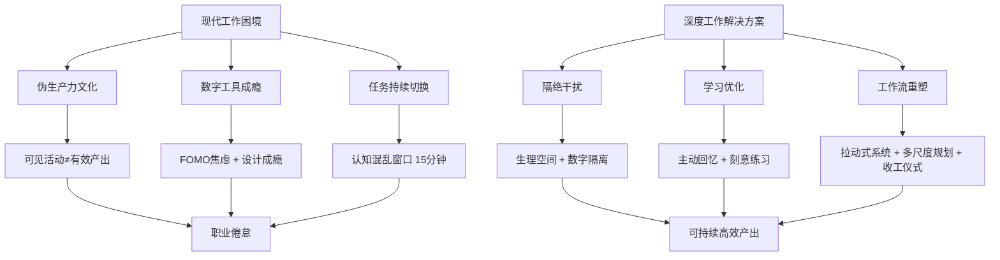
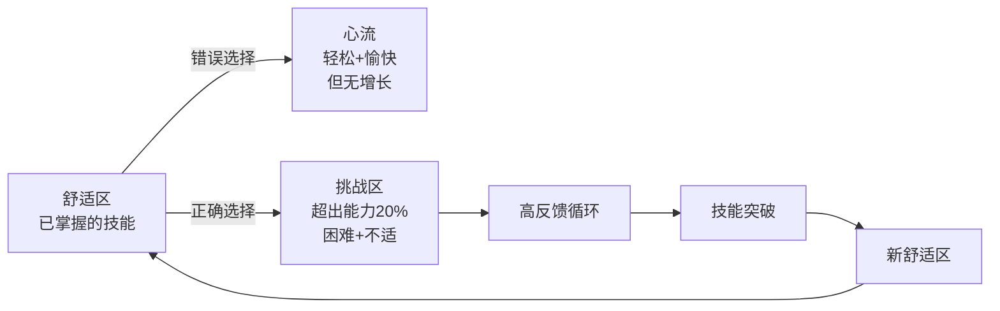
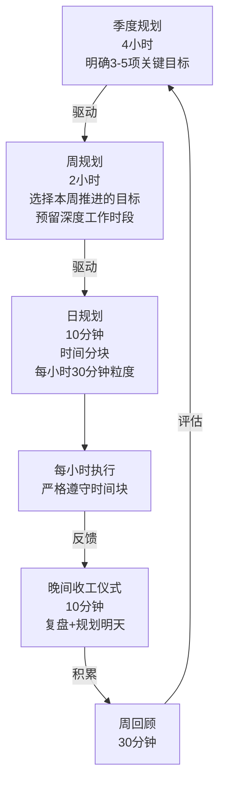
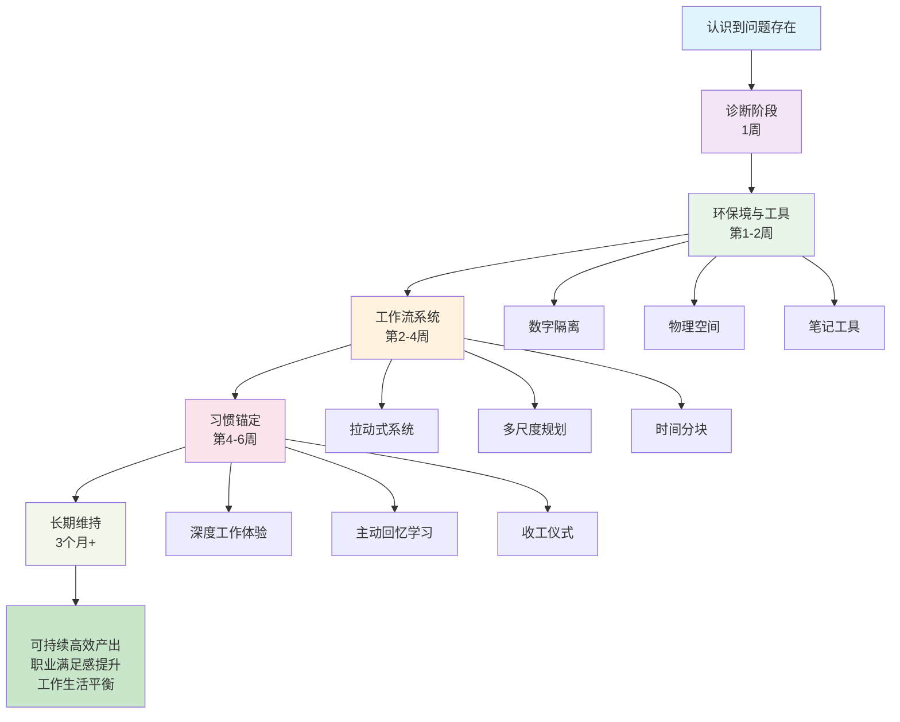

# 深度工作实践指南：从诊断到行动的完整体系

## 一、核心问题诊断

### 你是否正在经历这些症状？

- **时间碎片化**：一天中被中断超过10次，查看邮件/Slack间隔< 5分钟
- **伪生产力陷阱**：看起来很忙，但没有产出实质成果
- **认知混乱**：无法进入深度专注状态，思维跳跃无序
- **职业倦怠**：工作充满虚无感，生活无法放松
- **注意力困难**：难以完成需要2小时+的复杂任务
- **工作侵占生活**：下班后仍持续思考工作，无法真正休息

**诊断指标**：以上症状出现≥3项，说明需要系统性改变

---

## 视觉参考：核心概念图解

<svg viewBox="0 0 900 250" xmlns="http://www.w3.org/2000/svg">
<defs><style>.title{font-size:14px;font-weight:bold}.label{font-size:12px}.axis{font-size:11px}</style></defs>
<text x="450" y="25" text-anchor="middle" class="title">任务切换的隐性成本</text>
<rect x="50" y="50" width="350" height="180" fill="none" stroke="#333" stroke-width="2"/>
<rect x="500" y="50" width="350" height="180" fill="none" stroke="#333" stroke-width="2"/>
<text x="225" y="70" text-anchor="middle" class="label" font-weight="bold">表面时间消耗</text>
<text x="675" y="70" text-anchor="middle" class="label" font-weight="bold">实际认知成本</text>
<rect x="80" y="90" width="120" height="40" fill="#ffcdd2" stroke="#c62828" stroke-width="2"/>
<text x="140" y="115" text-anchor="middle" class="label">任务切换</text>
<text x="140" y="130" text-anchor="middle" class="label">5分钟</text>
<text x="225" y="100" class="label">↓</text>
<rect x="80" y="150" width="290" height="60" fill="#fff9c4" stroke="#f57f17" stroke-width="2" stroke-dasharray="5,5"/>
<text x="225" y="170" text-anchor="middle" class="label">+认知混乱窗口</text>
<text x="225" y="185" text-anchor="middle" class="label">15分钟</text>
<text x="225" y="200" text-anchor="middle" class="label">=总成本20分钟</text>
<rect x="530" y="90" width="80" height="40" fill="#ffcdd2" stroke="#c62828" stroke-width="2"/>
<text x="570" y="115" text-anchor="middle" class="label">5分钟</text>
<rect x="620" y="90" width="80" height="40" fill="#fff9c4" stroke="#f57f17" stroke-width="2" stroke-dasharray="5,5"/>
<text x="660" y="115" text-anchor="middle" class="label">15分钟</text>
<rect x="530" y="150" width="290" height="60" fill="#c8e6c9" stroke="#2e7d32" stroke-width="2"/>
<text x="675" y="170" text-anchor="middle" class="label" font-weight="bold">1日10次切换</text>
<text x="675" y="185" text-anchor="middle" class="label">= 200分钟浪费</text>
<text x="675" y="200" text-anchor="middle" class="label">= 生产力降低50%</text>
</svg>

---

## 二、理论框架：认知工作的新范式



### 关键概念解释

#### 1. 神经语义连贯性 vs 心流
- **心流**：轻松、沉浸、时间感消失（表演状态）
- **神经语义连贫性**：困难、专注、相关神经网络高度协同（进步状态）
- **追求方向**：放弃心流幻想，拥抱必要的不适感

#### 2. 认知成本的隐性计算
- 任务切换不仅耗时5分钟，附加认知混乱窗口15分钟
- 真实成本 = 切换时间 + 前置准备(~7.5分钟) + 后续调整(~7.5分钟)
- 每天10次切换 = 浪费200分钟认知效能

#### 3. 数字工具与成瘾机制
```
设计高度吸引力 → 建立刺激-反馈循环 
→ 中度行为成瘾 → 大脑重塑 
→ 注意力困难（可逆的）
```

---

## 三、三层实施框架

### 第一层：环境与工具（基础）

#### A. 数字隔离策略

**目标**：将手机从"注意力黑洞"转变为"工具"

| 行动项 | 具体方法 | 预期效果 |
|-------|--------|--------|
| 删除社交媒体 | 保留通讯、地图、音乐功能 | 互联网吸引力↓70% |
| 邮件检查时间 | 固定3次/天（9点、12点、16点） | 查看间隔从5分钟→180分钟 |
| 通知关闭 | 仅保留电话和特定紧急联系人 | 被动中断↓90% |
| 短信延迟回复 | 允许延迟数小时，除非标记"紧急" | 建立合理预期 |

**第1周行动清单**：
- [ ] 卸载或禁用所有社交媒体应用（Instagram、Twitter、TikTok等）
- [ ] 取消所有非必要的应用通知（除电话、短信、日历）
- [ ] 建立邮件检查时间表，在日历上标记
- [ ] 告知同事新的邮件响应时间（2-4小时以内回复）

#### B. 物理空间改造

**目标**：创建专注堡垒，激发创造力

**标准配置**：
```
书房/专注区
├── 工作台（定向远离门窗，减少视觉干扰）
├── 白板（17-20英寸，用于思维外化）
├── 高质量笔记本（$50+档案级纸张）
├── 参考书籍（精选3-5本，避免视觉混乱）
├── 物理噪音隔离（耳塞或隔音面板）
└── 壁炉/焦点物品（激发创造力的视觉锚点）
```

**第2周行动清单**：
- [ ] 识别家中最安静的角落，划定专注区
- [ ] 采购白板（推荐磁性玻璃白板，可擦性强）
- [ ] 购置一本高质量笔记本（如Rhodia、Moleskine或Remarkable）
- [ ] 移除专注区内的所有电子显示屏（手机、平板必须在视野外）

---

### 第二层：认知优化（核心）

#### A. 主动回忆学习法

**原理**：从记忆中提取信息比输入信息需要更高强度的脑力投入，但留下更深的神经痕迹

**三步学习流程**：

1. **初始接触**（20%时间）
   - 快速阅读/听讲核心概念
   - 不强调笔记美观度，只记关键词

2. **主动回忆**（60%时间）
   - 关闭所有资料
   - 尝试从记忆重现内容（口头、书写、教学）
   - 遇到卡顿时才翻回资料
   - 对每个知识点进行3-5次周期的回忆

3. **间隔重复**（20%时间）
   - 第1天复习
   - 第3天复习
   - 第7天复习
   - 第30天复习

**实例**：
```
学习"深度工作的三大策略"

初始接触（阅读本文档）→ 5分钟

主动回忆第1轮：
不看文档，说出三大策略名称和核心内容 → 10分钟（可能卡壳）

查阅资料补充 → 3分钟

主动回忆第2轮：
写出实施步骤，添加自己的例子 → 15分钟

间隔3天后，再次完整回忆 → 10分钟
```

**应用工具**：
- Anki（间隔重复软件）
- 白纸法则（无参考资料独立完成）
- 费曼学习法（用简洁语言教别人）

#### B. 刻意练习框架

**核心区别**：舒适区练习 ≠ 成长



**实践方法**：

1. **定义明确的顶级表现标准**
   - 示例：写作 = 清晰表达复杂观点，无冗余句子
   - 示例：演讲 = 维持眼神接触，自然停顿，无"嗯"

2. **在超出能力区设定目标**
   - 当前能做到：写1000字清晰文章需2小时
   - 挑战目标：相同质量，完成时间缩短至1.5小时（提升25%）

3. **获取即时反馈**
   - 录音回放自己的声音
   - 要求同行进行结构性批评
   - 追踪可量化指标

4. **不断迭代**
   - 每次练习20-90分钟（精力最优窗口）
   - 之后进行冥想/散步恢复

**刻意练习自查清单**：
- [ ] 目标是否明确且可测量？
- [ ] 是否在舒适区外20%的位置？
- [ ] 是否有具体的反馈机制？
- [ ] 每周进行≥3次集中练习？

---

### 第三层：工作流重塑（系统）

#### A. 拉动式系统：终结工作过载

**核心思想**：限制同时进行的任务数（2-3项），阻断"推送压力"

**实施步骤**：

**第1步**：建立三层任务系统
```
┌─────────────────────────────────┐
│   进行中清单（2-3项）            │
│   □ 项目A - 预期完成：周三      │
│   □ 项目B - 预期完成：周五      │
│   □ 项目C - 预期完成：下周一    │
└─────────────────────────────────┘
            ↓ 完成一项
┌─────────────────────────────────┐
│   待办队列（按优先级排序）       │
│   1. 项目D
│   2. 项目E
│   3. 项目F
│   ...
└─────────────────────────────────┘
            ↓ 拉入
┌─────────────────────────────────┐
│   关联信息库（不主动处理）       │
│   - 项目D的所有想法和资料       │
│   - 相关的邮件和讨论            │
│   （在项目拉入时集中处理）      │
└─────────────────────────────────┘
```

**第2步**：建立协议规则

| 状态 | 行为 | 理由 |
|-----|------|------|
| 进行中 | 主动开展工作、定期更新 | 这是承诺的事项 |
| 待办队列 | 记录信息，不回应、不开会 | 减少行政开销 |
| 拉入时点 | 快速集中处理所有相关沟通 | 建立清晰上下文 |

**第3步**：工具选择
- **简单方案**：Excel表格或Google Sheets
- **可视方案**：Trello（看板式管理）
- **团队方案**：Asana或Monday.com（共享清晰度）

**第3周行动清单**：
- [ ] 列出当前所有正在进行的项目（数目通常7-15个）
- [ ] 将其中最重要的2-3个放入"进行中"
- [ ] 其余项目按优先级排入待办队列
- [ ] 编写团队公告，解释新的响应时间协议
- [ ] 在项目管理工具中建立可视化系统

---

#### B. 多尺度规划：从年度到分钟

**理念**：只有将大目标分解到具体时间块，才能确保它们不被日常琐事侵蚀



**季度规划模板**（4小时）

```
2025年Q1关键目标

□ 目标1：完成核心项目的架构设计
  - 原因：决定全年方向
  - 成功指标：完成50页的设计文档
  - 风险：时间压力，需预留40小时
  
□ 目标2：深化某个专业技能
  - 原因：提升个人竞争力
  - 成功指标：完成10小时的结构化学习，能独立讲解
  - 风险：需选择好学习资源
  
□ 目标3：改善工作生活平衡
  - 原因：防止倦怠
  - 成功指标：每周运动3次，晚上7点后无工作
  - 风险：需要家庭支持

非目标（明确不做）：
✗ 参加3个以上的会议小组
✗ 启动新项目
✗ 回答所有Slack消息
```

**周规划模板**（2小时）

```
第45周计划（2024.11.4-11.8）

大目标进展：
□ 季度目标1：本周预期完成第2-3章草稿（共10章）
□ 季度目标2：完成2小时学习（间隔重复复习）
□ 季度目标3：周三和周五运动

本周固定会议：
- 周二10:00-11:00：团队同步
- 周四14:00-15:00：1:1反馈
- 周五16:00-17:00：周会

深度工作时段预留：
- 周一9:00-12:00（3小时）：目标1
- 周三9:00-11:00（2小时）：目标1
- 周四9:00-10:00（1小时）：目标2

风险识别：
⚠ 周四可能加班（客户演讲）→ 提前挪动工作

通勤/非深度工作：
- 邮件检查：9:15, 12:30, 16:00
- 社交互动：12:00-13:00 午饭
- 行政事务：15:00-15:30
```

**日时间分块示例**（每天创建）

```
周一 (2024.11.4)

9:00-10:30   │ [深度工作] 撰写项目章节第2部分
10:30-11:00  │ [邮件/沟通] 检查邮件，快速回复
11:00-12:00  │ [深度工作] 继续章节撰写
12:00-13:00  │ [休息/社交] 午餐
13:00-14:00  │ [中等认知] 报表审核
14:00-14:30  │ [邮件/沟通] Slack检查
14:30-15:30  │ [中等认知] 代码审查/文档改进
15:30-16:00  │ [邮件/沟通] 邮件检查 第3次
16:00-16:30  │ [管理] 日程调整，明天规划
16:30-17:00  │ [收工仪式] 复盘+宣告完成
```

**第4-5周行动清单**：
- [ ] 设定本季度3-5项关键目标
- [ ] 将季度目标分解为月度和周度里程碑
- [ ] 建立每周规划例行会议（建议周日下午2小时）
- [ ] 创建日时间分块模板（Google日历或纸质计划本）
- [ ] 实际执行一周，记录效果

---

#### C. 收工仪式：大脑的关机按钮

**科学基础**：Zeigarnik效应 - 未完成的任务持续占据认知资源，导致无法真正休息

**收工仪式全流程**（共10分钟）

**第1阶段：检查-关闭未完成循环（5分钟）**

清单：
- [ ] 审视收件箱 - 是否有紧急事项遗漏？
- [ ] 检查日历 - 明天有无突发安排？
- [ ] 回顾任务清单 - 进行中的项目是否都在追踪中？
- [ ] 验证承诺 - 是否答应了某个截止日期而忘记了？

做法：
```
心理对话：
"我已检查了：
✓ 收件箱：12条邮件，无红旗级紧急事项
✓ 日历：明天9:00有团队会议，已准备
✓ 任务：项目A、B、C都在计划内推进
✓ 承诺：下周一交付的报表已分配资源

所有已知的担忧点都已列入计划。
我可以安心离开。"
```

**第2阶段：规划-勾勒明天雏形（3分钟）**

```
明天大致计划（2024.11.5）：
1. 继续项目A（早晨3小时深度工作）
2. 团队会议10:30（准备Q&A）
3. 邮件处理×2
4. 如果有时间：学习任务20分钟

最重要的是：项目A进展

潜在风险：需确认客户反馈是否到达
```

**第3阶段：仪式-宣告完成（2分钟）**

方式1（言语仪式）：
```
说出一句特定的话语（需要重复一个月才能形成习惯）：
"工作日程已关闭。所有事项已在掌控中。
我现在可以完全切换到生活模式。"
```

方式2（物理仪式）：
- 勾选日计划本上的"关闭"复选框
- 关上笔记本，放在特定位置
- 转身离开办公区

方式3（身体仪式）：
- 做5次深呼吸，从腹部吸气
- 闭眼10秒，清空脑海
- 起身，改变位置（进入生活空间）

**预期效果曲线**：
```
第1周：效果不明显，感觉有点奇怪
第2周：偶尔有效，下班时焦虑减少30%
第3周：多数工作日有效，形成习惯
第4周+：下班后工作思维显著减少，睡眠质量提升
```

**第6周行动清单**：
- [ ] 书写完整的收工仪式流程（个性化版本）
- [ ] 选择你的仪式触发物（言语、物理或身体）
- [ ] 在日历上标记，坚持4周
- [ ] 第2周和第4周评估效果

<svg viewBox="0 0 900 350" xmlns="http://www.w3.org/2000/svg">
<defs><style>.title{font-size:14px;font-weight:bold}.label{font-size:12px}.axis{font-size:10px}</style></defs>
<text x="450" y="25" text-anchor="middle" class="title">一周时间分块示例规划</text>
<g id="grid">
<line x1="60" y1="60" x2="60" y2="320" stroke="#999" stroke-width="1"/>
<line x1="900" y1="60" x2="900" y2="320" stroke="#999" stroke-width="1"/>
<line x1="60" y1="60" x2="900" y2="60" stroke="#999" stroke-width="1"/>
<line x1="60" y1="320" x2="900" y2="320" stroke="#999" stroke-width="1"/>
<line x1="60" y1="100" x2="900" y2="100" stroke="#ddd" stroke-width="0.5" stroke-dasharray="3,3"/>
<line x1="60" y1="140" x2="900" y2="140" stroke="#ddd" stroke-width="0.5" stroke-dasharray="3,3"/>
<line x1="60" y1="180" x2="900" y2="180" stroke="#ddd" stroke-width="0.5" stroke-dasharray="3,3"/>
<line x1="60" y1="220" x2="900" y2="220" stroke="#ddd" stroke-width="0.5" stroke-dasharray="3,3"/>
<line x1="60" y1="260" x2="900" y2="260" stroke="#ddd" stroke-width="0.5" stroke-dasharray="3,3"/>
<line x1="60" y1="300" x2="900" y2="300" stroke="#ddd" stroke-width="0.5" stroke-dasharray="3,3"/>
</g>
<text x="45" y="90" text-anchor="end" class="axis">周一</text>
<text x="45" y="130" text-anchor="end" class="axis">周二</text>
<text x="45" y="170" text-anchor="end" class="axis">周三</text>
<text x="45" y="210" text-anchor="end" class="axis">周四</text>
<text x="45" y="250" text-anchor="end" class="axis">周五</text>
<text x="45" y="310" text-anchor="end" class="axis">工作时数</text>
<rect x="80" y="70" width="120" height="20" fill="#4caf50" stroke="#2e7d32" stroke-width="1"/>
<text x="140" y="85" text-anchor="middle" class="label" fill="white" font-weight="bold">深度工作 3h</text>
<rect x="210" y="70" width="60" height="20" fill="#ff9800" stroke="#e65100" stroke-width="1"/>
<text x="240" y="85" text-anchor="middle" class="label" fill="white" font-size="11">邮件 1h</text>
<rect x="80" y="110" width="150" height="20" fill="#4caf50" stroke="#2e7d32" stroke-width="1"/>
<text x="155" y="125" text-anchor="middle" class="label" fill="white" font-weight="bold">深度工作 3.5h</text>
<rect x="210" y="110" width="60" height="20" fill="#2196f3" stroke="#1565c0" stroke-width="1"/>
<text x="240" y="125" text-anchor="middle" class="label" fill="white" font-size="11">会议 1h</text>
<rect x="80" y="150" width="120" height="20" fill="#4caf50" stroke="#2e7d32" stroke-width="1"/>
<text x="140" y="165" text-anchor="middle" class="label" fill="white" font-weight="bold">深度工作 3h</text>
<rect x="210" y="150" width="60" height="20" fill="#ff9800" stroke="#e65100" stroke-width="1"/>
<text x="240" y="165" text-anchor="middle" class="label" fill="white" font-size="11">邮件 1h</text>
<rect x="80" y="190" width="90" height="20" fill="#4caf50" stroke="#2e7d32" stroke-width="1"/>
<text x="125" y="205" text-anchor="middle" class="label" fill="white" font-size="11">深度2.5h</text>
<rect x="180" y="190" width="90" height="20" fill="#f44336" stroke="#c62828" stroke-width="1"/>
<text x="225" y="205" text-anchor="middle" class="label" fill="white" font-size="11">突发 1.5h</text>
<rect x="80" y="230" width="150" height="20" fill="#4caf50" stroke="#2e7d32" stroke-width="1"/>
<text x="155" y="245" text-anchor="middle" class="label" fill="white" font-weight="bold">深度工作 4h</text>
<rect x="80" y="270" width="120" height="20" fill="#4caf50" stroke="#2e7d32" stroke-width="1"/>
<text x="140" y="285" text-anchor="middle" class="label" fill="white" font-weight="bold">深度工作 3h</text>
<rect x="210" y="270" width="60" height="20" fill="#ff9800" stroke="#e65100" stroke-width="1"/>
<text x="240" y="285" text-anchor="middle" class="label" fill="white" font-size="11">邮件 1h</text>
<rect x="350" y="70" width="100" height="250" fill="none" stroke="#333" stroke-width="2"/>
<text x="400" y="90" text-anchor="middle" class="label" font-weight="bold">统计</text>
<text x="360" y="120" class="label">深度工作</text>
<text x="430" y="120" text-anchor="middle" class="label" font-weight="bold">16.5h</text>
<text x="360" y="145" class="label">邮件处理</text>
<text x="430" y="145" text-anchor="middle" class="label">3h</text>
<text x="360" y="170" class="label">会议</text>
<text x="430" y="170" text-anchor="middle" class="label">1h</text>
<text x="360" y="195" class="label">休息/其他</text>
<text x="430" y="195" text-anchor="middle" class="label">3.5h</text>
<text x="360" y="225" class="label" font-weight="bold">深度占比</text>
<text x="430" y="225" text-anchor="middle" class="label" font-weight="bold">55%</text>
<text x="360" y="255" class="label" font-size="11" fill="#2e7d32" font-weight="bold">✓ 目标水平</text>
<rect x="550" y="70" width="320" height="250" fill="#f5f5f5" stroke="#999" stroke-width="2" stroke-dasharray="5,5"/>
<text x="710" y="95" text-anchor="middle" class="label" font-weight="bold">深度工作成效 vs 传统方式</text>
<text x="560" y="125" class="label">传统工作模式</text>
<text x="700" y="125" text-anchor="middle" class="label" font-weight="bold">时间分块模式</text>
<line x1="560" y1="130" x2="860" y2="130" stroke="#ddd" stroke-width="1"/>
<text x="560" y="150" class="label">• 随机打扰</text>
<text x="700" y="150" text-anchor="middle" class="label" font-weight="bold">• 专注保护</text>
<text x="560" y="170" class="label">• 生产力 40%</text>
<text x="700" y="170" text-anchor="middle" class="label" font-weight="bold">• 生产力 70%</text>
<text x="560" y="190" class="label">• 焦虑感高</text>
<text x="700" y="190" text-anchor="middle" class="label" font-weight="bold">• 焦虑感低</text>
<text x="560" y="210" class="label">• 低级错误多</text>
<text x="700" y="210" text-anchor="middle" class="label" font-weight="bold">• 质量上升</text>
<text x="710" y="245" text-anchor="middle" class="label" font-size="11" fill="#4caf50" font-weight="bold">↑ 同等工时产出增加40-60%</text>
</svg>

---

## 四、分场景实施指南

### 场景1：远程/混合办公

**问题**：在家工作反而更忙，会议数量剧增

**解决方案**：

1. **同步日程策略**
   - 制定团队范围内的"在家办公日"和"办公室日"
   - 例：周一、周三、周五在办公室；周二、周四在家
   - 效果：降低协作成本，提升深度工作时段

2. **双模式规则**
   - 办公室日：允许会议、实时沟通、协作讨论
   - 在家日：禁止会议、禁止邮件快速回应、深度工作时段
   - 紧急情况只能通过电话（强制同步，避免异步积压）

3. **工具优化**
   ```
   禁止的做法：
   - Async-first（所有事务异步进行）→ 导致邮件链无尽
   - 随意 Zoom 会议 → 摧毁深度时段
   
   推荐做法：
   - 异步留言 + 同步讨论混合
   - 在家办公日预设"无会议"规则
   - 使用 Slack 线程而非独立消息
   ```

### 场景2：高压力行业（金融、咨询、医疗）

**问题**：需求突发，拉动式系统难以维持

**解决方案**：

1. **弹性拉动式**
   - 保持"进行中"清单，但预留1个"应急槽位"
   - 真正的突发（≥P0级别）才能进入应急槽位
   - 其他新任务仍然排队

2. **高频迭代**
   - 日规划从1次改为2次（早晨9:00 + 下午14:00）
   - 周规划改为双周一次（容纳更多变量）
   - 收工仪式简化为5分钟版本

3. **认知备份**
   - 建立"战情室"：所有进行中项目的实时共享文档
   - 团队任何成员都能接手进行中的工作
   - 降低单点压力

### 场景3：创意工作（写作、设计、研发）

**问题**：需要大段不分断的深度专注（4-6小时）

**解决方案**：

1. **深度时段保护**
   ```
   标准做法：日分块 = 工作日的所有部分
   创意优化：日分块 = 1个4-6小时深度块 + 其他辅助工作
   
   示例：
   9:00-13:00   │ [深度工作] 创意输出 - 无任何打扰
   13:00-14:00  │ [休息] 午餐+散步（重要！帮助巩固创意）
   14:00-15:30  │ [邮件/会议] 沟通工作
   15:30-16:30  │ [中等认知] 编辑修订
   16:30-17:00  │ [收工仪式]
   ```

2. **散步-思考循环**
   - 创意卡壳时：立即站起来，30分钟散步
   - 散步时强制思考"当前核心问题"
   - 返回时灵感通常已形成
   - 原理：运动激活不同神经网络，打破思维僵持

3. **工具链优化**
   - 写作：直接在Scrivener/Word中工作（而非笔记应用）
   - 代码：直接在IDE中实验（而非伪代码）
   - 设计：直接在Figma中快速迭代
   - 原则：最小化中间环节，保持流量

### 场景4：领导力角色（经理、总监）

**问题**：不得不接收大量外来输入，无法拒绝会议

**解决方案**：

1. **聚焦式可用性**
   ```
   不推荐：每个人都可以随时预约你的时间
   推荐：
   - 周一、周三：团队office hours（固定时间，所有问题集中）
   - 周二、周四：1:1反馈（高优先级的直报）
   - 周五：战略思考（日程保护）
   
   效果：将随机打扰转变为结构化输入
   ```

2. **异步决策**
   - 建立规则：小于50k美元的决定，用邮件/文档异步进行
   - 要求决策申请人在文档中写明"背景+选项+建议"
   - 避免同步会议中的"头脑风暴"（效率最低）

3. **代理与授权**
   - 识别团队中的"决策代理"
   - 明确授权范围，减少向上升级
   - 建立快速决策反馈机制

---

## 五、30天启动计划

### 第1周：诊断与环境改造

| 日期 | 任务 | 时间 | 预期产出 |
|-----|------|------|--------|
| 周一 | 数字隔离 | 1小时 | 卸载社交媒体，关闭通知 |
| 周二 | 工作空间审计 | 1.5小时 | 清理专注区，采购白板+笔记本 |
| 周三 | 时间日志 | 全天 | 记录实际时间花在哪里 |
| 周四 | 问题诊断 | 1小时 | 识别自己的核心困境（3项） |
| 周五 | 团队沟通 | 1小时 | 发送邮件解释新的邮件响应时间 |
| 周六-日 | 休息+观察 | - | 感受数字隔离的初期反应 |

**输出物**：环境改造完成，有1份"我的核心困境"文档

---

### 第2-3周：工作流建立

| 周次 | 重点 | 行动 | 预期产出 |
|-----|------|------|--------|
| 第2周 | 拉动式系统 | 1. 列出所有正在做的事（清单化）2. 筛选top 3进"进行中"3. 其余放入待办队列 | 可视化任务系统（Trello/Excel） |
| 第3周 | 多尺度规划 | 1. 季度规划会议（2小时）2. 首周周规划3. 每日时间分块 | 日历中显示3层规划 |

**注意**：第2-3周会感到"变慢了"（因为任务转移需要时间），这是正常的。坚持。

---

### 第4-6周：习惯锚定

| 周次 | 重点 | 行动 | 预期产出 |
|-----|------|------|--------|
| 第4周 | 深度工作体验 | 执行第一个完整的周计划 + 日时间分块 | 至少2天能完成90分钟不分断工作 |
| 第5周 | 主动回忆学习 | 选1个知识领域，应用主动回忆学习法 | 完成1个完整学习周期（包括第1次重复） |
| 第6周 | 收工仪式 | 每天执行10分钟收工仪式 | 观察到下班后焦虑感↓30% |

**里程碑评估**（第6周末）：
```
检查项                     │ 预期状态
心理感受                   │ 工作开始有掌控感
产出质量                   │ 完成的工作更深入、更有价值
专注能力                   │ 能进行90分钟不分断工作
生活质量                   │ 下班后能真正放松
数字干扰                   │ 邮件检查从10+次→3次/天
```

如果大多数指标未达成，原因通常是：
1. 执行不彻底（没有真的隔离手机）→ 重做第1周
2. 规划不清晰（没有明确的日时间块）→ 优化第2-3周
3. 坚持不足（只执行了4-5天）→ 调整预期，坚持8周

---

## 六、常见问题与应对

### Q1：老板要求随时回复邮件怎么办？

**A**：分离"预期响应时间"与"实际响应时间"

```
做法：
1. 提前沟通："我的邮件响应时间是2-4小时。
             紧急事项请打电话或Slack @我。"

2. 设置自动回复：
   "感谢您的邮件。我通常在2小时内回复。
   如果紧急，请致电。"

3. 保留应急通道：
   - 电话始终开机
   - Slack有特殊关键词时会闪烁提醒
   
效果：老板仍可在真正紧急时联系你，
     但日常邮件不会打扰深度工作
```

### Q2：我的工作本身就充满中断（客服、医疗等），怎么办？

**A**：使用"微型深度块"而非整段块

```
标准深度块：90-120分钟不间断

微型深度块：
- 每个任务20-30分钟最大强度
- 完成后可以被打扰（因为是自然停歇点）
- 一天累积4-6个微型块
- 总计80-180分钟有效深度工作

原理：短而频繁的专注比长而稀疏的专注
     更容易维持（与人类注意力周期吻合）
```

### Q3：我容易忘记坚持这些系统，怎么办？

**A**：建立"系统的系统"

```
第1层：日提醒
- 日历中的"时间分块"就是提醒
- 下班前10分钟的"收工仪式提醒"

第2层：周审视
- 周日下午2小时的周规划会议
- 此时复盘上一周执行情况
- 识别偏离的原因

第3层：月检查
- 月度1次30分钟的"系统体检"
- 检查项：
  ✓ 拉动式系统中是否有任务堆积？
  ✓ 深度工作时段是否被侵蚀？
  ✓ 收工仪式是否持续有效？
  ✓ 应该调整什么？

第4层：外部问责
- 找一个同伴每两周同步10分钟
- 共同评估执行情况
```

### Q4：我的工作不需要"深度"（例如纯粹的管理工作）怎么办？

**A**：转变对"深度工作"的理解

```
深度工作≠一定是创意输出

管理工作的深度版本：
- 深度思考：季度目标应该怎么设定
- 深度倾听：员工反馈深层原因是什么
- 深度决策：这个战略选择的长期影响
- 深度关系：建立高信任的1:1反馈

这些都需要不分散的、高质量的专注。
使用同样的系统，焦点改为"决策质量"而非"产出量"。
```

---

## 七、科学支持与延伸阅读

### 核心研究

1. **认知负载理论** (Cognitive Load Theory)
   - 研究者：John Sweller
   - 核心：工作记忆容量有限(7±2项)，任务切换超载认知资源
   - 应用：时间分块法直接基于此理论

2. **神经可塑性与学习**
   - 研究者：Stephen Pinker, Daniel Coyle
   - 核心：在不适区的反复练习导致神经重塑
   - 应用：刻意练习框架的神经学基础

3. **数字成瘾与多巴胺**
   - 研究者：Jonathan Haidt, Adam Alter
   - 核心：社交媒体激活奖赏回路，形成可逆的成瘾
   - 应用：理解为什么"戒掉"社交媒体很困难，但值得

4. **时间管理效能**
   - Rescue Time数据（2023）：知识工作者平均检查邮件间隔5分钟
   - 卡内基梅隆研究：任务切换成本占工作时间的28%

### 推荐书籍

| 书籍 | 作者 | 核心内容 | 优先级 |
|-----|------|--------|-------|
| 深度工作 | Cal Newport | 框架完整，实践指导 | ⭐⭐⭐⭐⭐ |
| 如何成为全A生 | Cal Newport | 学习方法论 | ⭐⭐⭐⭐ |
| 刻意练习 | Anders Ericsson | 技能进阶科学 | ⭐⭐⭐⭐ |
| 原子习惯 | James Clear | 微习惯建立 | ⭐⭐⭐ |
| 心流 | Mihaly Csikszentmihalyi | 幸福感理论 | ⭐⭐ |

### 工具推荐

| 类别 | 工具 | 理由 |
|-----|-----|------|
| 任务管理 | Trello / Asana | 拉动式系统的可视化 |
| 时间追踪 | Toggl Track | 了解时间实际去向 |
| 日程规划 | Google Calendar + Notion | 时间分块 + 规划整合 |
| 学习工具 | Anki / RemNote | 主动回忆与间隔重复 |
| 专注防护 | Freedom / Cold Turkey | 工作时段屏蔽干扰网站 |

---

## 八、长期维持与演进

### 3个月检查点

评估维度 | 检查方法 | 调整触发
---------|---------|--------
深度工作时长 | 日志回顾统计 | 若<10小时/周，重新强化隔离
产出质量 | 完成的工作反馈 | 若收到消极反馈，可能是深度不足
身心状态 | 自我评分 | 若倦怠感>3/10，需要增加休息
系统执行度 | 收工仪式坚持率 | 若<80%，需要简化系统

### 6个月演进方向

选择1个方向深化：

1. **学习加速**
   - 从主动回忆 → 费曼学习法
   - 从被动学习 → 教学输出（写博客、讲座）

2. **创意突破**
   - 从例行时间块 → 主题式工作周
   - 从单线程 → 多项目并行（使用不同脑区）

3. **团队赋能**
   - 将个人系统转变为团队系统
   - 建立组织级的"深度工作"文化

4. **工具优化**
   - 引入AI助手（ChatGPT+），处理低认知工作
   - 自动化行政任务

---

## 九、快速参考清单

### 日常执行清单（每天5分钟）

```
☐ 早晨（5分钟）
  □ 回顾今日时间分块
  □ 识别1个最重要任务（MIT）
  □ 关闭邮件和Slack
  
☐ 午间（5分钟）
  □ 检查进度
  □ 调整下午安排（如需）

☐ 晚间（10分钟）
  □ 收工仪式：检查-规划-宣告
  □ 记录：今天最有成效的2小时是什么？
```

### 周执行清单（每周2小时）

```
☐ 周规划（2小时）
  □ 季度目标进展评估
  □ 本周关键成果明确
  □ 深度工作时段预留
  □ 风险识别与应对
  
☐ 周复盘（30分钟）
  □ 完成情况 vs 计划
  □ 学到什么？
  □ 下周改进1件事
```

### 月执行清单（每月1小时）

```
☐ 系统体检（1小时）
  □ 拉动式系统：是否有任务溢出？
  □ 学习进度：是否完成承诺？
  □ 收工仪式：效果如何？
  □ 需要调整的1-2个方面
```

---

## 十、总结框架图



---

**记住**：深度工作不是奢侈，而是现代知识工作者的必要技能。每一小时的投入都会以指数级回报体现在你的产出、成长和生活质量中。

开始吧。从今天。从关闭手机开始。